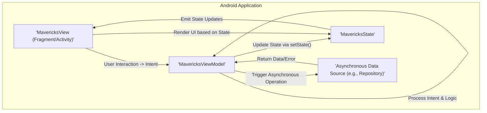

## Project Design Document: MvRx Library (Improved)

**1. Introduction**

This document provides an enhanced and more detailed design overview of the MvRx library, a Kotlin library for building Android UIs with the Model-View-Intent (MVI) pattern. This improved version aims to provide a more robust foundation for subsequent threat modeling activities by offering deeper insights into the library's architecture, data flow, and potential security implications.

**2. Goals**

*   Provide a comprehensive and detailed architectural overview of the MvRx library, suitable for security analysis.
*   Clearly identify key components, their specific responsibilities, and their interactions within the library, with a focus on potential security boundaries.
*   Describe the data flow and state management mechanisms employed by MvRx in detail, highlighting potential data transformation and manipulation points.
*   Elaborate on potential areas of interest for security analysis and threat modeling, providing concrete examples of potential threats.
*   Serve as a precise and informative reference point for security engineers, developers, and architects involved in securing applications using MvRx.

**3. Target Audience**

*   Security Engineers responsible for performing threat modeling, security assessments, and penetration testing of applications using MvRx.
*   Software Architects designing and reviewing the architecture of Android applications built with MvRx, with a focus on security considerations.
*   Developers utilizing the MvRx library who require a thorough understanding of its internal workings to implement secure and robust applications.

**4. Scope**

This document focuses on the core functionalities and architectural design of the MvRx library itself, with a specific emphasis on aspects relevant to security. It comprehensively covers:

*   The `MavericksState` interface, its role in state management, and potential vulnerabilities related to data storage and immutability.
*   The `MavericksViewModel` class, its lifecycle management, intent processing logic, and its role as a central point for state updates and asynchronous operations.
*   The `MavericksView` interface, its interaction with the ViewModel, and potential risks associated with rendering and user input handling.
*   The detailed mechanisms for state updates, including the `setState` function and its thread-safety implications.
*   The event handling mechanisms and potential for unintended side effects or information leakage.
*   The asynchronous data handling capabilities within MvRx, including the `execute` function and its implications for data integrity and error handling.

This document still does *not* cover:

*   Specific implementations of UI components or application logic built on top of MvRx.
*   The underlying Android framework or its inherent security mechanisms, except where directly relevant to MvRx's operation.
*   External dependencies or libraries used in conjunction with MvRx, unless their interaction directly impacts the core security of MvRx.
*   Specific use cases or applications built with MvRx, focusing instead on the library's general architecture.

**5. High-Level Architecture**

The MvRx library adheres to the Model-View-Intent (MVI) architectural pattern, providing a clear separation of concerns. The core components and their interactions, emphasizing data flow, can be visualized as follows:

**6. Detailed Design**

This section provides a more in-depth examination of the key components, highlighting their functionalities and potential security considerations.

*   **MavericksState:**
    *   Represents the immutable state of a screen or a specific UI component.
    *   Typically implemented as a Kotlin data class, promoting immutability.
    *   Crucial for predictable UI rendering and state management.
    *   **Security Consideration:**  If not implemented as a truly immutable data class, or if mutable properties are included, it could lead to race conditions or unintended state modifications, potentially exposing sensitive information or causing unexpected behavior. Serialization of the state for processes like state restoration needs careful consideration to prevent data injection.

*   **MavericksViewModel:**
    *   Acts as the central orchestrator, holding and managing the `MavericksState`.
    *   Extends `androidx.lifecycle.ViewModel`, benefiting from Android's lifecycle management.
    *   Receives intents (user actions or events) from the `MavericksView`.
    *   Processes these intents, applying business logic and potentially triggering asynchronous operations.
    *   Updates the `MavericksState` atomically using the `setState` function, ensuring thread-safety.
    *   Provides mechanisms for the `MavericksView` to subscribe to state changes.
    *   **Security Consideration:** The logic within the ViewModel for processing intents needs to be carefully scrutinized to prevent vulnerabilities such as:
        *   **Input Validation Failures:**  Improper validation of data within intents could lead to unexpected state or application behavior.
        *   **Authorization Issues:**  Ensure that only authorized actions can trigger specific state changes.
        *   **Information Disclosure:**  Carelessly logging or handling sensitive data within the ViewModel could lead to information leaks.
        *   **Denial of Service:**  Processing certain intents could trigger resource-intensive operations, potentially leading to denial of service.

*   **MavericksView:**
    *   Represents the UI layer, typically a Fragment or Activity.
    *   Implements the `MavericksView` interface, establishing the contract for interacting with the ViewModel.
    *   Observes changes in the `MavericksState` held by its associated `MavericksViewModel`.
    *   Renders the UI based on the current `MavericksState`.
    *   Dispatches intents to the `MavericksViewModel` in response to user interactions.
    *   **Security Consideration:**
        *   **Data Binding Vulnerabilities:** If using data binding, ensure proper sanitization of data before rendering to prevent cross-site scripting (XSS) or similar injection attacks.
        *   **Improper Input Handling:** Ensure that user input is correctly sanitized and validated before being sent as intents to the ViewModel.
        *   **State Observation Issues:**  Ensure that the View correctly handles different state transitions, especially error states, to prevent displaying misleading or sensitive information.

*   **Intents:**
    *   Represent user actions or events that initiate state changes.
    *   Typically implemented as simple data classes or sealed classes, promoting clarity and type safety.
    *   Dispatched from the `MavericksView` to the `MavericksViewModel`.
    *   **Security Consideration:** While typically simple, the data contained within intents should be treated as potential untrusted input. The ViewModel should not blindly trust the data within intents.

*   **Asynchronous Data Handling:**
    *   MvRx provides utilities, often leveraging Kotlin Coroutines, for managing asynchronous operations.
    *   The `execute` function on the `MavericksViewModel` simplifies managing the lifecycle of asynchronous tasks and updating the state based on the results (success, error, loading).
    *   This often involves interacting with data repositories or other data sources.
    *   **Security Consideration:**
        *   **Insecure Data Retrieval:** Ensure that data fetched asynchronously is retrieved securely (e.g., using HTTPS).
        *   **Error Handling and State Updates:**  Improper handling of errors during asynchronous operations could lead to displaying incorrect information or leaving the application in an inconsistent state. Error states should be handled gracefully and securely.
        *   **Data Integrity:** Verify the integrity of data received from asynchronous sources to prevent manipulation.

**7. Data Flow (Detailed)**

The data flow within an MvRx application follows a unidirectional pattern, enhancing predictability and making it easier to reason about state changes. A more detailed breakdown is as follows:

1. A user interacts with a UI element in the `MavericksView` (e.g., typing in a text field, clicking a button).
2. The `MavericksView` creates an **Intent** object representing this user action, encapsulating any relevant data.
3. The `MavericksView` dispatches this **Intent** to the associated `MavericksViewModel`.
4. The `MavericksViewModel` receives the **Intent** and its associated data.
5. The `MavericksViewModel` processes the **Intent**, potentially performing the following actions:
    *   **Input Validation:**  Validating the data received in the Intent to ensure it meets expected criteria and prevent malicious input.
    *   **Business Logic Execution:**  Executing the necessary business logic based on the intent.
    *   **State Update:**  Updating the `MavericksState` using the `setState` function. This update is atomic and thread-safe.
    *   **Asynchronous Operation Trigger:**  If the intent requires fetching data or performing a long-running task, the ViewModel initiates an asynchronous operation, often interacting with a repository or data source.
6. If an asynchronous operation is triggered:
    *   The `MavericksViewModel` interacts with an **Asynchronous Data Source** (e.g., a network API, a local database).
    *   The **Asynchronous Data Source** performs the requested operation.
    *   The **Asynchronous Data Source** returns the result (either success with data or an error) to the `MavericksViewModel`.
7. The `MavericksViewModel` receives the result of the asynchronous operation.
8. The `MavericksViewModel` updates the `MavericksState` based on the result of the asynchronous operation (e.g., setting the fetched data or an error message).
9. The `MavericksState` emits a new state object.
10. The `MavericksView` observes the change in the `MavericksState`.
11. The `MavericksView` re-renders the UI based on the new `MavericksState`, displaying the updated data or error information.

**8. Security Considerations (Expanded)**

This section provides more specific examples of potential security concerns related to the MvRx library:

*   **MavericksState Manipulation:**
    *   **Threat:** If `MavericksState` is not truly immutable, or if developers mistakenly modify it after creation, it can lead to race conditions and unpredictable UI behavior. Malicious actors might exploit this to inject false data or trigger unintended actions.
    *   **Mitigation:** Enforce immutability strictly. Use Kotlin's `data class` and `val` properties. Conduct code reviews to ensure proper usage.

*   **ViewModel Intent Handling Vulnerabilities:**
    *   **Threat:**  Insufficient input validation within the ViewModel's intent processing logic can allow attackers to inject malicious data, leading to state corruption, unexpected application behavior, or even remote code execution if the data is used unsafely.
    *   **Mitigation:** Implement robust input validation for all data received within intents. Use whitelisting instead of blacklisting for allowed input.

*   **Data Exposure in MavericksState:**
    *   **Threat:**  Storing sensitive information directly in `MavericksState` can expose it to the UI, even if it's not intended for direct display. This could be exploited by malicious apps or through compromised devices.
    *   **Mitigation:**  Avoid storing highly sensitive data directly in the state. If necessary, encrypt or transform the data before storing it in the state and decrypt/transform it only when needed for display.

*   **Insecure Asynchronous Operations:**
    *   **Threat:**  If asynchronous operations are not performed securely (e.g., using unencrypted connections), data can be intercepted or manipulated. Improper error handling can also lead to information leaks or denial of service.
    *   **Mitigation:**  Always use secure connections (HTTPS). Implement proper error handling and logging, ensuring sensitive information is not leaked in error messages. Validate the integrity of data received from asynchronous sources.

*   **State Restoration Attacks:**
    *   **Threat:**  If the state restoration mechanism is not secured, attackers might be able to inject malicious data into the restored state, leading to application compromise upon restart.
    *   **Mitigation:**  Encrypt sensitive data before saving it for state restoration. Implement integrity checks to ensure the restored state has not been tampered with.

*   **Dependency Chain Vulnerabilities:**
    *   **Threat:**  MvRx relies on other libraries. Vulnerabilities in these dependencies can be exploited to compromise the application.
    *   **Mitigation:**  Regularly update MvRx and its dependencies to the latest versions. Use dependency scanning tools to identify and address known vulnerabilities.

**9. Assumptions**

The following assumptions underpin this design document:

*   Developers utilizing MvRx possess a solid understanding of the MVI architectural pattern and Android development best practices.
*   Applications built with MvRx adhere to general Android security guidelines, such as proper permission management and secure storage of sensitive data outside of the immediate UI state.
*   Underlying data sources and external services accessed by the application have their own security measures in place.

**10. Out of Scope**

The following aspects remain outside the scope of this document:

*   Detailed security analysis of the Android operating system itself.
*   Specific network security configurations beyond the recommendation to use secure connections.
*   In-depth analysis of specific UI rendering libraries or techniques used in conjunction with MvRx.
*   Performance-related security considerations, focusing primarily on architectural and data flow aspects.
*   Security aspects of specific application features built using MvRx, rather than the library itself.
