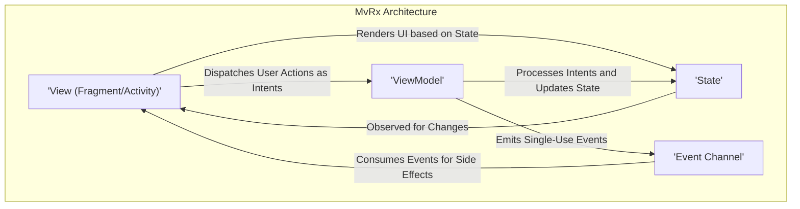
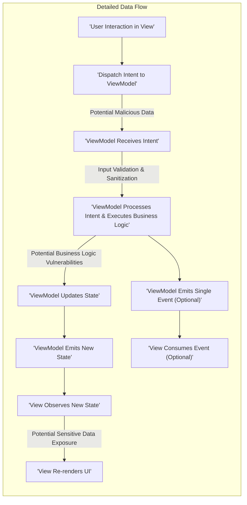

## Project Design Document: MvRx (Model-View-Rx) - Improved

**1. Introduction**

This document provides an enhanced design overview of the MvRx (Model-View-Rx) framework, an Android library by Airbnb for building robust and maintainable applications using the Model-View-Intent (MVI) architectural pattern with reactive programming principles. This improved document aims to provide a more detailed and security-focused understanding of MvRx's architecture, components, and data flow, specifically tailored for subsequent threat modeling activities.

**2. Goals and Objectives**

The primary goals of MvRx are to:

*   **Simplify Declarative UI Development on Android:** Provide a structured and predictable way to manage UI state and interactions, leading to more declarative UI implementations.
*   **Enhance Code Maintainability and Readability:** Enforce a clear separation of concerns between the UI, business logic, and data, making code easier to understand, test, and modify over time.
*   **Improve Testability of UI Logic:** Facilitate comprehensive unit testing of individual components, particularly ViewModels and state management logic, without direct UI dependencies.
*   **Reduce Boilerplate Associated with State Management:** Offer abstractions and utilities to minimize repetitive code associated with managing UI state, asynchronous operations, and UI updates.
*   **Promote Reactive and Asynchronous Programming Best Practices:** Leverage RxJava and Kotlin Coroutines for managing asynchronous operations and data streams in a structured and predictable manner.

**3. High-Level Architecture**

MvRx enforces a unidirectional data flow based on the Model-View-Intent (MVI) pattern. The core components and their interactions are illustrated below:

**4. Detailed Design**

This section provides a more granular view of each component within the MvRx architecture, highlighting aspects relevant to security considerations:

*   **View (Fragment/Activity):**
    *   **Responsibility:**  Displays the UI to the user and handles user interactions. Acts as the entry point for user-initiated actions.
    *   **State Observation:** Observes the immutable `State` emitted by the `ViewModel`. Any changes in the `State` trigger a UI re-render.
    *   **Rendering Logic:** Renders the UI based solely on the data contained within the current `State`. This promotes predictable and testable UI behavior.
    *   **Intent Dispatch:** Translates user interactions (e.g., button clicks, form input) into specific `Intents` and dispatches them to the associated `ViewModel`. This is a key point for considering potential malicious input.
    *   **Event Consumption:** Consumes single-shot `Events` emitted by the `ViewModel` for side effects that should only occur once (e.g., navigation, showing a transient message). Proper handling of these events is important to prevent unintended actions.
    *   **Integration:** Typically integrates with MvRx using the `MvRxView` interface or by extending `BaseMvRxFragment`/`BaseMvRxActivity`.

*   **State:**
    *   **Immutability:** Represents the entire UI state for a specific screen or feature as an immutable data class. This immutability is crucial for predictable state management and simplifies debugging.
    *   **Data Container:** Contains all the data necessary to render the UI. Care must be taken to avoid storing sensitive information in the `State` that is not strictly necessary for UI rendering.
    *   **State Transitions:** New `State` instances are created by the `ViewModel` based on incoming `Intents` and the results of business logic execution.
    *   **MvRx Management:** MvRx provides mechanisms for managing and updating the state safely and efficiently, ensuring thread safety.

*   **ViewModel:**
    *   **Business Logic Hub:** Holds the application's business logic and manages the `State` for a specific screen or feature.
    *   **Intent Handling:** Receives `Intents` from the `View` and determines the appropriate actions to take. This is a critical area for security checks and input validation.
    *   **State Updates:** Performs actions based on the received `Intents`, potentially involving data fetching from repositories, complex calculations, or interactions with other application layers. After processing an `Intent`, the `ViewModel` updates the `State`.
    *   **State Emission:** Emits new, immutable `State` instances, triggering UI updates in the `View`. The emission of state should be carefully controlled to avoid unintended UI updates or race conditions.
    *   **Event Emission:** Can emit single-shot `Events` for actions that should only be performed once. The logic for emitting events should be secure and prevent unintended side effects.
    *   **Lifecycle Management:**  Extends `MvRxViewModel` and is lifecycle-aware, surviving configuration changes. This is important for managing resources and preventing leaks.
    *   **Asynchronous Operations:** Commonly utilizes Kotlin Coroutines or RxJava for managing asynchronous operations like network requests or database interactions. Secure handling of these operations is paramount.

*   **Intent:**
    *   **Action Representation:** Represents a specific user action or an event that triggers a potential change in the `State`.
    *   **Data Carrier:** Typically a simple data class that may contain data associated with the user action. Care should be taken to sanitize any data contained within an `Intent` before processing it in the `ViewModel`.
    *   **Unidirectional Flow:** Dispatched unidirectionally from the `View` to the `ViewModel`.

*   **Event Channel:**
    *   **Single-Use Communication:** A mechanism for the `ViewModel` to communicate side effects or actions that should only be performed once to the `View`.
    *   **Preventing Redundant Actions:** Prevents unintended side effects from repeated state emissions, ensuring actions like navigation are not triggered multiple times.
    *   **Implementation:** Often implemented using `SingleAssign` or similar constructs to guarantee single consumption.

*   **Async Operations Management:**
    *   **State Representation:** MvRx provides utilities, often through the `Async` sealed class, to represent the different states of an asynchronous operation (Uninitialized, Loading, Success, Fail). This helps in managing the UI during long-running tasks.
    *   **Error Handling:**  Crucial for handling errors gracefully and preventing application crashes or unexpected behavior. Error states should be informative and avoid exposing sensitive information.
    *   **Cancellation:**  Mechanisms for cancelling ongoing asynchronous operations are important to prevent resource leaks and improve performance.

**5. Data Flow (Detailed)**

The typical data flow within an MvRx application, with a focus on potential security touchpoints, follows these steps:

1. **User Interaction in View:** The user interacts with the UI, triggering an action (e.g., clicking a button, submitting a form).
2. **Intent Dispatch to ViewModel:** The `View` creates an `Intent` representing the user action and dispatches it to the associated `ViewModel`. **Potential Security Concern:** Malicious or unexpected data could be included in the `Intent`.
3. **ViewModel Receives and Processes Intent:** The `ViewModel` receives the `Intent`. **Security Checkpoint:** Input validation and sanitization should occur here to prevent injection attacks or other vulnerabilities.
4. **Business Logic Execution:** The `ViewModel` executes the necessary business logic based on the `Intent`. This might involve data retrieval, manipulation, or interaction with other layers. **Potential Security Concern:** Vulnerabilities in the business logic itself could be exploited.
5. **State Update:** Based on the outcome of the business logic, the `ViewModel` creates a new, immutable `State` instance reflecting the changes.
6. **State Emission:** The `ViewModel` emits the new `State`.
7. **View Observes New State:** The `View` observes the emitted `State` changes.
8. **UI Re-rendering:** The `View` re-renders the UI based on the data in the new `State`. **Potential Security Concern:** If sensitive data is present in the `State`, it could be inadvertently displayed in the UI.
9. **Single Event Emission (Optional):** The `ViewModel` might emit a single-shot `Event` for side effects.
10. **View Consumes Event (Optional):** The `View` consumes the emitted `Event` and performs the corresponding action. **Potential Security Concern:** Improperly handled events could lead to unintended actions or security breaches.

**6. Key Technologies**

*   **Kotlin:** The primary programming language for MvRx and Android development.
*   **Android SDK:** Provides the core APIs and tools for building Android applications.
*   **Kotlin Coroutines:**  A primary mechanism for handling asynchronous operations within MvRx ViewModels.
*   **RxJava (Optional):**  Can be used as an alternative for reactive programming and asynchronous operations.
*   **Data Binding (Optional):**  An Android Jetpack library that can simplify the process of updating the UI based on state changes.
*   **Dependency Injection (e.g., Dagger, Hilt):**  Used for managing dependencies and promoting modularity within the application. The security of injected dependencies should be considered.

**7. Security Considerations (For Threat Modeling)**

This section outlines key security considerations that should be thoroughly investigated during the threat modeling process:

*   **State Management Security:**
    *   **Sensitive Data in State:** Avoid storing highly sensitive information directly in the `State` if it's not absolutely necessary for UI rendering. Consider encrypting or redacting sensitive data.
    *   **State Injection/Tampering:** While the `State` is immutable, understand the potential risks if the mechanisms for updating the state are compromised.
    *   **State Persistence:** If the `State` is persisted (e.g., for restoring application state), ensure secure storage and encryption mechanisms are in place.

*   **Intent Security:**
    *   **Malicious Intents:** Consider the possibility of crafted or malicious `Intents` being dispatched to the `ViewModel`. Implement robust input validation and sanitization.
    *   **Intent Data Exposure:** Be mindful of the data included in `Intents` and avoid transmitting sensitive information unnecessarily.

*   **ViewModel Security:**
    *   **Business Logic Vulnerabilities:** Thoroughly review the business logic within ViewModels for potential vulnerabilities such as injection flaws, authorization issues, or data breaches.
    *   **Asynchronous Operation Security:** Ensure that asynchronous operations (e.g., network requests, database interactions) are performed securely, including proper authentication, authorization, and data validation.
    *   **Error Handling:** Implement secure error handling to prevent the leakage of sensitive information through error messages or stack traces.

*   **Event Handling Security:**
    *   **Event Injection:** Consider the potential for malicious actors to trigger unintended events.
    *   **Event Sequencing:** Analyze the order and timing of events to prevent race conditions or other vulnerabilities.

*   **Dependency Security:**
    *   **Third-Party Libraries:** Regularly assess the security of third-party libraries (including RxJava or Coroutines versions) used by the application for known vulnerabilities.
    *   **Dependency Injection Security:** Ensure that the dependency injection framework is configured securely and does not introduce vulnerabilities.

*   **UI Security:**
    *   **Data Binding Vulnerabilities:** If using data binding, be aware of potential vulnerabilities related to expression injection or improper data handling.
    *   **Clickjacking/UI Redressing:** Consider mitigations for UI-based attacks.

**8. Diagrams**

The diagrams provided in the "High-Level Architecture" and "Data Flow (Detailed)" sections visually represent the key components and interactions within the MvRx framework, aiding in understanding the system for threat modeling purposes.

**9. Conclusion**

This improved design document provides a more detailed and security-focused overview of the MvRx framework. By understanding the architecture, components, and data flow, particularly the potential security touchpoints highlighted, development teams can proactively identify and mitigate potential vulnerabilities. This document serves as a crucial foundation for conducting thorough threat modeling activities for MvRx-based Android applications.