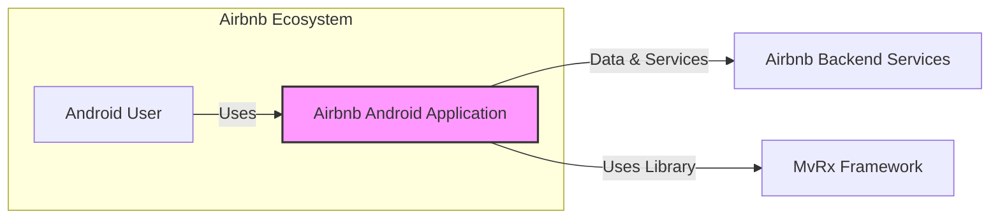
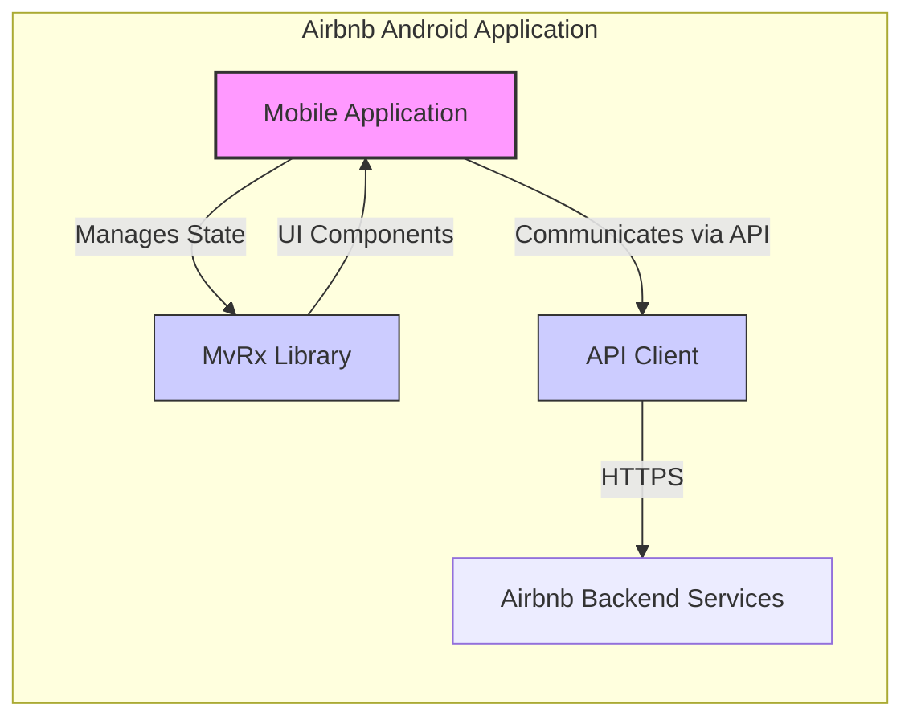
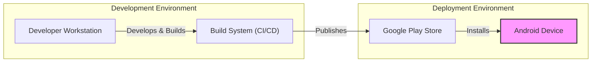
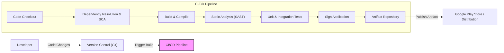

# BUSINESS POSTURE

- Business Priorities and Goals:
 - Goal: To enhance the efficiency and maintainability of Android application development.
 - Goal: To improve the user experience of Android applications by ensuring consistent and predictable UI behavior.
 - Goal: To accelerate the development lifecycle for new features and updates in Android applications.
 - Priority: Focus on developer productivity and code quality in Android projects.
 - Priority: Ensure the stability and reliability of Android applications.

- Business Risks:
 - Business Risk: Potential learning curve for development teams adopting a new framework like MvRx.
 - Business Risk: Risk of introducing bugs or instability if MvRx is not implemented correctly.
 - Business Risk: Dependency on an open-source framework, which may have its own vulnerabilities or become unmaintained in the future.
 - Business Risk: Compatibility issues with other libraries or SDKs used in Android projects.
 - Business Risk: Performance overhead if MvRx is not used efficiently, impacting application responsiveness.

# SECURITY POSTURE

- Existing Security Controls:
 - security control: Secure Software Development Lifecycle (SSDLC) - Implemented and described in company's internal security policies and development guidelines.
 - security control: Code Reviews - Implemented as part of the standard development workflow, using tools like GitHub pull requests.
 - security control: Dependency Management - Implemented using Gradle dependency management in Android projects, with potential for dependency scanning tools integrated into CI/CD pipelines.
 - security control: Static Application Security Testing (SAST) - Potentially implemented using tools integrated into CI/CD pipelines to scan code for vulnerabilities.
 - security control: Dynamic Application Security Testing (DAST) - Potentially implemented as part of the QA and testing process, although less directly related to MvRx framework itself.
 - security control: Regular Security Updates - Implemented as part of the ongoing maintenance of Android applications and their dependencies.
 - accepted risk: Reliance on open-source components - Accepted risk inherent in using open-source libraries like MvRx, with the understanding that vulnerabilities may be discovered and need to be addressed.
 - accepted risk: Complexity of Android ecosystem - Accepted risk associated with the inherent complexity of the Android platform and its diverse ecosystem of devices and OS versions.

- Recommended Security Controls:
 - security control: Software Composition Analysis (SCA) - Implement SCA tools to continuously monitor MvRx and its dependencies for known vulnerabilities. Integrate SCA into the CI/CD pipeline to fail builds on detection of high-severity vulnerabilities.
 - security control: Security Training for Developers - Provide specific training to Android developers on secure coding practices when using MvRx, focusing on state management and data handling within the framework.
 - security control: Automated UI Testing with Security Checks - Integrate automated UI testing frameworks with security checks to ensure that UI components built with MvRx are not vulnerable to common UI-related attacks (e.g., input injection through UI elements).
 - security control: Regular Penetration Testing - Conduct periodic penetration testing of Android applications that utilize MvRx to identify potential vulnerabilities in the application logic and UI implementation.

- Security Requirements:
 - Authentication:
  - Requirement: Authentication is typically handled at the application level, outside of the MvRx framework itself. MvRx should not introduce any vulnerabilities that could compromise application authentication mechanisms.
  - Requirement: If MvRx is used to display or handle authentication tokens or credentials in the UI (which is generally discouraged), it must do so securely, avoiding storage in insecure locations or logging sensitive information.
 - Authorization:
  - Requirement: Authorization logic is also typically implemented at the application level. MvRx should not bypass or weaken application authorization controls.
  - Requirement: Ensure that UI components built with MvRx correctly reflect the user's authorization level and do not expose unauthorized data or functionality.
 - Input Validation:
  - Requirement: MvRx is used to manage and display UI state, which often includes user inputs. Input validation should be performed at the application level, before data is passed to MvRx state management.
  - Requirement: UI components built with MvRx should be designed to handle invalid or unexpected input gracefully, preventing application crashes or unexpected behavior.
 - Cryptography:
  - Requirement: MvRx itself is not directly involved in cryptographic operations. However, if sensitive data is displayed or handled in the UI managed by MvRx, standard Android cryptographic APIs should be used for encryption and decryption at the application level.
  - Requirement: Avoid storing sensitive cryptographic keys or secrets within MvRx state or UI components. Use secure key storage mechanisms provided by the Android platform.

# DESIGN

- C4 CONTEXT

- C4 CONTEXT Elements:
 - - Name: Android User
   - Type: Person
   - Description: Users who interact with the Airbnb Android application on their mobile devices.
   - Responsibilities: Use the Airbnb Android application to browse listings, book accommodations, manage reservations, and communicate with hosts.
   - Security controls: Device-level security controls (passcode, biometrics), user account management within the Airbnb platform.
 - - Name: Airbnb Android Application
   - Type: Software System
   - Description: The Airbnb mobile application for the Android platform, providing users with access to Airbnb services.
   - Responsibilities: Provide user interface for Airbnb services, manage user interactions, communicate with backend services, manage application state using MvRx framework.
   - Security controls: Application-level security controls (authentication, authorization, input validation), secure data storage, secure communication (HTTPS), implemented security features of MvRx framework (if any).
 - - Name: Airbnb Backend Services
   - Type: Software System
   - Description: A collection of backend services that provide data and functionality to the Airbnb Android application, including user accounts, listings, bookings, payments, and messaging.
   - Responsibilities: Manage core Airbnb business logic, store and process data, provide APIs for client applications, handle authentication and authorization for API access.
   - Security controls: Server-side security controls (firewalls, intrusion detection, access control), API security (authentication, authorization, rate limiting), data encryption at rest and in transit.
 - - Name: MvRx Framework
   - Type: Software System (Library)
   - Description: An open-source Android framework for building robust and maintainable Android applications using Kotlin and Jetpack Compose, focused on state management and UI architecture.
   - Responsibilities: Provide a framework for managing UI state, simplify asynchronous operations, improve code organization and testability in Android applications.
   - Security controls: Security controls inherent in the framework itself (e.g., protection against state corruption, secure handling of data within the framework), dependency management to ensure secure dependencies.

- C4 CONTAINER

- C4 CONTAINER Elements:
 - - Name: Mobile Application
   - Type: Container (Android Application)
   - Description: The main Android application container, encompassing all application logic, UI components, and libraries.
   - Responsibilities: Host UI components, manage application lifecycle, handle user interactions, orchestrate data flow, integrate with MvRx library for state management, communicate with backend services via API Client.
   - Security controls: Application-level security controls (authentication, authorization, input validation), secure data storage within the application sandbox, secure communication (HTTPS), implementation of Android security best practices.
 - - Name: MvRx Library
   - Type: Container (Library)
   - Description: The MvRx framework integrated as a library within the Android application, responsible for managing UI state and simplifying asynchronous operations.
   - Responsibilities: Manage application state, provide mechanisms for state updates and observation, simplify handling of asynchronous tasks, enforce unidirectional data flow, improve code structure and maintainability.
   - Security controls: Security controls inherent in the MvRx library code (e.g., preventing state corruption), dependency management to ensure secure dependencies of the library.
 - - Name: API Client
   - Type: Container (Library/Component)
   - Description: A component within the Android application responsible for handling communication with Airbnb Backend Services via APIs. This could be a custom-built client or a library like Retrofit.
   - Responsibilities: Make API requests to backend services, handle API responses, manage network communication, implement API authentication and authorization, handle data serialization and deserialization.
   - Security controls: Secure communication (HTTPS), API authentication and authorization mechanisms, input validation of API responses, error handling to prevent information leakage.
 - - Name: Airbnb Backend Services
   - Type: External Container (Backend System)
   - Description: The external backend services that the Android application interacts with to retrieve and send data.
   - Responsibilities: Provide data and functionality to the Android application via APIs, manage business logic, store and process data.
   - Security controls: Server-side security controls (firewalls, intrusion detection, access control), API security (authentication, authorization, rate limiting), data encryption at rest and in transit.

- DEPLOYMENT

- DEPLOYMENT Elements:
 - - Name: Developer Workstation
   - Type: Infrastructure (Laptop/Desktop)
   - Description: The workstation used by Android developers to write code, build, and test the Airbnb Android application.
   - Responsibilities: Running IDE (Android Studio), writing code, local builds and testing, committing code to version control.
   - Security controls: Workstation security controls (OS hardening, antivirus, firewall, full disk encryption), developer authentication and authorization, code repository access controls.
 - - Name: Build System (CI/CD)
   - Type: Infrastructure (Cloud Service/On-Premise Server)
   - Description: An automated build system (e.g., GitHub Actions, Jenkins, GitLab CI) that compiles the Android application, runs tests, and prepares it for deployment.
   - Responsibilities: Automated building of the Android application, running unit and integration tests, performing static analysis and security scans, signing the application package, publishing to app stores or internal distribution channels.
   - Security controls: Access control to the build system, secure configuration of CI/CD pipelines, secrets management for signing keys and credentials, build artifact integrity checks, security scanning tools integration.
 - - Name: Google Play Store
   - Type: Infrastructure (Cloud Service)
   - Description: The Google Play Store, the primary distribution platform for Android applications.
   - Responsibilities: Hosting and distributing the Airbnb Android application to users, managing application updates, providing app store security features (e.g., malware scanning).
   - Security controls: Google Play Store security measures (app signing verification, malware scanning), developer account security, app store policies and guidelines.
 - - Name: Android Device
   - Type: Infrastructure (Mobile Device)
   - Description: End-user Android mobile devices where the Airbnb Android application is installed and run.
   - Responsibilities: Running the Airbnb Android application, providing user interface, executing application logic, storing application data, communicating with backend services.
   - Security controls: Device-level security controls (OS security, app sandboxing, permissions management, user-installed security apps), application-level security controls implemented within the Airbnb Android application.

- BUILD

- BUILD Elements:
 - - Name: Developer
   - Type: Person
   - Description: Software developers who write and modify the code for the Airbnb Android application.
   - Responsibilities: Writing code, committing code changes to version control, participating in code reviews, fixing bugs, developing new features.
   - Security controls: Developer workstation security, secure coding practices, authentication and authorization for code repository access.
 - - Name: Version Control (Git)
   - Type: Software System (Code Repository)
   - Description: A version control system (e.g., GitHub, GitLab, Bitbucket) used to manage the source code of the Android application.
   - Responsibilities: Storing source code, tracking changes, managing branches and merges, providing access control to code, facilitating collaboration among developers.
   - Security controls: Access control to the repository, branch protection, audit logging, secure configuration of version control system.
 - - Name: CI/CD Pipeline
   - Type: Software System (Automation System)
   - Description: An automated CI/CD pipeline that builds, tests, and prepares the Android application for deployment.
   - Responsibilities: Automating the build process, running security checks, executing tests, signing the application, publishing build artifacts.
   - Security controls: Secure pipeline configuration, secrets management for credentials and signing keys, access control to the CI/CD system, audit logging of pipeline activities.
 - - Name: Code Checkout
   - Type: Process (CI/CD Pipeline Step)
   - Description: The step in the CI/CD pipeline where the source code is retrieved from the version control system.
   - Responsibilities: Fetching the latest code from the repository, ensuring code integrity.
   - Security controls: Secure connection to the version control system, verification of code integrity (e.g., using commit hashes).
 - - Name: Dependency Resolution & SCA
   - Type: Process (CI/CD Pipeline Step)
   - Description: The step where project dependencies are resolved and Software Composition Analysis (SCA) is performed to identify vulnerable dependencies.
   - Responsibilities: Downloading project dependencies, scanning dependencies for known vulnerabilities using SCA tools, failing the build if high-severity vulnerabilities are found.
   - Security controls: Secure dependency resolution process (e.g., using dependency lock files), up-to-date vulnerability databases for SCA tools, automated alerts for new vulnerabilities.
 - - Name: Build & Compile
   - Type: Process (CI/CD Pipeline Step)
   - Description: The step where the Android application code is compiled and built into an executable package (APK or AAB).
   - Responsibilities: Compiling source code, linking libraries, packaging resources, creating the application package.
   - Security controls: Secure build environment, use of trusted build tools and compilers, build process hardening.
 - - Name: Static Analysis (SAST)
   - Type: Process (CI/CD Pipeline Step)
   - Description: The step where Static Application Security Testing (SAST) tools are used to scan the source code for potential security vulnerabilities.
   - Responsibilities: Scanning code for common vulnerabilities (e.g., SQL injection, cross-site scripting), generating reports of identified vulnerabilities, failing the build based on vulnerability severity.
   - Security controls: Properly configured SAST tools, up-to-date vulnerability rulesets, integration of SAST results into developer workflows.
 - - Name: Unit & Integration Tests
   - Type: Process (CI/CD Pipeline Step)
   - Description: The step where automated unit and integration tests are executed to verify the functionality and stability of the application.
   - Responsibilities: Running automated tests, verifying code functionality, ensuring code quality and reliability, identifying bugs early in the development cycle.
   - Security controls: Secure test environment, test data management, security-focused test cases (e.g., testing input validation, error handling).
 - - Name: Sign Application
   - Type: Process (CI/CD Pipeline Step)
   - Description: The step where the Android application package is digitally signed using a private key, which is required for deployment to the Google Play Store.
   - Responsibilities: Digitally signing the APK/AAB file, ensuring application integrity and authenticity.
   - Security controls: Secure storage and management of signing keys, access control to signing keys, automated signing process within the CI/CD pipeline.
 - - Name: Artifact Repository
   - Type: Software System (Storage)
   - Description: A repository (e.g., cloud storage, artifact management system) where build artifacts (signed APK/AAB files) are stored.
   - Responsibilities: Storing build artifacts, providing access to artifacts for deployment, versioning of artifacts.
   - Security controls: Access control to the artifact repository, secure storage of artifacts, integrity checks for stored artifacts.
 - - Name: Google Play Store / Distribution
   - Type: Process (Deployment Step)
   - Description: The step where the signed Android application package is published to the Google Play Store or other distribution channels for user download and installation.
   - Responsibilities: Publishing the application to distribution platforms, managing app store listings, handling application updates.
   - Security controls: Secure publishing process, adherence to app store guidelines, monitoring of app store security reports.

# RISK ASSESSMENT

- Critical Business Processes:
 - Critical Business Process: User login and authentication - Securing user accounts and preventing unauthorized access to user data and Airbnb services.
 - Critical Business Process: Booking and reservation management - Ensuring the integrity and availability of booking information and preventing fraudulent bookings.
 - Critical Business Process: Payment processing - Protecting sensitive payment information and ensuring secure financial transactions.
 - Critical Business Process: Communication between users and hosts - Maintaining the privacy and security of communication channels.
 - Critical Business Process: Data privacy and compliance - Protecting user personal data and complying with relevant privacy regulations (e.g., GDPR, CCPA).

- Data Sensitivity:
 - Data Sensitivity: User credentials (passwords, authentication tokens) - Highly sensitive, requiring strong encryption and access control.
 - Data Sensitivity: Personal Identifiable Information (PII) (name, address, email, phone number, location data) - Sensitive, requiring protection against unauthorized access and disclosure.
 - Data Sensitivity: Payment information (credit card details, bank account information) - Highly sensitive, requiring PCI DSS compliance and strong encryption.
 - Data Sensitivity: Booking details and reservation information - Sensitive business data, requiring integrity and confidentiality.
 - Data Sensitivity: Communication logs and user messages - Potentially sensitive, requiring privacy protection and access control.
 - Data Sensitivity: Application usage data and analytics - Less sensitive, but still requires appropriate data handling and privacy considerations.

# QUESTIONS & ASSUMPTIONS

- BUSINESS POSTURE Questions & Assumptions:
 - Question: What is the specific business justification for adopting MvRx within Airbnb Android development? Is it primarily for new projects or for refactoring existing applications?
  - Assumption: MvRx is being adopted to improve the maintainability and scalability of Airbnb's Android applications, likely for both new feature development and gradual refactoring of existing code.
 - Question: What is the risk appetite of Airbnb regarding the use of open-source frameworks like MvRx?
  - Assumption: Airbnb, as a mature tech company, has a moderate risk appetite for using well-established open-source frameworks, provided that appropriate security measures are in place.

- SECURITY POSTURE Questions & Assumptions:
 - Question: What existing security tools and processes are already in place for Android application development at Airbnb?
  - Assumption: Airbnb has a mature SDLC with security integrated at various stages, including code reviews, static analysis, and dependency scanning. However, the specific tools and their integration with MvRx projects need to be verified.
 - Question: Are there specific security guidelines or best practices that Airbnb developers are expected to follow when using MvRx?
  - Assumption: While general Android security guidelines likely exist, specific guidance on secure usage of MvRx might be needed to address framework-specific security considerations.
 - Question: What is the process for handling security vulnerabilities discovered in MvRx or its dependencies?
  - Assumption: Airbnb has a vulnerability management process, but the specific workflow for addressing vulnerabilities in open-source frameworks and coordinating with the MvRx community needs to be clarified.

- DESIGN Questions & Assumptions:
 - Question: How is MvRx intended to be integrated into the overall architecture of Airbnb's Android application? Are there specific architectural patterns or best practices being followed?
  - Assumption: MvRx is being used to manage UI state within the Android application, likely following a Model-View-Intent (MVI) or similar unidirectional data flow architecture.
 - Question: Are there any specific performance considerations or constraints related to using MvRx in Airbnb's Android application?
  - Assumption: Performance is a key consideration for mobile applications. It is assumed that performance testing and optimization will be conducted to ensure MvRx does not introduce unacceptable overhead.
 - Question: What is the expected lifespan and maintenance plan for MvRx within Airbnb projects?
  - Assumption: MvRx is expected to be a long-term component of Airbnb's Android development strategy, with ongoing maintenance and updates as needed.