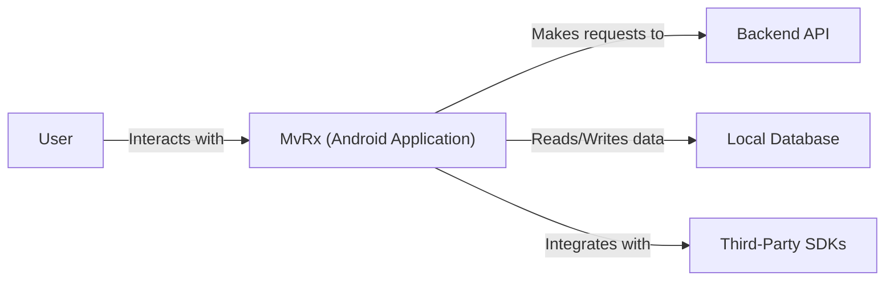
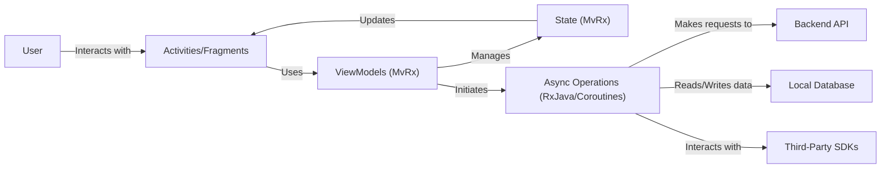
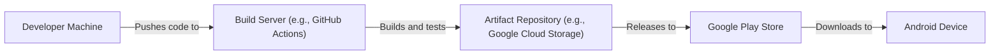
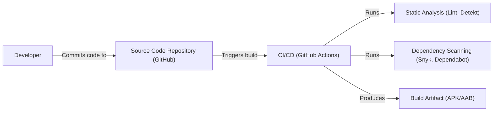

Okay, let's create a design document for the MvRx project, keeping in mind its purpose and potential security considerations.

# BUSINESS POSTURE

MvRx is a framework designed to simplify Android development by providing a robust and predictable architecture for managing state, handling asynchronous operations, and updating the UI. It's positioned as a tool to improve developer productivity, code maintainability, and application stability.  It's an open-source project maintained by Airbnb, a large, established company.

Priorities:

-   Reduce boilerplate code for common Android development tasks.
-   Improve the maintainability and testability of Android applications.
-   Provide a consistent and predictable state management solution.
-   Simplify asynchronous operation handling (network requests, database access, etc.).
-   Enhance the overall developer experience for building Android apps.
-   Maintain Airbnb's reputation for high-quality engineering and open-source contributions.

Goals:

-   Increase adoption of MvRx within the Android development community.
-   Establish MvRx as a leading framework for building robust Android applications.
-   Gather feedback from the community to continuously improve the framework.
-   Reduce the number of bugs and crashes in applications built with MvRx.

Business Risks:

-   Vulnerabilities in the framework could be exploited to compromise applications built using it, potentially leading to data breaches or other security incidents. This is the most significant risk, given Airbnb's high profile.
-   Lack of adoption due to complexity or perceived limitations could diminish the project's impact and value.
-   Inadequate documentation or support could hinder developer adoption and lead to frustration.
-   Incompatibility with future Android versions or other libraries could limit the framework's longevity.
-   Negative publicity due to security flaws or performance issues could damage Airbnb's reputation.

# SECURITY POSTURE

Existing Security Controls:

-   security control: Code Reviews: As an open-source project on GitHub, MvRx likely benefits from community code reviews and contributions, which can help identify potential security issues. (Described in GitHub's pull request and contribution guidelines).
-   security control: Static Analysis: Airbnb likely employs static analysis tools as part of their development process to detect common coding errors and potential vulnerabilities. (Assumed based on industry best practices and Airbnb's engineering blog posts).
-   security control: Dependency Management: The project uses Gradle for dependency management, allowing for tracking and updating of third-party libraries. (Described in the project's build.gradle files).
-   security control: Open Source: Open source nature of project allows for public scrutiny and security reviews.

Accepted Risks:

-   accepted risk: Reliance on Third-Party Libraries: MvRx depends on several third-party libraries (e.g., RxJava, Kotlin Coroutines). Vulnerabilities in these libraries could impact the security of MvRx.
-   accepted risk: Evolving Android Security Landscape: The Android security landscape is constantly evolving. New vulnerabilities and attack vectors may emerge that could affect MvRx.
-   accepted risk: User Implementation Errors: While MvRx provides a framework, developers using it can still introduce security vulnerabilities in their own application code.

Recommended Security Controls:

-   security control: Regular Security Audits: Conduct regular security audits of the MvRx codebase, including penetration testing and threat modeling.
-   security control: Software Composition Analysis (SCA): Implement SCA tooling to automatically identify and track known vulnerabilities in third-party dependencies.
-   security control: Fuzz Testing: Incorporate fuzz testing to identify unexpected behavior and potential vulnerabilities caused by malformed input.
-   security control: Security Training: Provide security training to MvRx contributors and maintainers to ensure they are aware of secure coding best practices.

Security Requirements:

-   Authentication: MvRx itself does not handle authentication directly. Authentication is typically implemented at the application level. However, MvRx should provide mechanisms to securely manage authentication tokens and other sensitive data.
-   Authorization: Similar to authentication, authorization is typically handled at the application level. MvRx should facilitate the integration with authorization systems and ensure that sensitive data is only accessible to authorized users.
-   Input Validation: MvRx should encourage and facilitate proper input validation within the application logic. While MvRx doesn't directly handle user input in the same way a web framework might, any data coming from external sources (network, user input, etc.) that is used to update the state should be validated.
-   Cryptography: MvRx should not handle cryptography directly. If cryptographic operations are required, they should be delegated to well-established cryptographic libraries and Android's built-in security features (e.g., Keystore). MvRx should provide guidance on securely storing cryptographic keys and other sensitive data.

# DESIGN

## C4 CONTEXT

Element Descriptions:

-   1.  Name: User
    2.  Type: Person
    3.  Description: A user interacting with the Android application built using MvRx.
    4.  Responsibilities: Interacts with the application's UI, provides input, and views data.
    5.  Security controls: None directly implemented by MvRx. Relies on application-level security controls.

-   1.  Name: MvRx (Android Application)
    2.  Type: Software System
    3.  Description: The Android application built using the MvRx framework.
    4.  Responsibilities: Manages application state, handles user interactions, performs asynchronous operations, and updates the UI.
    5.  Security controls: Code Reviews, Static Analysis, Dependency Management.

-   1.  Name: Backend API
    2.  Type: Software System
    3.  Description: A remote backend API that the MvRx application interacts with.
    4.  Responsibilities: Provides data and services to the application.
    5.  Security controls: Not directly managed by MvRx. Relies on the backend's security implementation.

-   1.  Name: Local Database
    2.  Type: Software System
    3.  Description: A local database on the Android device used for storing data.
    4.  Responsibilities: Stores data locally on the device.
    5.  Security controls: Relies on Android's data storage security mechanisms (e.g., encrypted SharedPreferences, SQLite database encryption).

-   1.  Name: Third-Party SDKs
    2.  Type: Software System
    3.  Description: Third-party SDKs integrated into the MvRx application.
    4.  Responsibilities: Provides specific functionalities (e.g., analytics, push notifications).
    5.  Security controls: Relies on the security implementation of the individual SDKs.

## C4 CONTAINER

Element Descriptions:

-   1.  Name: User
    2.  Type: Person
    3.  Description: A user interacting with the Android application.
    4.  Responsibilities: Interacts with the application's UI.
    5.  Security controls: None directly implemented by MvRx.

-   1.  Name: Activities/Fragments
    2.  Type: Container (UI Component)
    3.  Description: Android UI components (Activities and Fragments) that display data and handle user interactions.
    4.  Responsibilities: Display UI, handle user input, and interact with ViewModels.
    5.  Security controls: Relies on Android's UI security mechanisms.

-   1.  Name: ViewModels (MvRx)
    2.  Type: Container (MvRx Component)
    3.  Description: MvRx ViewModels that manage the state and business logic for specific screens or features.
    4.  Responsibilities: Manage state, handle user actions, initiate asynchronous operations, and update the state.
    5.  Security controls: Code Reviews, Static Analysis.

-   1.  Name: State (MvRx)
    2.  Type: Container (Data)
    3.  Description: The application's state, managed by MvRx.
    4.  Responsibilities: Holds the current state of the application.
    5.  Security controls: Input validation (when updating state from external sources).

-   1.  Name: Async Operations (RxJava/Coroutines)
    2.  Type: Container (Asynchronous Operations)
    3.  Description: Asynchronous operations (network requests, database access) handled using RxJava or Coroutines.
    4.  Responsibilities: Perform background tasks and update the state.
    5.  Security controls: Secure handling of network requests (e.g., HTTPS), proper error handling.

-   1.  Name: Backend API
    2.  Type: Software System
    3.  Description: A remote backend API.
    4.  Responsibilities: Provides data and services.
    5.  Security controls: Not directly managed by MvRx.

-   1.  Name: Local Database
    2.  Type: Software System
    3.  Description: A local database on the device.
    4.  Responsibilities: Stores data locally.
    5.  Security controls: Android's data storage security mechanisms.

-   1.  Name: Third-Party SDKs
    2.  Type: Software System
    3.  Description: Third-party SDKs.
    4.  Responsibilities: Provides specific functionalities.
    5.  Security controls: Relies on the SDKs' security implementation.

## DEPLOYMENT

Possible Deployment Solutions:

1.  Google Play Store: The standard deployment method for Android applications.
2.  Firebase App Distribution: For distributing pre-release versions to testers.
3.  Internal Enterprise Distribution: For distributing applications within an organization.
4.  Manual APK Installation: Sideloading the APK file onto a device.

Chosen Deployment Solution (Google Play Store):

Element Descriptions:

-   1.  Name: Developer Machine
    2.  Type: Infrastructure Node
    3.  Description: The developer's workstation used for writing and testing code.
    4.  Responsibilities: Code development, testing, and pushing to the build server.
    5.  Security controls: Local development environment security (e.g., secure coding practices, antivirus).

-   1.  Name: Build Server (e.g., GitHub Actions)
    2.  Type: Infrastructure Node
    3.  Description: A build server that automates the build, test, and release process.
    4.  Responsibilities: Builds the application, runs tests, and creates release artifacts.
    5.  Security controls: Secure build environment, access control, static analysis, dependency scanning.

-   1.  Name: Artifact Repository (e.g., Google Cloud Storage)
    2.  Type: Infrastructure Node
    3.  Description: A repository for storing build artifacts (e.g., APK files).
    4.  Responsibilities: Stores build artifacts securely.
    5.  Security controls: Access control, encryption at rest.

-   1.  Name: Google Play Store
    2.  Type: Platform
    3.  Description: Google's official app store for Android applications.
    4.  Responsibilities: Distributes the application to users.
    5.  Security controls: Google Play Store's security review process, app signing.

-   1.  Name: Android Device
    2.  Type: Device
    3.  Description: An Android device running the application.
    4.  Responsibilities: Runs the application.
    5.  Security controls: Android's built-in security features (e.g., sandboxing, permissions).

## BUILD

Build Process Description:

1.  Developers commit code to the GitHub repository.
2.  GitHub Actions (or a similar CI/CD system) is triggered by the commit.
3.  The CI/CD pipeline performs the following steps:
    -   Checks out the code.
    -   Runs static analysis tools (e.g., Lint, Detekt) to identify code quality and potential security issues.
    -   Runs dependency scanning tools (e.g., Snyk, Dependabot) to identify known vulnerabilities in third-party libraries.
    -   Builds the application, producing an APK (Android Package) or AAB (Android App Bundle) file.
    -   (Optionally) Runs automated tests (unit tests, integration tests).
    -   (Optionally) Signs the APK/AAB file with a release key.
    -   (Optionally) Uploads the APK/AAB file to an artifact repository or directly to the Google Play Store.

Security Controls in Build Process:

-   security control: Static Analysis: Lint and Detekt are used to identify potential coding errors and security vulnerabilities.
-   security control: Dependency Scanning: Snyk or Dependabot are used to identify known vulnerabilities in third-party dependencies.
-   security control: Code Signing: The APK/AAB file is signed with a release key to ensure its authenticity and integrity.
-   security control: CI/CD Pipeline Security: Access control and secure configuration of the CI/CD pipeline (GitHub Actions) are essential.

# RISK ASSESSMENT

Critical Business Processes:

-   User data privacy and security.
-   Application stability and reliability.
-   Maintaining Airbnb's reputation as a trusted platform.
-   Secure communication with backend services.

Data Sensitivity:

-   MvRx itself does not directly handle sensitive user data. However, applications built using MvRx may handle various types of sensitive data, including:
    -   Personally Identifiable Information (PII): Names, email addresses, phone numbers, etc.
    -   Financial Information: Payment card details, transaction history.
    -   Location Data: User's location information.
    -   Authentication Tokens: Credentials used to access backend services.
-   The sensitivity of the data depends on the specific application built using MvRx.

# QUESTIONS & ASSUMPTIONS

Questions:

-   What specific static analysis tools are used in the MvRx development process?
-   What is the process for handling security vulnerabilities reported by the community or discovered internally?
-   Are there any specific security guidelines or best practices provided to developers using MvRx?
-   What is the frequency of security audits and penetration testing?
-   Are there plans to integrate more advanced security features directly into MvRx (e.g., built-in input validation helpers)?

Assumptions:

-   BUSINESS POSTURE: Airbnb prioritizes security and has a mature security program.
-   SECURITY POSTURE: Standard security practices like code reviews and static analysis are followed.
-   DESIGN: The application using MvRx will handle sensitive data and interact with a backend API. The application will be deployed through the Google Play Store. The build process will utilize GitHub Actions.