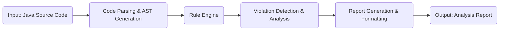

# Project Design Document: Alibaba P3C (Static Code Analysis Tool)

**Version:** 1.1
**Date:** October 26, 2023
**Author:** AI Software Architect

## 1. Introduction

This document provides an enhanced design overview of the Alibaba P3C project, a static code analysis tool dedicated to enforcing Java coding standards and best practices. This detailed design serves as a crucial foundation for subsequent threat modeling activities by clearly outlining the system's architecture, components, and data flow.

### 1.1. Project Overview

The Alibaba P3C project (likely an abbreviation for "Programming Practice Prohibitions and Common Sense") is a sophisticated static analysis tool engineered to identify potential issues and deviations from established coding guidelines within Java codebases. Its primary objective is to elevate code quality, enhance maintainability, and proactively minimize the occurrence of bugs and security vulnerabilities.

### 1.2. Goals

*   To deliver a robust and comprehensive static analysis tool specifically for Java code.
*   To rigorously enforce adherence to Alibaba's well-defined Java coding guidelines.
*   To proactively identify potential bugs, security vulnerabilities, and deviations from established code style conventions.
*   To generate actionable reports accompanied by clear suggestions for code improvement and remediation.
*   To seamlessly integrate with a diverse range of development environments and build automation processes.

### 1.3. Scope

This design document concentrates on the core architectural principles and fundamental functionalities of the P3C tool itself. It meticulously describes the essential components involved in the analysis workflow, the flow of data through the system, and the interactions between these components. The document intentionally avoids delving into the specifics of individual coding rules or the intricate implementation details of the underlying analysis engine.

## 2. System Architecture

The P3C tool adheres to a standard static analysis workflow, processing code through distinct stages. The high-level architecture can be visualized as follows:

### 2.1. Component Description

The system is composed of the following key components, each with specific responsibilities:

*   **Input: Java Source Code:** This represents the entry point of the analysis process, consisting of individual Java source code files or entire project directories targeted for analysis.
*   **Code Parsing & AST Generation:** This crucial component is responsible for meticulously parsing the input Java source code. It transforms the textual code into a structured representation known as an Abstract Syntax Tree (AST). The AST provides a hierarchical representation of the code's syntactic structure, making it significantly easier for the subsequent analysis engine to understand and process the code's logic and relationships.
*   **Rule Engine:** This is the central processing unit of the P3C tool. It houses a comprehensive collection of predefined rules meticulously crafted based on Alibaba's established Java coding guidelines and best practices. The rule engine systematically traverses the generated AST, applying these rules to identify any deviations or potential issues within the code.
*   **Violation Detection & Analysis:** This component builds upon the Rule Engine's findings. It is responsible for pinpointing specific instances within the AST that violate the defined rules. Beyond simple detection, this component often performs further analysis to categorize the severity of the violation, provide context, and potentially suggest remediation steps.
*   **Report Generation & Formatting:** This component takes the detailed violation data produced by the Violation Detection component and transforms it into a user-friendly, human-readable report. This involves structuring the information, adding context, and formatting it according to the desired output format.
*   **Output: Analysis Report:** This represents the final deliverable of the P3C tool. It provides developers with valuable insights into potential issues within their code. The report can be generated in various formats to suit different needs (e.g., plain text for simple integration, XML or JSON for programmatic consumption).

### 2.2. Component Interactions

The components interact in a sequential and well-defined manner, as illustrated in the high-level architecture diagram. The process begins with the ingestion of Java source code. This code is then processed by the Code Parsing component to create an AST. The Rule Engine then takes over, analyzing this AST. Violations are identified and analyzed by the Violation Detection component, and finally, the Report Generation component compiles and formats these findings into a comprehensive report.

## 3. Data Flow

The flow of data within the P3C tool can be described in a step-by-step manner:

1. **Source Code Ingestion:** The process commences with the input of Java source code, either as individual files or as a directory structure representing a project.
2. **Parsing and AST Construction:** The Code Parsing component reads the input source code and meticulously constructs an Abstract Syntax Tree (AST). This AST represents the code's structure in a hierarchical format, making it easier for programmatic analysis.
3. **AST Traversal and Rule Matching:** The Rule Engine receives the generated AST and systematically traverses its nodes and branches. For each element in the AST, the Rule Engine applies a predefined set of rules to check for adherence to coding guidelines and best practices.
4. **Violation Identification and Contextualization:** When a rule violation is detected, the Violation Detection component records the specific details of the infraction. This includes the file name, the precise line number where the violation occurred, the specific rule that was violated, and often a description of the issue and its potential impact.
5. **Report Data Aggregation and Enrichment:** The Report Generation component gathers all the identified violations from the Violation Detection component. It may further enrich this data with additional information, such as severity levels, suggested fixes, or links to relevant documentation.
6. **Report Formatting and Output:** The Report Generation component formats the aggregated violation data into a structured and easily understandable report. This report can be generated in various formats, including plain text, XML, JSON, or HTML, depending on the desired output and integration requirements.
7. **Analysis Report Delivery:** The final analysis report is generated and made available to the user or system that initiated the analysis. This report provides actionable insights for developers to improve their code.

## 4. Deployment

The P3C tool offers flexibility in its deployment and usage, catering to various development workflows:

*   **Command-Line Interface (CLI) Execution:** Developers can directly invoke the P3C tool from the command line. This method typically involves providing the path to the Java source code or project directory as an argument. This is useful for ad-hoc analysis and scripting.
*   **Integrated Development Environment (IDE) Plugin Integration:** P3C can be seamlessly integrated as a plugin within popular Java IDEs such as IntelliJ IDEA and Eclipse. This integration enables real-time code analysis and immediate feedback as developers write code, promoting proactive issue resolution.
*   **Build Process Integration (Maven/Gradle Plugins):** P3C can be incorporated into the software build process using plugins for build tools like Maven and Gradle. This allows for automated code analysis during the build process. The build can be configured to fail if critical violations are detected, enforcing code quality standards.
*   **Continuous Integration/Continuous Deployment (CI/CD) Pipeline Integration:** P3C can be a valuable component in CI/CD pipelines. Integrating P3C into the pipeline ensures that automated code analysis is performed as part of the software delivery process, providing consistent code quality checks before deployment.

## 5. Security Considerations (Crucial for Threat Modeling)

This section highlights potential security considerations that are paramount for effective threat modeling of the P3C tool.

*   **Input Validation Vulnerabilities:**
    *   **Malicious Code Injection:**  Carefully crafted, malicious Java source code could potentially exploit vulnerabilities within the Code Parsing or AST Generation components. This could lead to denial-of-service attacks by consuming excessive resources or potentially even arbitrary code execution within the P3C tool's environment.
    *   **Resource Exhaustion:**  Submitting extremely large or deeply nested code structures could overwhelm the parsing and analysis components, leading to resource exhaustion and denial of service. Robust input size and complexity limits are necessary.
*   **Rule Engine Security Risks:**
    *   **Malicious Rule Injection (if dynamically loaded):** If the rule definitions are loaded dynamically from external sources or are user-configurable without proper validation, there's a significant risk of malicious rule injection. Attackers could introduce rules that cause incorrect analysis, expose sensitive information, or even execute arbitrary code within the P3C tool's context.
    *   **Rule Logic Vulnerabilities:**  Bugs or vulnerabilities within the rule engine's logic itself could be exploited to bypass intended checks, produce incorrect results, or cause unexpected behavior. Thorough testing and secure coding practices are essential for the rule engine.
*   **Report Output Security Concerns:**
    *   **Sensitive Information Exposure:** Analysis reports might inadvertently contain or expose sensitive information present in the analyzed source code, such as API keys, database credentials, or internal configuration details. Access to these reports must be strictly controlled and potentially sensitive data should be masked or redacted.
    *   **Cross-Site Scripting (XSS) in Reports:** If reports are generated in formats that support active content, such as HTML, and are viewed in a web browser, there's a risk of cross-site scripting (XSS) vulnerabilities if the report generation process doesn't properly sanitize the output. Attackers could inject malicious scripts into the report that could then be executed in the context of a user viewing the report.
*   **Dependency Management Weaknesses:**
    *   **Vulnerable Dependencies:** The P3C tool likely relies on various external libraries and dependencies. Known vulnerabilities in these dependencies could be exploited to compromise the P3C tool itself. A robust dependency management process, including regular security scanning and updates, is crucial.
*   **Access Control Deficiencies:**
    *   **Unauthorized Modification:** In environments where P3C is integrated into shared systems or CI/CD pipelines, inadequate access controls could allow unauthorized users to modify the tool's configuration, rule sets, or even the tool's binary, leading to compromised analysis results or malicious activity.
*   **Insufficient Logging and Auditing:**
    *   **Lack of Visibility:**  Insufficient logging of P3C's activities can hinder the ability to detect and investigate security incidents or suspicious behavior related to the tool. Comprehensive logging and auditing mechanisms are necessary for security monitoring and incident response.
*   **Data Storage Security (if applicable):**
    *   **Compromised Configuration or Results:** If P3C stores any configuration data, analysis results, or temporary files, the security of this storage needs to be carefully considered. Unauthorized access to this data could lead to information disclosure or manipulation of the analysis process.

## 6. Future Considerations

While this document focuses on the current design, potential future enhancements could significantly expand the capabilities and value of the P3C tool:

*   **Multi-Language Support:** Expanding the tool to support analysis of other programming languages beyond Java would broaden its applicability and impact.
*   **Customizable and Extensible Rule Sets:** Allowing users to define their own custom rules or extend the existing rule sets would provide greater flexibility and cater to specific project needs and internal coding standards.
*   **Integration with Issue Tracking Systems (e.g., Jira, GitHub Issues):** Seamless integration with issue tracking systems would streamline the workflow for reporting and managing identified code violations.
*   **Advanced Reporting and Trend Analysis:** Implementing more sophisticated reporting features, such as trend analysis over time, historical data tracking of violations, and customizable dashboards, would provide valuable insights into code quality improvements.
*   **Performance Optimization and Scalability Enhancements:** Continuously improving the performance and scalability of the tool to efficiently handle increasingly large and complex codebases is crucial for its long-term viability.
*   **Interactive Remediation Suggestions:** Providing more interactive and context-aware remediation suggestions directly within the IDE or report would further assist developers in resolving identified issues.

This enhanced design document provides a more detailed and comprehensive understanding of the Alibaba P3C project's architecture, components, and data flow. This detailed information is essential for conducting thorough threat modeling and identifying potential security vulnerabilities within the system.
