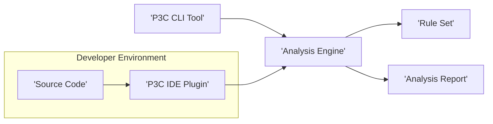
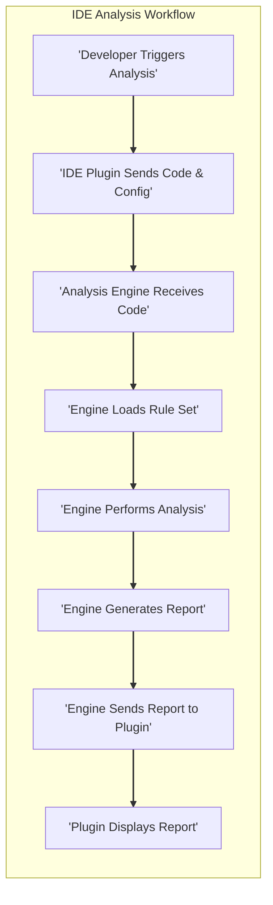
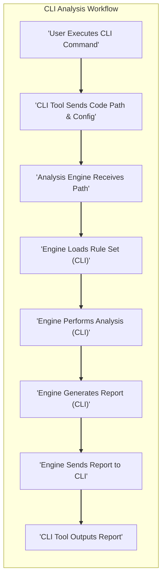

# Project Design Document: Alibaba P3C (Static Code Analysis Tool)

**Version:** 1.1
**Date:** October 26, 2023
**Author:** AI Architecture Expert

## 1. Introduction

This document provides an enhanced architectural design for the Alibaba P3C project, a static code analysis tool for Java. The primary objective remains to offer a clear depiction of the system's components, data flow, and interactions, specifically tailored to facilitate comprehensive threat modeling. This document strictly adheres to the specified constraints, employing valid markdown formatting, correctly formatted mermaid syntax (with quoted node names in flowcharts), and utilizing markdown lists instead of tables.

## 2. Goals

*   To provide a clear and concise architectural overview of the Alibaba P3C project.
*   To precisely define the core components of the system and their respective responsibilities.
*   To accurately illustrate the movement of data within the P3C ecosystem.
*   To explicitly highlight potential security vulnerabilities and attack surfaces to inform subsequent threat modeling activities.
*   To serve as a reliable reference for development teams, security analysts, and maintenance personnel.

## 3. Scope

This design document encompasses the fundamental architecture and functionalities of the P3C project, including:

*   The P3C IDE plugin for integrated development environments.
*   The P3C command-line interface (CLI) for scriptable analysis.
*   The central analysis engine responsible for code inspection.
*   The rule set defining the criteria for identifying issues.
*   The generation and formatting of analysis reports.

This document explicitly excludes:

*   In-depth details of the algorithms employed by the analysis engine.
*   Granular configuration parameters and options available to users.
*   Specific deployment procedures and infrastructure details beyond a conceptual level.
*   The internal architecture and operation of the host IDEs where the plugin resides.

## 4. High-Level Architecture

The P3C system is logically structured into several interconnected components that collaborate to perform static code analysis on Java projects.

*   **Source Code:** The Java codebase under scrutiny by the static analysis tool.
*   **P3C IDE Plugin:**  A component that integrates P3C's capabilities directly into popular Java IDEs, such as IntelliJ IDEA and Eclipse.
*   **P3C CLI Tool:** A standalone command-line executable that allows users to trigger P3C analysis from scripts or terminal environments.
*   **Analysis Engine:** The core processing unit of P3C, responsible for parsing the source code and applying the defined rules.
*   **Rule Set:** A structured collection of rules, patterns, and criteria that the Analysis Engine uses to identify potential issues in the code.
*   **Analysis Report:** The output generated by the Analysis Engine, detailing the identified coding errors, security vulnerabilities, and style violations.

## 5. Detailed Component Design

### 5.1. P3C IDE Plugin

*   **Responsibilities:**
    *   Provides a user-friendly interface within the IDE to initiate code analysis on the currently open project or selected files.
    *   Allows developers to configure analysis parameters, such as selecting specific rule sets or adjusting severity thresholds.
    *   Displays the results of the analysis directly within the IDE, often highlighting problematic code lines and providing contextual information.
    *   May offer features like quick fixes or automated refactoring suggestions to address identified issues.
    *   Manages the communication and data exchange with the underlying Analysis Engine.
*   **Key Interactions:**
    *   Receives the source code directly from the IDE's editor or project structure.
    *   Transmits analysis requests, along with configuration settings, to the Analysis Engine.
    *   Receives the generated Analysis Report from the Analysis Engine.
    *   Renders the analysis findings visually within the IDE for the developer.

### 5.2. P3C CLI Tool

*   **Responsibilities:**
    *   Offers a command-line interface for executing P3C analysis in batch mode or within automated workflows.
    *   Accepts command-line arguments to specify the target codebase (directory or individual files), the rule set to be used, and the desired output format for the report.
    *   Triggers the Analysis Engine and awaits the completion of the analysis process.
    *   Outputs the generated Analysis Report to the console or saves it to a specified file.
*   **Key Interactions:**
    *   Takes the path to the source code as a command-line argument.
    *   Forwards analysis requests and configuration details to the Analysis Engine.
    *   Receives the completed Analysis Report from the Analysis Engine.
    *   Presents the analysis results to the user via standard output or a designated file.

### 5.3. Analysis Engine

*   **Responsibilities:**
    *   Parses the input Java source code into an internal representation, such as an Abstract Syntax Tree (AST).
    *   Loads and interprets the rules defined within the configured Rule Set.
    *   Traverses the internal code representation, applying the loaded rules to detect potential violations.
    *   Generates a detailed Analysis Report containing the identified issues, their location within the code, severity level, and descriptive information.
    *   Orchestrates the execution of different analysis modules or checkers responsible for specific types of code analysis.
*   **Key Interactions:**
    *   Receives the source code (or its location) from either the IDE Plugin or the CLI Tool.
    *   Loads and accesses the rules from the Rule Set.
    *   Constructs and outputs the comprehensive Analysis Report.
    *   Sends the generated Analysis Report back to the initiating component (IDE Plugin or CLI Tool).

### 5.4. Rule Set

*   **Responsibilities:**
    *   Stores the comprehensive collection of predefined rules and patterns that define what constitutes a coding error, security vulnerability, or style violation.
    *   Provides a structured format for defining the criteria used by the Analysis Engine for code inspection.
    *   Includes metadata for each rule, such as its severity, a detailed description of the issue it detects, and recommended remediation steps.
    *   May support mechanisms for users or administrators to customize or extend the existing rule set with new or modified rules.
*   **Key Interactions:**
    *   Read and interpreted by the Analysis Engine during the code analysis process.
    *   May be updated, modified, or extended through administrative interfaces or file system operations.

### 5.5. Analysis Report

*   **Responsibilities:**
    *   Presents the findings of the static code analysis in a structured and informative manner.
    *   Lists each identified issue, including its specific type, the file and line number where it occurs, its assigned severity level, and a descriptive message.
    *   May include recommendations or suggestions for resolving the identified issues.
    *   Can be generated in various formats, such as plain text, XML, or JSON, to facilitate integration with other tools and systems.
*   **Key Interactions:**
    *   Generated by the Analysis Engine as the final output of the analysis process.
    *   Consumed by the IDE Plugin for display within the developer's environment.
    *   Consumed by the CLI Tool for output to the console or saving to a file.
    *   Potentially consumed by other software systems for reporting, tracking, or automated remediation workflows.

## 6. Data Flow

The following diagrams illustrate the typical data flow within the P3C system for both IDE-initiated and CLI-initiated analysis.

*   **IDE Analysis Workflow:**
    *   A developer initiates a code analysis operation from within the IDE.
    *   The P3C IDE Plugin extracts the relevant source code and analysis configurations and sends them to the Analysis Engine.
    *   The Analysis Engine receives the source code and configuration parameters.
    *   The Analysis Engine loads the appropriate rules from the Rule Set.
    *   The Analysis Engine performs the static code analysis on the provided source code.
    *   The Analysis Engine generates a detailed Analysis Report containing the findings.
    *   The Analysis Engine transmits the generated report back to the P3C IDE Plugin.
    *   The P3C IDE Plugin renders and displays the analysis results to the developer within the IDE.

*   **CLI Analysis Workflow:**
    *   A user executes the P3C CLI tool from the command line, specifying the target codebase and any relevant options.
    *   The P3C CLI Tool identifies the location of the source code and sends the path, along with configuration details, to the Analysis Engine.
    *   The Analysis Engine receives the path to the source code and the provided configuration.
    *   The Analysis Engine loads the necessary rules from the Rule Set.
    *   The Analysis Engine performs the static code analysis on the specified codebase.
    *   The Analysis Engine generates an Analysis Report detailing the identified issues.
    *   The Analysis Engine sends the generated report back to the P3C CLI Tool.
    *   The P3C CLI Tool outputs the analysis report to the console or saves it to a specified file.

## 7. Security Considerations (for Threat Modeling)

This section outlines potential security concerns and attack vectors that should be thoroughly examined during the threat modeling process.

*   **Compromised Rule Set:**
    *   **Threat:** A malicious actor could tamper with the Rule Set, either by modifying existing rules to ignore critical vulnerabilities or by injecting new rules that introduce false positives or even trigger malicious actions within the Analysis Engine.
    *   **Impact:** Failure to detect real vulnerabilities, wasted development time investigating false positives, potential for exploiting vulnerabilities in the Analysis Engine.
    *   **Assets Affected:** The Rule Set itself, the Analysis Engine, the analyzed codebase, developer trust.

*   **Code Injection through Malicious Code:**
    *   **Threat:** Carefully crafted malicious code within the analyzed project could exploit vulnerabilities in the Analysis Engine's parsing or analysis logic, potentially leading to code execution or information disclosure on the analysis system.
    *   **Impact:** Compromise of the system running the Analysis Engine, potential leakage of sensitive information from the analyzed codebase or the analysis environment.
    *   **Assets Affected:** The Analysis Engine, the system running the Analysis Engine, potentially the analyzed codebase.

*   **Exposure of Sensitive Data in Analysis Reports:**
    *   **Threat:** Analysis Reports might inadvertently contain sensitive information extracted from the source code, such as API keys, passwords, or internal URLs. If these reports are not handled securely, this information could be exposed to unauthorized parties.
    *   **Impact:** Leakage of sensitive credentials or confidential information, potentially leading to further security breaches.
    *   **Assets Affected:** The Analysis Reports, the analyzed codebase, potentially external systems accessed using leaked credentials.

*   **Vulnerabilities in Third-Party Dependencies:**
    *   **Threat:** The P3C tool likely relies on external libraries and dependencies. Vulnerabilities in these dependencies could be exploited to compromise the P3C tool itself.
    *   **Impact:** Compromise of the P3C tool, potentially allowing attackers to influence analysis results or gain access to the analysis environment.
    *   **Assets Affected:** The P3C tool, the system running the tool.

*   **Unauthorized Access to Analysis Results and Configuration:**
    *   **Threat:** If access controls are not properly implemented, unauthorized individuals could gain access to analysis reports, revealing potential vulnerabilities in a codebase, or modify the tool's configuration, potentially weakening its effectiveness.
    *   **Impact:** Exposure of vulnerabilities to attackers, reduced effectiveness of the analysis tool.
    *   **Assets Affected:** Analysis Reports, P3C configuration settings, the analyzed codebase.

*   **Denial of Service Attacks on the Analysis Engine:**
    *   **Threat:** A malicious actor could submit specially crafted code designed to consume excessive resources during analysis, leading to a denial of service for the Analysis Engine.
    *   **Impact:** Inability to perform code analysis, delaying development workflows and potentially leaving vulnerabilities undetected.
    *   **Assets Affected:** The Analysis Engine, development workflows.

*   **Security of the IDE Plugin:**
    *   **Threat:** Vulnerabilities in the IDE Plugin itself could be exploited to gain access to the developer's machine or the analyzed codebase within the IDE environment.
    *   **Impact:** Compromise of developer workstations, potential access to sensitive source code and development resources.
    *   **Assets Affected:** Developer workstations, the analyzed codebase within the IDE.

## 8. Deployment

P3C is typically deployed in the following primary configurations:

*   **IDE Plugin Deployment:** The P3C plugin is installed directly within the supported Integrated Development Environments (IDEs), providing a seamless experience for developers during their coding activities.
*   **Standalone CLI Deployment:** The P3C command-line interface is distributed as an independent executable or package, allowing for integration into CI/CD pipelines and other automated workflows. The Rule Set is usually bundled with the distribution or can be configured to be loaded from a specific location.

## 9. Future Considerations

*   **Cloud-Based Analysis Platform:** Explore the possibility of offering P3C as a cloud-based service, providing scalability and centralized management of analysis tasks and results.
*   **Integration with Version Control Systems:** Implement direct integration with popular version control systems like Git to automatically trigger analysis on code commits and pull requests.
*   **Enhanced Rule Management Interface:** Develop a more user-friendly and robust interface for managing, updating, and customizing the Rule Set, potentially with features for sharing and collaborating on custom rules.
*   **Support for Additional Programming Languages:** Expand the capabilities of the Analysis Engine to support static code analysis for a wider range of programming languages beyond Java.

This enhanced design document provides a more detailed and security-focused overview of the Alibaba P3C project's architecture. The identified components, data flows, and security considerations are intended to serve as a solid foundation for conducting thorough threat modeling and implementing appropriate security measures.