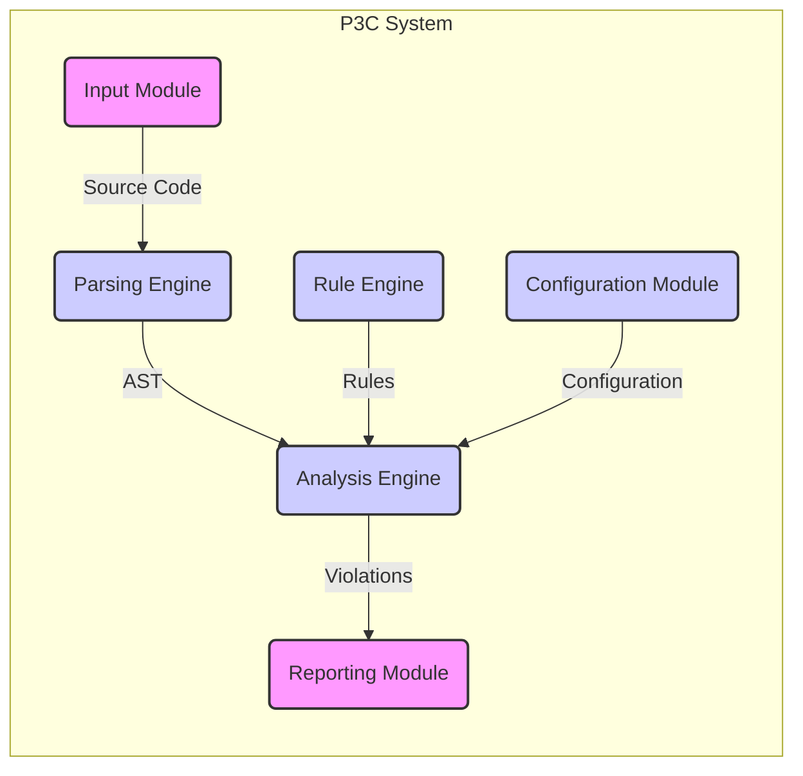

# Project Design Document: Alibaba P3C (Java Coding Guidelines) - Improved

**1. Introduction**

*   **Purpose:** This document provides an enhanced architectural design of the Alibaba P3C (Alibaba Java Coding Guidelines) project. It aims to offer a clearer and more detailed understanding of the system's components, data flow, and key technologies, specifically for use in subsequent threat modeling activities.
*   **Scope:** This document focuses on the core architecture and functionality of the P3C static analysis tool, emphasizing aspects relevant to security considerations. It covers the key components involved in analyzing Java code and generating reports, including their interactions and data dependencies. The document does not delve into the specifics of individual coding rules' implementation but focuses on the mechanisms for rule application and management.
*   **Goals:**
    *   Clearly define the major components of the P3C project and their responsibilities.
    *   Illustrate the data flow within the system with explicit directionality.
    *   Identify the key technologies utilized and their potential security implications.
    *   Provide a robust and detailed foundation for identifying potential security threats and vulnerabilities during threat modeling.

**2. Project Overview**

*   **Description:** The Alibaba P3C project is a sophisticated static analysis tool designed to enforce a comprehensive set of predefined Java coding guidelines. It meticulously analyzes Java source code to identify violations of these guidelines, thereby assisting developers in enhancing code quality, ensuring consistency across projects, and improving overall maintainability.
*   **Key Functionality:**
    *   **Source Code Ingestion:**  Accepting Java source code as input from various sources.
    *   **Syntactic Analysis:** Parsing Java source code and constructing an Abstract Syntax Tree (AST).
    *   **Semantic Analysis:**  Analyzing the AST to understand the code's structure and meaning.
    *   **Rule Application:** Executing a predefined set of coding rules against the AST.
    *   **Violation Detection:** Identifying instances where the code violates the defined rules.
    *   **Report Generation:** Creating detailed reports of detected rule violations.
    *   **Configuration Management:** Allowing users to customize the analysis process and rule sets.
*   **Target Users:** Primarily Java developers, but also beneficial for development team leads, quality assurance engineers, and security auditors.

**3. System Architecture**

*   **High-Level Components:**
    *   **Input Module:**  Responsible for securely receiving and validating the Java source code to be analyzed.
    *   **Parsing Engine:**  Converts the validated source code into a well-formed Abstract Syntax Tree (AST) representation.
    *   **Rule Engine:**  Manages and provides access to the defined coding guidelines and the logic for checking violations. This includes mechanisms for loading, updating, and potentially customizing rules.
    *   **Analysis Engine:**  The core component that traverses the AST and applies the rules retrieved from the Rule Engine to identify violations.
    *   **Reporting Module:**  Generates comprehensive reports detailing the identified rule violations, including their location and severity.
    *   **Configuration Module:**  Allows users to securely configure the analysis process, such as selecting specific rules, setting severity levels, and defining custom rule parameters.

*   **Component Diagram (Mermaid):**

*   **Component Details:**
    *   **Input Module:**
        *   Accepts Java source code from various sources: file paths, directory paths, code repositories (e.g., Git).
        *   Performs initial validation of the input, such as checking file types and encoding.
        *   May involve authentication and authorization if accessing code repositories.
    *   **Parsing Engine:**
        *   Utilizes a robust Java parser (e.g., Eclipse JDT, ANTLR) to generate a detailed and accurate AST.
        *   Handles syntax errors gracefully and may provide feedback on parsing issues.
        *   Security considerations include protection against maliciously crafted code that could exploit parser vulnerabilities.
    *   **Rule Engine:**
        *   Stores the coding guidelines as a collection of rules.
        *   Rules can be defined in various formats (e.g., Java code, declarative configuration files).
        *   Provides mechanisms for loading, updating, and potentially versioning the rule set.
        *   Security is critical here to prevent unauthorized modification or injection of malicious rules.
    *   **Analysis Engine:**
        *   Traverses the AST generated by the Parsing Engine.
        *   Retrieves relevant rules from the Rule Engine.
        *   Applies the rules to the AST nodes to detect violations.
        *   May employ advanced static analysis techniques like data flow analysis and control flow analysis.
        *   Performance and resource consumption are important considerations.
    *   **Reporting Module:**
        *   Formats the analysis results into user-friendly reports.
        *   Supports multiple output formats: plain text, XML, HTML, JSON, SARIF (Static Analysis Results Interchange Format).
        *   Reports typically include the location of the violation, the rule violated, and a description of the issue.
        *   Security considerations include preventing the inclusion of sensitive information in reports and securing access to reports.
    *   **Configuration Module:**
        *   Allows users to customize the analysis scope and behavior.
        *   Enables selection of specific rules to be applied or excluded.
        *   Allows setting severity levels for different rule violations.
        *   May support configuration through command-line arguments, configuration files, or a graphical user interface.
        *   Secure storage and management of configuration data are important.

**4. Data Flow**

*   **Data Flow Diagram (Mermaid):**

```mermaid
graph LR
    A["Java Source Code"]
    B["Input Module"]
    C["Abstract Syntax Tree (AST)"]
    D["Parsing Engine"]
    E["Coding Rules"]
    F["Rule Engine"]
    G["Analysis Engine"]
    H["Rule Violation Data"]
    I["Reporting Module"]
    J["Analysis Report"]
    K["Configuration Data"]
    L["Configuration Module"]

    style A fill:#fff,stroke:#333,stroke-width:2px
    style B fill:#f9f,stroke:#333,stroke-width:2px
    style C fill:#ccf,stroke:#333,stroke-width:2px
    style D fill:#ccf,stroke:#333,stroke-width:2px
    style E fill:#ccf,stroke:#333,stroke-width:2px
    style F fill:#ccf,stroke:#333,stroke-width:2px
    style G fill:#ccf,stroke:#333,stroke-width:2px
    style H fill:#ccf,stroke:#333,stroke-width:2px
    style I fill:#f9f,stroke:#333,stroke-width:2px
    style J fill:#fff,stroke:#333,stroke-width:2px
    style K fill:#ccf,stroke:#333,stroke-width:2px
    style L fill:#ccf,stroke:#333,stroke-width:2px

    A -- "Provides" --> B
    B -- "Parses into" --> D
    D -- "Generates" --> C
    F -- "Provides" --> E
    C -- "Analyzes with" --> G
    E -- "Used by" --> G
    G -- "Generates" --> H
    H -- "Formats into" --> I
    I -- "Produces" --> J
    L -- "Provides" --> K
    K -- "Influences" --> G
```

*   **Data Flow Description:**
    *   The process initiates with **Java Source Code** being provided to the system.
    *   The **Input Module** receives and validates the source code.
    *   The **Parsing Engine** processes the validated source code, generating an **Abstract Syntax Tree (AST)**.
    *   **Coding Rules** are managed and provided by the **Rule Engine**.
    *   The **Analysis Engine** receives the AST and the coding rules.
    *   The **Analysis Engine** analyzes the AST based on the provided rules, generating **Rule Violation Data**.
    *   The **Reporting Module** takes the rule violation data and formats it into a comprehensive **Analysis Report**.
    *   **Configuration Data**, managed by the **Configuration Module**, influences the **Analysis Engine**, determining which rules are applied and how the analysis is performed.

**5. Key Technologies**

*   **Primary Programming Language:** Java - This is the core language in which P3C is developed, influencing its architecture and potential vulnerabilities related to the Java ecosystem.
*   **Parsing Library:**  Likely utilizes a robust and well-established Java parsing library such as Eclipse JDT (Java Development Tools) or ANTLR (Another Tool for Language Recognition). The choice of parser impacts performance and the ability to handle complex code structures.
*   **Build Automation Tool:**  Likely employs Maven or Gradle for dependency management, building, and packaging. Security vulnerabilities in build dependencies are a concern.
*   **Reporting Libraries:**  May leverage libraries for generating reports in various formats, such as Apache POI for Excel, libraries for HTML generation (e.g., Thymeleaf, FreeMarker), or JSON libraries (e.g., Jackson, Gson). Vulnerabilities in these libraries could be exploited.
*   **Testing Framework:**  JUnit or TestNG are likely used for unit and integration testing, ensuring the reliability and correctness of the analysis engine and rules.
*   **Version Control System:** Git, as the project is hosted on GitHub, is used for managing the source code and collaboration. Secure management of the Git repository is crucial.

**6. Deployment Considerations**

*   **Usage Modes and Deployment Scenarios:**
    *   **Command-Line Interface (CLI):**  Executed directly from the command line, providing flexibility for integration into various workflows. Requires secure access to the execution environment and input code.
    *   **Integrated Development Environment (IDE) Plugin:**  Provides real-time analysis and feedback within the developer's IDE (e.g., IntelliJ IDEA, Eclipse). Security considerations include the plugin's access to the IDE's resources and the potential for malicious plugins.
    *   **Continuous Integration/Continuous Deployment (CI/CD) Pipeline Integration:**  Automates code analysis as part of the software delivery process. Requires secure configuration and access to the CI/CD environment and code repositories.
    *   **Standalone Server Application:**  Potentially deployed as a service to analyze code remotely. Requires robust security measures to protect the server and the analyzed code.
*   **Deployment Environment Security:**  The security of the environment where P3C is deployed is critical. This includes securing the operating system, network, and any associated infrastructure.

**7. Security Considerations (Detailed for Threat Modeling)**

*   **Input Validation Vulnerabilities:**
    *   **Malicious Code Injection:**  Can crafted Java code exploit vulnerabilities in the Input Module or Parsing Engine to execute arbitrary code on the analysis system?
    *   **Denial of Service (DoS):** Can excessively large or complex code inputs overwhelm the system's resources?
    *   **Path Traversal:** If file paths are used as input, can attackers access files outside the intended scope?
*   **Rule Engine Security:**
    *   **Rule Tampering:**  How are coding rules protected from unauthorized modification or deletion? Could compromised rules lead to bypassing critical checks?
    *   **Malicious Rule Injection:** Can attackers inject malicious rules that could cause harm or exfiltrate information during analysis?
*   **Analysis Engine Vulnerabilities:**
    *   **Exploitation of Parser Flaws:** Could vulnerabilities in the underlying parsing library be exploited through specially crafted code?
    *   **Resource Exhaustion:** Can the analysis of certain code patterns lead to excessive memory or CPU usage?
*   **Reporting Module Security:**
    *   **Information Disclosure:** Could reports inadvertently contain sensitive information (e.g., API keys, passwords) present in the analyzed code?
    *   **Unauthorized Access to Reports:** How are generated reports stored and accessed? Are there adequate access controls to prevent unauthorized viewing?
*   **Configuration Module Security:**
    *   **Unauthorized Configuration Changes:** How is access to the Configuration Module controlled? Could unauthorized changes weaken the analysis or introduce vulnerabilities?
    *   **Exposure of Configuration Secrets:** If configuration involves sensitive data (e.g., credentials for accessing code repositories), how is this data securely stored and managed?
*   **Dependency Vulnerabilities:** Are the external libraries used by P3C regularly scanned for known vulnerabilities? Could vulnerabilities in these dependencies be exploited?
*   **Authentication and Authorization:** For deployment scenarios involving user interaction or access to code repositories, are robust authentication and authorization mechanisms in place?

**8. Future Considerations (Potential Architectural and Security Impacts)**

*   **Support for Additional Languages:** Expanding analysis capabilities to other programming languages would introduce new parsing engines and rule sets, requiring careful consideration of their security implications.
*   **Cloud-Based Analysis Service:** Offering P3C as a cloud service would introduce new security challenges related to data privacy, access control, and multi-tenancy.
*   **Integration with Security Vulnerability Databases:**  Integrating with databases of known security vulnerabilities could enhance the tool's ability to identify security-related coding flaws. This would require secure and reliable access to these databases.
*   **Machine Learning for Rule Improvement:** Utilizing machine learning to automatically refine or generate coding rules could introduce risks if the training data is biased or compromised.
*   **Automated Code Remediation:**  Adding features for automated code fixes would require careful consideration of the security implications of automatically modifying code.

This improved design document provides a more detailed and security-focused overview of the Alibaba P3C project, making it a more effective foundation for subsequent threat modeling activities. The explicit data flow, detailed component descriptions, and specific security considerations offer a clearer picture of potential attack surfaces and vulnerabilities.