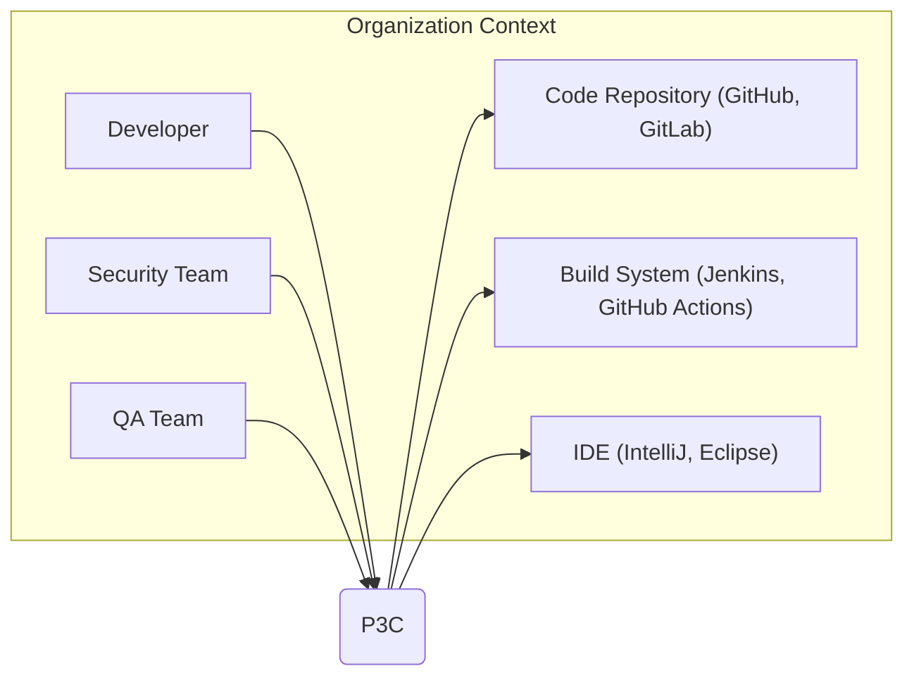
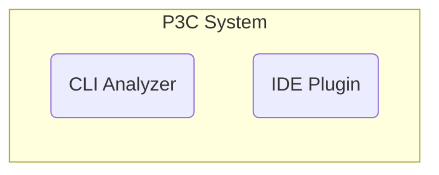
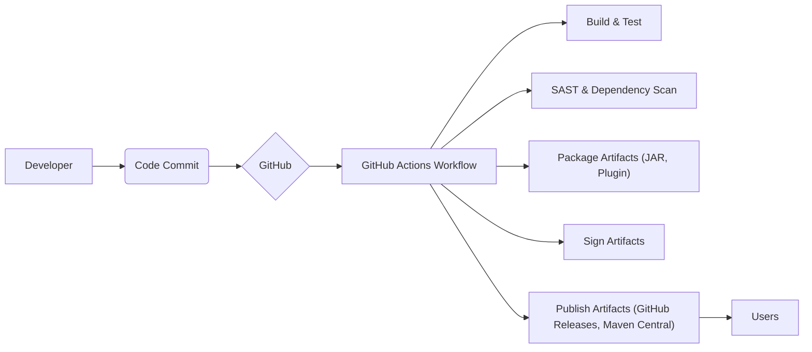

# BUSINESS POSTURE

This project, Alibaba P3C, is a static code analysis tool for Java.

- Business Priorities and Goals:
  - Improve the quality and reliability of Java code.
  - Reduce the number of bugs and vulnerabilities in Java applications.
  - Enforce coding standards and best practices within development teams.
  - Increase developer productivity by providing automated code reviews.
  - Facilitate easier code maintenance and refactoring.

- Business Risks:
  - False positives in analysis results can lead to wasted developer time.
  - False negatives can lead to undetected vulnerabilities in code.
  - Performance overhead of running static analysis might slow down development workflows.
  - Integration challenges with existing development tools and pipelines.
  - Lack of adoption by developers if the tool is perceived as too noisy or difficult to use.
  - Potential for security vulnerabilities within the P3C tool itself, which could be exploited if widely adopted.

# SECURITY POSTURE

- Security Controls:
  - security control: Open Source Community Review - The project is open source, allowing for community review of the code, which can help identify and address potential security vulnerabilities. Implemented and described in: GitHub repository and community contributions.
  - security control: Static Analysis Tooling - P3C itself is a static analysis tool, which is a security control for identifying potential vulnerabilities in user code. Implemented and described in: Project documentation and code.

- Accepted Risks:
  - accepted risk: Reliance on Community Security - Security of the project relies on the vigilance and contributions of the open-source community.
  - accepted risk: Potential Vulnerabilities in P3C - Like any software, P3C itself may contain vulnerabilities that could be exploited.

- Recommended Security Controls:
  - security control: Automated Dependency Scanning - Implement automated scanning of P3C's dependencies to identify and address known vulnerabilities in third-party libraries.
  - security control: Secure Development Practices - Follow secure coding practices during the development of P3C itself, including code reviews and security testing.
  - security control: Security Vulnerability Reporting Process - Establish a clear process for reporting and handling security vulnerabilities found in P3C.
  - security control: Release Signing and Verification - Sign releases of P3C artifacts to ensure integrity and authenticity, allowing users to verify they are using official and untampered versions.

- Security Requirements:
  - Authentication:
    - Not directly applicable to the core functionality of P3C as a static analysis tool. If a web-based reporting or management interface is added in the future, authentication would be required to control access.
  - Authorization:
    - Not directly applicable to the core functionality of P3C. Authorization might be relevant if user roles and permissions are introduced for managing configurations or analysis results in future extensions.
  - Input Validation:
    - P3C must perform robust input validation on the source code it analyzes to prevent code injection or other attacks that could be triggered by maliciously crafted code. This is critical to ensure the tool itself is not vulnerable when analyzing potentially untrusted code.
  - Cryptography:
    - Not directly applicable to the core functionality of P3C. Cryptography might be relevant if features like secure storage of configurations or encrypted communication are added in the future.

# DESIGN

## C4 CONTEXT



- Context Diagram Elements:
  - - Name: Developer
    - Type: Person
    - Description: Software developers who use P3C to analyze and improve their Java code.
    - Responsibilities: Write Java code, run P3C analysis, review and fix findings.
    - Security controls: Code review processes, developer workstations security.
  - - Name: Security Team
    - Type: Person
    - Description: Security professionals who may use P3C to identify potential security vulnerabilities in Java codebases.
    - Responsibilities: Integrate P3C into security scanning workflows, review security-related findings, track remediation efforts.
    - Security controls: Security information and event management (SIEM) systems, vulnerability management tools.
  - - Name: QA Team
    - Type: Person
    - Description: Quality assurance engineers who may use P3C to ensure code quality and adherence to coding standards.
    - Responsibilities: Integrate P3C into QA processes, monitor code quality metrics, ensure compliance with coding standards.
    - Security controls: Quality gates in CI/CD pipelines, test management tools.
  - - Name: Code Repository (GitHub, GitLab)
    - Type: External System
    - Description: Source code repositories where Java code is stored and managed. P3C analyzes code from these repositories.
    - Responsibilities: Store and version control source code, provide access to code for analysis.
    - Security controls: Access control lists (ACLs), branch protection, audit logs.
  - - Name: Build System (Jenkins, GitHub Actions)
    - Type: External System
    - Description: Automated build systems used to compile, test, and package Java applications. P3C can be integrated into build pipelines.
    - Responsibilities: Automate build processes, run P3C analysis as part of the build, generate build artifacts.
    - Security controls: CI/CD pipeline security, secrets management, build artifact signing.
  - - Name: IDE (IntelliJ, Eclipse)
    - Type: External System
    - Description: Integrated Development Environments used by developers to write and edit Java code. P3C provides plugins for IDE integration.
    - Responsibilities: Provide development environment, allow developers to run P3C analysis directly within the IDE.
    - Security controls: IDE security plugins, developer workstation security.
  - - Name: P3C
    - Type: System
    - Description: Alibaba P3C static code analysis tool for Java. Analyzes Java code to identify potential bugs, vulnerabilities, and coding standard violations.
    - Responsibilities: Analyze Java code, generate analysis reports, provide recommendations for code improvement.
    - Security controls: Input validation, secure coding practices in P3C development, vulnerability scanning of dependencies.

## C4 CONTAINER



- Container Diagram Elements:
  - - Name: CLI Analyzer
    - Type: Container
    - Description: Command-line interface application for running P3C analysis. Can be used in CI/CD pipelines or by developers locally.
    - Responsibilities: Load and parse Java code, perform static analysis based on configured rules, generate analysis reports in various formats.
    - Security controls: Input validation of analyzed code, secure handling of configuration files, logging of analysis activities.
  - - Name: IDE Plugin
    - Type: Container
    - Description: Plugin for popular Java IDEs (IntelliJ, Eclipse) that allows developers to run P3C analysis directly within their IDE.
    - Responsibilities: Integrate P3C analysis into the IDE workflow, provide real-time feedback to developers, display analysis results within the IDE.
    - Security controls: Secure communication with IDE, input validation of analyzed code within the IDE context, protection of plugin configuration and settings.

## DEPLOYMENT

Deployment Scenario: Integration into a CI/CD Pipeline using GitHub Actions.

```mermaid
flowchart LR
    subgraph "GitHub Actions Environment"
        A["GitHub Actions Runner"]
    end
    B["Code Repository (GitHub)"]
    C["Build Artifacts (GitHub Releases, Maven Central)"]

    B --> A: Source Code
    A --> A: Run P3C CLI Analyzer
    A --> C: Publish Analysis Results (Logs, Reports)
    A --> C: Publish Build Artifacts (P3C CLI)
```

- Deployment Diagram Elements:
  - - Name: GitHub Actions Runner
    - Type: Execution Environment
    - Description: Virtual machine or container provided by GitHub Actions to execute CI/CD workflows. Runs the P3C CLI Analyzer.
    - Responsibilities: Execute build and analysis steps defined in GitHub Actions workflow, provide runtime environment for P3C CLI.
    - Security controls: GitHub Actions security features, runner isolation, secrets management for accessing repositories and publishing artifacts.
  - - Name: Code Repository (GitHub)
    - Type: Infrastructure
    - Description: GitHub repository hosting the Java codebase being analyzed and the P3C project itself.
    - Responsibilities: Store source code, trigger CI/CD workflows, provide access to code for analysis.
    - Security controls: GitHub repository security settings, access controls, branch protection.
  - - Name: Build Artifacts (GitHub Releases, Maven Central)
    - Type: Artifact Repository
    - Description: Repositories where P3C CLI and analysis reports are published. Could be GitHub Releases for distribution or Maven Central for Java library distribution.
    - Responsibilities: Store and distribute P3C CLI artifacts, store analysis reports for access by developers and security teams.
    - Security controls: Access controls for artifact repositories, artifact signing to ensure integrity, secure storage of artifacts.

## BUILD



- Build Process Description:
  - Developer commits code changes to the GitHub repository.
  - GitHub triggers a GitHub Actions workflow upon code commit.
  - The workflow executes build and test steps to compile and verify the P3C project.
  - Static Application Security Testing (SAST) and dependency scanning are performed on the P3C codebase to identify vulnerabilities.
  - Build artifacts (JAR files for CLI, plugin archives) are packaged.
  - Artifacts are digitally signed to ensure authenticity and integrity.
  - Signed artifacts are published to distribution channels like GitHub Releases and Maven Central for users to download and use.

- Build Process Security Controls:
  - security control: Automated Build Process - Using GitHub Actions ensures a consistent and repeatable build process, reducing manual errors.
  - security control: Source Code Version Control - GitHub manages source code and tracks changes, providing auditability and rollback capabilities.
  - security control: Static Application Security Testing (SAST) - Integrated SAST tools scan the P3C codebase for potential security vulnerabilities during the build process.
  - security control: Dependency Scanning - Automated dependency scanning identifies known vulnerabilities in third-party libraries used by P3C.
  - security control: Artifact Signing - Digitally signing build artifacts ensures their integrity and authenticity, preventing tampering and allowing users to verify the source.
  - security control: Secure Artifact Repository - Publishing artifacts to trusted repositories like Maven Central and GitHub Releases ensures secure distribution.
  - security control: Access Control to Build System - Restricting access to GitHub Actions workflows and secrets to authorized personnel.

# RISK ASSESSMENT

- Critical Business Processes We Are Trying to Protect:
  - Software Development Lifecycle: P3C aims to improve the quality and security of software developed using Java. Protecting the SDLC means ensuring the tools used within it are reliable and secure.
  - Code Quality Assurance: P3C is a tool for ensuring code quality. Protecting this process means ensuring the tool accurately identifies code quality issues and doesn't introduce new risks.

- Data We Are Trying to Protect and Their Sensitivity:
  - Source Code (Indirectly): P3C analyzes source code, but doesn't store or manage it directly. The sensitivity of the source code depends on the projects being analyzed. P3C should not expose or leak the source code it analyzes. Sensitivity: Low to High (depending on the analyzed code).
  - Analysis Results: P3C generates analysis results and reports. These results might contain information about potential vulnerabilities or code quality issues, which could be sensitive if exposed. Sensitivity: Medium.
  - P3C Configuration: Configuration settings for P3C rules and analysis parameters. Misconfiguration could lead to ineffective analysis or false positives/negatives. Sensitivity: Low.

# QUESTIONS & ASSUMPTIONS

- Questions:
  - What are the primary target users for P3C? Individual developers, small teams, or large organizations?
  - What are the most common deployment scenarios for P3C? Local CLI usage, CI/CD pipeline integration, or centralized server deployment?
  - Are there any specific regulatory compliance requirements that P3C aims to help users meet (e.g., PCI DSS, HIPAA, GDPR)?
  - Are there plans to extend P3C with features beyond static code analysis, such as runtime monitoring or security vulnerability remediation guidance?
  - What is the process for users to report issues or request features for P3C?

- Assumptions:
  - P3C is primarily intended for use by Java developers and development teams.
  - The main deployment method is integration into existing development workflows, including local development environments and CI/CD pipelines.
  - P3C is distributed as an open-source tool and relies on community contributions for maintenance and improvement.
  - Security is a significant concern for P3C users, and they expect the tool to be reliable and not introduce new security risks.
  - P3C is designed to be integrated with existing development tools and infrastructure, rather than requiring a standalone deployment environment.