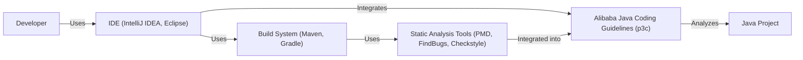
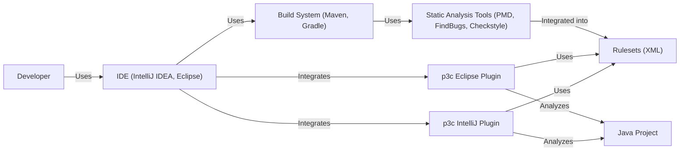
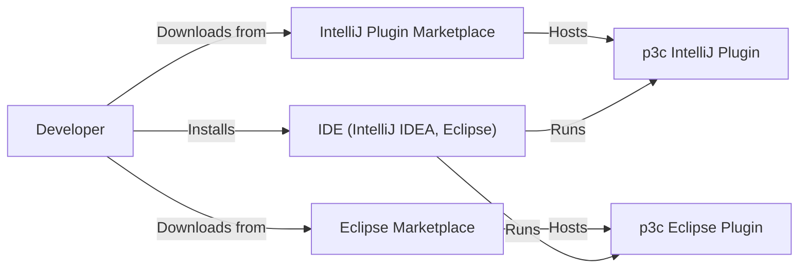
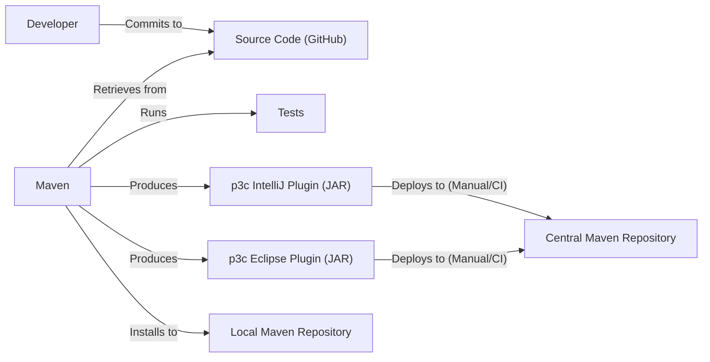

Okay, let's create a design document for the Alibaba Java Coding Guidelines project (p3c) based on the provided GitHub repository.

# BUSINESS POSTURE

Business Priorities and Goals:

*   Improve code quality and consistency across Alibaba's Java projects.
*   Reduce bugs and potential vulnerabilities through standardized coding practices.
*   Enhance code maintainability and readability.
*   Facilitate collaboration among developers by establishing common coding conventions.
*   Promote best practices in Java development.
*   Onboard new developers more efficiently.

Most Important Business Risks:

*   Inconsistent code quality leading to increased technical debt.
*   Higher incidence of bugs and security vulnerabilities due to non-standard practices.
*   Increased development and maintenance costs.
*   Difficulties in collaboration and knowledge transfer among developers.
*   Reputational damage due to software failures caused by poor code quality.

# SECURITY POSTURE

Existing Security Controls:

*   security control: Static code analysis (PMD, FindBugs, Checkstyle integration within the IntelliJ IDEA and Eclipse plugins). The rulesets themselves represent a form of codified security control, as many rules address potential security weaknesses (e.g., SQL injection, XSS, etc.). Described in the repository's documentation and implemented in the plugins.
*   security control: Community review and contributions. The open-source nature of the project allows for public scrutiny and contributions, potentially identifying and addressing security concerns. Described in the contribution guidelines.
*   security control: Focus on secure coding practices within the guidelines themselves. Many rules are directly related to preventing common vulnerabilities. Described in the coding guidelines documents.

Accepted Risks:

*   accepted risk: The guidelines are recommendations, not mandatory rules enforced at a low level. Adoption and adherence depend on developer discipline and organizational enforcement.
*   accepted risk: The plugins may not catch all potential security issues. Static analysis is not a silver bullet.
*   accepted risk: The project relies on community contributions, which may introduce new issues if not properly reviewed.
*   accepted risk: The guidelines may not cover all possible security scenarios or emerging threats.

Recommended Security Controls:

*   Integrate Software Composition Analysis (SCA) tools to identify vulnerabilities in third-party libraries.
*   Develop and maintain a secure coding training program based on the guidelines.
*   Implement automated enforcement of critical rules through CI/CD pipelines.
*   Establish a process for regularly updating the guidelines to address new threats and best practices.
*   Consider developing a custom security linter that goes beyond the capabilities of PMD/FindBugs/Checkstyle.

Security Requirements:

*   Authentication: Not directly applicable to this project, as it's a set of coding guidelines and plugins, not an application with user authentication.
*   Authorization: Not directly applicable, as above.
*   Input Validation: The guidelines should emphasize the importance of input validation to prevent various injection vulnerabilities (SQLi, XSS, command injection, etc.).  The existing rules cover some aspects of this, but it should be a prominent theme.
*   Cryptography: The guidelines should recommend secure cryptographic practices, including using strong algorithms, proper key management, and avoiding deprecated methods. The existing rules may cover some aspects, but this should be explicitly addressed.
*   Error Handling: The guidelines should recommend secure error handling practices, including avoiding information leakage in error messages.
*   Logging: The guidelines should recommend secure logging practices, including avoiding logging sensitive data.

# DESIGN

## C4 CONTEXT

Element Descriptions:

*   Element:
    *   Name: Developer
    *   Type: Person
    *   Description: A software developer writing Java code.
    *   Responsibilities: Writing, testing, and debugging code; adhering to coding guidelines.
    *   Security controls: Follows secure coding practices; undergoes security training.

*   Element:
    *   Name: Alibaba Java Coding Guidelines (p3c)
    *   Type: Software System
    *   Description: A set of coding guidelines and IDE plugins for Java development.
    *   Responsibilities: Providing coding rules and automated checks; analyzing code for potential issues.
    *   Security controls: Integrates static analysis tools; incorporates secure coding rules.

*   Element:
    *   Name: IDE (IntelliJ IDEA, Eclipse)
    *   Type: Software System
    *   Description: Integrated Development Environment used for Java development.
    *   Responsibilities: Providing a platform for code editing, compilation, debugging, and plugin integration.
    *   Security controls: Runs the p3c plugins; may have its own security features.

*   Element:
    *   Name: Java Project
    *   Type: Software System
    *   Description: The Java code being developed, which is subject to the coding guidelines.
    *   Responsibilities: Implementing the business logic of the application.
    *   Security controls: Should adhere to secure coding practices; subject to static analysis.

*   Element:
    *   Name: Build System (Maven, Gradle)
    *   Type: Software System
    *   Description: Tools used to build and manage Java projects.
    *   Responsibilities: Compiling code, managing dependencies, running tests, and packaging applications.
    *   Security controls: Can be configured to run static analysis tools as part of the build process.

*   Element:
    *   Name: Static Analysis Tools (PMD, FindBugs, Checkstyle)
    *   Type: Software System
    *   Description: Tools used to analyze code for potential bugs, style violations, and security vulnerabilities.
    *   Responsibilities: Identifying potential issues in the code.
    *   Security controls: Enforce coding rules, including security-related rules.

## C4 CONTAINER

In this case, the project is relatively simple, so the container diagram is essentially an extension of the context diagram. The "containers" are the plugins themselves and the rulesets.

Element Descriptions:

*   Element:
    *   Name: p3c IntelliJ Plugin
    *   Type: Container (Plugin)
    *   Description: The IntelliJ IDEA plugin for the Alibaba Java Coding Guidelines.
    *   Responsibilities: Integrating with IntelliJ IDEA; providing real-time code analysis; reporting violations.
    *   Security controls: Enforces the rulesets; uses PMD/FindBugs/Checkstyle internally.

*   Element:
    *   Name: p3c Eclipse Plugin
    *   Type: Container (Plugin)
    *   Description: The Eclipse plugin for the Alibaba Java Coding Guidelines.
    *   Responsibilities: Integrating with Eclipse; providing real-time code analysis; reporting violations.
    *   Security controls: Enforces the rulesets; uses PMD/FindBugs/Checkstyle internally.

*   Element:
    *   Name: Rulesets (XML)
    *   Type: Container (Configuration)
    *   Description: The XML files defining the coding rules and their severity levels.
    *   Responsibilities: Defining the coding standards; configuring the static analysis tools.
    *   Security controls: Contain rules specifically designed to prevent security vulnerabilities.

*   Element:
    *   Name: Developer, IDE, Java Project, Build System, Static Analysis Tools
    *   Type, Description, Responsibilities, Security Controls: Same as in C4 Context.

## DEPLOYMENT

Possible Deployment Solutions:

1.  IDE Plugin Marketplace: Developers install the plugins directly from the IntelliJ IDEA and Eclipse marketplaces.
2.  Manual Download and Installation: Developers download the plugin JAR files from the GitHub repository and install them manually.
3.  Internal Repository: Organizations can host the plugins on an internal repository for easier distribution and updates.

Chosen Solution (IDE Plugin Marketplace):

Element Descriptions:

*  Element:
    *   Name: Developer, IDE, P3CIntelliJPlugin, P3CEclipsePlugin
    *   Type, Description, Responsibilities, Security Controls: Same as in C4 Container.

*   Element:
    *   Name: IntelliJ Plugin Marketplace
    *   Type: Infrastructure Node (Software System)
    *   Description: The official marketplace for IntelliJ IDEA plugins.
    *   Responsibilities: Hosting and distributing plugins; providing updates.
    *   Security controls: Plugin signing; malware scanning (assumed).

*   Element:
    *   Name: Eclipse Marketplace
    *   Type: Infrastructure Node (Software System)
    *   Description: The official marketplace for Eclipse plugins.
    *   Responsibilities: Hosting and distributing plugins; providing updates.
    *   Security controls: Plugin signing; malware scanning (assumed).

## BUILD

The build process for p3c involves compiling the Java code for the plugins, packaging them into JAR files, and potentially running tests. The project uses Maven as its build tool.

Security Controls in Build Process:

*   security control: Dependency Management (Maven): Maven manages project dependencies, but it's crucial to use a tool like OWASP Dependency-Check to identify known vulnerabilities in those dependencies. This is not explicitly shown in the current repository but is a highly recommended addition.
*   security control: Static Analysis (PMD, FindBugs, Checkstyle): These tools are integrated into the build process (through Maven plugins) to identify potential code quality and security issues.
*   security control: Testing: The project includes unit tests, which can help identify functional bugs that might have security implications.
*   security control: (Recommended) Software Composition Analysis (SCA): Integrate an SCA tool (e.g., OWASP Dependency-Check, Snyk) into the Maven build to automatically scan for vulnerabilities in third-party libraries.
*   security control: (Recommended) Code Signing: Sign the plugin JAR files to ensure their integrity and authenticity.

# RISK ASSESSMENT

Critical Business Processes:

*   Software Development: The primary business process is the development of Java applications within Alibaba and by users of the guidelines.
*   Code Quality Assurance: Ensuring the quality, maintainability, and security of the codebase.

Data:

*   Source Code: The primary data is the Java source code of the applications being developed. Sensitivity varies greatly depending on the specific application. Some code may contain highly sensitive business logic, intellectual property, or personal data.
*   Coding Guidelines: The guidelines themselves are not sensitive data, but they represent best practices for protecting sensitive data within applications.
*   Plugin Configuration: The plugin configuration (rulesets) is not typically sensitive.

# QUESTIONS & ASSUMPTIONS

Questions:

*   What is the specific process for reviewing and approving changes to the coding guidelines (rulesets)?
*   Are there any plans to integrate more advanced security analysis tools, such as SAST or SCA tools, directly into the plugins or build process?
*   What is the process for handling reported vulnerabilities in the plugins themselves?
*   Is there a formal process for tracking and addressing violations of the coding guidelines within Alibaba's development teams?
*   Are there plans to create versions of the guidelines for other programming languages?

Assumptions:

*   BUSINESS POSTURE: Alibaba prioritizes code quality and security, and is willing to invest in tools and processes to achieve these goals.
*   SECURITY POSTURE: Developers are generally aware of secure coding principles, but need guidance and tools to consistently apply them. The existing security controls (static analysis) are considered sufficient for the current risk level, but there is room for improvement.
*   DESIGN: The primary deployment method is through the official IDE plugin marketplaces. Developers have access to Maven and can build the plugins from source if needed. The build process is automated using Maven.