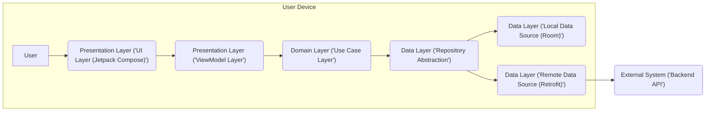
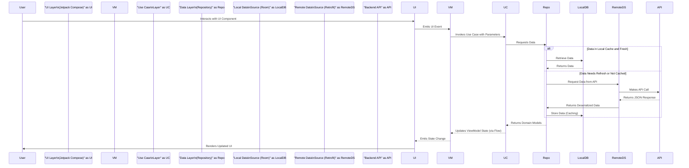

# Project Design Document: Now in Android (NiA) Application

**Version:** 2.0
**Date:** October 26, 2023
**Prepared By:** Gemini (AI Language Model)

## 1. Introduction

This document provides an enhanced and more detailed architectural design of the Now in Android (NiA) application, an open-source Android application showcasing modern Android development best practices. This improved document will serve as a stronger foundation for subsequent threat modeling activities by providing greater clarity and specificity.

### 1.1. Project Overview

The Now in Android application is a sample Android app built entirely with Kotlin and Jetpack Compose. It demonstrably utilizes various Android architecture components and libraries, including but not limited to:

*   Jetpack Compose for declarative UI development and management.
*   Kotlin Coroutines and Flow for managing asynchronous operations and reactive data streams.
*   Hilt for compile-time safe dependency injection, improving modularity and testability.
*   Room Persistence Library for providing an abstraction layer over SQLite, enabling structured local data management.
*   Retrofit for type-safe HTTP client implementation, facilitating communication with RESTful APIs.
*   WorkManager for scheduling and managing background tasks, ensuring reliable execution even when the app is not active.
*   Material Design 3 for implementing a modern and consistent user interface.

The application's core functionality revolves around fetching, processing, and displaying information related to the latest Android development news, relevant topics, and valuable resources.

### 1.2. Goals

The primary goals of this design document are to:

*   Provide a more granular and precise outline of the application's architecture and individual components.
*   Elaborate on the data flow within the application, including specific data transformations and handling.
*   Clearly identify the key technologies employed and their specific roles within the application's architecture.
*   Establish a robust and detailed basis for identifying potential security threats, vulnerabilities, and attack vectors.

### 1.3. Scope

This document encompasses the architectural design of the Now in Android application as represented in the provided GitHub repository. The focus remains on the client-side application and its interactions with external services. While backend services are acknowledged, they are treated as external entities with defined interfaces for the purpose of this client-centric design document.

## 2. High-Level Architecture

The Now in Android application adheres to a well-defined modern Android architecture, structured around distinct layers with specific responsibilities.

### 2.1. Architectural Diagram

### 2.2. Component Descriptions

*   **User:** The individual interacting with the application to consume Android development content.
*   **Presentation Layer ('UI Layer (Jetpack Compose)'):**  Responsible for rendering the user interface elements and handling direct user interactions. Implemented using Jetpack Compose's declarative UI paradigm. This layer focuses on UI state and event handling.
*   **Presentation Layer ('ViewModel Layer'):**  Acts as an intermediary between the UI and the domain/data layers. It holds UI-related data, manages the UI state, and contains presentation logic. ViewModels survive configuration changes, ensuring data persistence across UI redraws.
*   **Domain Layer ('Use Case Layer'):** Encapsulates specific business logic and application-specific rules. Use cases orchestrate the flow of data between the ViewModel and the Data Layer, representing distinct actions a user can take.
*   **Data Layer ('Repository Abstraction'):** Provides a consistent interface for accessing data from various sources. It abstracts the underlying data sources (local and remote), allowing the domain layer to interact with data without needing to know its origin.
*   **Data Layer ('Local Data Source (Room)'):** Manages the local persistence of structured data using the Room Persistence Library, which provides a type-safe abstraction over an SQLite database. This facilitates offline access and caching.
*   **Data Layer ('Remote Data Source (Retrofit)'):** Handles all network communication with the external Backend API. Retrofit simplifies the process of making HTTP requests and handling responses, including serialization and deserialization.
*   **External System ('Backend API'):**  An external service responsible for providing the raw data consumed by the application. This includes news articles, topic information, and other relevant content.

## 3. Detailed Design

### 3.1. Data Flow

The typical data flow within the application, triggered by a user action, can be described in more detail as follows:

*   **User Interaction:** The user initiates an action through the UI (e.g., refreshing the news feed, selecting a specific topic).
*   **UI Event Emission:** The Jetpack Compose UI emits an event corresponding to the user interaction.
*   **ViewModel Action Handling:** The ViewModel observes UI events and triggers corresponding actions or state updates.
*   **Use Case Invocation with Parameters:** The ViewModel invokes a specific Use Case, potentially passing parameters based on the user's action.
*   **Repository Method Call:** The Use Case calls a specific method on the Data Layer's Repository interface.
*   **Data Source Decision Logic:** The Repository implements logic to determine the appropriate data source (local or remote). This decision might be based on factors like data freshness, network availability, or caching policies.
*   **Local Data Source Interaction (if applicable):** If the data is available and considered fresh locally, Room retrieves the data from the SQLite database. Data might be transformed or mapped to domain models.
*   **Remote Data Source Interaction (if applicable):** If the data is not available locally or needs to be refreshed, Retrofit makes an asynchronous API call to the Backend API, specifying the required endpoint and any necessary parameters.
*   **Backend API Response Handling:** The Backend API processes the request and returns a response, typically in JSON format.
*   **Data Deserialization and Mapping:** Retrofit handles the deserialization of the JSON response into data transfer objects (DTOs). The Data Layer then maps these DTOs to the application's domain models.
*   **Data Caching (if applicable):** The Data Layer might cache the data retrieved from the remote source in the local database using Room to improve performance and enable offline access.
*   **Data Return to Use Case:** The Repository returns the requested data (either from local or remote source) to the invoking Use Case.
*   **ViewModel State Update:** The Use Case processes the data and updates the ViewModel's state, potentially using Kotlin Flows to emit the updated data.
*   **UI State Observation and Rendering:** The Jetpack Compose UI observes the changes in the ViewModel's state through Flows and re-renders the UI to reflect the updated data.

### 3.2. Key Components and Technologies

*   **Jetpack Compose:**  Employed for building the application's UI using a declarative approach, enabling efficient UI updates and a more maintainable codebase.
*   **Kotlin Coroutines and Flow:**  Fundamental for managing asynchronous operations, such as network requests and database interactions, ensuring the UI remains responsive. Flows are used for representing streams of data over time.
*   **Hilt:**  Facilitates dependency injection, allowing for loose coupling between components and simplifying unit testing. Hilt automatically generates and manages the dependency injection code.
*   **Room Persistence Library:** Provides a robust and type-safe way to interact with the SQLite database, handling boilerplate code and offering compile-time verification of database queries.
*   **Retrofit:**  Simplifies the process of making network requests to RESTful APIs by providing a type-safe interface for defining API endpoints and handling data serialization/deserialization.
*   **WorkManager:**  Used for scheduling background tasks that need to run reliably, even if the application is not in the foreground or the device restarts. Examples include periodic data synchronization or content updates.
*   **Material Design 3:**  Ensures a consistent and visually appealing user interface by adhering to Google's latest design guidelines and component library.

### 3.3. Data Storage

*   **Local Storage (Room):** The primary mechanism for local data persistence. Room manages an SQLite database, storing data fetched from the backend, such as news articles, topics, and related metadata. This enables offline access and reduces network load. Data is typically structured into entities that map to database tables.
*   **Shared Preferences (Potentially):** While not explicitly detailed in the high-level architecture, Shared Preferences might be used for storing small amounts of simple data, such as user preferences (e.g., theme selection, notification settings) or application settings.

### 3.4. Network Communication

*   **Retrofit (with OkHttp):** Retrofit, built on top of OkHttp, handles all network communication. It defines interfaces for API endpoints and uses converters (like Gson or Kotlin Serialization) to handle data serialization and deserialization between JSON and Kotlin data classes.
*   **HTTPS Enforcement:** It is a strong assumption that all communication with the Backend API is conducted over HTTPS to ensure the confidentiality and integrity of data transmitted between the application and the server, protecting against eavesdropping and man-in-the-middle attacks.

### 3.5. Background Tasks

*   **WorkManager:**  Likely utilized for tasks that require reliable execution in the background, such as periodically fetching new content from the backend API to keep the local data fresh, even when the user is not actively using the application. WorkManager respects device battery and system health constraints.

## 4. Deployment Architecture

The Now in Android application follows a standard Android application deployment model:

*   **Development and Building:** Developers use Android Studio to write, build, and test the application. Gradle is used as the build system to manage dependencies and build processes.
*   **Packaging:** The application is packaged into an Android App Bundle (AAB) or an APK (Android Package Kit) for distribution.
*   **Distribution:** The primary distribution channel is the Google Play Store, where users can download and install the application on their Android devices. Alternative distribution methods (e.g., sideloading) might also be possible.
*   **Client-Server Interaction:** The deployed application interacts with a remotely hosted Backend API over the internet. The Backend API's deployment and management are independent of the client application.

## 5. Technology Stack Summary

*   **Primary Programming Language:** Kotlin
*   **UI Toolkit:** Jetpack Compose
*   **Asynchronous Programming:** Kotlin Coroutines and Flow
*   **Dependency Injection Framework:** Hilt
*   **Local Data Persistence Library:** Room Persistence Library (utilizing SQLite)
*   **Networking Library:** Retrofit (leveraging OkHttp)
*   **Background Task Management:** WorkManager
*   **UI Design System:** Material Design 3
*   **Build System:** Gradle

## 6. Security Considerations (For Threat Modeling)

This section provides a more detailed breakdown of potential security considerations, categorized for clarity during threat modeling.

*   **Data Storage Security:**
    *   **Local Data Encryption at Rest:**  Given the potential sensitivity of Android development news and user preferences, evaluate if data stored by Room is encrypted at rest using mechanisms like SQLCipher or the Android Keystore.
    *   **Secure Key Management for Encryption:** If encryption is implemented, the management of encryption keys is critical. Investigate how keys are generated, stored (e.g., Android Keystore), and accessed to prevent unauthorized access.
    *   **Data Leakage Prevention:** Analyze potential data leakage vectors, such as through application logs (ensure sensitive data is not logged), backups (consider excluding sensitive data from backups), or through vulnerabilities that might allow unauthorized data extraction.
*   **Network Communication Security:**
    *   **Strict HTTPS Enforcement:** Verify that the application strictly enforces HTTPS for all communication with the Backend API. This prevents eavesdropping and ensures data integrity during transit. Consider using tools like Network Security Configuration to enforce this.
    *   **Certificate Pinning Implementation:** Implement certificate pinning to prevent man-in-the-middle attacks by validating the server's SSL certificate against a known, trusted certificate.
    *   **Backend API Authentication and Authorization:** While the client app might not handle direct user authentication, understand the authentication and authorization mechanisms used by the Backend API to protect its resources. Ensure the client app interacts with the API securely.
    *   **Data Validation and Sanitization:**  Thoroughly validate and sanitize data received from the Backend API to prevent injection attacks or other vulnerabilities that could arise from processing malicious data.
*   **Input Validation (Though Limited):**
    *   **User Preference Input Sanitization:** If the application allows users to input any data (e.g., custom feed URLs, search terms), ensure this input is properly sanitized to prevent potential issues, even within the context of a native application.
*   **Dependency Management Security:**
    *   **Third-Party Library Vulnerability Scanning:** Regularly scan all third-party libraries and dependencies for known vulnerabilities using tools like dependency-check or GitHub's dependency scanning features.
    *   **Secure Dependency Sources:** Ensure that dependencies are sourced from trusted repositories to mitigate the risk of supply chain attacks.
*   **Code Security:**
    *   **Code Obfuscation and Minification:** Employ code obfuscation (e.g., R8) to make reverse engineering more difficult and protect intellectual property.
    *   **Secure Coding Practices Adherence:** Follow secure coding practices to prevent common vulnerabilities like buffer overflows, improper error handling, and insecure randomness.
*   **Platform Security (Android Specifics):**
    *   **Permissions Analysis:** Review the Android permissions requested by the application and ensure they are necessary and do not grant excessive access to sensitive device resources or user data.
    *   **Intent Security:** If the application uses intents to communicate with other applications, ensure that these intents are properly secured to prevent malicious applications from intercepting or manipulating them.
*   **Background Task Security:**
    *   **Secure Data Handling in Background:** If WorkManager tasks handle sensitive data, ensure appropriate security measures are in place to protect this data during background processing.
*   **Authentication and Authorization (Application Level):** While the core functionality seems public, if any features require user accounts or personalized data in future iterations, robust authentication (verifying user identity) and authorization (controlling access to resources) mechanisms will be critical.

## 7. Future Considerations

*   **Enhanced Offline Capabilities:** Explore more sophisticated offline data management strategies, such as differential synchronization or more granular caching controls.
*   **Feature Expansion and Security Impact Analysis:** As new features are added, conduct thorough security impact assessments to identify and mitigate potential new vulnerabilities.
*   **Performance and Security Trade-offs:** Continuously evaluate the trade-offs between performance optimization and security measures, ensuring a balanced approach.
*   **Accessibility and Security:** Consider the intersection of accessibility and security, ensuring that security measures do not inadvertently hinder accessibility for users with disabilities.

This enhanced design document provides a more detailed and nuanced understanding of the Now in Android application's architecture, offering a stronger foundation for comprehensive threat modeling. By focusing on specific components, data flows, and technologies, potential security vulnerabilities can be more effectively identified, analyzed, and addressed.