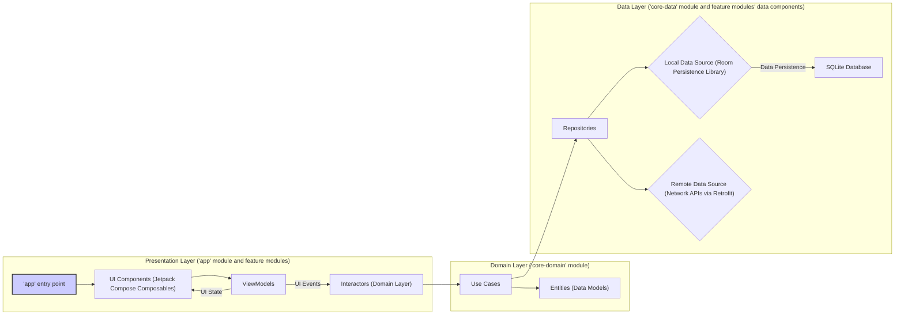

# Project Design Document: Now in Android (NIA) Application - Enhanced for Threat Modeling

**1. Introduction**

This document provides an enhanced design overview of the Now in Android (NIA) application, an open-source project by Google demonstrating modern Android development best practices. This document is specifically tailored to facilitate threat modeling activities by providing a detailed understanding of the application's architecture, components, data flow, and technologies, with a particular focus on security-relevant aspects.

**2. Goals and Objectives**

The primary goals of the NIA application are:

*   To serve as a practical demonstration of modern Android development using Kotlin, Jetpack Compose, and recommended Android Jetpack libraries.
*   To provide a comprehensive, real-world example of an Android application featuring multiple screens, data sources, and functionalities.
*   To showcase recommended architectural patterns, such as Model-View-Intent (MVI) or similar reactive architectures, for building scalable and maintainable Android applications.
*   To illustrate the integration of various Android platform features and APIs, providing developers with concrete examples.
*   To act as a valuable learning resource for Android developers seeking to adopt modern development practices.

**3. System Architecture**

The NIA application employs a modular architecture, emphasizing separation of concerns and enabling independent development and testing of features. The high-level architecture is represented below:



**3.1. Presentation Layer ('app' module and feature modules)**

*   **'app' entry point:**  The main application module, responsible for bootstrapping the application and coordinating feature modules.
*   **UI Components (Jetpack Compose Composables):** The user interface is built using declarative composable functions from Jetpack Compose.
    *   Individual Composables: Reusable UI elements that render the application's screens and components (e.g., `NewsFeedScreen`, `ArticleDetailScreen`).
    *   Navigation Component: Manages navigation between different composable screens and handles deep linking.
    *   UI State Management:  Utilizes state holders (often within ViewModels) to manage the UI's state and trigger recomposition when data changes.
*   **ViewModels:**  Act as intermediaries between the UI and the Domain Layer, holding UI-related data and handling UI logic.
    *   State Observables (e.g., `StateFlow`, `LiveData`): Expose the current UI state to the Composables.
    *   Event Handling:  Process UI events (user interactions) and trigger actions in the Domain Layer.
    *   Lifecycle Awareness:  Designed to survive configuration changes (e.g., screen rotation).
*   **Interactors (Domain Layer):** While conceptually part of the Domain Layer, these are often invoked directly from the Presentation Layer to initiate business logic.

**3.2. Domain Layer ('core-domain' module)**

*   **Use Cases:**  Represent specific business operations or user interactions within the application.
    *   Examples: `GetLatestNewsUseCase`, `FollowTopicUseCase`, `BookmarkArticleUseCase`.
    *   Orchestration:  Coordinate data retrieval and manipulation by interacting with Repositories.
    *   Business Logic:  Contain the core business rules and logic of the application, independent of UI or data source details.
*   **Entities (Data Models):**  Represent the core data objects of the application.
    *   Examples: `NewsArticle`, `Topic`, `Author`.
    *   Data Classes: Typically implemented as immutable data classes in Kotlin.
    *   Domain-Specific:  Represent data in a way that is meaningful to the application's domain.

**3.3. Data Layer ('core-data' module and feature modules' data components)**

*   **Repositories:** Provide a single, consistent interface for accessing data, abstracting the underlying data sources.
    *   Data Source Abstraction:  Decide whether to retrieve data from local or remote sources, or a combination of both.
    *   Caching Logic: Implement caching strategies to improve performance and reduce network requests (e.g., using in-memory caches or database caching).
    *   Offline Capabilities:  Enable the application to function partially or fully offline by relying on cached data.
*   **Local Data Source (Room Persistence Library):** Manages local data persistence using SQLite.
    *   Entities (Database Entities):  Represent database tables and their columns.
    *   DAOs (Data Access Objects): Interfaces defining methods for interacting with the database (e.g., `insert`, `query`, `update`, `delete`).
    *   Database Instance:  The concrete implementation of the Room database.
    *   Type Converters: Handle conversion between data types used in the application and those supported by SQLite.
*   **Remote Data Source (Network APIs via Retrofit):** Handles communication with backend services over the network.
    *   Retrofit Interface: Defines the API endpoints, request methods (GET, POST, etc.), and request/response formats.
    *   API Endpoints: Specific URLs for interacting with the backend API (e.g., `/news`, `/topics`).
    *   Request/Response Objects: Data Transfer Objects (DTOs) used for serializing requests and deserializing responses.
    *   Interceptors:  Allow for modification of network requests and responses (e.g., adding authentication headers, logging).
    *   Error Handling:  Manages network errors and provides mechanisms for retrying requests or handling failures.

**4. Data Flow (Example: Fetching and Displaying News Feed)**

```mermaid
graph LR
    subgraph "User Interaction (Presentation Layer)"
        A["User refreshes news feed in UI"]
        A --> B["UI Component (Composable) triggers ViewModel action"]
    end
    subgraph "Presentation Layer (ViewModel)"
        B --> C["ViewModel calls GetLatestNews Use Case"]
    end
    subgraph "Domain Layer (Use Case)"
        C --> D["GetLatestNews Use Case"]
    end
    subgraph "Data Layer (Repository)"
        D --> E{"News Repository"}
        E --> F{"Local Data Source (Room)"}
        E --> G{"Remote Data Source (Retrofit API)"}
    end
    subgraph "Data Source Logic"
        direction down
        F -- "Cache Hit" --> H["Return cached news data"]
        G -- "Cache Miss or forced refresh" --> I["Fetch news from API"]
        I --> J["Parse API response into Entities"]
        J --> K["Store fetched data in Local Data Source (Room)"]
    end
    subgraph "Response Flow"
        H --> E
        I --> E
        K --> F
        E --> D
        D --> C
        C --> L["ViewModel updates UI State with news data"]
    end
    subgraph "Presentation Layer (UI)"
        L --> M["UI Component (Composable) recomposes and displays news feed"]
    end

    style A fill:#ccf,stroke:#333,stroke-width:2px
    style M fill:#ccf,stroke:#333,stroke-width:2px
```

**Detailed Data Flow Steps:**

1. **User Interaction:** The user initiates a refresh of the news feed within the application's UI.
2. **Presentation Layer (UI):** A Jetpack Compose Composable detects the user interaction and triggers an action within its associated ViewModel.
3. **Presentation Layer (ViewModel):** The ViewModel receives the event and calls the `GetLatestNewsUseCase` from the Domain Layer.
4. **Domain Layer (Use Case):** The `GetLatestNewsUseCase` is invoked.
5. **Data Layer (Repository):** The Use Case interacts with the `NewsRepository`.
6. **Data Source Selection:** The `NewsRepository` determines the appropriate data source(s) to use. This might involve checking the local cache, considering network availability, or implementing a specific caching policy.
7. **Local Data Source (Room):** If the data is available and considered fresh in the local Room database, it is retrieved.
8. **Remote Data Source (Retrofit API):** If the data is not available locally or a refresh is required, the `NewsRepository` uses Retrofit to make a network request to the backend API.
9. **API Response:** The backend API returns the news data, which is then parsed into application-specific Entities.
10. **Data Persistence:** The newly fetched data from the API is often stored in the local Room database to serve as a cache for future requests and to enable offline access.
11. **Response to Domain:** The `NewsRepository` returns the aggregated news data (from either local or remote source, or both) to the `GetLatestNewsUseCase`.
12. **Response to Presentation:** The `GetLatestNewsUseCase` processes the data (if needed) and returns it to the ViewModel.
13. **Presentation Layer (ViewModel):** The ViewModel updates its UI state with the received news data.
14. **Presentation Layer (UI):** The change in the ViewModel's UI state triggers a recomposition of the relevant Jetpack Compose Composable, and the updated news feed is displayed to the user.

**5. Technology Stack**

*   **Primary Programming Language:** Kotlin
*   **Declarative UI Framework:** Jetpack Compose
*   **Asynchronous Programming:** Kotlin Coroutines with Flow for managing asynchronous operations and data streams.
*   **Dependency Injection:** Hilt (built on top of Dagger) for managing dependencies and improving code testability.
*   **Local Data Persistence:** Room Persistence Library for efficient and type-safe interaction with SQLite databases.
*   **Networking:** Retrofit for type-safe HTTP client implementation to interact with RESTful APIs.
*   **JSON Serialization/Deserialization:** Likely using Kotlin Serialization or Gson/Moshi for handling JSON data from network responses.
*   **Architectural Pattern:** Model-View-Intent (MVI) or a similar reactive unidirectional data flow architecture.
*   **Background Task Management:** WorkManager for managing deferrable and guaranteed background tasks.
*   **Image Loading:** Likely using Coil or Glide for efficient image loading and caching.
*   **Testing Frameworks:**
    *   JUnit for unit testing.
    *   Mockito or MockK for mocking dependencies in tests.
    *   Espresso or UI Automator for UI testing.
    *   Robolectric for running Android tests locally on the JVM.
*   **Build System:** Gradle with Kotlin DSL for project configuration and dependency management.

**6. Security Considerations (Focused on Threat Modeling)**

This section outlines potential security vulnerabilities and threats that should be thoroughly considered during the threat modeling process:

*   **Local Data Storage (SQLite Database):**
    *   **Threat:** Unauthorized access to sensitive data stored in the local database, especially on rooted devices or if device security is compromised.
    *   **Considerations:** Is sensitive user data (e.g., API keys, personal information) stored locally? If so, are appropriate encryption mechanisms (e.g., SQLCipher) employed? Are there any exported `ContentProvider` components that could inadvertently expose database contents? What are the file permissions on the database files?
*   **Network Communication (API Interactions):**
    *   **Threat:** Man-in-the-middle (MITM) attacks allowing eavesdropping or manipulation of network traffic between the app and the backend API.
    *   **Considerations:** Is HTTPS (TLS/SSL) enforced for all API communication? Is certificate pinning implemented to prevent trust of rogue certificates? How are API keys and other secrets managed within the application code (avoiding hardcoding)? Are network requests validated against potential injection vulnerabilities?
*   **Backend API Security:**
    *   **Threat:** Vulnerabilities in the backend APIs that the application interacts with, potentially leading to data breaches or unauthorized access.
    *   **Considerations:** What authentication and authorization mechanisms are used by the backend APIs (e.g., OAuth 2.0)? How are API requests authenticated (e.g., API keys, bearer tokens)? Are there rate limiting or other protective measures in place on the backend?
*   **Input Validation (Client-Side and Server-Side):**
    *   **Threat:** Injection attacks (e.g., SQL injection if raw queries were used, though unlikely with Room), cross-site scripting (XSS) if displaying web content, or other vulnerabilities due to malformed input.
    *   **Considerations:** Is user input validated on the client-side before being sent to the backend? Is input also validated on the server-side to prevent malicious data from being processed or stored? How is user-generated content handled and sanitized before display?
*   **Dependency Management (Third-Party Libraries):**
    *   **Threat:** Introduction of vulnerabilities through insecure or outdated third-party libraries.
    *   **Considerations:** Are dependencies regularly updated to the latest stable versions with security patches? Are there mechanisms in place to scan for and identify known vulnerabilities in dependencies (e.g., using dependency checking tools)?
*   **Authentication and Authorization (Application Level - if implemented):**
    *   **Threat:** Unauthorized access to user-specific data or features if the application were to implement user accounts.
    *   **Considerations:** If user authentication were implemented, how would user credentials be securely stored (avoiding storing passwords directly)? What authorization mechanisms would be used to control access to different parts of the application or data? Are secure storage mechanisms (e.g., Android Keystore) used for sensitive tokens or credentials?
*   **Deep Links and App Links:**
    *   **Threat:** Malicious deep links or app links potentially leading to unintended actions within the application or exposing sensitive information.
    *   **Considerations:** Are deep links and app links properly validated to ensure they originate from trusted sources and do not contain malicious parameters?
*   **Data Handling and Privacy:**
    *   **Threat:** Exposure or misuse of user data, potentially violating privacy regulations.
    *   **Considerations:** What types of user data are collected, processed, and stored by the application? Are privacy policies clearly defined and adhered to? Are appropriate measures taken to protect user privacy (e.g., data anonymization, minimization)?
*   **Code Security (General):**
    *   **Threat:** Vulnerabilities introduced through insecure coding practices, such as improper error handling, insecure randomness, or information leakage.
    *   **Considerations:** Are secure coding guidelines followed during development? Are code reviews conducted to identify potential security flaws? Are there any exported components (e.g., `BroadcastReceiver`, `Service`) that could be exploited?

**7. Deployment**

The NIA application is intended for deployment on Android devices. The typical deployment process involves:

*   Building the application's APK or Android App Bundle using Android Studio and Gradle.
*   Distribution through the Google Play Store for public release or through internal distribution channels for development and testing.

**8. Future Considerations**

Potential future enhancements or changes that could impact the architecture and security posture of the NIA application include:

*   Integration with more complex or sensitive backend services requiring stronger authentication or authorization.
*   Implementation of user accounts and personalized features, introducing new security considerations related to user data management.
*   Addition of new features that interact with sensitive device resources or user data.
*   Adoption of new Android platform features or libraries that may introduce new security requirements or best practices.

This enhanced design document provides a more detailed and security-focused overview of the Now in Android application. It is intended to be a valuable resource for conducting thorough threat modeling and identifying potential security vulnerabilities.