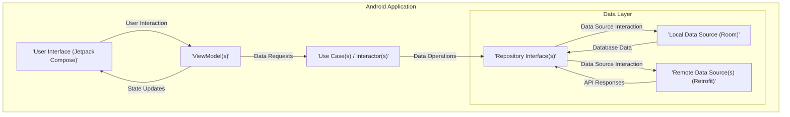
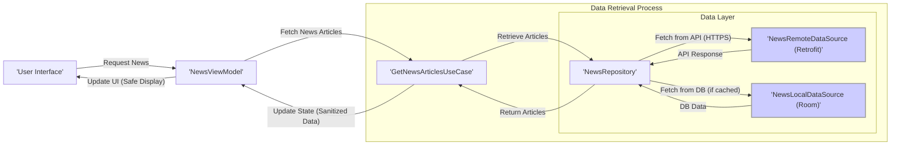

# Project Design Document: Now in Android (NiA)

**Version:** 1.1
**Date:** October 26, 2023
**Author:** AI Software Architect

## 1. Introduction

This document provides a detailed architectural design of the Now in Android (NiA) project, an open-source Android application showcasing modern Android development practices. This document serves as a foundation for subsequent threat modeling activities, enabling a comprehensive understanding of the system's components, data flows, and potential security vulnerabilities. The design focuses on the application's structure, key components, and interactions between them, with a particular emphasis on aspects relevant to security.

## 2. Goals

The primary goals of this design document are to:

*   Provide a clear and comprehensive overview of the NiA application's architecture, focusing on elements relevant to security.
*   Identify the key components and their responsibilities, highlighting potential security implications.
*   Describe the data flow within the application, pinpointing sensitive data paths and transformation points.
*   Serve as a robust basis for identifying potential security threats and vulnerabilities during threat modeling sessions.
*   Facilitate communication and understanding among stakeholders, particularly regarding security aspects.

## 3. Scope

This document covers the architectural design of the NiA Android application, focusing on the following aspects critical for threat modeling:

*   High-level architectural overview, emphasizing security boundaries and trust zones.
*   Detailed description of key components and their functionalities, including technologies used and potential vulnerabilities.
*   Data flow within the application, including data sources, persistence mechanisms, and data transformation steps.
*   User interface and user interaction flow, highlighting potential input vectors.
*   Integration with external services, detailing communication protocols and data exchanged.
*   Authentication and authorization mechanisms (if any, and planned).

This document does not cover:

*   Detailed code implementation specifics beyond architectural relevance.
*   Specific UI element designs unless they directly impact security (e.g., input fields).
*   Deployment infrastructure details unless they directly impact the application's security posture.
*   Detailed security controls and mitigations (these will be the output of the threat modeling process).

## 4. High-Level Architecture

The Now in Android application follows a modern Android architecture, primarily based on the following principles, which have security implications:

*   **Unidirectional Data Flow:**  Simplifies reasoning about state changes and data propagation, aiding in identifying potential data leaks or unauthorized modifications.
*   **Reactive Programming (Kotlin Coroutines and Flows):** Asynchronous operations require careful handling to prevent race conditions and ensure data integrity.
*   **Modularization:**  While improving organization, module boundaries can be potential points of integration vulnerabilities if not properly secured.
*   **Dependency Injection (Hilt):**  Ensures dependencies are managed, but vulnerabilities in injected libraries can impact the application.

Here's a high-level architectural diagram:

## 5. Detailed Component Descriptions

This section describes the key components of the NiA application and their responsibilities, with a focus on security-relevant aspects.

*   **User Interface (Jetpack Compose):**
    *   **Responsibilities:** Presents information to the user and handles user interactions, acting as the primary entry point for user input.
    *   **Technologies:** Jetpack Compose, Kotlin.
    *   **Security Considerations:**
        *   Potential for UI redressing attacks if not properly handled.
        *   Vulnerability to displaying malicious content if data is not sanitized.
        *   Improper handling of sensitive data in UI elements (e.g., logging).

*   **ViewModel(s):**
    *   **Responsibilities:** Prepares and manages data for the UI, holds UI state, and exposes it to the UI. Handles business logic related to UI interactions, potentially involving sensitive data manipulation.
    *   **Technologies:** Android Architecture Components (ViewModel), Kotlin Coroutines, Flows.
    *   **Security Considerations:**
        *   Potential for exposing sensitive data if not properly managed within the ViewModel's lifecycle.
        *   Risk of state manipulation vulnerabilities if not implemented correctly.

*   **Use Case(s) / Interactor(s):**
    *   **Responsibilities:** Contains specific business logic and orchestrates data retrieval and manipulation from repositories. Represents a single user action or use case, often involving sensitive operations.
    *   **Technologies:** Kotlin Coroutines, Flows.
    *   **Security Considerations:**
        *   Critical point for enforcing business logic and authorization rules.
        *   Potential for vulnerabilities if business logic flaws exist.

*   **Repository Interface(s):**
    *   **Responsibilities:** Defines an abstraction for accessing data, providing a clean interface for data operations, regardless of the underlying data source. This abstraction is crucial for managing access control to different data sources.
    *   **Technologies:** Kotlin Interfaces.
    *   **Security Considerations:**
        *   Central point for defining data access policies.
        *   Improper implementation can lead to bypassing data source specific security measures.

*   **Local Data Source (Room):**
    *   **Responsibilities:** Manages the local persistent storage of data, including potentially sensitive user preferences or cached content.
    *   **Technologies:** Android Room Persistence Library, SQLite.
    *   **Security Considerations:**
        *   Data at rest vulnerability if the database is not properly secured (e.g., encryption).
        *   Potential for SQL injection if data is not properly sanitized before database queries (though Room mitigates this significantly).
        *   Risk of unauthorized access if the device is compromised.

*   **Remote Data Source(s) (Retrofit):**
    *   **Responsibilities:** Handles communication with remote APIs to fetch data, potentially including sensitive information.
    *   **Technologies:** Retrofit, Kotlin Coroutines, Serialization libraries (e.g., kotlinx.serialization or Gson), potentially OkHttp for network configuration.
    *   **Security Considerations:**
        *   Data in transit vulnerability if HTTPS is not enforced.
        *   Risk of man-in-the-middle attacks.
        *   Vulnerabilities related to the specific API endpoints being called and the data exchanged.
        *   Improper handling of API keys or authentication tokens.
        *   Vulnerabilities in the serialization/deserialization process.

## 6. Data Flow

The data flow within the NiA application generally follows this pattern, with potential security implications at each stage:

1. **User Interaction:** The user interacts with the UI, potentially providing input that could be malicious.
2. **ViewModel Action:** The UI event triggers an action in the corresponding ViewModel. Input validation should ideally start here.
3. **Use Case Invocation:** The ViewModel invokes a specific Use Case to handle the business logic, which should include authorization checks.
4. **Repository Interaction:** The Use Case interacts with the appropriate Repository interface, which enforces data access policies.
5. **Data Source Access:** The Repository implementation accesses either the Local Data Source (Room) or the Remote Data Source (Retrofit), each with its own security considerations.
6. **Data Retrieval/Modification:**
    *   **Local:** Room interacts with the SQLite database. Potential for SQL injection if raw queries are used improperly.
    *   **Remote:** Retrofit makes network requests to external APIs. Requires secure communication (HTTPS).
7. **Data Return:** The data source returns the requested data to the Repository. Ensure sensitive data is not inadvertently exposed.
8. **Data Transformation (Optional):** The Repository or Use Case may transform the data. Ensure transformations do not introduce vulnerabilities or leak sensitive information.
9. **State Update:** The Use Case updates the state in the ViewModel. Ensure state updates do not expose sensitive information unnecessarily.
10. **UI Update:** The ViewModel's state changes are observed by the UI, which re-renders to reflect the updated data. Ensure sensitive data is handled appropriately in the UI.

Here's a data flow diagram for fetching and displaying news articles, highlighting potential security touchpoints:

## 7. Authentication and Authorization

While the Now in Android application is primarily a content consumption app and may not require explicit user login for core functionality, consider the following:

*   **API Key Management:** If the application uses API keys for accessing external services, secure storage and handling of these keys are crucial.
*   **Potential Future Features:** If future features involve user accounts or personalized content, authentication and authorization mechanisms will need to be implemented. Consider strategies like OAuth 2.0.
*   **Device Attestation:** For certain sensitive operations (if any are planned), consider device attestation to ensure the integrity of the device.

## 8. Security Considerations (Detailed)

This section expands on the initial security considerations, providing more specific examples:

*   **Data at Rest:**
    *   **Threat:** Unauthorized access to locally stored data if the device is lost or stolen.
    *   **Examples:** User preferences, saved articles, potentially cached API responses containing sensitive information.
    *   **Mitigation Considerations:** Implementing database encryption using mechanisms provided by Android or third-party libraries.

*   **Data in Transit:**
    *   **Threat:** Eavesdropping or man-in-the-middle attacks intercepting communication with remote APIs.
    *   **Examples:** API requests for news articles, topic information.
    *   **Mitigation Considerations:** Enforcing HTTPS for all network communication. Implementing certificate pinning for enhanced security.

*   **API Security:**
    *   **Threat:** Vulnerabilities in the external APIs used by the application.
    *   **Examples:** API endpoints susceptible to injection attacks, insecure authentication mechanisms.
    *   **Mitigation Considerations:** Thoroughly vetting the APIs used. Implementing proper error handling to avoid leaking information. Rate limiting to prevent abuse.

*   **Input Validation:**
    *   **Threat:**  Although minimal, if any user input is processed (e.g., search queries), it could be a vector for injection attacks.
    *   **Examples:**  Malicious scripts injected through search fields.
    *   **Mitigation Considerations:**  Sanitizing and validating all user inputs on the client-side and ideally on the server-side as well.

*   **Dependency Management:**
    *   **Threat:** Using outdated libraries with known security vulnerabilities.
    *   **Examples:** Vulnerabilities in Retrofit, Room, or other third-party libraries.
    *   **Mitigation Considerations:** Regularly updating dependencies and monitoring for security advisories. Using tools to scan for dependency vulnerabilities.

*   **Permissions:**
    *   **Threat:** Requesting unnecessary permissions that could be misused if the application is compromised.
    *   **Examples:** Requesting location permissions without a clear need.
    *   **Mitigation Considerations:** Adhering to the principle of least privilege and requesting only necessary permissions.

## 9. Assumptions and Constraints

The following assumptions and constraints have been considered during the design process, which have implications for security:

*   The application primarily consumes data and does not involve significant user-generated content, reducing the attack surface related to user input.
*   The backend APIs are assumed to be generally secure and follow common security best practices (e.g., input validation, authorization). However, this assumption needs to be validated during threat modeling.
*   The application targets modern Android devices and utilizes the latest Android SDK features, which include built-in security enhancements.
*   The development team adheres to secure coding practices, although this needs to be reinforced through training and code reviews.

## 10. Future Considerations

This design document provides a snapshot of the current architecture. Future considerations that could impact security include:

*   **Offline Capabilities:** Implementing offline data storage requires careful consideration of data encryption and integrity.
*   **Push Notifications:** Secure handling of push notification tokens and the content of notifications is important.
*   **Feature Expansion:** New features might introduce new security risks that need to be assessed.
*   **Integration with Third-Party Services:** Integrating with external services increases the attack surface and requires careful evaluation of the security posture of those services.

This document provides a more detailed and security-focused architectural overview of the Now in Android application, serving as a strong foundation for the subsequent threat modeling process.