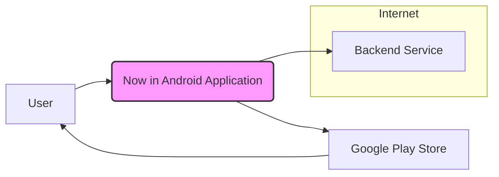
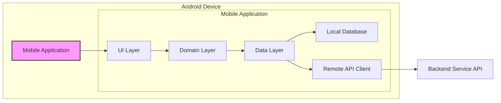
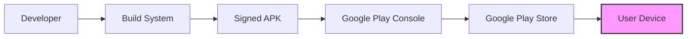

# BUSINESS POSTURE

- Business Priorities and Goals:
 - Goal: To showcase modern Android development best practices using Jetpack Compose and modern Android architecture.
 - Goal: To serve as a learning resource for Android developers interested in modern Android development.
 - Goal: To demonstrate a practical application of various Jetpack libraries and architectural patterns.
 - Priority: Code quality and adherence to best practices are paramount to effectively demonstrate modern Android development.
 - Priority: Maintainability and readability of the codebase to facilitate learning and understanding.
 - Priority: Demonstrating a functional application that showcases UI and data handling.

- Business Risks:
 - Risk: Misinterpretation of the sample application as a production-ready template without necessary security hardening.
 - Risk: Inclusion of insecure coding practices in the sample, which could be unintentionally adopted by developers learning from the project.
 - Risk: Outdated dependencies or libraries in the sample project over time, leading to security vulnerabilities if used as a template in the future.
 - Risk: Lack of clarity on the intended scope and limitations of the sample application, potentially leading to misuse or unrealistic expectations.

# SECURITY POSTURE

- Existing Security Controls:
 - security control: Code reviews are likely performed by the Android development team (inferred from open-source nature and Google's development practices). Implementation: GITHUB REPOSITORY - PULL REQUEST process.
 - security control: Dependency management using Gradle and dependency lock files. Implementation: GITHUB REPOSITORY - `build.gradle.kts` files and `gradle.lockfile`.
 - security control: Static code analysis using linters and code formatters (e.g., detekt, ktlint). Implementation: GITHUB REPOSITORY - Gradle configuration and potentially CI pipelines.
 - security control: ProGuard/R8 code shrinking and obfuscation during release builds. Implementation: ANDROID BUILD SYSTEM - Gradle configuration for release builds.

- Accepted Risks:
 - accepted risk:  Sample application may not undergo rigorous security penetration testing as a production application would. Rationale: It is a sample application and not intended for production use handling sensitive data.
 - accepted risk:  Vulnerabilities in backend services (if any are actually deployed and used for demo) are not in scope of this project's security posture. Rationale: Focus is on the Android application itself.
 - accepted risk:  Detailed security documentation and threat models are not explicitly created for this sample application. Rationale: Project's primary goal is demonstration and education, not production security.

- Recommended Security Controls:
 - security control: Implement automated security scanning as part of the CI/CD pipeline (e.g., using GitHub Actions and SAST tools for Kotlin and Android).
 - security control: Regularly update dependencies to address known vulnerabilities.
 - security control:  Include basic input validation examples within the sample application to demonstrate secure coding practices.
 - security control:  Provide clear documentation or comments within the code regarding security considerations and best practices for Android development.

- Security Requirements:
 - Authentication:
  - Requirement:  For a sample news application, user authentication is likely not a core requirement. If implemented for demonstration purposes, it should showcase secure authentication practices.
  - Existing Control: Not explicitly implemented in the sample application as per initial review.
  - Recommended Control: If authentication is added as a feature, demonstrate secure storage of tokens (e.g., using Android Keystore) and secure communication protocols (HTTPS).
 - Authorization:
  - Requirement:  Authorization might be relevant if the application were to have different user roles or access levels. In the current sample, it is likely not a core requirement.
  - Existing Control: Not explicitly implemented.
  - Recommended Control: If authorization is added, demonstrate role-based access control or attribute-based access control within the application logic.
 - Input Validation:
  - Requirement:  Input validation is crucial to prevent common vulnerabilities like injection attacks. The application should demonstrate proper input validation for user inputs and data received from external sources.
  - Existing Control: Basic input validation practices are expected as part of general good coding practices, but explicit security-focused input validation examples should be highlighted.
  - Recommended Control:  Implement and showcase input validation for common input fields (e.g., search queries, user profile updates) using Android Jetpack libraries or standard Kotlin validation techniques.
 - Cryptography:
  - Requirement:  Cryptography is essential for protecting sensitive data at rest and in transit. For a news application, data at rest might include user preferences or cached data. Data in transit should be protected using HTTPS.
  - Existing Control: HTTPS usage for network communication is expected. Data at rest encryption is not explicitly highlighted in the sample description.
  - Recommended Control:  Demonstrate best practices for handling sensitive data (if any) using Android Keystore for encryption and decryption. Ensure all network communication uses HTTPS.

# DESIGN

## C4 CONTEXT



- Elements of Context Diagram:
 - Element:
  - Name: User
  - Type: Person
  - Description: Android users who install and use the "Now in Android" application on their mobile devices to read news and explore Android development topics.
  - Responsibilities:  Interact with the application to consume content, provide feedback (implicitly through usage), and potentially customize their experience.
  - Security controls: User devices are outside the direct security control of the project. Users are responsible for device security, including OS updates and app permissions.
 - Element:
  - Name: Now in Android Application
  - Type: Software System
  - Description: The "Now in Android" mobile application, built for the Android platform using Jetpack Compose and modern Android architecture. It fetches and displays news and information related to Android development.
  - Responsibilities:  Present news content to users, manage user interface and user experience, handle data fetching and caching, and interact with backend services (if any).
  - Security controls: Implements security controls within the application code, such as input validation, secure data handling, and secure communication. Relies on Android OS security features.
 - Element:
  - Name: Backend Service
  - Type: Software System
  - Description:  A backend service (potentially mock or simplified for the sample) that provides news content and data to the "Now in Android" application.
  - Responsibilities:  Store and manage news content, provide API endpoints for the application to fetch data, and potentially handle user-related data (if any).
  - Security controls:  Backend service security is assumed to be managed separately. Security controls would include API security, data protection, and infrastructure security. (Note: For a sample app, this might be a simplified or mock service with minimal security considerations).
 - Element:
  - Name: Google Play Store
  - Type: Software System
  - Description: The official app store for the Android platform, used to distribute and update the "Now in Android" application to users.
  - Responsibilities:  Host the application package, manage application distribution, handle updates, and provide a platform for user reviews and ratings.
  - Security controls: Google Play Store implements security controls for app distribution, including app signing verification and malware scanning. Developers are responsible for ensuring their app complies with Play Store policies.

## C4 CONTAINER



- Elements of Container Diagram:
 - Element:
  - Name: Mobile Application
  - Type: Container - Mobile App
  - Description: The "Now in Android" Android application, packaged as an APK and running on user's Android devices. It is composed of different layers following modern Android architecture.
  - Responsibilities:  Provide user interface, manage application state, handle user interactions, orchestrate data flow between layers, and interact with local storage and remote APIs.
  - Security controls: Implements application-level security controls, leverages Android OS security features, and interacts with device security features (e.g., permissions).
 - Element:
  - Name: UI Layer
  - Type: Component - Kotlin/Compose Code
  - Description:  Responsible for rendering the user interface using Jetpack Compose, handling user input, and displaying data to the user.
  - Responsibilities:  UI rendering, user interaction handling, UI state management, and presentation logic.
  - Security controls: Input validation on UI inputs, secure display of data, and protection against UI-related vulnerabilities (e.g., clickjacking - less relevant for mobile apps).
 - Element:
  - Name: Domain Layer
  - Type: Component - Kotlin Code
  - Description: Contains the business logic and use cases of the application. It is independent of the UI and data layers.
  - Responsibilities:  Orchestrate use cases, implement business rules, and manage data flow between the UI and data layers.
  - Security controls: Authorization logic, business rule enforcement, and data sanitization before passing to the data layer.
 - Element:
  - Name: Data Layer
  - Type: Component - Kotlin Code
  - Description:  Responsible for data access and management. It interacts with local data sources (database) and remote data sources (API).
  - Responsibilities:  Data fetching, data caching, data persistence, and data source abstraction.
  - Security controls: Input validation for database queries, secure handling of API requests and responses, and data encryption at rest (if needed for sensitive data).
 - Element:
  - Name: Local Database
  - Type: Container - SQLite Database (or similar)
  - Description:  A local database on the Android device used for caching data, storing user preferences, or persisting application state.
  - Responsibilities:  Persistent storage of application data, data retrieval, and data management.
  - Security controls: Data encryption at rest (Android OS level or application level if needed), secure database access controls (Android OS permissions).
 - Element:
  - Name: Remote API Client
  - Type: Component - Kotlin Code (using libraries like Retrofit)
  - Description:  Handles communication with the backend service API over the network.
  - Responsibilities:  Making API requests, handling API responses, and data serialization/deserialization.
  - Security controls: HTTPS for secure communication, API key management (if applicable), and handling API authentication and authorization.
 - Element:
  - Name: Backend Service API
  - Type: External System - API
  - Description:  The API exposed by the backend service for the mobile application to fetch news and data.
  - Responsibilities:  Provide API endpoints, handle requests from the mobile application, and return data in a defined format.
  - Security controls: API authentication and authorization, input validation on API requests, and secure API implementation (managed by the backend service team).

## DEPLOYMENT

- Deployment Architecture:
 - Solution: Public App Store Distribution (Google Play Store)
 - Description: The "Now in Android" application is deployed to user devices through the Google Play Store. Users download and install the application from the Play Store. Updates are also distributed through the Play Store.



- Elements of Deployment Diagram:
 - Element:
  - Name: Developer
  - Type: Person
  - Description: Android developers who contribute to the "Now in Android" project.
  - Responsibilities:  Write code, commit changes, and participate in the development process.
  - Security controls: Secure development practices, code reviews, and access control to the source code repository.
 - Element:
  - Name: Build System
  - Type: Automated System (e.g., GitHub Actions, local build environment)
  - Description:  The system used to build the Android application from the source code, compile it, and package it into an APK file.
  - Responsibilities:  Automated build process, dependency management, code compilation, testing, and APK packaging.
  - Security controls: Secure build environment, dependency vulnerability scanning, and code signing.
 - Element:
  - Name: Signed APK
  - Type: Artifact - Android Application Package
  - Description:  The Android application package file, signed with a developer certificate, ready for distribution.
  - Responsibilities:  Installable application package for Android devices.
  - Security controls: Code signing to verify application integrity and developer identity.
 - Element:
  - Name: Google Play Console
  - Type: Web Application
  - Description:  The web interface for developers to upload and manage their applications on the Google Play Store.
  - Responsibilities:  Application upload, store listing management, release management, and application monitoring.
  - Security controls: Account security (authentication and authorization), secure upload channels (HTTPS), and application review process.
 - Element:
  - Name: Google Play Store
  - Type: Public App Store
  - Description:  Google's official app store for Android applications.
  - Responsibilities:  Application distribution, update management, and user access control.
  - Security controls: App signing verification, malware scanning, and platform security.
 - Element:
  - Name: User Device
  - Type: Physical Device - Android Mobile Device
  - Description:  User's Android smartphone or tablet where the "Now in Android" application is installed and run.
  - Responsibilities:  Run the application, provide user interface, and store application data.
  - Security controls: Device security features (OS security, screen lock, encryption), user-installed security applications.

## BUILD

```mermaid
flowchart LR
    A[Developer Workspace] --> B[Version Control System (GitHub)]
    B --> C[CI/CD System (GitHub Actions)]
    C --> D[Build Environment]
    D --> E[Dependency Management & Security Scan]
    E --> F[Code Compilation & Static Analysis]
    F --> G[Unit & Integration Tests]
    G --> H[APK Packaging & Signing]
    H --> I[Build Artifacts (Signed APK)]
    style I fill:#f9f,stroke:#333,stroke-width:2px
```

- Elements of Build Diagram:
 - Element:
  - Name: Developer Workspace
  - Type: Development Environment
  - Description:  Developer's local machine with IDE, source code, and development tools.
  - Responsibilities:  Code development, local testing, and committing code changes.
  - Security controls: Developer workstation security, access control to development tools, and secure coding practices.
 - Element:
  - Name: Version Control System (GitHub)
  - Type: Software Service - Cloud Based
  - Description:  GitHub repository hosting the source code of the "Now in Android" project.
  - Responsibilities:  Source code management, version control, collaboration, and code review.
  - Security controls: Access control (authentication and authorization), branch protection, and audit logging.
 - Element:
  - Name: CI/CD System (GitHub Actions)
  - Type: Automation Service - Cloud Based
  - Description:  GitHub Actions workflows configured to automate the build, test, and potentially deployment process.
  - Responsibilities:  Automated build execution, testing, and artifact generation.
  - Security controls: Secure workflow configuration, secret management, and access control to CI/CD pipelines.
 - Element:
  - Name: Build Environment
  - Type: Virtual Environment - Cloud Based (GitHub Actions runners)
  - Description:  Isolated environment where the build process is executed.
  - Responsibilities:  Provide a clean and consistent environment for building the application.
  - Security controls: Secure runner environment, isolation from other processes, and temporary nature.
 - Element:
  - Name: Dependency Management & Security Scan
  - Type: Build Step - Automated
  - Description:  Managing project dependencies using Gradle and performing security scans on dependencies to identify vulnerabilities.
  - Responsibilities:  Dependency resolution, vulnerability scanning, and reporting.
  - Security controls: Dependency lock files, vulnerability databases, and automated scanning tools.
 - Element:
  - Name: Code Compilation & Static Analysis
  - Type: Build Step - Automated
  - Description:  Compiling Kotlin and Compose code and performing static code analysis using linters and SAST tools.
  - Responsibilities:  Code compilation, code quality checks, and static vulnerability detection.
  - Security controls: SAST tools, linters, and secure coding guidelines.
 - Element:
  - Name: Unit & Integration Tests
  - Type: Build Step - Automated
  - Description:  Running automated unit and integration tests to ensure code quality and functionality.
  - Responsibilities:  Automated testing, test reporting, and quality assurance.
  - Security controls: Secure testing practices, test environment isolation.
 - Element:
  - Name: APK Packaging & Signing
  - Type: Build Step - Automated
  - Description:  Packaging the compiled code and resources into an APK file and signing it with a developer certificate.
  - Responsibilities:  APK creation, code signing, and artifact preparation.
  - Security controls: Secure key management for code signing, and secure APK packaging process.
 - Element:
  - Name: Build Artifacts (Signed APK)
  - Type: Artifact - Android Application Package
  - Description:  The final signed APK file ready for distribution.
  - Responsibilities:  Deployable application package.
  - Security controls: Code signing, artifact integrity checks.

# RISK ASSESSMENT

- Critical Business Processes:
 - Process: Demonstrating modern Android development best practices.
 - Process: Providing a learning resource for Android developers.
 - Process: Maintaining the credibility and reputation of the Android development team as experts in modern Android development.

- Data to Protect and Sensitivity:
 - Data: Source code of the application. Sensitivity: High (Intellectual Property, competitive advantage in demonstrating best practices).
 - Data: Build artifacts (APK). Sensitivity: Medium (Integrity and availability for distribution).
 - Data: User data within the sample application (likely minimal, e.g., preferences). Sensitivity: Low (Sample data, not intended to be real user data).
 - Data: Developer credentials and signing keys. Sensitivity: Critical (Compromise could lead to unauthorized application updates or malicious application distribution).

# QUESTIONS & ASSUMPTIONS

- Questions:
 - What is the intended backend service architecture for the "Now in Android" application? Is it a mock service or a real deployed service? (Assumption: Likely a simplified or mock service for demonstration purposes).
 - Are there specific security guidelines or policies that the "Now in Android" project adheres to beyond general Android security best practices? (Assumption: Adheres to general Android security best practices and Google's internal development guidelines).
 - What is the process for managing and updating dependencies for the project, and how are security vulnerabilities in dependencies addressed? (Assumption: Regular dependency updates and vulnerability scanning are performed, but specific details are not explicitly documented in the provided input).

- Assumptions:
 - BUSINESS POSTURE: The primary goal is educational and demonstrational, not production use. Security is important to showcase best practices but not to the level of a production application handling sensitive user data.
 - SECURITY POSTURE: Standard Android security best practices are followed. Security controls are primarily focused on secure development lifecycle and basic application security measures. Detailed security documentation and penetration testing are not assumed to be in scope for this sample project.
 - DESIGN: The application follows modern Android architecture principles with clear separation of layers. The backend service is simplified or mocked for demonstration purposes. Deployment is primarily through the Google Play Store. Build process is automated using CI/CD and includes basic security checks.