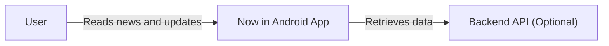
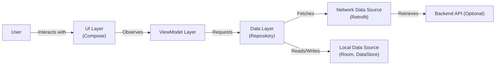
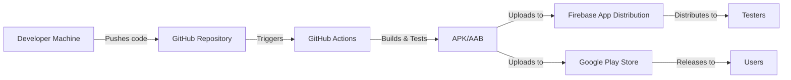
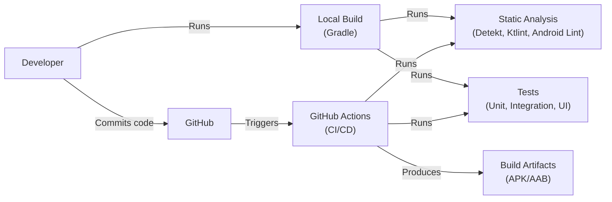

# Project Design Document: Now in Android

## BUSINESS POSTURE

The "Now in Android" (NiA) application is an open-source, fully functional Android app showcasing modern Android development best practices. It serves as a learning resource and reference implementation for developers.

Business Priorities and Goals:

*   Provide a high-quality, up-to-date example of a modern Android application.
*   Demonstrate best practices in Android development, including architecture, UI/UX, and testing.
*   Serve as a learning resource for Android developers of all skill levels.
*   Maintain a codebase that is easy to understand, contribute to, and extend.
*   Showcase the use of the latest Android features and libraries.

Business Risks:

*   The application, while primarily educational, could potentially be forked and used as a basis for production applications. Therefore, security vulnerabilities in NiA could indirectly impact applications built upon it.
*   Outdated dependencies or unaddressed security issues could tarnish the project's reputation as a best-practice example.
*   Lack of clarity in the codebase or design could hinder its usefulness as a learning resource.
*   Sensitive data exposure, even if it's just sample data, could create reputational risk.

## SECURITY POSTURE

Existing Security Controls:

*   security control: Dependency management: The project uses Gradle's version catalogs and dependency management features to keep dependencies up-to-date. (build.gradle.kts, libs.versions.toml)
*   security control: Static analysis: The project includes static analysis tools like Detekt, Ktlint, and Android Lint to identify potential code quality and security issues. (build.gradle.kts, configuration files in the config/detekt and config/quality directories)
*   security control: Testing: A comprehensive suite of unit, integration, and UI tests helps ensure code correctness and prevent regressions. (androidTest, test directories)
*   security control: Code reviews: All changes are subject to code review before being merged. (GitHub pull request process)
*   security control: Obfuscation and minification: ProGuard/R8 is used to obfuscate and minify the code for release builds, making it harder to reverse engineer. (proguard-rules.pro)
*   security control: HTTPS: Network communication uses HTTPS. (Implicit in the use of modern networking libraries like Retrofit, which default to HTTPS)
*   security control: Data storage: Data is stored using appropriate mechanisms like DataStore and Room, which offer secure storage options. (Data layer implementations)

Accepted Risks:

*   accepted risk: The application uses some third-party libraries, which introduces a dependency on their security. This risk is mitigated by using well-maintained libraries and keeping them updated.
*   accepted risk: The application is primarily a sample and may not implement every possible security control. The focus is on demonstrating common best practices, not achieving the highest possible security level.

Recommended Security Controls:

*   security control: Implement a Content Security Policy (CSP) if a WebView is used (currently, it doesn't appear to be, but this should be verified).
*   security control: Consider adding Network Security Configuration to explicitly define allowed network connections and certificate pinning.
*   security control: Regularly run dependency vulnerability scanners (e.g., OWASP Dependency-Check) as part of the CI/CD pipeline.
*   security control: Explore the use of Jetpack Security library for enhanced data encryption at rest.

Security Requirements:

*   Authentication: Not applicable, as the app doesn't have user accounts.
*   Authorization: Not applicable, as there are no user roles or permissions.
*   Input Validation:
    *   All user inputs (if any) should be validated to prevent injection attacks. Currently, the app primarily consumes data from a backend API.
    *   Data received from the backend API should be treated as untrusted and validated/sanitized appropriately.
*   Cryptography:
    *   Data stored locally should be encrypted using appropriate cryptographic libraries (e.g., Jetpack Security).
    *   HTTPS should be enforced for all network communication.
*   Data Protection:
    *   Ensure no sensitive data is logged.
    *   Follow the principle of least privilege when accessing device resources.

## DESIGN

### C4 CONTEXT

Element Descriptions:

*   Element:
    *   Name: User
    *   Type: Person
    *   Description: An Android developer or user interested in learning about modern Android development.
    *   Responsibilities: Interacts with the Now in Android app to view news, updates, and other content.
    *   Security controls: Not applicable.

*   Element:
    *   Name: Now in Android App
    *   Type: Software System
    *   Description: The Android application showcasing modern Android development best practices.
    *   Responsibilities: Displays news and updates, manages user preferences, and interacts with the backend API (if used).
    *   Security controls: Dependency management, static analysis, testing, code reviews, obfuscation/minification, HTTPS, secure data storage.

*   Element:
    *   Name: Backend API (Optional)
    *   Type: Software System
    *   Description: An optional backend API that provides data to the Now in Android app.
    *   Responsibilities: Provides news and updates data to the app.
    *   Security controls: Should implement appropriate API security measures (authentication, authorization, input validation, etc.). Not in the scope of this project.

### C4 CONTAINER

Element Descriptions:

*   Element:
    *   Name: User
    *   Type: Person
    *   Description: An Android developer or user.
    *   Responsibilities: Interacts with the UI.
    *   Security controls: Not applicable.

*   Element:
    *   Name: UI Layer (Compose)
    *   Type: Container (UI)
    *   Description: The user interface built using Jetpack Compose.
    *   Responsibilities: Displays data to the user and handles user interactions.
    *   Security controls: Input validation (if applicable).

*   Element:
    *   Name: ViewModel Layer
    *   Type: Container (Component)
    *   Description: ViewModels that manage UI-related data and handle user actions.
    *   Responsibilities: Provides data to the UI and handles business logic.
    *   Security controls: None directly, but facilitates separation of concerns.

*   Element:
    *   Name: Data Layer (Repository)
    *   Type: Container (Component)
    *   Description: Repositories that provide a unified data access interface.
    *   Responsibilities: Manages data from different sources (network, local database).
    *   Security controls: Coordinates secure data access.

*   Element:
    *   Name: Network Data Source (Retrofit)
    *   Type: Container (Component)
    *   Description: Handles network communication using Retrofit.
    *   Responsibilities: Fetches data from the backend API.
    *   Security controls: HTTPS.

*   Element:
    *   Name: Local Data Source (Room, DataStore)
    *   Type: Container (Component)
    *   Description: Handles local data storage using Room (database) and DataStore (preferences).
    *   Responsibilities: Stores and retrieves data locally.
    *   Security controls: Secure data storage (encryption with Jetpack Security recommended).

*   Element:
    *   Name: Backend API (Optional)
    *   Type: Software System
    *   Description: An optional backend API.
    *   Responsibilities: Provides data.
    *   Security controls: API security measures (out of scope).

### DEPLOYMENT

Possible Deployment Solutions:

1.  Manual APK/AAB upload to Google Play Store.
2.  Using Google Play Console's internal testing tracks.
3.  Using Firebase App Distribution.
4.  Using GitHub Actions to automate build and release to GitHub Releases.

Chosen Solution (Combination of 3 and 4): Firebase App Distribution for internal testing and GitHub Actions for releases.

Element Descriptions:

*   Element:
    *   Name: Developer Machine
    *   Type: Infrastructure Node
    *   Description: The developer's local development environment.
    *   Responsibilities: Writing code, running tests, initiating builds.
    *   Security controls: Local development environment security (e.g., disk encryption, strong passwords).

*   Element:
    *   Name: GitHub Repository
    *   Type: Infrastructure Node
    *   Description: The Git repository hosted on GitHub.
    *   Responsibilities: Source code version control, triggering CI/CD pipelines.
    *   Security controls: Branch protection rules, code review requirements, access controls.

*   Element:
    *   Name: Firebase App Distribution
    *   Type: Service
    *   Description: Firebase service for distributing pre-release builds to testers.
    *   Responsibilities: Distributing builds, managing testers, collecting feedback.
    *   Security controls: Access controls, tester management.

*   Element:
    *   Name: Google Play Store
    *   Type: Service
    *   Description: The official app store for Android applications.
    *   Responsibilities: Distributing released builds to users.
    *   Security controls: Google Play Protect, app signing.

*   Element:
    *   Name: Testers
    *   Type: Person
    *   Description: Internal testers who test pre-release builds.
    *   Responsibilities: Testing the app, providing feedback.
    *   Security controls: Not applicable.

*   Element:
    *   Name: Users
    *   Type: Person
    *   Description: End-users who download the app from the Play Store.
    *   Responsibilities: Using the app.
    *   Security controls: Not applicable.

*   Element:
    *   Name: GitHub Actions
    *   Type: Service
    *   Description: CI/CD service provided by GitHub.
    *   Responsibilities: Automating builds, tests, and releases.
    *   Security controls: Secure access to secrets, workflow permissions.

*   Element:
    *   Name: APK/AAB
    *   Type: Artifact
    *   Description: Build artifacts (Android Package Kit or Android App Bundle).
    *   Responsibilities: Deliverable application package.
    *   Security controls: Code signing.

### BUILD

Build Process Description:

1.  Developers write code and run local builds using Gradle.
2.  Local builds include running static analysis tools (Detekt, Ktlint, Android Lint) and tests (unit, integration, UI).
3.  Code is committed and pushed to the GitHub repository.
4.  GitHub Actions is triggered on push/pull request events.
5.  GitHub Actions runs the same build process as the local build, including static analysis and tests.
6.  If all checks pass, GitHub Actions produces build artifacts (APK/AAB).
7.  The build artifacts can be used for deployment (e.g., to Firebase App Distribution or Google Play Store).

Security Controls:

*   security control: Static analysis tools (Detekt, Ktlint, Android Lint) are run as part of the build process to identify potential code quality and security issues.
*   security control: Comprehensive tests (unit, integration, UI) are run to ensure code correctness and prevent regressions.
*   security control: GitHub Actions provides a secure and reproducible build environment.
*   security control: Dependency management ensures that dependencies are tracked and updated.
*   security control: Secrets (e.g., API keys) are managed securely using GitHub Actions secrets.
*   security control: Build process is automated, reducing the risk of manual errors.

## RISK ASSESSMENT

Critical Business Processes:

*   Providing a reliable and accurate learning resource for Android developers.
*   Maintaining the reputation of the project as a showcase of best practices.

Data Protection:

*   Data: The application primarily displays publicly available news and updates related to Android development.
*   Sensitivity: Low. The data is not considered sensitive. However, data integrity is important to maintain the app's credibility.
*   Data: User preferences (if any) are stored locally.
*   Sensitivity: Low. Preferences are generally not considered sensitive, but should still be protected.
*   Data: Potentially, cached data from the backend API.
*   Sensitivity: Low, assuming the backend API doesn't provide sensitive data.

## QUESTIONS & ASSUMPTIONS

Questions:

*   Is there a plan to introduce a backend API in the future? If so, what are the security requirements for the API?
*   Are there any specific compliance requirements (e.g., GDPR, CCPA) that need to be considered? (Assumption: No, as the app doesn't collect personal data.)
*   What is the expected level of traffic and usage for the app? (Assumption: Moderate traffic, primarily from developers.)

Assumptions:

*   BUSINESS POSTURE: The primary goal is to provide an educational resource, not to build a production-ready application with strict security requirements.
*   BUSINESS POSTURE: The project has a relatively high risk tolerance, as it's an open-source sample application.
*   SECURITY POSTURE: The existing security controls are sufficient for the current scope of the project.
*   SECURITY POSTURE: The backend API (if used) is out of scope for this security assessment.
*   DESIGN: The architecture and design are appropriate for the project's goals.
*   DESIGN: The deployment process is well-defined and secure.
*   DESIGN: The build process is automated and includes security checks.