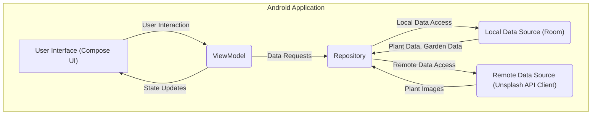

# Project Design Document: Sunflower Android Application (Improved)

**Project Name:** Sunflower

**Project Repository:** [https://github.com/android/sunflower](https://github.com/android/sunflower)

**Document Version:** 1.1

**Date:** October 26, 2023

**Author:** AI Software Architect

## 1. Introduction

This document provides an enhanced design overview of the Sunflower Android application, specifically tailored for threat modeling. Sunflower is a demo Android application showcasing modern Android development practices using Kotlin, Jetpack Compose, and other Android Architecture Components. This document aims to provide a detailed and security-focused understanding of the application's architecture, components, and data flow, serving as a robust foundation for subsequent threat modeling activities. The improvements in this version focus on providing more granular detail relevant to security considerations.

## 2. Project Overview

Sunflower is a gardening app that allows users to browse a curated list of plant species and manage their personal garden. Key features include:

*   Displaying a scrollable list of available plant species, sourced locally.
*   Presenting detailed information about individual plant species, including descriptions and care tips.
*   Enabling users to add specific plant species to their virtual garden.
*   Scheduling local notifications as reminders for watering plants in the user's garden.
*   Displaying a personalized list of plants currently in the user's garden.
*   Asynchronously loading plant images from an external image service (Unsplash) via their public API.

## 3. Architectural Design

Sunflower adheres to a recommended Android application architecture, primarily based on Model-View-ViewModel (MVVM) with a strong emphasis on separation of concerns. This architecture facilitates testability and maintainability, and also provides clear boundaries for security analysis.

### 3.1. High-Level Architecture Diagram



### 3.2. Component Breakdown

*   **User Interface (Compose UI):**
    *   Responsible for rendering the application's screens and capturing user interactions (taps, scrolls, etc.).
    *   Built using Jetpack Compose, a declarative UI toolkit.
    *   Comprises composable functions that define the UI structure, styling, and behavior.
    *   Observes state changes emitted by the ViewModels to dynamically update the displayed UI.
    *   Potential security considerations: Handling of sensitive data display, protection against UI redressing attacks (though less common on mobile).
*   **ViewModel:**
    *   Acts as an intermediary between the UI layer and the data layer.
    *   Holds UI-specific data and state, exposing it to the UI for rendering.
    *   Contains the business logic associated with UI interactions, such as handling button clicks or list item selections.
    *   Orchestrates data retrieval and transformation from the Repository.
    *   Lifecycle-aware, ensuring data persistence across configuration changes.
    *   Potential security considerations: Proper handling of user input (though limited in this app), preventing exposure of sensitive data in logs or during debugging.
*   **Repository:**
    *   Provides a unified interface for accessing data from various sources.
    *   Abstracts the underlying data sources (local database and remote API).
    *   Implements caching strategies to optimize data retrieval and reduce network requests.
    *   Decides whether to fetch data from the local database or the remote API based on factors like data freshness and availability.
    *   Potential security considerations: Securely managing API keys, implementing proper error handling for data retrieval failures, preventing data leaks through improper caching mechanisms.
*   **Local Data Source (Room):**
    *   Manages the application's local data persistence using the Room Persistence Library (an abstraction layer over SQLite).
    *   Defines database entities representing application data (e.g., `Plant`, `GardenPlanting`).
    *   Provides Data Access Objects (DAOs) for performing CRUD (Create, Read, Update, Delete) operations on the database.
    *   Stores plant information and the user's garden data (which plants are in their garden).
    *   Potential security considerations: Protection against SQL injection (though Room provides some protection), securing sensitive data at rest (consider encryption), preventing unauthorized access to the database file on the device.
*   **Remote Data Source (Unsplash API Client):**
    *   Handles communication with the external Unsplash API to fetch plant images.
    *   Typically uses a library like Retrofit for making asynchronous network requests.
    *   Responsible for constructing API requests, handling API responses, and managing potential network errors.
    *   May implement caching of images to reduce network traffic.
    *   Potential security considerations: Ensuring secure communication over HTTPS, validating API responses, securely handling API keys, protecting against man-in-the-middle attacks, implementing proper error handling for network failures.

## 4. Data Flow

The application's data flow can be broken down into key scenarios, each with its own security implications.

### 4.1. Fetching and Displaying Plant List

1. The **User Interface** (e.g., the main plant list screen) initiates a request to display available plants.
2. The **ViewModel** receives this request.
3. The **ViewModel** calls the **Repository** to retrieve the list of plants.
4. The **Repository** queries the **Local Data Source (Room)** for plant data.
    *   The **Local Data Source** retrieves plant entities from the local database.
5. The **Repository** returns the plant data to the **ViewModel**.
6. The **ViewModel** updates its state with the fetched plant data.
7. The **User Interface** observes the state change and renders the list of plants.

    *   **Potential Security Concerns:**  If the local database is compromised, the displayed plant data could be manipulated.

### 4.2. Fetching and Displaying Plant Details

1. The **User Interface** (e.g., when a user taps on a plant in the list) requests details for a specific plant.
2. The **ViewModel** receives the request, typically containing the plant's ID.
3. The **ViewModel** calls the **Repository** to fetch the details for the specified plant.
4. The **Repository** queries the **Local Data Source (Room)** for the details of the plant with the given ID.
5. The **Local Data Source** retrieves the plant details from the local database.
6. Separately, the **Repository** might initiate a request to the **Remote Data Source (Unsplash API Client)** to fetch the image URL for the plant.
    *   The **Remote Data Source** makes an HTTPS request to the Unsplash API, potentially including an API key.
    *   The Unsplash API responds with the image URL.
7. The **Repository** combines the plant details and the image URL (if fetched) and returns them to the **ViewModel**.
8. The **ViewModel** updates its state with the plant details and image URL.
9. The **User Interface** observes the state change and displays the detailed plant information and image.

    *   **Potential Security Concerns:**  Exposure of the Unsplash API key, potential for man-in-the-middle attacks during image URL retrieval, displaying malicious content if the Unsplash API is compromised (though unlikely).

### 4.3. Adding a Plant to the User's Garden

1. The **User Interface** (e.g., a button on the plant details screen) triggers an action to add a plant to the user's garden.
2. The **ViewModel** receives this action, along with the plant's ID.
3. The **ViewModel** calls the **Repository** to add the plant to the garden.
4. The **Repository** interacts with the **Local Data Source (Room)** to insert a new `GardenPlanting` entity, linking the plant to the user's garden.
5. The **Local Data Source** inserts the new record into the local database.
6. The **Repository** informs the **ViewModel** about the success or failure of the operation.
7. The **ViewModel** updates its state, potentially triggering a UI update (e.g., displaying a confirmation message).

    *   **Potential Security Concerns:**  If the local database is compromised, unauthorized plants could be added to the user's garden.

### 4.4. Scheduling Watering Reminders

1. When a user adds a plant to their garden, the **Repository** might also schedule a local notification for watering reminders.
2. This typically involves using Android's `AlarmManager` or `WorkManager`.
3. The scheduled notification will trigger at a specified time, displaying a reminder to the user.

    *   **Potential Security Concerns:**  While less direct, vulnerabilities in the notification scheduling mechanism could be exploited, though this is generally handled by the Android OS.

## 5. Security Considerations (Detailed)

This section expands on the initial security considerations, providing more specific examples of potential threats and mitigation strategies.

*   **Data at Rest:**
    *   **Threat:** Unauthorized access to the device's file system could expose the SQLite database containing plant data and user's garden information.
    *   **Mitigation:** Consider using Android's encryption features (e.g., `EncryptedFile`) to encrypt the database. Evaluate the sensitivity of the data and the risk profile.
*   **Data in Transit:**
    *   **Threat:** Man-in-the-middle (MITM) attacks could intercept communication with the Unsplash API, potentially exposing the API key or allowing for the injection of malicious content.
    *   **Mitigation:** Enforce HTTPS for all communication with the Unsplash API. Implement certificate pinning for enhanced security against certificate-based MITM attacks (advanced).
*   **API Key Management:**
    *   **Threat:** Hardcoding the Unsplash API key in the application code or storing it insecurely could lead to unauthorized access to the Unsplash API.
    *   **Mitigation:** Store the API key securely, potentially using the Android Keystore system. Avoid committing the API key to version control. Consider using a backend service to proxy API requests if more stringent security is required.
*   **Input Validation:**
    *   **Threat:** Although user input is limited in this application, future features might introduce vulnerabilities if input is not properly validated.
    *   **Mitigation:** Implement robust input validation on any user-provided data to prevent injection attacks (e.g., SQL injection if dynamic queries were used, which is unlikely with Room).
*   **Permissions:**
    *   **Threat:** Requesting unnecessary permissions could grant the application access to sensitive user data or device features.
    *   **Mitigation:** Adhere to the principle of least privilege. Only request permissions that are strictly necessary for the application's functionality. Clearly explain the purpose of each permission to the user.
*   **Third-Party Libraries:**
    *   **Threat:** Vulnerabilities in third-party libraries (e.g., Retrofit, Room) could be exploited to compromise the application.
    *   **Mitigation:** Keep all third-party libraries up-to-date with the latest security patches. Regularly review the security advisories for used libraries. Consider using tools to scan for known vulnerabilities in dependencies.
*   **Deeplinks/App Links:**
    *   **Threat:** If the application implements deeplinks or app links, improper validation could lead to malicious redirection or exploitation of application functionality.
    *   **Mitigation:** Thoroughly validate any data received through deeplinks or app links to prevent unintended actions.
*   **Background Services/Tasks:**
    *   **Threat:** Vulnerabilities in background services or tasks (e.g., related to notification scheduling) could be exploited.
    *   **Mitigation:** Ensure background tasks are implemented securely and follow best practices. Be mindful of data accessed and processed in the background.

## 6. Trust Boundaries

Identifying trust boundaries is crucial for threat modeling. In the Sunflower application, key trust boundaries include:

*   **The Android Device:** The application runs within the security context of the Android operating system. Data and resources within the device are generally considered within the same trust zone, although different applications have isolated sandboxes.
*   **The Application Sandbox:** Each Android application runs in its own sandbox, limiting its access to system resources and data of other applications.
*   **The Local Database:** Data stored in the Room database is within the application's sandbox but represents a potential target if the device is compromised.
*   **The Network Boundary:** Communication with the Unsplash API crosses a network boundary, introducing risks associated with data in transit.
*   **The Unsplash API:** The external Unsplash API is a separate entity with its own security posture, which the Sunflower application relies upon.

## 7. Diagrams

### 7.1. Component Diagram with Trust Boundaries

```mermaid
graph LR
    subgraph "Android Device"
        direction LR
        subgraph "Sunflower Application Sandbox"
            direction LR
            UI["User Interface (Compose)"]
            VM["ViewModel"]
            Repo["Repository"]
            LocalDS["Local Data Source (Room)"]
            RemoteDS["Remote Data Source (Unsplash API Client)"]
        end
    end
    UnsplashAPI["Unsplash API"]

    UI --> VM
    VM --> Repo
    Repo -- "Local Data Access" --> LocalDS
    Repo -- "Network Request (HTTPS)" --> RemoteDS
    RemoteDS -- "HTTPS Request" --> UnsplashAPI

    style LocalDS fill:#f9f,stroke:#333,stroke-width:2px
    style RemoteDS fill:#ccf,stroke:#333,stroke-width:2px
    style "Sunflower Application Sandbox" stroke:#00f,stroke-width:2px
    style "Android Device" stroke:#0a0,stroke-width:2px
```

### 7.2. Data Flow Diagram (Fetching Plant Data) with Trust Boundaries

```mermaid
graph LR
    subgraph "Android Device"
        direction TB
        subgraph "Sunflower Application Sandbox"
            direction TB
            A["User Interface"]
            B["ViewModel"]
            C["Repository"]
            D["Local Data Source"]
            E["Remote Data Source"]
        end
    end
    F["Unsplash API"]

    A -- "Request Plant Data" --> B
    B -- "Fetch Data" --> C
    C -- "Query Local Data" --> D
    D -- "Plant Data" --> C
    C -- "Request Remote Images (HTTPS)" --> E
    E -- "HTTPS Request" --> F
    F -- "Plant Images (HTTPS)" --> E
    E -- "Plant Images" --> C
    C -- "Return Plant Data" --> B
    B -- "Update UI State" --> A

    style D fill:#f9f,stroke:#333,stroke-width:2px
    style E fill:#ccf,stroke:#333,stroke-width:2px
    style "Sunflower Application Sandbox" stroke:#00f,stroke-width:2px
    style "Android Device" stroke:#0a0,stroke-width:2px
```

### 7.3. Data Flow Diagram (Adding Plant to Garden) with Trust Boundaries

```mermaid
graph LR
    subgraph "Android Device"
        direction TB
        subgraph "Sunflower Application Sandbox"
            direction TB
            A["User Interface"]
            B["ViewModel"]
            C["Repository"]
            D["Local Data Source"]
        end
    end

    A -- "Add Plant to Garden" --> B
    B -- "Save Garden Planting" --> C
    C -- "Insert GardenPlanting" --> D
    D -- "Success/Failure" --> C
    C -- "Update UI State" --> B
    B -- "Confirmation/Error" --> A

    style D fill:#f9f,stroke:#333,stroke-width:2px
    style "Sunflower Application Sandbox" stroke:#00f,stroke-width:2px
    style "Android Device" stroke:#0a0,stroke-width:2px
```

## 8. Assumptions and Constraints

*   The application primarily relies on locally stored data for core plant information.
*   Network interaction is limited to fetching plant images from the public Unsplash API.
*   User authentication and authorization are not implemented in this demo application, simplifying the security scope.
*   The focus of this design document is on the application's architecture and data flow relevant to potential security threats.
*   The Android operating system provides a base level of security through its sandbox environment.

## 9. Future Considerations

*   Implementation of user accounts and secure authentication mechanisms.
*   Potential integration with other external services, which would introduce new trust boundaries and security considerations.
*   Expansion of features that might involve handling more sensitive user data.
*   Regular security audits and penetration testing to identify and address potential vulnerabilities.

This improved design document provides a more detailed and security-focused overview of the Sunflower Android application. The inclusion of trust boundaries and more specific security considerations will significantly aid in the subsequent threat modeling process, enabling a more thorough analysis of potential vulnerabilities and the development of effective mitigation strategies.
