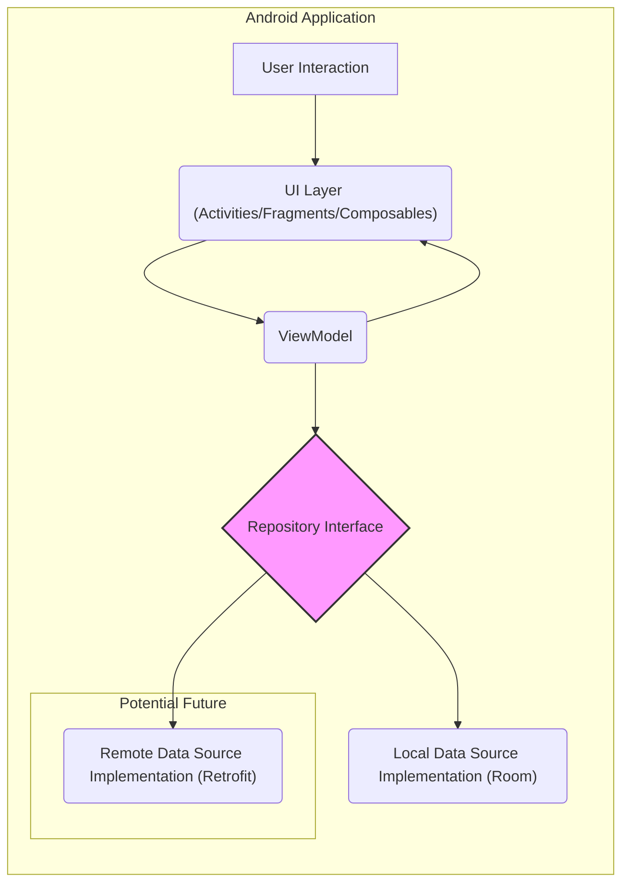
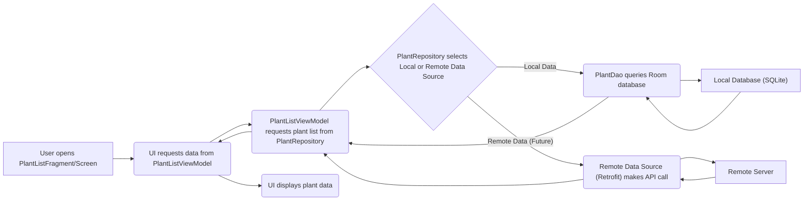
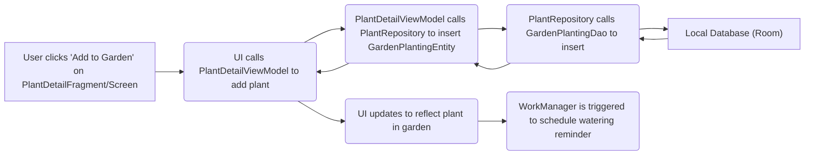

# Project Design Document: Sunflower Android Application

**Version:** 1.1
**Date:** October 26, 2023
**Prepared by:** AI Software Architect

## 1. Introduction

This document provides a detailed design overview of the Sunflower Android application, an open-source gardening app developed by Google. The purpose of this document is to serve as a robust foundation for subsequent threat modeling activities. It outlines the application's architecture, components, data flow, and key interactions with enhanced clarity and detail.

## 2. Goals and Objectives

The primary goals of the Sunflower application are:

*   Provide users with a visually appealing and informative platform for browsing and learning about plants.
*   Enable users to manage their own virtual garden by adding plants and tracking their care requirements.
*   Offer timely and relevant reminders for essential plant care tasks, such as watering, fertilization, etc.
*   Demonstrate and promote best practices in modern Android development utilizing the latest Jetpack libraries and architectural patterns.

## 3. High-Level Architecture

The Sunflower application adheres to the Model-View-ViewModel (MVVM) architectural pattern, emphasizing a clear separation of concerns, improved testability, and maintainability. The core layers are:

*   **UI Layer (View):** Responsible for rendering the user interface, displaying data to the user, and capturing user interactions. This layer is primarily composed of Activities, Fragments, custom Composables (if using Jetpack Compose), and custom View components.
*   **Presentation Layer (ViewModel):** Acts as a mediator between the UI Layer and the Data Layer. It retrieves data from the Data Layer, prepares it for display in the UI, and handles UI-related logic, such as managing UI state.
*   **Data Layer (Model):**  Responsible for abstracting data access and manipulation. This layer encompasses local data persistence mechanisms and potential future integrations with remote data sources or APIs.

## 4. Detailed Design

### 4.1 UI Layer (View)

*   **PlantListFragment (or PlantListScreen Composable):**
    *   Purpose: Displays a scrollable list of available plant specimens to the user.
    *   Functionality:
        *   Observes and renders a list of plant data fetched from the `PlantListViewModel`.
        *   Presents plant information including image, name, and a brief description.
        *   Enables user navigation to the `PlantDetailFragment` (or `PlantDetailScreen`) upon selection of a plant.
    *   Technology: Android Fragments (or Jetpack Compose Composables), `RecyclerView` with `ListAdapter` (or `LazyColumn`), Data Binding (or Compose State management), `LiveData` (or `StateFlow`/`Flow`). Image loading likely utilizes a library like Coil or Glide.
    *   Interactions: Observes `LiveData` or `StateFlow` from `PlantListViewModel` for data updates and triggers actions in the ViewModel based on user interactions.

*   **PlantDetailFragment (or PlantDetailScreen Composable):**
    *   Purpose: Presents comprehensive details for a selected plant.
    *   Functionality:
        *   Retrieves and displays detailed plant data based on a unique plant identifier.
        *   Shows plant attributes such as scientific name, description, ideal growing conditions, watering frequency, and associated images.
        *   Provides actions for the user to add the plant to their personal garden.
    *   Technology: Android Fragments (or Jetpack Compose Composables), Data Binding (or Compose State management), `LiveData` (or `StateFlow`/`Flow`).
    *   Interactions: Observes `LiveData` or `StateFlow` from `PlantDetailViewModel` and invokes functions within the ViewModel based on user actions (e.g., adding to garden).

*   **MyGardenFragment (or MyGardenScreen Composable):**
    *   Purpose: Displays the collection of plants the user has added to their virtual garden.
    *   Functionality:
        *   Fetches and displays a list of plants currently in the user's garden.
        *   Shows relevant information for garden plants, such as the last watered date and potentially a calculated next watering date.
        *   Allows users to navigate to the `PlantDetailFragment` (or `PlantDetailScreen`) for plants within their garden.
    *   Technology: Android Fragments (or Jetpack Compose Composables), `RecyclerView` with `ListAdapter` (or `LazyColumn`), Data Binding (or Compose State management), `LiveData` (or `StateFlow`/`Flow`).
    *   Interactions: Observes `LiveData` or `StateFlow` from `MyGardenViewModel` and allows for interactions that might trigger updates in the ViewModel.

*   **PlantViewHolder (or Plant Card Composable):**
    *   Purpose: Represents the visual structure for an individual plant item within a list.
    *   Functionality:
        *   Binds plant data to the corresponding UI elements (e.g., `ImageView`, `TextView`).
        *   Handles asynchronous loading of plant images, potentially using Coil or Glide.
    *   Technology: Android ViewHolder (or Jetpack Compose), Data Binding (or Compose state hoisting).
    *   Interactions: Used by `PlantListFragment` and `MyGardenFragment` (or their Compose equivalents).

### 4.2 Presentation Layer (ViewModel)

*   **PlantListViewModel:**
    *   Purpose: Provides plant data to the `PlantListFragment` (or `PlantListScreen`).
    *   Functionality:
        *   Retrieves a list of available plants from the `PlantRepository`.
        *   Exposes the list of plants as `LiveData`, `StateFlow`, or `Flow` for observation by the UI.
    *   Technology: Android ViewModel, `LiveData` (or `StateFlow`/`Flow`), Kotlin Coroutines for asynchronous operations.
    *   Interactions: Communicates with the `PlantRepository` to fetch data and updates the observable data streams consumed by the UI.

*   **PlantDetailViewModel:**
    *   Purpose: Provides detailed information for a specific plant to the `PlantDetailFragment` (or `PlantDetailScreen`).
    *   Functionality:
        *   Fetches detailed plant information based on a plant ID from the `PlantRepository`.
        *   Determines if the currently displayed plant is already present in the user's garden.
        *   Provides functions to add or remove the plant from the user's garden, interacting with the `PlantRepository`.
    *   Technology: Android ViewModel, `LiveData` (or `StateFlow`/`Flow`), Kotlin Coroutines.
    *   Interactions: Communicates with the `PlantRepository` to retrieve plant details and manage garden entries.

*   **MyGardenViewModel:**
    *   Purpose: Provides the collection of plants in the user's garden to the `MyGardenFragment` (or `MyGardenScreen`).
    *   Functionality:
        *   Retrieves the list of plants currently in the user's garden from the `PlantRepository`.
        *   Exposes the garden plant list as `LiveData`, `StateFlow`, or `Flow`.
    *   Technology: Android ViewModel, `LiveData` (or `StateFlow`/`Flow`), Kotlin Coroutines.
    *   Interactions: Communicates with the `PlantRepository` to fetch the user's garden data.

### 4.3 Data Layer (Model)

*   **PlantRepository:**
    *   Purpose: Provides a unified interface for accessing and managing plant-related data.
    *   Functionality:
        *   Abstracts the underlying data sources, allowing the ViewModels to interact with data without knowing the implementation details.
        *   Retrieves plant data from the local data source (`PlantDao`).
        *   (Future) Could retrieve plant data from a remote data source via a defined interface.
        *   Manages operations related to the user's garden, such as adding and removing plants.
    *   Technology: Kotlin, Kotlin Coroutines for asynchronous operations, potentially uses a repository pattern implementation.
    *   Interactions: Interacts with `PlantDao` for local data, potentially with a remote data source interface, and is consumed by the ViewModels.

*   **Local Data Source (Room Persistence Library):**
    *   **PlantEntity:** Represents the schema for plant data stored in the local database.
        *   Fields: `plantId` (String, primary key), `name` (String), `description` (String), `growZoneNumber` (Int), `wateringInterval` (Int), `imageUrl` (String).
    *   **GardenPlantingEntity:** Represents the relationship between a plant and a user's garden.
        *   Fields: `gardenPlantingId` (Long, primary key, autogenerated), `plantId` (String, foreign key referencing `PlantEntity`), `plantDate` (Calendar or Long), `lastWateringDate` (Calendar or Long).
    *   **PlantAndGardenPlantings:** A Room Relation to fetch plants along with their garden planting information.
    *   **PlantDao:** Data Access Object responsible for querying the `PlantEntity` table.
        *   Methods: `@Query("SELECT * FROM plants") fun getPlants(): Flow<List<PlantEntity>>`, `@Query("SELECT * FROM plants WHERE id = :plantId") fun getPlant(plantId: String): Flow<PlantEntity>>`, `@Insert(onConflict = OnConflictStrategy.REPLACE) suspend fun insertAll(plants: List<PlantEntity>)`.
    *   **GardenPlantingDao:** Data Access Object for interacting with the `GardenPlantingEntity` table.
        *   Methods: `@Query("SELECT * FROM garden_plantings") fun getGardenPlantings(): Flow<List<GardenPlantingEntity>>`, `@Query("SELECT * FROM garden_plantings WHERE plant_id = :plantId") fun getGardenPlanting(plantId: String): Flow<GardenPlantingEntity?>`, `@Insert(onConflict = OnConflictStrategy.REPLACE) suspend fun insertGardenPlanting(gardenPlanting: GardenPlantingEntity)`, `@Delete suspend fun deleteGardenPlanting(gardenPlanting: GardenPlantingEntity)`.
    *   **AppDatabase:**  The abstract Room database class.
    *   Technology: Android Room Persistence Library, SQLite.
    *   Interactions: Used by the `PlantRepository` to perform database operations.

*   **Remote Data Source (Future - Potential Retrofit Implementation):**
    *   Purpose: To retrieve plant data from an external API.
    *   Functionality:
        *   Defines API endpoints for fetching plant data, potentially using RESTful principles.
        *   Handles network requests and responses.
        *   Parses data (e.g., JSON) into data transfer objects (DTOs).
    *   Technology: Retrofit, Kotlin Serialization or Gson for JSON parsing, potentially OkHttp for network requests.
    *   Interactions: The `PlantRepository` would use this data source to fetch data when needed (e.g., for initial data population or refreshing data).

*   **WorkManager:**
    *   Purpose: To schedule and manage background tasks, such as plant watering reminders.
    *   Functionality:
        *   Schedules periodic tasks to display notifications reminding the user to water specific plants based on their watering schedule and last watered date.
        *   Handles task persistence and execution even if the app is closed or the device restarts.
    *   Technology: Android WorkManager API.
    *   Interactions: Triggered by user actions (adding a plant to the garden) or application logic within the ViewModel or Repository.

## 5. Data Flow

The typical data flow for displaying a list of plants:

The data flow for adding a plant to the user's garden:

## 6. Security Considerations (Initial)

Based on the architecture, here are some initial security considerations:

*   **Local Data Storage (SQLite Database):**
    *   **Threat:** Data exfiltration if the device is compromised (rooted). Malicious applications or users with root access could potentially access the database files containing plant information and user garden data.
    *   **Mitigation:** Employing encryption for the local database using libraries like SQLCipher. Consider device-bound encryption where feasible. Avoid storing highly sensitive user data locally if not absolutely necessary.
    *   **Threat:** Potential for SQL injection if raw SQL queries are used incorrectly, although Room's abstraction layer significantly reduces this risk.
    *   **Mitigation:** Strictly adhere to Room's recommended practices and avoid using raw SQL queries where possible. If raw queries are necessary, sanitize user inputs thoroughly.
*   **Inter-Process Communication (IPC):**
    *   **Threat:** If the application utilizes IPC mechanisms (e.g., Content Providers without proper permissions), other applications could potentially access or manipulate the Sunflower app's data.
    *   **Mitigation:** Implement strict permission controls for any exposed Content Providers. Minimize the use of IPC if possible.
*   **Third-Party Libraries:**
    *   **Threat:** Vulnerabilities in third-party libraries (e.g., image loading libraries like Glide or Coil, networking libraries like Retrofit) could be exploited.
    *   **Mitigation:** Regularly update all third-party dependencies to their latest stable versions. Conduct security scans of dependencies to identify known vulnerabilities.
*   **Data Validation:**
    *   **Threat:** Insufficient input validation could lead to unexpected data being stored, potentially causing application errors or even security vulnerabilities.
    *   **Mitigation:** Implement robust input validation on all data received from user interactions and external sources.
*   **Background Tasks (WorkManager):**
    *   **Threat:** If background tasks are not implemented securely, they could potentially be hijacked or used to perform malicious actions.
    *   **Mitigation:** Ensure that WorkManager tasks operate with the minimum necessary permissions. Avoid storing sensitive information within the task parameters.
*   **Future Remote Data Source & API Communication:**
    *   **Threat:** Insecure communication with a remote API could expose data in transit. Lack of proper authentication and authorization could allow unauthorized access to data.
    *   **Mitigation:** Enforce HTTPS for all API communication. Implement secure authentication mechanisms (e.g., OAuth 2.0). Implement proper authorization to ensure users can only access the data they are permitted to. Securely store API keys and secrets.

## 7. Deployment Model

The Sunflower application is intended for deployment as a native Android application through the Google Play Store. Users will download and install the application directly onto their Android-powered mobile devices.

## 8. Assumptions and Constraints

*   **Offline First (Initial Focus):** The primary design currently emphasizes offline functionality, with local data persistence being the core data storage mechanism.
*   **Single User per Device:** The application is assumed to be used by a single user on a given device. Multi-user support is not currently a primary design consideration.
*   **Open Source Nature:** The application's source code is publicly accessible on GitHub, which allows for community contributions and scrutiny but also means potential attackers have access to the codebase.
*   **Target Platform:** The application is specifically designed for Android mobile operating systems.

## 9. Future Considerations

*   **Cloud Synchronization:**
    *   **Security Implications:** Introduces the need for secure user authentication and authorization. Data encryption in transit (TLS/SSL) and at rest (server-side encryption) becomes crucial. Secure storage of user credentials and synchronization tokens is essential. Vulnerabilities in the synchronization API could lead to data breaches or account compromise.
*   **Social Features (e.g., Sharing Garden Progress):**
    *   **Security Implications:** Requires mechanisms for user privacy controls and data sharing permissions. Potential for information disclosure if privacy settings are not properly implemented. Risk of malicious content being shared.
*   **Integration with External Services (e.g., Weather APIs):**
    *   **Security Implications:** Requires secure management of API keys and secrets. Potential vulnerabilities if API communication is not secured (e.g., using HTTPS). Data received from external services should be validated to prevent injection attacks.

This improved design document provides a more detailed and comprehensive overview of the Sunflower Android application's architecture and components. It offers a stronger foundation for conducting a thorough threat modeling exercise by highlighting potential security concerns within the current and future planned features.
