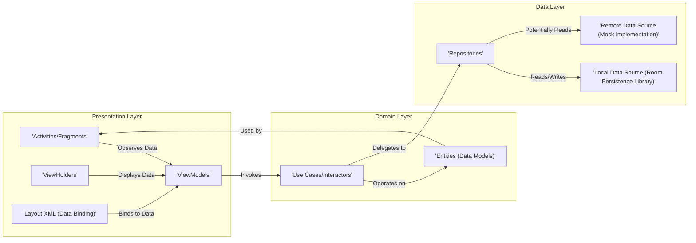
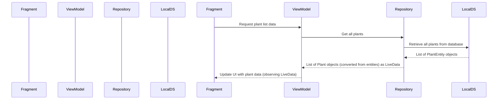
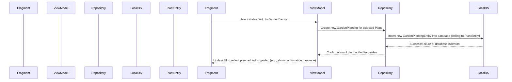

# Project Design Document: Sunflower Android Application

**Version:** 1.1
**Date:** October 26, 2023
**Author:** AI Software Architect

## 1. Introduction

This document provides an enhanced and more detailed design overview of the Sunflower Android application, an open-source project developed by Google. This iteration builds upon the previous version, aiming for greater clarity and depth, specifically to facilitate comprehensive threat modeling activities. We will delve deeper into component interactions, data flows, and potential security considerations.

## 2. Project Overview

The Sunflower application is a demonstration Android application showcasing modern Android development best practices and the recommended architecture. It serves as a practical example of utilizing Android Architecture Components (such as Room, LiveData, ViewModel, and Data Binding), Kotlin coroutines for asynchronous operations, and modern UI development principles. The application's core functionality allows users to explore a catalog of plant species, access detailed information about them, and manage their personal virtual garden of plants.

## 3. Goals and Objectives

The primary goals of the Sunflower project are:

*   To serve as a canonical example of modern Android application development.
*   To effectively demonstrate the practical application of Android Architecture Components in a real-world scenario.
*   To provide a clear and concise example of using Kotlin and coroutines for asynchronous tasks and data management.
*   To offer a well-structured, modular, and maintainable codebase that adheres to best practices.
*   To act as a valuable learning resource for Android developers of varying skill levels.

## 4. Architecture Overview

The Sunflower application adheres to a well-defined Android architecture, commonly referred to as the Model-View-ViewModel (MVVM) pattern. This architectural pattern promotes a clear separation of concerns, enhancing testability, maintainability, and scalability.

**Key Architectural Layers:**

*   **Presentation Layer (UI):** This layer is responsible for rendering the user interface and handling user interactions. It comprises Activities, Fragments, RecyclerView ViewHolders, Layout XML files (leveraging Data Binding), and ViewModels. The primary responsibility is to present data to the user and relay user actions to the ViewModel.
*   **Domain Layer (Business Logic):** This layer encapsulates the core business logic and use cases of the application. It is independent of any specific framework or implementation details, making it highly testable. Entities, representing the application's data structures, reside within this layer.
*   **Data Layer:** This layer is responsible for abstracting the data sources and providing a consistent interface for data access. It includes Repositories, Local Data Sources (implemented using the Room persistence library), and potentially Remote Data Sources (though Sunflower primarily utilizes a mock implementation for demonstration purposes).

## 5. Component Details

This section provides a more detailed breakdown of the key components within each architectural layer, outlining their specific responsibilities and interactions.

### 5.1. Presentation Layer

*   **Activities/Fragments:**
    *   `GardenActivity`: The main entry point of the application, responsible for hosting the `GardenFragment`.
    *   `GardenFragment`: Displays the user's current garden plantings, allowing them to view and potentially interact with their plants.
    *   `PlantListFragment`: Presents a scrollable list of available plant species from the data catalog.
    *   `PlantDetailFragment`: Displays comprehensive information about a selected plant, including its name, description, watering guidelines, and image.
    *   `PlantDetailBindingAdapter`:  Facilitates custom data binding logic for the `PlantDetailFragment` layout.
*   **ViewHolders:**
    *   `PlantViewHolders`: Used within `RecyclerView` adapters in `PlantListFragment` to efficiently display individual plant items. Handles binding plant data to the list item layout.
    *   `GardenPlantingViewHolders`: Used within `RecyclerView` adapters in `GardenFragment` to display individual plants in the user's garden.
*   **Layout XML (Data Binding):**
    *   Layout files for Activities, Fragments, and list items, utilizing Android Data Binding to directly connect UI elements to data exposed by the ViewModels. This reduces boilerplate code and improves maintainability.
*   **ViewModels:**
    *   `GardenPlantingListViewModel`: Manages the data required to display the user's garden, including fetching the list of planted plants and their associated details. Exposes `LiveData` for the UI to observe.
    *   `PlantListViewModel`: Responsible for fetching and managing the list of available plant species. Provides `LiveData` containing the plant list and handles filtering or sorting if implemented.
    *   `PlantDetailViewModel`: Manages the data for a specific plant displayed in the `PlantDetailFragment`. Fetches plant details based on a plant ID and exposes this data via `LiveData`. Also handles actions like adding the plant to the garden.

### 5.2. Domain Layer

*   **Use Cases/Interactors:** Represent specific business operations or user actions within the application. They orchestrate interactions between different parts of the application.
    *   `AddPlantToGardenUseCase`:  Encapsulates the logic for adding a selected `Plant` to the user's garden, creating a new `GardenPlanting` entity.
    *   `GetPlantsUseCase`: Retrieves a list of all available `Plant` entities from the `PlantRepository`.
    *   `GetPlantDetailUseCase`: Retrieves a specific `Plant` entity based on its unique identifier from the `PlantRepository`.
    *   `GetGardenPlantingsUseCase`: Retrieves all `GardenPlanting` entities, potentially including associated `Plant` details.
*   **Entities (Data Models):** Represent the core data structures of the application.
    *   `Plant`: Represents a plant species with attributes such as `plantId`, `name`, `description`, `growZoneNumber`, `wateringInterval`, and an `imageUrl`.
    *   `GardenPlanting`: Represents a specific instance of a `Plant` that has been added to the user's garden. It includes attributes like `plantId` (foreign key to `Plant`), `plantDate`, and `lastWateringDate`.

### 5.3. Data Layer

*   **Repositories:** Provide a single, consistent interface for accessing data, abstracting away the underlying data sources (local database, remote API, etc.).
    *   `PlantRepository`: Handles all data access operations related to `Plant` entities. It decides whether to fetch data from the local database or a remote source (though the remote source is mocked in this project).
    *   `GardenPlantingRepository`: Manages data access for `GardenPlanting` entities, providing methods for adding, retrieving, and deleting garden plantings.
*   **Local Data Source (Room Persistence Library):**
    *   `AppDatabase`: The concrete implementation of the Room database, responsible for managing the underlying SQLite database.
    *   `PlantDao`: Data Access Object (DAO) for the `Plant` entity, providing methods for querying, inserting, updating, and deleting plant data from the `plants` table.
    *   `GardenPlantingDao`: DAO for the `GardenPlanting` entity, providing methods for interacting with the `garden_plantings` table.
    *   `PlantingAndPlant`: A data class representing a join between `GardenPlanting` and `Plant` entities, used for efficiently retrieving garden plantings with associated plant details.
    *   Database Entities (`PlantEntity`, `GardenPlantingEntity`):  Annotated Kotlin data classes that define the schema of the database tables.
*   **Remote Data Source (Mock Implementation):**
    *   In the Sunflower project, the remote data source is simulated. This typically involves:
        *   Pre-populating the Room database with initial plant data.
        *   Using static data or in-memory data structures to represent "remote" data.
        *   Potentially, loading data from a local JSON file during application initialization.

## 6. Data Flow

The following diagrams illustrate the typical data flow for key user interactions, providing a clearer picture of how data moves through the application's layers.

### 6.1. Displaying the List of Plants

### 6.2. Adding a Plant to the Garden

## 7. Security Considerations (For Threat Modeling)

This section provides a more detailed analysis of potential security considerations, crucial for effective threat modeling.

*   **Data at Rest (Local Database):**
    *   The Sunflower app utilizes Room for local data persistence. By default, Room databases are stored within the application's private storage directory on the Android device.
    *   **Threat:** If the device is rooted, compromised by malware, or if the application has vulnerabilities allowing unauthorized file access, the database files could be accessed. This could expose plant information and user garden data. While the data itself isn't highly sensitive in this demo, the principle applies to applications with more sensitive data.
    *   **Mitigation:**
        *   For applications handling sensitive data, consider using SQLCipher for encrypting the SQLite database.
        *   Implement proper file permissions and ensure the application doesn't inadvertently expose its private storage.
        *   Regularly update dependencies, including Room, to patch potential vulnerabilities.
*   **Data in Transit (Limited in this application):**
    *   The current implementation primarily operates with local data. However, if a future version integrates a remote data source (e.g., a backend API for plant information), data transmission becomes a concern.
    *   **Threat:** If communication with a remote server occurs over unencrypted channels (HTTP), Man-in-the-middle (MITM) attacks could intercept sensitive data being transmitted.
    *   **Mitigation:**
        *   Enforce HTTPS (TLS/SSL) for all network communication with remote servers.
        *   Implement certificate pinning to prevent MITM attacks even if a compromised Certificate Authority is involved.
*   **Input Validation (Limited User Input):**
    *   The Sunflower app currently has limited direct user input. However, if future features introduce user-generated content (e.g., notes about plants, custom plant names), robust input validation is essential.
    *   **Threat:** Without proper validation, vulnerabilities like SQL injection (if constructing raw SQL queries, though Room mitigates this risk significantly), cross-site scripting (XSS) if displaying user content in a web view, or other injection attacks could occur.
    *   **Mitigation:**
        *   Implement input sanitization and validation on both the client-side and server-side (if a server is involved).
        *   Use parameterized queries or ORM features (like Room) to prevent SQL injection.
        *   Encode user-generated content appropriately before displaying it to prevent XSS.
*   **Dependency Management:**
    *   The project relies on various external libraries (Android Architecture Components, Kotlin Coroutines, etc.). Outdated or vulnerable dependencies can introduce security risks.
    *   **Threat:** Known vulnerabilities in third-party libraries could be exploited by malicious actors.
    *   **Mitigation:**
        *   Regularly update all project dependencies to their latest stable versions.
        *   Utilize dependency scanning tools (e.g., OWASP Dependency-Check) to identify known vulnerabilities in project dependencies.
        *   Carefully evaluate the security posture of any new dependencies before incorporating them into the project.
*   **Application Logic Vulnerabilities:**
    *   While Sunflower is a relatively straightforward application, complex business logic in other applications can introduce vulnerabilities if not designed and implemented carefully.
    *   **Threat:** Logical flaws in the application's code could be exploited to perform unintended actions or bypass security controls.
    *   **Mitigation:**
        *   Conduct thorough code reviews to identify potential logical flaws.
        *   Implement comprehensive unit and integration tests to verify the correctness of the application's logic.
        *   Follow secure coding practices during development.
*   **Reverse Engineering and Code Tampering:**
    *   Android applications can be reverse-engineered to some extent, allowing attackers to analyze the code and understand its inner workings.
    *   **Threat:** Attackers could reverse-engineer the application to identify vulnerabilities, understand sensitive logic, or potentially tamper with the application's code.
    *   **Mitigation:**
        *   Apply code obfuscation techniques (e.g., using ProGuard or R8) to make reverse engineering more difficult.
        *   Avoid storing sensitive secrets or API keys directly within the application's code.
        *   Implement integrity checks to detect if the application has been tampered with.
*   **Permissions:**
    *   The Sunflower application requests a minimal set of permissions. It's crucial to only request necessary permissions and justify their use.
    *   **Threat:** Requesting unnecessary permissions increases the application's attack surface and could be exploited by malicious actors or the operating system.
    *   **Mitigation:**
        *   Adhere to the principle of least privilege when requesting permissions.
        *   Clearly document the purpose of each requested permission.
        *   Review and minimize the requested permissions regularly.

## 8. Deployment

The Sunflower application is designed for deployment on Android devices. The primary distribution method is typically through the Google Play Store. Alternatively, the application's APK file can be sideloaded onto devices.

## 9. Technologies Used

*   **Programming Language:** Kotlin
*   **Target Android SDK:**  API Level 26 or higher (as per project configuration)
*   **Android Jetpack Libraries:**
    *   **Architecture Components:** ViewModel, LiveData, Room Persistence Library, Data Binding
    *   **UI:**  AppCompat, Material Design Components
    *   **Navigation:** (Potentially, though not heavily used in the core demo)
    *   **WorkManager:** (Potentially for background tasks)
*   **Kotlin Coroutines:** For managing asynchronous operations and background tasks.
*   **Dependency Injection:** Hilt (recommended and likely used in the project) or Dagger.
*   **Image Loading Library:** Glide or Coil (likely Glide).
*   **Testing Frameworks:** JUnit, Mockito, AndroidX Test (Espresso, UI Automator).

## 10. Future Considerations

*   **Integration with a Real-World Backend:** Replacing the mock data source with a connection to a remote API for fetching plant data and potentially user-specific garden information.
*   **User Authentication and Authorization:** Implementing user accounts to allow users to save and synchronize their garden data across multiple devices. This would introduce new security considerations related to authentication and session management.
*   **Enhanced Image Handling:** Allowing users to upload custom images for their plants or integrating with image search APIs.
*   **Push Notifications:** Implementing notifications for watering reminders or other garden-related events.
*   **Accessibility Enhancements:** Further improving the application's accessibility for users with disabilities.
*   **More Advanced UI Features:** Exploring more complex UI patterns and animations.

This revised document provides a more in-depth design overview of the Sunflower Android application, offering a stronger foundation for comprehensive threat modeling. By elaborating on component responsibilities, data flows, and potential security vulnerabilities, this document aims to facilitate a more thorough security analysis of the project.