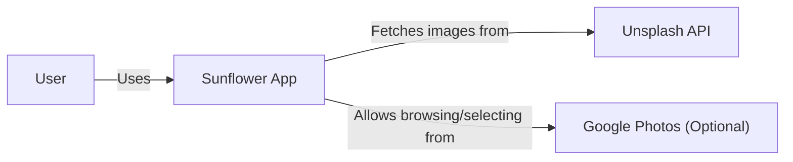
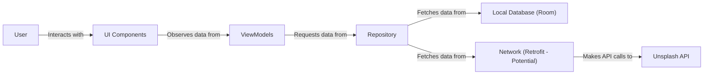
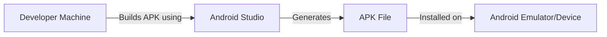
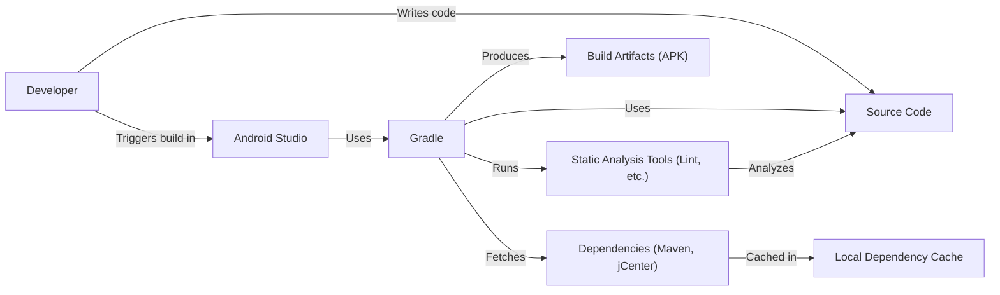

Okay, let's create a design document for the Sunflower Android application, focusing on aspects relevant for threat modeling.

# BUSINESS POSTURE

The Sunflower project is a demo application showcasing best practices for Android development. It's not a commercial product, but rather a learning resource and a reference implementation.  Therefore, the primary business goals are:

*   Provide a clear, well-documented, and maintainable example of a modern Android application.
*   Demonstrate the use of recommended Android architecture components and libraries.
*   Serve as a learning tool for Android developers of varying skill levels.
*   Showcase best practices in UI/UX design for a simple gardening app.

Given these goals, the most important business risks are:

*   **Code Quality Degradation:**  If the codebase becomes difficult to understand or maintain, it fails its primary purpose as a learning resource.
*   **Outdated Dependencies/Practices:**  Using obsolete libraries or techniques undermines the project's value as a reference for *modern* Android development.
*   **Security Vulnerabilities (to a lesser extent):** While not a production app handling sensitive user data, significant vulnerabilities could still damage the project's reputation and mislead developers who use it as a reference.  Exploitable vulnerabilities could be used to compromise developer machines or be copied into production applications.
*   **Misleading Information:** Inaccurate or misleading documentation/comments would defeat the purpose of the project.

# SECURITY POSTURE

The Sunflower application, being a sample application, has a relatively limited set of explicit security controls.  The focus is more on demonstrating architectural best practices than implementing robust security measures. However, some inherent security features and accepted risks are present:

*   security control: **Implicit Android Security Model:** The application benefits from the inherent security features of the Android platform, such as sandboxing, permission model, and inter-process communication (IPC) restrictions. Implemented in Android OS.
*   security control: **Dependency Management:** The project uses Gradle for dependency management, allowing for relatively easy updates to address known vulnerabilities in third-party libraries. Implemented in build.gradle.
*   security control: **Basic Code Obfuscation (Potentially):**  Release builds may use ProGuard or R8, providing a basic level of code obfuscation, making reverse engineering slightly more difficult. Implemented in build.gradle.
*   security control: **HTTPS (Implicit):** Any network communication (if added in the future) would likely use HTTPS, ensuring encrypted data in transit. This is a best practice, but not explicitly enforced in the current code.
*   accepted risk: **Limited Input Validation:** The application primarily displays data and has limited user input.  Extensive input validation is not a primary focus, though basic validation may be present in some areas.
*   accepted risk: **No Sensitive Data Storage:** The application, in its current form, does not store any sensitive user data.  All data is either static or related to plant information.
*   accepted risk: **No Authentication/Authorization:** The application does not require user login or implement any authorization mechanisms.
*   accepted risk: **Potential for Dependency Vulnerabilities:** While dependencies are managed, there's always a risk of undiscovered vulnerabilities in third-party libraries.
*   accepted risk: **Limited Error Handling:** The application may not have comprehensive error handling for all edge cases.

Recommended Security Controls (High Priority):

*   security control: **Regular Dependency Updates:** Establish a process for regularly checking for and applying updates to all dependencies, including libraries and Gradle plugins.
*   security control: **Static Code Analysis:** Integrate static analysis tools (e.g., FindBugs, PMD, Android Lint) into the build process to identify potential security vulnerabilities and code quality issues.
*   security control: **Software Composition Analysis (SCA):** Use a tool like OWASP Dependency-Check to identify known vulnerabilities in dependencies.

Security Requirements:

*   **Authentication:** Not required for the current scope.
*   **Authorization:** Not required for the current scope.
*   **Input Validation:**
    *   If user input is added (e.g., for searching or adding custom notes), validate all input to prevent common injection vulnerabilities (e.g., SQL injection, cross-site scripting).
    *   Enforce length restrictions and data type validation where appropriate.
*   **Cryptography:**
    *   If any sensitive data is stored locally (even non-user data), consider using the Android Keystore system for secure storage.
    *   If network communication is added, ensure HTTPS is used with proper certificate validation.
*   **Data Protection:**
    *   Ensure that any temporary files or cached data are stored in the application's private storage.
    *   If external storage is used (not recommended), be mindful of permissions and data exposure risks.

# DESIGN

## C4 CONTEXT

*   Elements Description:
    *   Name: User
        *   Type: Person
        *   Description: A gardener who wants to track their plants.
        *   Responsibilities: Interacts with the application to view plant information, add plants to their garden, and manage their garden.
        *   Security controls: None (external to the system).
    *   Name: Sunflower App
        *   Type: Software System
        *   Description: The Android application itself.
        *   Responsibilities: Displays plant information, allows users to manage their garden, and interacts with external services (potentially).
        *   Security controls: Implicit Android Security Model, Dependency Management, Basic Code Obfuscation (Potentially), HTTPS (Implicit).
    *   Name: Unsplash API
        *   Type: External System
        *   Description: A web service providing plant images.
        *   Responsibilities: Provides images based on search queries.
        *   Security controls: Assumed to be managed by Unsplash (HTTPS, API keys, etc.).
    *   Name: Google Photos (Optional)
        *   Type: External System
        *   Description: User's Google Photos library.
        *   Responsibilities: Stores user's photos.
        *   Security controls: Managed by Google (authentication, authorization, etc.).

## C4 CONTAINER

*   Elements Description:
    *   Name: User
        *   Type: Person
        *   Description: A gardener who wants to track their plants.
        *   Responsibilities: Interacts with the application to view plant information, add plants to their garden, and manage their garden.
        *   Security controls: None (external to the system).
    *   Name: UI Components
        *   Type: Container
        *   Description: Activities, Fragments, and other UI elements.
        *   Responsibilities: Display data to the user and handle user interactions.
        *   Security controls: Implicit Android Security Model (sandboxing, IPC restrictions).
    *   Name: ViewModels
        *   Type: Container
        *   Description: Android Architecture Components ViewModels.
        *   Responsibilities: Hold UI-related data and handle business logic. Survive configuration changes.
        *   Security controls: None specific.
    *   Name: Repository
        *   Type: Container
        *   Description: A single source of truth for data.
        *   Responsibilities: Abstract the data source (local database or network) from the ViewModels.
        *   Security controls: None specific.
    *   Name: Local Database (Room)
        *   Type: Container
        *   Description: A Room persistence library database.
        *   Responsibilities: Stores plant data and user's garden data locally.
        *   Security controls: Android file system permissions (data is stored in the app's private storage).
    *   Name: Network (Retrofit - Potential)
        *   Type: Container
        *   Description: A Retrofit client for making network requests.
        *   Responsibilities: Fetches data from the Unsplash API.
        *   Security controls: HTTPS (if implemented).
    *   Name: Unsplash API
        *   Type: External System
        *   Description: A web service providing plant images.
        *   Responsibilities: Provides images based on search queries.
        *   Security controls: Assumed to be managed by Unsplash (HTTPS, API keys, etc.).

## DEPLOYMENT

Possible deployment solutions:

1.  **Manual Installation (APK):**  Developers can build the APK and manually install it on a device or emulator.
2.  **Google Play Store (Internal Testing Track):**  The app could be deployed to the internal testing track for limited distribution and testing.
3.  **Firebase App Distribution:** Firebase App Distribution could be used to distribute builds to testers.

Chosen solution (for detailed description): **Manual Installation (APK)**

*   Elements Description:
    *   Name: Developer Machine
        *   Type: Infrastructure Node
        *   Description: The developer's computer.
        *   Responsibilities: Hosts the source code and build tools.
        *   Security controls: Developer machine security (firewall, antivirus, etc.).
    *   Name: Android Studio
        *   Type: Software
        *   Description: The IDE used for Android development.
        *   Responsibilities: Builds the application, manages dependencies, and provides debugging tools.
        *   Security controls: None specific.
    *   Name: Android Emulator/Device
        *   Type: Infrastructure Node
        *   Description: The target device or emulator for running the application.
        *   Responsibilities: Runs the application.
        *   Security controls: Android OS security features.
    *   Name: APK File
        *   Type: Artifact
        *   Description: The Android application package.
        *   Responsibilities: Contains the compiled code, resources, and manifest file.
        *   Security controls: Code signing (if enabled).

## BUILD

The Sunflower project uses Gradle for build automation and dependency management. The build process is typically triggered within Android Studio.

*   Security Controls in Build Process:
    *   **Dependency Management (Gradle):**  Gradle manages dependencies, making it easier to update them and address known vulnerabilities.
    *   **Static Analysis (Android Lint - Potential):** Android Lint, integrated into the build process, can identify potential code quality and security issues.  This should be explicitly configured and run as part of the build.
    *   **Software Composition Analysis (SCA - Recommended):**  A tool like OWASP Dependency-Check should be integrated into the build process to identify known vulnerabilities in dependencies.
    *   **Code Signing (Release Builds):** Release builds should be signed with a developer key to ensure authenticity and integrity.

# RISK ASSESSMENT

*   **Critical Business Process:** Providing a high-quality, up-to-date, and accurate example of modern Android development best practices.
*   **Data to Protect:**
    *   **Source Code:**  The primary asset.  Sensitivity: Low (public repository), but integrity is crucial.
    *   **Plant Data (Static):**  Sensitivity: Low.
    *   **User's Garden Data (Local):** Sensitivity: Low (not considered sensitive personal information).
    *   **Images (from Unsplash):** Sensitivity: Low (publicly available).

# QUESTIONS & ASSUMPTIONS

*   **Questions:**
    *   Will there be any future features added that involve user input or network communication?
    *   Is there a specific target audience (beginner, intermediate, advanced developers)? This might influence the level of detail in documentation and the complexity of the code.
    *   Are there any plans to monetize the application in the future (e.g., through in-app purchases or advertising)? This would significantly change the security posture.
    *   What is the process for handling reported vulnerabilities or bugs?

*   **Assumptions:**
    *   **BUSINESS POSTURE:** The primary goal is education and demonstration, not commercial use.
    *   **SECURITY POSTURE:** The application will not handle sensitive user data. No authentication or authorization is required.
    *   **DESIGN:** The application architecture will follow the recommended Android Architecture Components. The use of Unsplash API is assumed, but the specific implementation details may vary. The deployment will primarily be through manual APK installation for development and testing purposes. The build process will rely on Gradle and standard Android build tools.