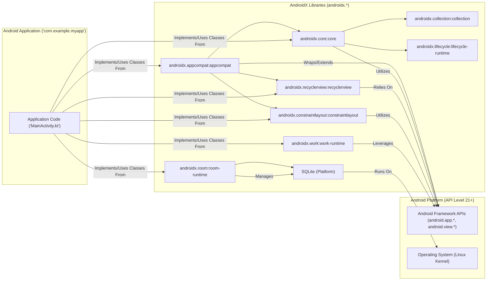
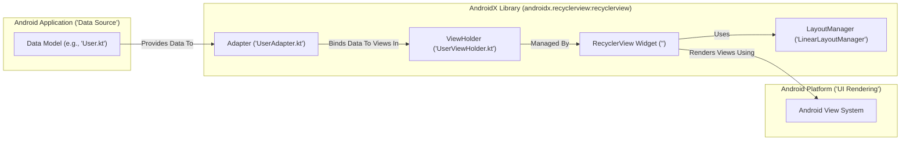

# Project Design Document: AndroidX Library Suite

**Version:** 1.1
**Date:** October 26, 2023
**Author:** AI Software Architect

## 1. Introduction

This document provides an enhanced architectural design overview of the AndroidX library suite. AndroidX represents a significant effort by Google to offer backward-compatible versions of Android framework APIs and introduce new functionalities and components for Android development. This document aims to clearly outline the essential components, their interactions, and data flow within the AndroidX ecosystem, serving as a robust foundation for subsequent threat modeling exercises.

## 2. Goals

*   Present a clear, concise, and easily understandable overview of the AndroidX architecture.
*   Precisely identify key components and delineate their respective responsibilities.
*   Illustrate the flow of data within the AndroidX libraries and their interactions with encompassing Android applications.
*   Highlight specific potential areas of security concern to effectively guide future threat modeling efforts.

## 3. High-Level Architecture

The AndroidX project is structured as a collection of independent libraries rather than a single, unified application. These libraries are designed to be incorporated into Android applications as managed dependencies. A fundamental principle of AndroidX is to decouple library development from the Android platform's release cycle, enabling faster iteration and ensuring backward compatibility for developers.

**Key Observations from the Diagram:**

*   Android applications directly declare dependencies on specific AndroidX libraries within their build configuration.
*   AndroidX libraries frequently build upon or provide compatibility wrappers around existing Android Framework APIs.
*   Internal dependencies exist between certain AndroidX libraries (e.g., `appcompat` often utilizes components from `core`).
*   Some libraries interact directly with lower-level platform components (e.g., Room interacting with the underlying SQLite database provided by the Android platform).

## 4. Key Components

This section provides more detailed descriptions of several key AndroidX libraries, emphasizing their purpose, functionalities, and typical interactions within an Android application.

*   **androidx.appcompat:appcompat:**
    *   Purpose: Delivers backward-compatible implementations of newer Android UI features and design patterns on older Android versions. It enables developers to utilize modern UI elements like `Toolbar` and material design themes consistently across a broader range of devices.
    *   Key Interactions: Wraps and extends standard Android framework UI components (e.g., providing a backward-compatible `ActionBar`). Interacts with the Android OS for UI rendering, input event handling, and theming. Example: An `AppCompatActivity` using `Toolbar` will delegate rendering to the appropriate framework implementation based on the device's Android version.

*   **androidx.core:core:**
    *   Purpose: Offers fundamental utility classes and components that are broadly used across various other AndroidX libraries. It includes functionalities for resource access, context management, permissions handling, and compatibility shims for newer APIs.
    *   Key Interactions: Serves as a foundational library for many other AndroidX components. Directly interacts with the Android OS for accessing resources (strings, drawables), managing application context, and interacting with system services. Example: Other AndroidX libraries might use `ContextCompat` from `core` to access resources in a backward-compatible manner.

*   **androidx.recyclerview:recyclerview:**
    *   Purpose: Provides a highly efficient and flexible component for displaying large, dynamically changing collections of data. It features optimized view recycling, customizable layouts, and item animations.
    *   Key Interactions: Relies on `Adapter` implementations to bind data to individual views (`ViewHolder` instances). Interacts with `LayoutManager` implementations to define the arrangement of items. Leverages the Android framework for view rendering, touch event handling, and scrolling. Example: An application displaying a list of contacts would use a `RecyclerView` with a custom `Adapter` to efficiently render the contact data.

*   **androidx.constraintlayout:constraintlayout:**
    *   Purpose: A powerful and flexible layout manager that allows developers to create intricate and responsive layouts with a flat view hierarchy, which can improve layout performance compared to deeply nested layouts.
    *   Key Interactions: Interprets constraints defined in XML or programmatically to determine the position and size of views relative to each other and the parent layout. Interacts with the Android layout inflation process and the rendering pipeline. Example: Defining constraints to position a button relative to the edges of the screen and another text view.

*   **androidx.lifecycle:lifecycle-runtime:**
    *   Purpose: Provides classes and interfaces to manage the lifecycle of Android components (Activities, Fragments, Services) in a more robust and decoupled manner. This helps prevent memory leaks and improve code organization.
    *   Key Interactions: Enables components to observe lifecycle events (e.g., `onCreate`, `onStart`, `onStop`) and react accordingly. Integrates deeply with the Android OS's lifecycle management system. Example: A `ViewModel` using `LiveData` to hold data that survives configuration changes, observing the lifecycle of an Activity.

*   **androidx.room:room-runtime:**
    *   Purpose: Offers a persistent library that provides an abstraction layer over SQLite, simplifying database access and reducing boilerplate code. It includes compile-time verification of SQL queries and seamless integration with LiveData and RxJava.
    *   Key Interactions: Uses the underlying SQLite database engine provided by the Android platform. Interacts with the Android file system for storing database files. Allows defining database entities, DAOs (Data Access Objects), and the database itself. Example: Defining an `@Entity` class representing a user and using a `@Dao` interface to perform CRUD operations on the user table.

*   **androidx.work:work-runtime:**
    *   Purpose: An API for scheduling deferrable, asynchronous tasks that are guaranteed to run even if the application exits or the device restarts. It handles API level differences and ensures task execution under various constraints.
    *   Key Interactions: Interacts with the Android OS's scheduling mechanisms (e.g., `JobScheduler`, `AlarmManager`). May utilize background services or other system features to execute tasks reliably. Example: Scheduling a background task to periodically synchronize data with a remote server.

*   **androidx.collection:collection:**
    *   Purpose: Provides optimized and specialized data structures for Android development, including efficient implementations of lists, sets, and maps that are designed for performance and memory efficiency on Android devices.
    *   Key Interactions: Used internally by other AndroidX libraries and can be directly utilized by application code for managing collections of data. Example: Using `ArraySet` for a memory-efficient implementation of a set of unique elements.

## 5. Data Flow

The data flow within AndroidX libraries is highly contextual and depends on the specific library and its intended functionality. However, we can identify some common patterns:

*   **UI Data Binding and Rendering:** Libraries like `appcompat`, `recyclerview`, and `constraintlayout` process application data (e.g., data models, view attributes) to render user interface elements on the screen. This involves interactions with the Android graphics subsystem for drawing and layout.

*   **Persistent Data Management:** Libraries such as `room-runtime` manage the flow of data between the application's memory and persistent storage (the SQLite database). This involves translating data into SQL queries, interacting with the database engine, and serializing/deserializing data.

*   **Background Task Execution:** `work-runtime` orchestrates the flow of data and execution related to background tasks. This might involve fetching data from network resources, processing data in the background, and subsequently updating the UI or local storage.

*   **Lifecycle Event Propagation:** The `lifecycle-runtime` library facilitates the communication of lifecycle state changes between the Android OS and application components. This enables components to react appropriately to events like `onCreate`, `onStart`, and `onStop`.

**Example Data Flow (RecyclerView):**

1. The Android application provides a collection of data (e.g., a list of `User` objects) to the `Adapter`.
2. The `Adapter` creates `ViewHolder` instances for each data item and binds the data to the views within the `ViewHolder`.
3. The `RecyclerView Widget` manages the creation and recycling of `ViewHolder` instances as items become visible or invisible on the screen.
4. The `LayoutManager` determines how the items are arranged within the `RecyclerView` (e.g., linearly, in a grid).
5. The `RecyclerView Widget` leverages the Android View System to render the individual item views on the screen.

## 6. Security Considerations (Specific Areas for Threat Modeling)

This section outlines specific potential security concerns associated with AndroidX libraries, providing a more targeted focus for threat modeling activities.

*   **SQL Injection Vulnerabilities (androidx.room:room-runtime):** If application code constructs raw SQL queries using user-provided input and passes it to Room's database operations (though Room's design discourages this), it could be susceptible to SQL injection attacks. Threat modeling should focus on how applications use Room's API and whether there are any paths for unsanitized user input to reach the database.
*   **Data Exposure through Improper Permissions/Encryption (androidx.room:room-runtime, androidx.work:work-runtime):** Sensitive data stored in Room databases or handled by WorkManager tasks could be vulnerable if appropriate encryption mechanisms (e.g., using `SupportSQLiteOpenHelper.Factory` with an encrypted database implementation) and proper file permissions are not implemented by the application developer. Threat modeling should consider scenarios where an attacker gains access to the device's file system.
*   **UI Redressing/Clickjacking (Indirectly through usage of androidx.appcompat:appcompat, androidx.constraintlayout:constraintlayout):** While the libraries themselves don't introduce these vulnerabilities, improper usage in application layouts could make them susceptible. For example, overlaying UI elements in unexpected ways. Threat modeling should analyze how applications use these layout components and if there are opportunities for malicious overlays.
*   **Denial of Service through Resource Exhaustion (androidx.recyclerview:recyclerview):** If an application displays a very large dataset in a `RecyclerView` without proper pagination or view recycling optimization, it could lead to excessive memory consumption and potentially a denial of service. Threat modeling should consider scenarios with extremely large or unbounded datasets.
*   **Information Disclosure through Leaky Collections (androidx.core:core, androidx.collection:collection):** If sensitive data is stored in collections without proper clearing or handling, there's a potential for information leakage, especially during application state transitions or crashes. Threat modeling should examine how sensitive data is managed within these collections.
*   **Bypassing Security Features on Older Devices (androidx.appcompat:appcompat):** If `appcompat` attempts to provide backward-compatible implementations of security features, vulnerabilities in its implementation could potentially lead to bypasses on older Android versions. Threat modeling should consider the specific security features that `appcompat` backports and analyze their implementation.
*   **Supply Chain Vulnerabilities:**  While not specific to the code itself, the risk of compromised dependencies or build tools used in the AndroidX project's development and distribution pipeline should be considered. This is a broader concern but relevant to the overall security posture.
*   **Vulnerabilities in Third-Party Dependencies:** AndroidX libraries may depend on other external libraries, which could introduce their own vulnerabilities. Threat modeling should include an analysis of the dependencies of key AndroidX libraries.

## 7. Deployment

AndroidX libraries are distributed through Google's Maven repository (Maven Central). Android developers declare dependencies on specific AndroidX libraries within their application's module-level `build.gradle` files. The Gradle build system then automatically downloads and integrates these libraries into the application's APK during the build process.

*   **Primary Distribution Mechanism:** Maven Central repository (`mavenCentral()`).
*   **Dependency Management Tool:** Gradle, using dependency declarations in `build.gradle` files (e.g., `implementation("androidx.appcompat:appcompat:1.6.1")`).
*   **Versioning Scheme:** Semantic versioning is applied to individual AndroidX libraries, allowing developers to specify specific versions or version ranges.

## 8. Assumptions and Constraints

*   This document provides a high-level architectural overview and does not delve into the intricate implementation details of individual AndroidX libraries.
*   The AndroidX architecture is continuously evolving with the addition of new libraries and updates to existing ones. This document reflects the state at the time of writing.
*   Security considerations outlined are preliminary and require more in-depth analysis and validation through dedicated threat modeling exercises.
*   The primary focus is on architectural aspects relevant to security. Performance, usability, and other non-functional requirements are not the central focus here.

## 9. Future Considerations

*   Develop more detailed component diagrams for individual, critical AndroidX libraries to understand their internal structure and interactions.
*   Create specific data flow diagrams for key functionalities within each library to trace the movement and transformation of data.
*   Clearly identify trust boundaries within the AndroidX ecosystem and between AndroidX and the application/platform.
*   Conduct a thorough analysis of potential attack vectors targeting AndroidX libraries and propose corresponding mitigation strategies.
*   Maintain an updated list of dependencies for key AndroidX libraries and monitor for known vulnerabilities.

This enhanced document provides a more detailed and actionable foundation for understanding the architecture of the AndroidX library suite, specifically tailored to facilitate comprehensive threat modeling activities.