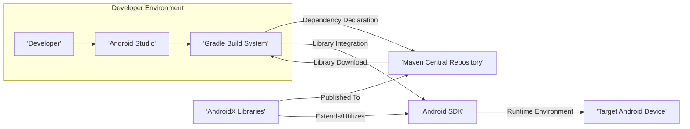
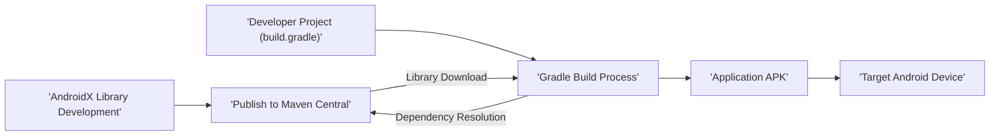

# Project Design Document: AndroidX Library Suite

**1. Introduction**

This document provides a detailed architectural overview of the AndroidX library suite project, publicly hosted at [https://github.com/androidx/androidx](https://github.com/androidx/androidx). It is designed to serve as a foundational resource for subsequent threat modeling activities. Understanding the system's structure, data flow, and core functionalities is crucial for identifying potential security vulnerabilities. AndroidX is a comprehensive collection of support libraries designed to offer backward compatibility for new Android features and introduce valuable components beyond the standard Android SDK.

**2. Goals**

The overarching goals of the AndroidX project are:

*   **Backward Compatibility:** To enable developers to utilize new Android features on older Android versions, reducing fragmentation and improving user experience across devices.
*   **Independent Evolution:** To provide libraries that can be updated and released independently of the core Android platform release cycle, allowing for faster innovation and bug fixes.
*   **Improved Organization and Maintainability:** To decouple support and component libraries from the monolithic Android SDK, leading to better code organization, reduced dependencies, and easier maintenance.
*   **New Components and Architectural Guidance:** To introduce novel components and establish best practices for building robust and modern Android applications.
*   **Ecosystem Growth:** To cultivate a more focused and dynamic ecosystem of Android libraries, fostering community contributions and specialization.

**3. High-Level Architecture**

The AndroidX project operates as a distributed collection of independent libraries. The primary interaction involves developers incorporating these libraries as dependencies within their Android application development process.

**4. Key Components and Their Roles**

The AndroidX project encompasses a wide array of individual libraries, organized into functional groups. Key component categories and representative examples include:

*   **Foundational Libraries:**
    *   `androidx.core`: Provides essential utilities, data structures, and backward compatibility shims for core Android framework features.
    *   `androidx.annotation`:  Offers annotations for code analysis, linting, and improved developer tooling, aiding in code correctness and maintainability.
    *   `androidx.collection`:  Provides optimized and specialized data structures tailored for Android development, enhancing performance and efficiency.
*   **User Interface (UI) Libraries:**
    *   `androidx.appcompat`: Delivers backward-compatible implementations of Material Design UI widgets and themes, ensuring a consistent look and feel across Android versions.
    *   `androidx.recyclerview`:  Offers a highly flexible and efficient mechanism for displaying large, dynamic lists of data, optimizing performance and memory usage.
    *   `androidx.constraintlayout`:  A powerful and versatile layout manager enabling developers to create complex and responsive user interfaces with a flat view hierarchy.
    *   `androidx.viewpager2`:  An enhanced version of the ViewPager, facilitating swipeable collections of views with improved features and flexibility.
*   **Architecture and Data Management Libraries:**
    *   `androidx.lifecycle`: Provides classes and interfaces for managing the lifecycle of Android components (Activities, Fragments, Services) in a robust and predictable manner, reducing memory leaks and improving stability.
    *   `androidx.room`:  An object-relational mapping (ORM) library providing a compile-time verification layer over SQLite databases, simplifying database interactions and reducing boilerplate code.
    *   `androidx.work`:  Offers an API for scheduling background tasks that need to run even if the application is not in the foreground, ensuring reliable execution of deferred and asynchronous operations.
    *   `androidx.navigation`:  A framework for structuring in-app navigation, handling fragment transactions, and managing the user's navigation flow.
    *   `androidx.paging`:  Assists in efficiently loading and displaying large datasets from local storage or over the network, improving performance and user experience when dealing with substantial amounts of data.
    *   `androidx.datastore`:  A modern data storage solution utilizing Kotlin coroutines and Flow to store key-value pairs or typed objects with protocol buffers, offering a reactive and asynchronous approach to data persistence.
*   **Media and Graphics Libraries:**
    *   `androidx.media`:  Provides utility classes and interfaces for working with media playback and control.
    *   `androidx.media3` (formerly ExoPlayer):  An application-level media player for Android that provides a high degree of customization and supports various audio and video formats and streaming protocols.
*   **Security Focused Libraries:**
    *   `androidx.security`:  Offers APIs for secure storage of sensitive data using encryption and key management, protecting user credentials and other confidential information.
*   **Testing and Instrumentation Libraries:**
    *   `androidx.test`:  Provides foundational frameworks and APIs for writing unit tests, integration tests, and UI tests for Android applications.
    *   `androidx.test.ext.junit`:  A JUnit test runner specifically designed for Android instrumentation tests, enabling testing on actual Android devices or emulators.
    *   `androidx.test.espresso`:  A powerful UI testing framework allowing developers to write concise and reliable UI tests that interact with the application as a user would.

**5. Data Flow: Library Integration and Usage**

The primary data flow within the AndroidX ecosystem revolves around the distribution and integration of libraries into developer projects:

1. **Library Development and Publication:** Google and community contributors develop, maintain, and rigorously test individual AndroidX libraries. These libraries are compiled and packaged as Android Archive (AAR) files.
2. **Publication to Maven Central:** The compiled AAR files are then published to the Maven Central Repository, a widely recognized and trusted repository for Java and Android libraries.
3. **Dependency Declaration in Projects:** Android developers explicitly declare their need for specific AndroidX libraries by adding dependency declarations within their application's `build.gradle` files. These declarations typically specify the group ID, artifact ID, and desired version of the library.
4. **Gradle Dependency Resolution and Download:** When the developer initiates a build process, the Gradle build system analyzes these dependency declarations. Gradle then contacts the configured repositories (including Maven Central) and securely downloads the necessary AAR files.
5. **Library Integration into the Application:** Gradle seamlessly integrates the downloaded AndroidX libraries into the application's build process. This involves incorporating the library's compiled code, resources (layouts, drawables, etc.), and any necessary manifest entries.
6. **Runtime Execution on Target Devices:** When the application is executed on an Android device, the code from the integrated AndroidX libraries is invoked and runs alongside the application's core logic, providing the desired functionality and backward compatibility.

**6. Security Considerations for Threat Modeling**

The following considerations are crucial for threat modeling the AndroidX project and applications that utilize it:

*   **Dependency Management and Integrity:**
    *   **Threat:** Compromised Libraries: How is the integrity of libraries hosted on Maven Central rigorously verified to prevent the introduction of malicious or vulnerable components?
    *   **Threat:** Dependency Confusion: Are there mechanisms to prevent attackers from exploiting dependency confusion vulnerabilities by publishing packages with similar names to Maven Central?
    *   **Mitigation:**  Explore the signing and verification processes for artifacts on Maven Central. Consider using dependency verification features in Gradle.
*   **Vulnerabilities within AndroidX Libraries:**
    *   **Threat:** Exploitable Bugs: Like any software, AndroidX libraries may contain security vulnerabilities. What is the process for identifying, responsibly reporting, and promptly patching these vulnerabilities?
    *   **Threat:** Outdated Dependencies:  Using outdated versions of AndroidX libraries may expose applications to known vulnerabilities. How are developers informed about necessary updates and security patches?
    *   **Mitigation:**  Review the AndroidX security disclosure and patching process. Consider using dependency scanning tools to identify vulnerable dependencies.
*   **Supply Chain Security of AndroidX Development:**
    *   **Threat:** Compromised Development Tools/Infrastructure:  Could attackers compromise the development tools or infrastructure used to build and publish AndroidX libraries?
    *   **Threat:** Malicious Insiders: What measures are in place to prevent malicious actions by individuals with access to the AndroidX codebase and release pipeline?
    *   **Mitigation:** Understand the security practices followed by the AndroidX development team, including access controls, code review processes, and build pipeline security.
*   **API Security and Misuse:**
    *   **Threat:** Insecure API Usage:  Improper use of AndroidX APIs by developers could introduce security vulnerabilities in applications. Are there clear guidelines and security considerations for using sensitive APIs?
    *   **Threat:** Exposed Sensitive Data: Do any AndroidX libraries inadvertently expose sensitive data if not used correctly?
    *   **Mitigation:** Review the documentation for AndroidX libraries, paying close attention to security best practices and potential pitfalls.
*   **Data Handling and Privacy:**
    *   **Threat:** Data Leaks or Breaches: If AndroidX libraries handle sensitive user data, are there sufficient security measures in place to prevent unauthorized access, disclosure, or modification?
    *   **Threat:** Compliance Violations:  Do AndroidX libraries adhere to relevant data privacy regulations (e.g., GDPR, CCPA)?
    *   **Mitigation:**  Analyze how AndroidX libraries interact with user data and ensure appropriate security controls (e.g., encryption, secure storage) are implemented.
*   **Testing and Security Audits:**
    *   **Question:** What level of security testing (e.g., static analysis, dynamic analysis, penetration testing) is performed on AndroidX libraries before release?
    *   **Question:** Are there publicly available security audit reports for the AndroidX project?
*   **Open Source Security Implications:**
    *   **Benefit:** Public Scrutiny: The open-source nature allows for community review and identification of potential vulnerabilities.
    *   **Risk:**  Information Disclosure: Attackers have access to the source code, potentially aiding in vulnerability research and exploitation.
*   **Interaction with the Android SDK:**
    *   **Threat:** SDK Vulnerabilities: Security vulnerabilities in the underlying Android SDK could potentially impact the security of AndroidX libraries that rely on those SDK components.
    *   **Mitigation:** Stay informed about security updates and vulnerabilities in the Android SDK.
*   **Developer Security Practices:**
    *   **Threat:** Developer-Introduced Vulnerabilities: The security of applications using AndroidX libraries ultimately depends on the security practices of the developers using them.
    *   **Mitigation:** Promote secure coding practices and provide developers with resources and guidance on how to use AndroidX libraries securely.

**7. Deployment and Distribution Model**

AndroidX libraries are deployed and distributed through a standardized and widely adopted mechanism:

*   **Maven Central Repository:**  The central repository for distributing AndroidX libraries. Developers configure Maven Central as a repository source within their project's `build.gradle` file.
*   **Gradle Dependency Management:** Developers declare their dependencies on specific AndroidX libraries within their `build.gradle` files. Gradle automates the process of resolving, downloading, and integrating these libraries into the project during the build process.
*   **Android Archive (AAR) Packaging:** AndroidX libraries are packaged as AAR files. These files contain the compiled code (in DEX format), resources (layouts, drawables, etc.), and a manifest file necessary for integration into Android applications.

**8. Key Technologies Utilized**

The AndroidX project leverages a range of technologies for its development and operation:

*   **Programming Languages:** Primarily **Java** and **Kotlin** are used for developing Android applications and the AndroidX library implementations.
*   **Android Software Development Kit (SDK):** The foundational platform upon which AndroidX libraries are built and extend.
*   **Gradle:** The standard build system for Android projects, responsible for compiling code, managing dependencies, and packaging applications.
*   **Maven:** The build automation and dependency management tool used for publishing and managing libraries within the Maven Central repository.
*   **Git:** The distributed version control system used for managing the source code of the AndroidX project (hosted on GitHub).
*   **Jetpack Compose:** A modern declarative UI toolkit for Android, with many of its core components residing within the AndroidX library suite.
*   **Kotlin Coroutines and Flow:**  Used extensively in modern AndroidX libraries to facilitate asynchronous programming, improve responsiveness, and simplify background task management.

This document provides a comprehensive architectural overview of the AndroidX project, designed to facilitate effective threat modeling. A deeper, more granular analysis of individual libraries and their specific functionalities will be necessary for a complete and thorough security assessment.
