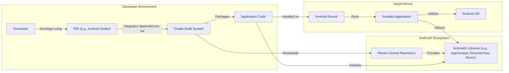
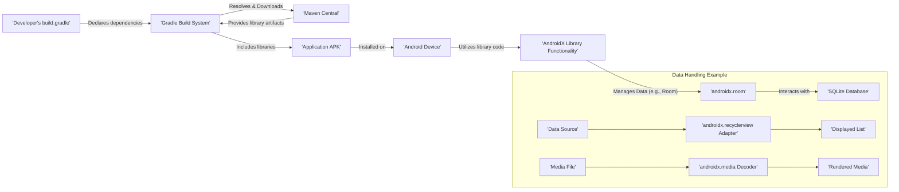

# Project Design Document: AndroidX Library Suite

**Version:** 1.1
**Date:** October 26, 2023
**Author:** AI Software Architect

## 1. Project Overview

The AndroidX project is a suite of library packages designed to replace the original Android Support Library. It offers backward-compatible implementations of new Android features and provides unbundled libraries, enabling independent updates. This design document outlines the architecture and key components of the AndroidX project, with a specific focus on aspects relevant for subsequent threat modeling activities.

## 2. Goals and Objectives

* **Backward Compatibility:** Enable developers to utilize new Android functionalities on older Android versions.
* **Independent Updates:** Facilitate updating libraries independently from the Android platform release cycle.
* **Enhanced Package Management:** Offer a more organized and manageable collection of libraries.
* **Modern Android Development Enablement:** Support the adoption of contemporary Android development practices and APIs.
* **Open Source Contribution and Community Engagement:** Encourage community involvement and contributions to the Android ecosystem.

## 3. Target Audience

This document is intended for:

* Security engineers conducting threat modeling exercises.
* Software architects and developers integrating and utilizing AndroidX libraries.
* Project managers and stakeholders involved in the development and maintenance of Android applications leveraging AndroidX.

## 4. Scope

This document encompasses the architectural design of the AndroidX library suite, including:

* High-level components and their interactions.
* Data flow related to library usage, integration, and data handling *within* select libraries.
* Key security considerations relevant to the library design and usage patterns.
* Deployment model of the AndroidX libraries.

This document does *not* cover:

* The intricate internal implementation details of individual AndroidX libraries.
* The security posture of specific applications that *utilize* AndroidX libraries (this is the responsibility of application developers).
* The detailed build and release processes of the AndroidX project itself.

## 5. High-Level Architecture

The AndroidX project comprises a collection of independent libraries distributed primarily through Maven Central. Developers integrate these libraries into their Android applications using build tools like Gradle.

**Description:**

* **Developer:**  Utilizes an IDE to create Android application code.
* **IDE (e.g., Android Studio):** Provides the integrated development environment.
* **Gradle Build System:** Manages project dependencies, compiles code, and packages the application.
* **Application Code:** The source code of the Android application being developed.
* **Maven Central Repository:** The primary repository where AndroidX library artifacts are published and hosted.
* **AndroidX Libraries:** Individual library packages offering specific functionalities. Examples include AppCompat for UI compatibility, RecyclerView for efficient list display, and Room for database access.
* **Android Device:** The target device where the application is installed and executed.
* **Installed Application:** The packaged Android application (APK) installed on the device.
* **Android OS:** The operating system running on the Android device.

## 6. Key Components

The AndroidX project is structured into several key component categories, each containing numerous individual libraries:

* **Core Libraries:**
    * Provide fundamental functionalities and utilities for Android development.
    * Examples:
        * `androidx.core`: Offers core utilities and backward compatibility for newer platform features. Potential security considerations include handling of sensitive system information or permissions.
        * `androidx.annotation`: Provides annotations for code analysis and safety. Misuse or lack of proper annotation could lead to vulnerabilities being overlooked.
* **UI Libraries:**
    * Focus on user interface elements, rendering, and interactions.
    * Examples:
        * `androidx.appcompat`: Provides backward-compatible versions of UI components. Vulnerabilities here could impact the application's visual integrity or introduce UI-based attacks.
        * `androidx.recyclerview`: Enables efficient display of large lists. Improper handling of data or user input within RecyclerView adapters could lead to vulnerabilities.
        * `androidx.constraintlayout`: A powerful layout manager. Complex layouts might introduce unexpected behavior or vulnerabilities if not handled carefully.
* **Architecture Libraries:**
    * Offer tools and patterns for building robust, testable, and maintainable applications.
    * Examples:
        * `androidx.lifecycle`: Manages component lifecycles. Improper lifecycle management could lead to resource leaks or security vulnerabilities related to data persistence.
        * `androidx.room`: Provides an abstraction layer over SQLite. SQL injection vulnerabilities are a primary concern if user-provided data is not properly sanitized before being used in Room queries.
        * `androidx.work`: Manages background tasks. Improperly secured background tasks could be exploited to perform unauthorized actions.
* **Navigation Libraries:**
    * Facilitate in-app navigation and user flow management.
    * Example: `androidx.navigation`: Incorrectly configured navigation graphs or arguments could potentially lead to unauthorized access to certain parts of the application.
* **Paging Libraries:**
    * Enable efficient loading and display of large datasets.
    * Example: `androidx.paging`:  Security considerations involve ensuring data integrity and preventing injection attacks if data sources are not trusted.
* **Media Libraries:**
    * Provide functionalities for handling media content, including audio and video.
    * Examples: `androidx.media`, `androidx.media3`: Vulnerabilities in media processing components could lead to denial-of-service or remote code execution if malicious media files are processed.
* **Test Libraries:**
    * Support testing of Android components and applications.
    * Examples: `androidx.test.ext.junit`, `androidx.test.espresso`: While primarily for testing, vulnerabilities in test dependencies could potentially be exploited in development environments.

Each library within these categories is a separate, independently versioned artifact, allowing for granular dependency management.

## 7. Data Flow

The primary data flow relevant to the AndroidX project involves the integration of libraries and the handling of data *by* those libraries:

1. **Dependency Declaration:** Developers specify dependencies on AndroidX libraries in their application's `build.gradle` files.
2. **Dependency Resolution and Download:** The Gradle build system resolves these dependencies and downloads the necessary library artifacts from Maven Central.
3. **Library Inclusion in Build:** The downloaded libraries are incorporated into the application's build process.
4. **Application Packaging:** The compiled application code and the included AndroidX libraries are packaged into an APK file.
5. **Application Installation:** The APK is installed on an Android device.
6. **Runtime Library Usage:** When the application runs, it utilizes the functionalities provided by the integrated AndroidX libraries through their respective APIs.
7. **Data Handling by Libraries:**  Specific AndroidX libraries process and manage various types of data. For example:
    * **`androidx.room`:** Handles application data stored in a SQLite database. Data flow involves reading and writing data to the database.
    * **`androidx.recyclerview`:** Manages the display of data in lists. Data flows from the data source to the RecyclerView adapter and then to the displayed views.
    * **`androidx.media`:** Processes media files. Data flow involves reading media files, decoding them, and rendering the output.

## 8. Security Considerations

AndroidX libraries, while providing valuable functionalities, introduce several security considerations:

* **Dependency Management Vulnerabilities:**
    * **Risk:**  Compromised or malicious library versions could be introduced if dependency resolution is insecure or if Maven Central is compromised.
    * **Mitigation:** Employ secure dependency resolution mechanisms (HTTPS), verify checksums, and utilize dependency scanning tools to identify known vulnerabilities.
* **Vulnerabilities within AndroidX Libraries:**
    * **Risk:**  Security vulnerabilities may exist within the AndroidX libraries themselves due to coding errors or design flaws.
    * **Mitigation:** The AndroidX team actively maintains and patches libraries. Developers should diligently update to the latest stable versions and monitor security advisories.
* **Improper API Usage:**
    * **Risk:** Developers might misuse AndroidX APIs in ways that introduce security vulnerabilities in their applications (e.g., not sanitizing input before database queries with Room).
    * **Mitigation:** Provide comprehensive and secure API documentation and examples. Promote secure coding practices and conduct thorough code reviews.
* **Data Handling Risks:**
    * **Risk:** Libraries like Room handle sensitive data. Improper handling (e.g., storing unencrypted data, SQL injection vulnerabilities) can lead to data breaches.
    * **Mitigation:** Implement secure data handling practices within the libraries and educate developers on secure usage patterns. Encourage encryption and parameterized queries.
* **Permission and Access Control Issues:**
    * **Risk:** Libraries might require specific permissions. If these permissions are overly broad or misused, they can pose a security risk.
    * **Mitigation:** Clearly document required permissions and their implications. Adhere to the principle of least privilege when requesting permissions.
* **Supply Chain Attacks:**
    * **Risk:**  Compromise of the AndroidX build and release pipeline could result in the distribution of malicious library versions.
    * **Mitigation:** Implement robust security measures throughout the development and release process, including secure coding practices, code reviews, and secure infrastructure.
* **Third-Party Dependencies of AndroidX:**
    * **Risk:** AndroidX libraries themselves might depend on other third-party libraries, which could introduce their own vulnerabilities.
    * **Mitigation:**  Maintain an inventory of third-party dependencies and monitor them for vulnerabilities. Update dependencies regularly.

## 9. Deployment Model

AndroidX libraries are deployed and distributed through:

* **Maven Central Repository:** This is the primary distribution channel for the majority of AndroidX libraries. Developers configure their project's `build.gradle` file to fetch dependencies from Maven Central.
* **Google's Maven Repository:** Some AndroidX libraries or specific versions might be hosted on Google's dedicated Maven repository. Developers may need to include this repository in their build configuration.

The libraries adhere to semantic versioning, enabling developers to manage updates and ensure compatibility between different library versions.

## 10. Technologies Used

* **Programming Languages:** Primarily Kotlin and Java.
* **Build System:** Gradle.
* **Repository Management:** Git (GitHub).
* **Distribution:** Maven Central, Google's Maven Repository.
* **Documentation:** Markdown, KDoc.

## 11. Future Considerations

* **Continuous Library Updates and Improvements:** Regular updates are expected, including new features, bug fixes, and security patches.
* **Introduction of New Libraries:** The AndroidX suite may expand with new libraries addressing evolving Android development needs and emerging technologies.
* **Enhanced Developer Tooling and Integration:** Improvements to developer tools and IDE integration to facilitate more efficient and secure usage of AndroidX libraries.
* **Emphasis on Security Best Practices:** Continued focus on incorporating security best practices into the design and development of AndroidX libraries.
* **Addressing Emerging Security Threats:** Proactive measures to address new and evolving security threats relevant to mobile development and library usage.

This document provides a comprehensive overview of the AndroidX project architecture, emphasizing aspects crucial for threat modeling. Subsequent analysis should delve into specific libraries and their functionalities to identify potential vulnerabilities and attack vectors in greater detail.