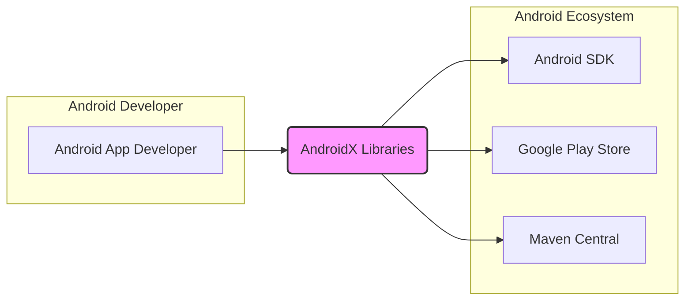
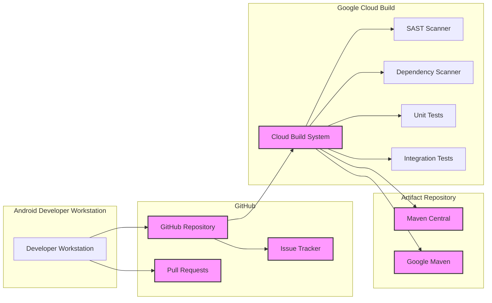
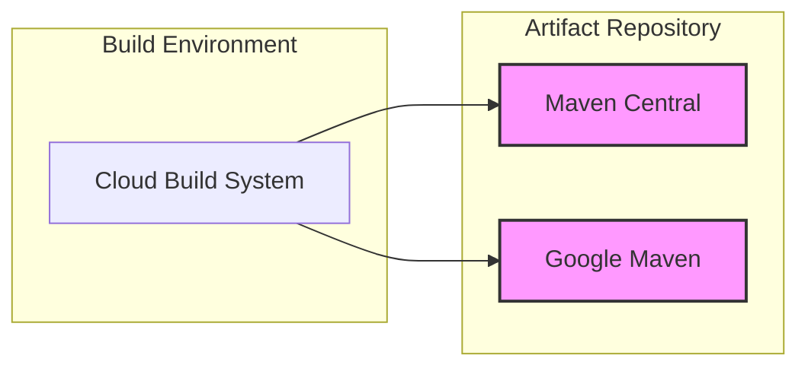
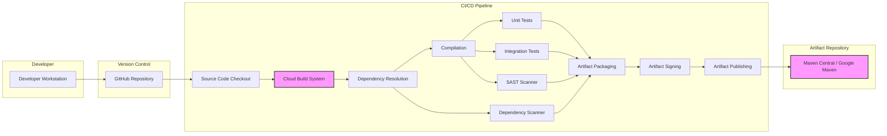

# BUSINESS POSTURE

The AndroidX project is a suite of libraries from Google that are used by Android developers to build applications. It is part of Android Jetpack and is designed to provide backward-compatible versions of Android framework APIs, as well as offer new features and components to accelerate development and improve app quality across different Android versions and devices.

Business Priorities and Goals:
- Provide stable and reliable libraries for Android developers.
- Ensure backward compatibility for new features and bug fixes.
- Accelerate Android app development by providing reusable components.
- Improve the quality and consistency of Android applications.
- Support a wide range of Android devices and versions.
- Foster a healthy and active Android developer ecosystem.

Most Important Business Risks:
- Security vulnerabilities in AndroidX libraries could be exploited in a vast number of Android applications, leading to widespread impact.
- Breaking changes or regressions in libraries could disrupt Android app development and cause compatibility issues.
- Slow adoption of new AndroidX libraries could hinder innovation and developer productivity.
- Performance issues in libraries could negatively impact the performance of Android applications.
- Open-source nature of the project requires careful management of contributions and security.

# SECURITY POSTURE

Existing Security Controls:
- security control: Open Source Code Review - The AndroidX project is open source, allowing for community review of the code. This is implemented on GitHub.
- security control: Public Issue Tracker - Public issue tracker on GitHub allows security researchers and developers to report potential vulnerabilities. This is implemented on GitHub.
- security control: Google Security Team Review - Projects from Google typically undergo internal security reviews, although the extent for open-source projects may vary. This is assumed to be implemented internally within Google.
- security control: Dependency Management - Using dependency management tools (like Gradle) helps manage and track dependencies, potentially aiding in vulnerability management of third-party libraries. This is implemented in the project's build system.

Accepted Risks:
- accepted risk: Public vulnerability disclosure - As an open-source project, vulnerabilities may be publicly disclosed before a patch is available.
- accepted risk: Third-party dependency vulnerabilities - AndroidX relies on third-party libraries, which may contain vulnerabilities.
- accepted risk: Contribution security - Security risks associated with accepting contributions from a large number of external developers.

Recommended Security Controls:
- security control: Automated Static Application Security Testing (SAST) - Implement SAST tools in the CI/CD pipeline to automatically scan code for potential vulnerabilities during development.
- security control: Automated Dependency Scanning - Implement dependency scanning tools to automatically check for vulnerabilities in third-party libraries used by AndroidX.
- security control: Regular Security Audits - Conduct periodic security audits by internal or external security experts to identify and address potential security weaknesses.
- security control: Security Champions - Designate security champions within the development teams to promote security awareness and best practices.
- security control: Vulnerability Disclosure Program - Establish a clear vulnerability disclosure program to encourage responsible reporting of security issues.
- security control: Security Training for Developers - Provide security training to developers to improve their awareness of secure coding practices.

Security Requirements:
- Authentication:
    - Requirement: Contributors to the AndroidX project must be authenticated to ensure traceability and accountability of code changes. This is implemented by GitHub authentication for committers.
- Authorization:
    - Requirement: Access control mechanisms should be in place to manage who can commit code, merge pull requests, and manage releases. This is implemented by GitHub's role-based access control.
- Input Validation:
    - Requirement: AndroidX libraries should perform robust input validation to prevent vulnerabilities such as injection attacks and denial-of-service. This needs to be implemented within the code of AndroidX libraries.
- Cryptography:
    - Requirement: If AndroidX libraries handle sensitive data or implement security-sensitive features, they must use strong and properly implemented cryptography. This needs to be implemented within the code of AndroidX libraries where applicable.

# DESIGN

## C4 CONTEXT

Context Diagram Elements:

- Name: Android App Developer
  - Type: Person
  - Description: Developers who use AndroidX libraries to build Android applications.
  - Responsibilities: Develop Android applications, integrate AndroidX libraries into their projects, report issues and contribute to AndroidX.
  - Security controls: Security controls are not directly implemented by Android App Developers on AndroidX project, but they are responsible for securely using libraries in their applications.

- Name: Android SDK
  - Type: Software System
  - Description: The Android Software Development Kit, providing tools, libraries, and APIs necessary for Android development. AndroidX libraries are designed to work with the Android SDK.
  - Responsibilities: Provide core Android APIs, support AndroidX library functionality, and define the platform for Android applications.
  - Security controls: Security controls are managed by the Android SDK team, including API security, platform security features, and updates.

- Name: Google Play Store
  - Type: Software System
  - Description: The official app store for Android, where Android applications built using AndroidX libraries are distributed to end-users.
  - Responsibilities: Distribute Android applications, provide a platform for app updates, and enforce app security policies.
  - Security controls: Google Play Store implements various security controls, including app scanning, developer verification, and runtime permissions.

- Name: Maven Central
  - Type: Software System
  - Description: A central repository for Java and Android libraries. AndroidX libraries are published to Maven Central for developers to easily include in their projects.
  - Responsibilities: Host and distribute AndroidX library artifacts, manage library versions, and provide access to developers.
  - Security controls: Maven Central implements security controls for artifact integrity and access, but the security of the libraries themselves is the responsibility of the AndroidX project.

- Name: AndroidX Libraries
  - Type: Software System
  - Description: A suite of Android Jetpack libraries developed by Google to provide backward-compatible features and accelerate Android development.
  - Responsibilities: Provide stable, reliable, and secure libraries for Android developers, address bug fixes and security vulnerabilities, and introduce new features.
  - Security controls: Security controls are implemented throughout the AndroidX project lifecycle, including code review, testing, security analysis, and secure development practices.

## C4 CONTAINER

Container Diagram Elements:

- Name: Developer Workstation
  - Type: Container
  - Description: The local development environment used by AndroidX developers to write code, run tests, and contribute to the project.
  - Responsibilities: Code development, local testing, and interaction with the GitHub repository.
  - Security controls: Security controls are the responsibility of individual developers, including secure coding practices, workstation security, and access control.

- Name: GitHub Repository
  - Type: Container
  - Description: The Git repository hosted on GitHub that stores the AndroidX source code, commit history, and project metadata.
  - Responsibilities: Version control, source code management, collaboration platform for developers, and hosting issue tracker and pull requests.
  - Security controls: security control: GitHub Access Control - Implemented by GitHub's user authentication and role-based access control to manage who can access and modify the repository. security control: Branch Protection - Implemented by GitHub to protect branches from unauthorized changes. security control: Audit Logs - Implemented by GitHub to track repository activities.

- Name: Issue Tracker
  - Type: Container
  - Description: The issue tracking system on GitHub used to report bugs, feature requests, and security vulnerabilities.
  - Responsibilities: Track and manage issues, facilitate communication about issues, and provide a platform for vulnerability reporting.
  - Security controls: security control: GitHub Issue Tracking Security - Implemented by GitHub's issue tracking system, including access control and moderation features.

- Name: Pull Requests
  - Type: Container
  - Description: GitHub Pull Requests are used for code review and contribution management.
  - Responsibilities: Facilitate code review process, manage code contributions, and ensure code quality and security before merging.
  - Security controls: security control: Code Review Process - Implemented through mandatory code reviews for all pull requests before merging. security control: Branch Policies - Implemented by GitHub to enforce code review requirements.

- Name: Cloud Build System
  - Type: Container
  - Description: A cloud-based build system (likely Google Cloud Build or similar) that automates the build, test, and release process for AndroidX libraries.
  - Responsibilities: Automated building of AndroidX libraries, running automated tests (unit and integration), performing security scans (SAST and dependency scanning), and publishing artifacts.
  - Security controls: security control: Build System Access Control - Implemented by the cloud build platform to restrict access to build configurations and secrets. security control: Secure Build Environment - Implemented by using hardened build environments and secure configurations. security control: Build Artifact Integrity - Implemented by signing build artifacts to ensure integrity.

- Name: SAST Scanner
  - Type: Container
  - Description: Static Application Security Testing tools integrated into the build pipeline to automatically scan the source code for potential security vulnerabilities.
  - Responsibilities: Identify potential security vulnerabilities in the source code before deployment.
  - Security controls: security control: SAST Tool Configuration - Implemented by configuring SAST tools with appropriate rules and settings. security control: SAST Results Analysis - Implemented by reviewing and addressing findings from SAST scans.

- Name: Dependency Scanner
  - Type: Container
  - Description: Dependency scanning tools integrated into the build pipeline to automatically check for known vulnerabilities in third-party libraries used by AndroidX.
  - Responsibilities: Identify vulnerabilities in third-party dependencies.
  - Security controls: security control: Dependency Scanning Tool Configuration - Implemented by configuring dependency scanning tools with vulnerability databases. security control: Dependency Vulnerability Remediation - Implemented by updating vulnerable dependencies or applying mitigations.

- Name: Unit Tests
  - Type: Container
  - Description: Automated unit tests that verify the functionality of individual components of AndroidX libraries.
  - Responsibilities: Ensure code quality, detect regressions, and improve code reliability.
  - Security controls: Unit tests indirectly contribute to security by improving code quality and reducing bugs.

- Name: Integration Tests
  - Type: Container
  - Description: Automated integration tests that verify the interaction between different components of AndroidX libraries and with the Android platform.
  - Responsibilities: Ensure proper integration of components and compatibility with the Android platform.
  - Security controls: Integration tests indirectly contribute to security by verifying the correct interaction of components and reducing integration-related issues.

- Name: Maven Central
  - Type: Container
  - Description: Public Maven repository where stable releases of AndroidX libraries are published for general use by Android developers.
  - Responsibilities: Host and distribute stable releases of AndroidX libraries.
  - Security controls: security control: Artifact Signing - Implemented by signing published artifacts to ensure integrity and authenticity. security control: Maven Central Security Policies - Implemented by Maven Central platform to protect the repository.

- Name: Google Maven
  - Type: Container
  - Description: Google's internal Maven repository, potentially used for pre-release or internal distribution of AndroidX libraries.
  - Responsibilities: Host and distribute internal or pre-release versions of AndroidX libraries.
  - Security controls: security control: Google Maven Access Control - Implemented by Google's internal access control mechanisms to restrict access to the repository. security control: Artifact Signing - Implemented by signing published artifacts to ensure integrity and authenticity.

## DEPLOYMENT

AndroidX libraries are not deployed as running services or applications in a traditional sense. Instead, they are deployed as library artifacts (AAR and JAR files) to Maven repositories. Android developers then include these artifacts as dependencies in their Android applications.

Deployment Architecture: Maven Repository Distribution

Deployment Diagram Elements:

- Name: Cloud Build System
  - Type: Environment
  - Description: The environment where AndroidX libraries are built, tested, and prepared for deployment. This is likely a Google Cloud Build environment.
  - Responsibilities: Build and package AndroidX libraries, run automated tests and security scans, and deploy artifacts to Maven repositories.
  - Security controls: security control: Secure Build Environment - Implemented by using hardened build environments and secure configurations. security control: Access Control - Implemented to restrict access to the build environment and deployment processes.

- Name: Maven Central
  - Type: Environment
  - Description: The public Maven repository where stable releases of AndroidX libraries are deployed for public consumption.
  - Responsibilities: Host and distribute stable AndroidX library artifacts to the Android developer community.
  - Security controls: security control: Maven Central Security - Implemented by Maven Central platform to ensure the security and integrity of hosted artifacts. security control: Artifact Signing - Implemented by signing artifacts before deployment to Maven Central.

- Name: Google Maven
  - Type: Environment
  - Description: Google's internal Maven repository, potentially used for internal distribution or pre-release versions of AndroidX libraries.
  - Responsibilities: Host and distribute internal or pre-release AndroidX library artifacts within Google or to select partners.
  - Security controls: security control: Google Maven Security - Implemented by Google's internal security infrastructure to protect the repository. security control: Access Control - Implemented to restrict access to Google Maven repository. security control: Artifact Signing - Implemented by signing artifacts before deployment to Google Maven.

## BUILD

Build Process Diagram Elements:

- Name: Developer Workstation
  - Type: Environment
  - Description: Developer's local machine where code is written and initially tested.
  - Responsibilities: Code development, local testing, and committing changes to the version control system.
  - Security controls: Security controls are developer's responsibility, including secure coding practices and workstation security.

- Name: GitHub Repository
  - Type: Component
  - Description: Central repository for source code, used for version control and collaboration.
  - Responsibilities: Source code management, version history, and triggering CI/CD pipeline on code changes.
  - Security controls: security control: Access Control - Implemented by GitHub to control who can commit and modify code. security control: Branch Protection - Implemented to protect main branches from direct commits.

- Name: Cloud Build System
  - Type: Component
  - Description: Automated CI/CD system that orchestrates the build, test, and release process.
  - Responsibilities: Automate build process, run tests, perform security scans, and publish artifacts.
  - Security controls: security control: Secure Build Environment - Implemented by using hardened build agents and secure configurations. security control: Access Control - Implemented to restrict access to build configurations and secrets.

- Name: Source Code Checkout
  - Type: Build Step
  - Description: Step in the CI/CD pipeline that retrieves the latest source code from the GitHub repository.
  - Responsibilities: Obtain the correct version of the source code for building.
  - Security controls: security control: Secure Connection - Implemented by using secure protocols (e.g., SSH, HTTPS) to access the GitHub repository.

- Name: Dependency Resolution
  - Type: Build Step
  - Description: Step in the CI/CD pipeline that resolves and downloads project dependencies.
  - Responsibilities: Manage project dependencies and ensure they are available for the build process.
  - Security controls: security control: Dependency Management - Implemented by using dependency management tools (e.g., Gradle) to manage and verify dependencies. security control: Dependency Scanning - Implemented by scanning dependencies for known vulnerabilities.

- Name: Compilation
  - Type: Build Step
  - Description: Step in the CI/CD pipeline that compiles the source code into executable artifacts (e.g., JAR, AAR).
  - Responsibilities: Convert source code into binary artifacts.
  - Security controls: Compiler security is generally assumed, but using up-to-date and trusted compilers is important.

- Name: Unit Tests
  - Type: Build Step
  - Description: Step in the CI/CD pipeline that executes automated unit tests.
  - Responsibilities: Verify the functionality of individual code components.
  - Security controls: Unit tests indirectly contribute to security by improving code quality.

- Name: Integration Tests
  - Type: Build Step
  - Description: Step in the CI/CD pipeline that executes automated integration tests.
  - Responsibilities: Verify the interaction between different components and with the Android platform.
  - Security controls: Integration tests indirectly contribute to security by verifying system integration.

- Name: SAST Scanner
  - Type: Build Step
  - Description: Step in the CI/CD pipeline that runs Static Application Security Testing tools.
  - Responsibilities: Identify potential security vulnerabilities in the source code.
  - Security controls: security control: SAST Tool Configuration - Implemented by configuring SAST tools with relevant security rules.

- Name: Dependency Scanner
  - Type: Build Step
  - Description: Step in the CI/CD pipeline that runs dependency scanning tools.
  - Responsibilities: Identify known vulnerabilities in third-party dependencies.
  - Security controls: security control: Dependency Scanning Tool Configuration - Implemented by configuring dependency scanning tools with vulnerability databases.

- Name: Artifact Packaging
  - Type: Build Step
  - Description: Step in the CI/CD pipeline that packages the compiled artifacts into distributable formats (e.g., AAR, JAR).
  - Responsibilities: Prepare build artifacts for distribution.
  - Security controls: Ensuring the packaging process does not introduce vulnerabilities.

- Name: Artifact Signing
  - Type: Build Step
  - Description: Step in the CI/CD pipeline that signs the build artifacts to ensure integrity and authenticity.
  - Responsibilities: Protect the integrity and authenticity of released artifacts.
  - Security controls: security control: Code Signing - Implemented by using code signing certificates and secure key management practices.

- Name: Artifact Publishing
  - Type: Build Step
  - Description: Step in the CI/CD pipeline that publishes the signed artifacts to Maven Central and/or Google Maven.
  - Responsibilities: Distribute build artifacts to the intended repositories.
  - Security controls: security control: Secure Publishing - Implemented by using secure protocols to publish artifacts to Maven repositories. security control: Access Control - Implemented to restrict who can publish artifacts.

- Name: Maven Central / Google Maven
  - Type: Component
  - Description: Artifact repositories where AndroidX libraries are published.
  - Responsibilities: Host and distribute AndroidX library artifacts.
  - Security controls: security control: Repository Security - Implemented by Maven Central and Google Maven platforms to protect hosted artifacts. security control: Access Control - Implemented to control access to the repositories.

# RISK ASSESSMENT

Critical Business Processes to Protect:
- AndroidX Library Development and Release Process: Ensuring the integrity and security of the development pipeline is crucial to prevent the introduction of vulnerabilities into AndroidX libraries.
- Android Developer Ecosystem: Maintaining trust and reliability in AndroidX libraries is essential for the health of the Android developer ecosystem.

Data to Protect and Sensitivity:
- Source Code: Publicly available, but integrity is important to prevent malicious modifications. Sensitivity: Low (public), Integrity: High.
- Build Artifacts (JAR/AAR files): Publicly distributed, integrity and authenticity are critical to prevent supply chain attacks. Sensitivity: Low (public), Integrity: Critical, Authenticity: Critical.
- Build System Credentials and Secrets: Used for accessing repositories, signing artifacts, and publishing releases. Sensitivity: High, Confidentiality: High, Integrity: High.
- Vulnerability Reports: Information about potential security issues, needs to be handled confidentially until fixed and disclosed. Sensitivity: Medium, Confidentiality: Medium, Integrity: High.

# QUESTIONS & ASSUMPTIONS

Questions:
- What specific SAST and dependency scanning tools are used in the AndroidX build pipeline?
- What is the process for handling and remediating vulnerabilities identified by security scans or reported by external researchers?
- Are there regular penetration testing or security audits conducted on AndroidX libraries or the build infrastructure?
- What are the specific criteria and processes for releasing security updates for AndroidX libraries?
- What security training is provided to AndroidX developers?
- What is the incident response plan in case of a security breach or vulnerability exploitation?

Assumptions:
- BUSINESS POSTURE: Assumed that Google prioritizes the security and stability of AndroidX libraries due to their widespread use and impact on the Android ecosystem.
- SECURITY POSTURE: Assumed that Google follows secure software development lifecycle practices for AndroidX, including code review, testing, and security scanning, even though specific details are not publicly documented for this open-source project. Assumed that standard GitHub security features are utilized.
- DESIGN: Assumed a standard CI/CD pipeline using cloud-based build systems and artifact repositories. Assumed that industry best practices for open-source software development are followed. Assumed that artifact signing is implemented for release artifacts.