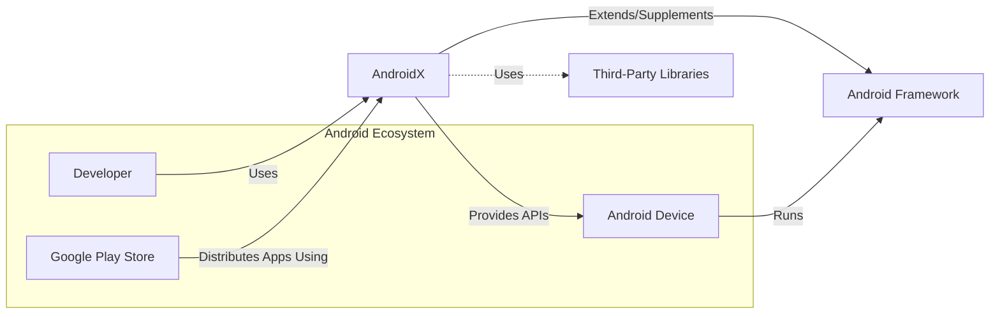
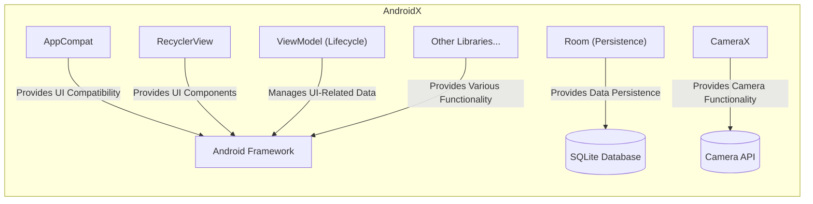
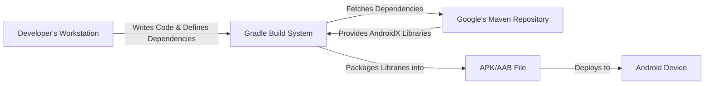
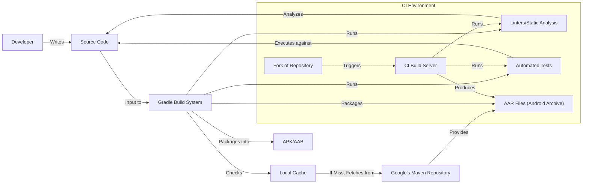

Okay, let's create a design document for the AndroidX project, keeping in mind its purpose and potential security considerations.  I'll follow the structure you've outlined.

# BUSINESS POSTURE

The AndroidX project is a crucial component of the Android ecosystem.  Its primary business goal is to provide a set of libraries that offer backward compatibility, improved APIs, and features beyond the standard Android framework.  This enables developers to create applications that work consistently across a wide range of Android versions and devices, reducing fragmentation and development time.

Business Priorities:

*   Reduce Android platform fragmentation.
*   Improve developer productivity and application quality.
*   Provide a stable and reliable foundation for Android applications.
*   Enable faster adoption of new Android features.
*   Maintain backward compatibility with older Android versions.

Business Goals:

*   Become the standard library set for Android app development.
*   Maintain high adoption rates among Android developers.
*   Continuously evolve to meet the changing needs of the Android ecosystem.

Most Important Business Risks:

*   Security vulnerabilities in AndroidX libraries could affect a vast number of applications and users.
*   Compatibility issues could break existing applications, leading to user frustration and developer distrust.
*   Performance problems could negatively impact application responsiveness and battery life.
*   Failure to keep up with the evolving Android platform could render AndroidX obsolete.
*   Lack of adoption by key developers or frameworks could limit its impact.

# SECURITY POSTURE

The AndroidX project, being a foundational element of many Android applications, has a significant security responsibility.  The following outlines the existing and recommended security controls, accepted risks, and security requirements.

Existing Security Controls:

*   security control: Code Reviews:  The project is open source and hosted on GitHub, implying that code reviews are a standard part of the development process. (Described in GitHub pull request process).
*   security control: Static Analysis:  The project likely uses static analysis tools to identify potential security vulnerabilities and coding errors. (Implied by best practices for large-scale projects).
*   security control: Testing:  A comprehensive test suite is essential for ensuring the stability and reliability of the libraries. (Evident from the project structure and continuous integration setup).
*   security control: Open Source: Being open source allows for community scrutiny and contributions, potentially leading to faster identification and resolution of security issues.

Accepted Risks:

*   accepted risk: Zero-day vulnerabilities:  Like any software project, AndroidX is susceptible to zero-day vulnerabilities that are unknown and unpatched.
*   accepted risk: Supply chain attacks:  Dependencies on third-party libraries introduce the risk of supply chain attacks, although the project likely mitigates this through careful dependency management.
*   accepted risk: Reliance on developer implementation:  The security of applications using AndroidX ultimately depends on how developers implement and use the libraries. AndroidX can provide secure components, but developers must use them correctly.

Recommended Security Controls:

*   security control: Dynamic Analysis: Implement dynamic analysis (e.g., fuzzing) to complement static analysis and identify runtime vulnerabilities.
*   security control: Security Audits: Conduct regular, independent security audits to identify potential vulnerabilities that may be missed by internal reviews.
*   security control: Vulnerability Disclosure Program: Establish a clear and responsive vulnerability disclosure program to encourage responsible reporting of security issues.
*   security control: Software Bill of Materials (SBOM): Generate and maintain an SBOM to track all dependencies and facilitate rapid response to vulnerabilities in third-party libraries.
*   security control: Signing of Artifacts: Digitally sign all released artifacts to ensure their integrity and authenticity.

Security Requirements:

*   Authentication:
    *   Where applicable, libraries should support secure authentication mechanisms, such as OAuth 2.0 and OpenID Connect.
    *   Sensitive data, like API keys or tokens, should never be hardcoded and should be securely stored using appropriate Android platform mechanisms (e.g., Keystore).

*   Authorization:
    *   Libraries that provide access to sensitive resources or functionality should implement appropriate authorization checks.
    *   Support for role-based access control (RBAC) or permission-based access control should be considered where relevant.

*   Input Validation:
    *   All input from external sources (e.g., user input, network data) must be rigorously validated to prevent injection attacks (e.g., SQL injection, XSS).
    *   Libraries should provide utilities or guidance for developers to perform input validation effectively.

*   Cryptography:
    *   Use only well-established and vetted cryptographic algorithms and libraries (e.g., those provided by the Android platform or trusted third-party libraries).
    *   Avoid implementing custom cryptographic solutions.
    *   Provide secure key management mechanisms and guidance.
    *   Ensure proper use of random number generators.

# DESIGN

## C4 CONTEXT

Element Descriptions:

*   Element:
    *   Name: Developer
    *   Type: Person
    *   Description: Software developers creating Android applications.
    *   Responsibilities: Utilize AndroidX libraries to build applications, handle user data, implement security best practices.
    *   Security controls: Follow secure coding guidelines, implement appropriate security measures within their applications.

*   Element:
    *   Name: Android Device
    *   Type: Device
    *   Description: Mobile devices running the Android operating system.
    *   Responsibilities: Execute Android applications, manage user data, interact with hardware resources.
    *   Security controls: Android operating system security features (sandboxing, permissions), device-specific security measures.

*   Element:
    *   Name: Google Play Store
    *   Type: System
    *   Description: The primary distribution platform for Android applications.
    *   Responsibilities: Host and distribute applications, enforce security policies, provide updates.
    *   Security controls: Application vetting process, malware scanning, developer identity verification.

*   Element:
    *   Name: AndroidX
    *   Type: System
    *   Description: A set of libraries providing backward compatibility and enhanced features for Android development.
    *   Responsibilities: Provide APIs for developers, ensure compatibility across Android versions, maintain stability and security.
    *   Security controls: Code reviews, static analysis, testing, vulnerability management.

*   Element:
    *   Name: Third-Party Libraries
    *   Type: System
    *   Description: External libraries used by AndroidX or by applications built with AndroidX.
    *   Responsibilities: Provide specific functionality not covered by AndroidX or the Android framework.
    *   Security controls: Dependent on the specific library; AndroidX should carefully vet and manage its dependencies.

*   Element:
    *   Name: Android Framework
    *   Type: System
    *   Description: The core set of APIs and services provided by the Android operating system.
    *   Responsibilities: Provide fundamental functionality for applications, manage system resources, enforce security policies.
    *   Security controls: Built-in security features of the Android OS, regular security updates.

## C4 CONTAINER

Since AndroidX is a collection of libraries, the "container" level is less about distinct deployable units and more about the logical grouping of libraries. The following diagram represents a simplified view, focusing on a few key library groups.

Element Descriptions:

*   Element:
    *   Name: AppCompat
    *   Type: Library
    *   Description: Provides backward compatibility for UI components and features.
    *   Responsibilities: Enable consistent UI across different Android versions.
    *   Security controls: Input validation, secure handling of UI resources.

*   Element:
    *   Name: RecyclerView
    *   Type: Library
    *   Description: A flexible view for displaying large data sets.
    *   Responsibilities: Efficiently display lists and grids of data.
    *   Security controls: Input validation, secure handling of data displayed in the list.

*   Element:
    *   Name: ViewModel (Lifecycle)
    *   Type: Library
    *   Description: Manages UI-related data in a lifecycle-conscious way.
    *   Responsibilities: Store and manage data that survives configuration changes.
    *   Security controls: Secure handling of data stored in the ViewModel.

*   Element:
    *   Name: Room (Persistence)
    *   Type: Library
    *   Description: An abstraction layer over SQLite for easier database management.
    *   Responsibilities: Provide a simplified API for database operations, ensure data integrity.
    *   Security controls: SQL injection prevention, secure database configuration.

*   Element:
    *   Name: CameraX
    *   Type: Library
    *   Description: Simplifies camera development and provides consistent behavior across devices.
    *   Responsibilities: Provide access to camera hardware, manage camera sessions.
    *   Security controls: Secure handling of camera data and permissions.

*   Element:
    *   Name: Other Libraries...
    *   Type: Library Group
    *   Description: Represents the many other libraries within AndroidX.
    *   Responsibilities: Provide a wide range of functionality, from UI components to background tasks.
    *   Security controls: Vary depending on the specific library; each library should adhere to security best practices.

*   Element:
    *   Name: SQLite Database
    *   Type: Database
    *   Description: Embedded database engine used by Room.
    *   Responsibilities: Store and manage application data.
    *   Security controls: Provided by Android OS and Room library.

*   Element:
    *   Name: Camera API
    *   Type: API
    *   Description: Native Android Camera API.
    *   Responsibilities: Provide access to camera hardware.
    *   Security controls: Provided by Android OS.

## DEPLOYMENT

AndroidX libraries are typically deployed as part of an Android application package (APK) or Android App Bundle (AAB).  There isn't a separate "deployment" of AndroidX itself, as it's integrated into the application's build process.

Possible Deployment Solutions:

1.  **Gradle Dependency:** The most common approach. Developers include AndroidX libraries as dependencies in their project's `build.gradle` file.  Gradle then fetches the libraries from a repository (e.g., Google's Maven repository) and includes them in the APK/AAB.
2.  **Manual Inclusion (Rare):**  It's technically possible to manually download the library files (AARs) and include them in the project, but this is highly discouraged due to the complexity of managing dependencies and updates.

Chosen Solution (Gradle Dependency):

Element Descriptions:

*   Element:
    *   Name: Developer's Workstation
    *   Type: Device
    *   Description: The computer used by the developer to write code and build the application.
    *   Responsibilities: Host the development environment, source code, and build tools.
    *   Security controls: Standard workstation security measures (antivirus, firewall, etc.).

*   Element:
    *   Name: Gradle Build System
    *   Type: System
    *   Description: The build system used for Android projects.
    *   Responsibilities: Manage dependencies, compile code, package the application.
    *   Security controls: Dependency verification, secure configuration of the build process.

*   Element:
    *   Name: Google's Maven Repository
    *   Type: Repository
    *   Description: A repository hosting AndroidX libraries and other dependencies.
    *   Responsibilities: Provide a reliable source for downloading library artifacts.
    *   Security controls: Repository security measures, artifact signing.

*   Element:
    *   Name: APK/AAB File
    *   Type: File
    *   Description: The final application package that is deployed to the device.
    *   Responsibilities: Contain the application's code, resources, and dependencies (including AndroidX).
    *   Security controls: Code signing, application sandboxing (on the device).

*   Element:
    *   Name: Android Device
    *   Type: Device
    *   Description: The mobile device running the Android application.
    *   Responsibilities: Execute the application, manage user data, interact with hardware.
    *   Security controls: Android operating system security features.

## BUILD

The AndroidX project itself has a complex build process, managed by the Android Open Source Project (AOSP) build system.  However, from the perspective of an application developer *using* AndroidX, the build process is simplified through Gradle.

Build Process Description:

1.  **Developer Writes Code:** The developer writes application code and specifies AndroidX dependencies in the `build.gradle` file.
2.  **Gradle Build System:** Gradle is invoked (either through Android Studio or the command line).
3.  **Dependency Resolution:** Gradle checks the local cache for the specified AndroidX library versions. If not found, it fetches them from Google's Maven repository.
4.  **Linters and Static Analysis:** Gradle can be configured to run linters (e.g., Android Lint) and static analysis tools to identify potential code quality and security issues.
5.  **Automated Tests:** Gradle executes the project's automated tests (unit tests, integration tests, UI tests).
6.  **Packaging:** Gradle compiles the code, processes resources, and packages everything into an AAR (for library modules) or an APK/AAB (for application modules).
7. **CI Environment**: In CI environment, like GitHub Actions, build process is triggered by changes in repository. Build server runs linters, tests and produces build artifacts.

Security Controls in the Build Process:

*   security control: Dependency Management: Gradle handles dependency resolution, ensuring that the correct versions of AndroidX libraries are used.
*   security control: Static Analysis: Linters and static analysis tools can identify potential vulnerabilities before runtime.
*   security control: Automated Testing: A comprehensive test suite helps ensure the stability and security of the code.
*   security control: CI/CD Pipeline: A CI/CD pipeline (e.g., using GitHub Actions) automates the build, test, and release process, ensuring consistency and reducing the risk of manual errors.
*   security control: Supply Chain Security: Using trusted repositories (like Google's Maven repository) and verifying artifact signatures (if implemented) helps mitigate supply chain risks.

# RISK ASSESSMENT

Critical Business Processes:

*   Application Development: AndroidX is a critical component for building Android applications.
*   Application Stability and Compatibility: AndroidX ensures applications run reliably across different Android versions.
*   User Experience: AndroidX contributes to a consistent and performant user experience.

Data We Are Trying to Protect:

*   User Data (Indirectly): While AndroidX itself doesn't directly handle user data, it provides the building blocks for applications that do. Therefore, vulnerabilities in AndroidX could indirectly lead to user data breaches. Sensitivity: Varies greatly depending on the application.
*   Application Code: The integrity of the application code is crucial. AndroidX libraries are part of this code. Sensitivity: High.
*   Device Resources: AndroidX libraries interact with device resources (e.g., camera, storage).  Vulnerabilities could allow unauthorized access to these resources. Sensitivity: High.

# QUESTIONS & ASSUMPTIONS

Questions:

*   What specific static analysis tools are used in the AndroidX build process?
*   Are there any formal security audits conducted on AndroidX libraries?
*   What is the process for handling reported security vulnerabilities?
*   Are there plans to implement artifact signing for AndroidX releases?
*   What level of dynamic analysis (e.g., fuzzing) is currently employed?
*   What are the specific security training requirements for AndroidX developers?

Assumptions:

*   BUSINESS POSTURE: The AndroidX project prioritizes security due to its widespread use and impact on the Android ecosystem.
*   SECURITY POSTURE: Code reviews, static analysis, and testing are standard practices within the AndroidX development process.
*   SECURITY POSTURE: The project follows secure coding guidelines and best practices.
*   DESIGN: Developers typically use Gradle to include AndroidX libraries in their projects.
*   DESIGN: The Android Open Source Project (AOSP) build system is used for building AndroidX itself.
*   DESIGN: Google's Maven repository is the primary source for AndroidX library artifacts.
*   DESIGN: Continuous integration and continuous delivery (CI/CD) practices are used to automate the build and release process.