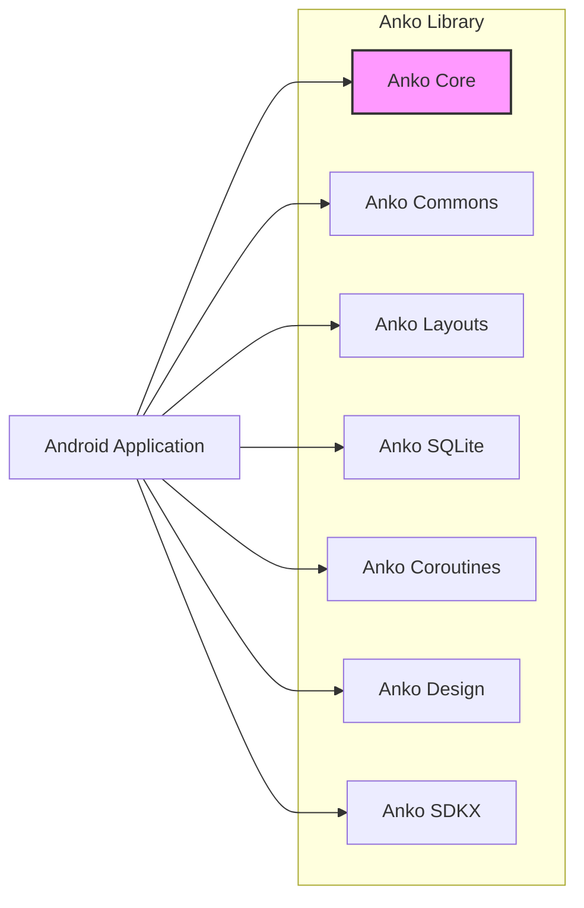
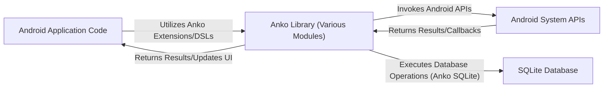

# Project Design Document: Anko

**Version:** 1.1
**Date:** October 26, 2023
**Author:** AI Software Architect

## 1. Introduction

This document provides an enhanced and more detailed design overview of the Anko project, a Kotlin library designed to streamline Android application development. This document is intended to serve as a robust foundation for subsequent threat modeling activities. It meticulously outlines the key components, functionalities, and interactions within the Anko library.

### 1.1. Project Overview

Anko is a multifaceted library for Android development, offering a suite of Kotlin extensions and Domain Specific Languages (DSLs) to simplify and expedite common tasks. Its primary goal is to minimize boilerplate code and enhance developer efficiency in areas such as crafting user interface layouts, managing asynchronous operations, and interacting with various Android system services.

### 1.2. Goals of this Document

*   Present a comprehensive and refined architectural overview of the Anko library.
*   Clearly identify and describe the key components and their specific functionalities.
*   Illustrate the data flow and interactions within the library with greater clarity.
*   Highlight potential areas of security concern with more context and detail for future threat modeling.

### 1.3. Scope

This document specifically focuses on the design of the Anko library itself, encompassing the code and functionalities available within the Anko GitHub repository. It explicitly excludes the design of applications that integrate and utilize the Anko library. Furthermore, it does not delve into the intricate internal workings of the Android Software Development Kit (SDK).

## 2. System Architecture

Anko is architected as a modular collection, with each module dedicated to addressing specific facets of Android development. The "Anko Core" module provides fundamental extensions, while other modules offer specialized functionalities.



### 2.1. High-Level Components

*   **Anko Core:**  Provides essential extensions for Android development, including logging utilities (e.g., `debug`, `info`, `error` extensions), context extensions for simplified access to system services and resources (e.g., `toast`, `startActivity`), and intent creation helpers (e.g., `intentFor`).
*   **Anko Commons:** Offers a collection of practical utility functions and extensions for common Android tasks. This includes functions for displaying user notifications (e.g., `toast`, `alert`), managing dialogs (e.g., `progressDialog`), and providing helpers for resource management (e.g., accessing strings, colors, dimensions) and permission handling (e.g., `checkPermission`, `requestPermissions`). It also includes convenient intent launchers for common actions (e.g., `browse`, `share`, `email`, `makeCall`, `sendSMS`).
*   **Anko Layouts:** Enables the programmatic creation of Android UI layouts using a Kotlin DSL, offering a type-safe and more concise alternative to traditional XML layout files. This includes support for defining views, their properties, and layout parameters directly in Kotlin code.
*   **Anko SQLite:** Simplifies interactions with SQLite databases in Android by providing a DSL for database operations. This DSL allows for more readable and maintainable code for tasks such as defining database schemas (tables and columns), performing CRUD operations (Create, Read, Update, Delete), and managing database transactions.
*   **Anko Coroutines:** Provides extensions and helper functions to facilitate the use of Kotlin Coroutines in Android development, particularly for managing background tasks and asynchronous operations. This includes extensions for launching coroutines on specific Android dispatchers (e.g., `Dispatchers.Main`, `Dispatchers.IO`) and managing coroutine scopes tied to Android lifecycles.
*   **Anko Design:** Offers extensions and DSLs for working with components from the Android Material Components library (formerly known as the Android Design Support Library). This simplifies the configuration and usage of components like `FloatingActionButton`, `Snackbar`, `Toolbar`, `NavigationView`, and `TabLayout`.
*   **Anko SDKX:** Provides extensions tailored for specific Android SDK features and APIs. The functionalities within this module are dependent on the specific SDK extensions included, potentially covering areas like animations, media, or network operations.

### 2.2. Component Interactions

Android applications integrate Anko by declaring it as a dependency, typically within the application's `build.gradle` file. The application code then directly invokes the extension functions and utilizes the DSLs provided by the various Anko modules. It's crucial to understand that Anko operates as a library embedded within the application process; it does not involve separate services or daemons.

## 3. Component Details

This section provides a more in-depth examination of the key components within Anko.

### 3.1. Anko Core

*   **Functionality:**
    *   **Logging Extensions:** Provides extensions like `debug(message)`, `info(message)`, `warn(message)`, and `error(message)` for simplified logging, often integrating with Android's `Log` class.
    *   **Context Extensions:** Offers extensions on `Context` objects for easier access to system services (e.g., `getSystemService<NotificationManager>()`) and resources (e.g., `color(R.color.primary)`). Includes extensions for starting activities (e.g., `startActivity<MyActivity>()`).
    *   **Intent Creation Helpers:** Simplifies the creation of `Intent` objects for launching activities and services (e.g., `intentFor<MyActivity>(EXTRA_ID to 123)`).
    *   **`runOnUiThread` Extension:** Provides a convenient way to execute code on the main (UI) thread.
*   **Data Flow:** Primarily involves passing data as parameters to extension functions and receiving return values. This module does not inherently involve persistent data storage.

### 3.2. Anko Commons

*   **Functionality:**
    *   **Displaying Toasts:** Functions like `toast(message)` and `longToast(message)` for displaying short-lived messages to the user.
    *   **Displaying Alerts:** Functions for creating and displaying alert dialogs with customizable titles, messages, and buttons (e.g., `alert("Message") { positiveButton("OK") {} }.show()`).
    *   **Displaying Progress Dialogs:** Functions for showing progress indicators to the user during long-running operations (e.g., `progressDialog("Loading...")`).
    *   **Resource Helpers:** Extensions for easily accessing Android resources like strings (`getString(R.string.app_name)`), colors (`color(R.color.accent)`), dimensions (`dimen(R.dimen.spacing_large)`), and drawables.
    *   **Permission Utilities:** Functions for checking if permissions are granted (`checkPermission(Manifest.permission.CAMERA)`) and requesting permissions at runtime (`requestPermissions(Manifest.permission.ACCESS_FINE_LOCATION, requestCode)`).
    *   **Intent Launchers:**  Convenience functions for launching common intents: `browse(url)`, `share(text)`, `email(emailAddress, subject, message)`, `makeCall(phoneNumber)`, `sendSMS(phoneNumber, text)`.
*   **Data Flow:** Takes input parameters (e.g., the message for a toast, the permission to check) and interacts with the Android system APIs to perform the requested actions.

### 3.3. Anko Layouts

*   **Functionality:**
    *   **Layout DSL:** Provides a Kotlin DSL for defining UI layouts programmatically. This allows developers to create views and set their properties within Kotlin code, offering type safety and compile-time checking. For example:
        ```kotlin
        verticalLayout {
            textView("Hello, Anko!") {
                textSize = 24f
                gravity = Gravity.CENTER
            }
            button("Click Me")
        }
        ```
    *   **Type-Safe View Access:** When using Anko Layouts, view IDs are often generated and can be accessed in a type-safe manner, reducing the risk of `NullPointerExceptions`.
    *   **Integration with Layout Inflation:**  The DSL code is ultimately translated into standard Android View objects and utilizes the Android layout inflation mechanisms to create the UI hierarchy.
*   **Data Flow:** The DSL code is interpreted and translated into corresponding Android View objects and their properties. This process culminates in the construction of the application's user interface hierarchy.

### 3.4. Anko SQLite

*   **Functionality:**
    *   **Database DSL:** Offers a DSL for defining database schemas, including creating tables and specifying column names, data types, and constraints.
    *   **CRUD Operations DSL:** Provides a DSL for performing Create, Read, Update, and Delete operations on the database in a more concise and readable manner compared to traditional SQL query building. For example:
        ```kotlin
        db.insert(
            "users",
            "name" to "John Doe",
            "age" to 30
        )
        ```
    *   **Transaction Management:** Simplifies the management of database transactions, ensuring data integrity.
*   **Data Flow:** The DSL commands are translated into standard SQL queries, which are then executed against the application's embedded SQLite database. Data is read from and written to the database based on these operations.

### 3.5. Anko Coroutines

*   **Functionality:**
    *   **Coroutine Launching Extensions:** Provides extensions for launching coroutines on specific Android dispatchers, such as `UI` (for main thread operations) and `IO` (for background I/O operations). For example: `launch(Dispatchers.IO) { ... }`.
    *   **Asynchronous Task Management:** Simplifies the management of asynchronous tasks and background operations using coroutines, making asynchronous code more readable and less prone to callback hell.
    *   **Lifecycle Integration:** Offers mechanisms for managing coroutine scopes that are tied to the lifecycle of Android components (e.g., Activities, Fragments), automatically cancelling coroutines when the component is destroyed to prevent memory leaks.
*   **Data Flow:** Manages the execution of asynchronous tasks. Data flows between different coroutine contexts and threads as defined by the application's logic, potentially involving network requests, database operations, or other time-consuming tasks.

### 3.6. Anko Design

*   **Functionality:**
    *   **Material Design Component DSLs and Extensions:** Provides DSLs and extensions for working with various Material Design components, such as `FloatingActionButton`, `Snackbar`, `Toolbar`, `NavigationView`, `TabLayout`, and `AppBarLayout`. This simplifies their configuration and integration into the UI.
    *   **Simplified Configuration:** Offers a more concise way to configure the properties and behavior of Material Design elements compared to setting attributes in XML or programmatically.
*   **Data Flow:** Similar to Anko Layouts, the DSL code is used to configure the properties and behavior of Material Design components, which are then rendered as part of the application's UI.

### 3.7. Anko SDKX

*   **Functionality:** Provides extensions for specific Android SDK features and APIs. The exact functionalities depend on the specific SDK extensions included in this module. Examples might include extensions for working with animations, media players, network functionalities, or specific hardware features.
*   **Data Flow:** The data flow is dependent on the specific SDK features being accessed. For instance, extensions for network operations would involve data being sent and received over the network.

## 4. Data Flow

The primary data flow within Anko revolves around the interaction between the application code and the underlying Android system. Anko acts as a facilitator, simplifying these interactions through its provided extensions and DSLs.



*   **UI Layout Creation:** Application code utilizes the Anko Layouts DSL, which is subsequently translated into concrete Android View objects and rendered on the device screen.
*   **Database Operations:** Application code employs the Anko SQLite DSL, which generates corresponding SQL queries that are then executed against the application's local SQLite database.
*   **Asynchronous Operations:** Application code leverages Anko Coroutines extensions to initiate and manage background tasks, potentially involving interactions with network resources or local storage.
*   **System Service Access:** Anko Commons offers extensions to simplify access and interaction with various Android system services, such as the `NotificationManager`, `AlarmManager`, and `LocationManager`.

## 5. Security Considerations (Preliminary)

This section provides a more detailed exploration of potential security considerations that warrant further investigation during threat modeling.

*   **Dependency Vulnerabilities:** Anko, like many libraries, relies on external dependencies. Vulnerabilities discovered in these transitive dependencies could potentially introduce security risks to applications utilizing Anko. Regular monitoring and updating of dependencies are crucial.
*   **Misuse of DSLs, Especially Anko SQLite:** Improper or insecure usage of Anko's DSLs, particularly Anko SQLite, can create vulnerabilities. For instance, if user-provided input is directly incorporated into SQLite queries without proper sanitization, it could lead to **SQL injection attacks**.
*   **Information Disclosure through Logging:** Careless or excessive use of the logging extensions provided by Anko Core could inadvertently log sensitive information, such as user credentials or personal data, which could be exposed through log files or during debugging.
*   **Insecure Permission Handling:** While Anko Commons simplifies permission requests, incorrect implementation within the application using Anko could lead to security vulnerabilities. For example, failing to handle cases where permissions are denied or continuing operations that require permissions without proper checks.
*   **Resource Leaks due to Coroutine Mismanagement:** Improper management of coroutine scopes in Anko Coroutines could lead to resource leaks or unexpected behavior. For example, if a coroutine performing a network request is not properly cancelled when an Activity is destroyed, it could lead to memory leaks or continued network activity. This could potentially be exploited for denial-of-service scenarios.
*   **Potential for Code Injection (Less Probable but Possible):** Although less likely due to Kotlin's type safety features, theoretical vulnerabilities within the Anko library itself, if not implemented with utmost care, could potentially be exploited for code injection. This would require a significant flaw in the library's code.
*   **Data Exposure through Implicit Intents:** When using Anko Commons' intent launching functions (e.g., `share`, `email`), it's important to be mindful of the data being passed and the potential for unintended data exposure if the receiving application is malicious or compromised.

## 6. Technologies Used

*   **Primary Programming Language:** Kotlin
*   **Target Platform:** Android
*   **Build Automation Tool:** Gradle
*   **Core Libraries:** Android SDK
*   **Dependency Management:** Gradle Dependency Management

## 7. Deployment Considerations

Anko is deployed as a library dependency within Android applications. Developers integrate Anko by adding the necessary module dependencies to their application's `build.gradle` file. Subsequently, the Anko code is compiled and packaged within the application's APK (Android Package Kit) file during the build process.

## 8. Future Considerations

*   **Exploration of Further Modularization:** Investigating the potential for further decomposition of existing modules into smaller, more specialized units to enhance maintainability and reduce dependencies.
*   **Assessment of Kotlin Multiplatform Support:** Evaluating the feasibility and benefits of extending Anko's capabilities beyond the Android platform through Kotlin Multiplatform.
*   **Integration Strategies with Jetpack Compose:**  Actively considering how Anko's existing functionalities could be adapted, integrated, or potentially replaced by features offered within Jetpack Compose, Android's modern declarative UI toolkit.
*   **Enhancements to Security Features/Helpers:** Exploring opportunities to incorporate more security-focused utilities or best practice guidance within the Anko library itself.

This document provides an enhanced and more detailed design overview of the Anko project, providing a solid foundation for effective threat modeling. The comprehensively described components, data flows, and the more detailed preliminary security considerations will be instrumental in identifying and mitigating potential risks associated with the utilization of the Anko library.