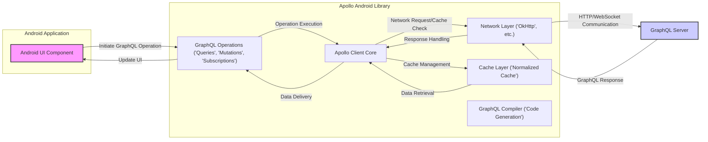
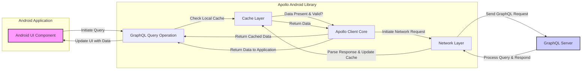
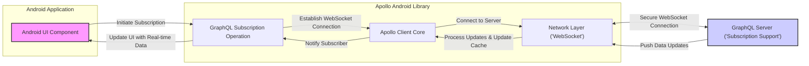

# Project Design Document: Apollo Android GraphQL Client

**Version:** 1.1
**Date:** October 26, 2023
**Author:** Gemini (AI Language Model)

## 1. Introduction

This document provides an enhanced and detailed design overview of the Apollo Android GraphQL client library, specifically tailored for threat modeling activities. It meticulously outlines the key components, architecture, data flow, and security considerations to facilitate the identification of potential vulnerabilities and attack vectors. This document serves as a crucial resource for understanding the system's structure from a security perspective.

### 1.1. Purpose

The primary purpose of this document is to provide a comprehensive architectural blueprint of the Apollo Android library to enable effective and targeted threat modeling. It aims to clearly define the system's boundaries, enumerate its constituent components, and illustrate their interactions, thereby empowering security professionals to proactively identify potential attack surfaces and vulnerabilities.

### 1.2. Scope

This document focuses on the core architecture and functionality of the Apollo Android client library, with a strong emphasis on aspects relevant to data handling, network communication security, caching mechanisms, and integration within Android applications. It provides a high-level view of the system, focusing on architectural elements rather than delving into the implementation details of individual classes or methods.

### 1.3. Target Audience

This document is primarily intended for:

* Security engineers and architects tasked with performing threat modeling and security assessments of applications utilizing the Apollo Android library.
* Developers working with the Apollo Android library who require a deeper understanding of its architecture and potential security implications.
* DevOps engineers involved in the deployment, configuration, and maintenance of applications that incorporate Apollo Android.

## 2. System Overview

The Apollo Android library is a robust, type-safe, and caching GraphQL client designed for Android and Java applications. It empowers developers to interact with GraphQL APIs in a manner that is both type-safe and highly performant. Its key features include:

* **Type-Safe GraphQL Operations:** Automatic generation of Kotlin/Java code from GraphQL schema and operation definitions, ensuring compile-time safety.
* **Normalized Caching:**  Efficient storage of GraphQL data in a normalized format, optimizing data retrieval and ensuring consistency across the application.
* **Offline Support Capabilities:** Enables applications to maintain functionality and access cached data even in the absence of network connectivity.
* **Optimistic Updates Implementation:** Allows for immediate updates to the user interface before receiving confirmation from the server, enhancing user experience.
* **File Upload Support:** Facilitates the uploading of files to GraphQL servers through well-defined mechanisms.
* **Real-time Data Handling with Subscriptions:** Supports the development of real-time features by leveraging GraphQL subscriptions for bidirectional communication.

## 3. Architectural Design

The Apollo Android library's architecture can be conceptually divided into the following key components, each playing a distinct role in the overall functionality:

* **GraphQL Compiler:**  The build-time component responsible for processing GraphQL schema and operation files to generate type-safe Kotlin/Java code.
* **Apollo Client Core:**  The central runtime component that orchestrates the execution of GraphQL operations, manages the local cache, and handles network communication.
* **Network Layer:**  The component responsible for the actual transmission of requests to and reception of responses from the GraphQL server.
* **Cache Layer:**  The component that manages the storage, retrieval, and invalidation of GraphQL data within the client application.
* **Android Integration Layer:** Provides Android-specific functionalities and integrations, tailoring the library for use within the Android ecosystem.

### 3.1. Component Descriptions

* **GraphQL Compiler:**
    * **Functionality:** Takes GraphQL schema (`.graphqls`) and operation (`.graphql`) files as input during the application's build process.
    * **Output:** Generates Kotlin/Java data classes that mirror the structure of GraphQL types defined in the schema.
    * **Output:** Generates type-safe API interfaces that developers use to execute queries, mutations, and subscriptions against the GraphQL server.
    * **Security Relevance:** The integrity of the generated code depends on the trustworthiness of the input schema files.

* **Apollo Client Core:**
    * **Functionality:** Provides the central `ApolloClient` class, which serves as the primary entry point for interacting with the GraphQL API.
    * **Responsibilities:** Manages the lifecycle and execution of GraphQL operations initiated by the application.
    * **Responsibilities:** Coordinates the interaction between the Network Layer for sending requests and the Cache Layer for data storage and retrieval.
    * **Responsibilities:** Handles error responses received from the GraphQL server and provides mechanisms for error handling.
    * **Extensibility:** Offers interceptors, allowing developers to modify requests before they are sent and responses after they are received, which can be used for logging, authentication, etc.

* **Network Layer:**
    * **Functionality:** Responsible for the physical communication with the GraphQL server over the network.
    * **Implementation:** Typically leverages a library like OkHttp to handle the complexities of HTTP and WebSocket communication.
    * **Responsibilities:** Constructs HTTP requests, including setting headers and the request body containing the GraphQL operation.
    * **Responsibilities:** Parses the JSON response received from the server.
    * **Security Relevance:** This layer is crucial for ensuring secure communication (HTTPS) and handling authentication credentials securely.

* **Cache Layer:**
    * **Functionality:** Implements a normalized cache to efficiently store and manage GraphQL data locally.
    * **Normalization:** Uses a unique identifier for each object within the GraphQL graph, enabling efficient data retrieval and consistency.
    * **Retrieval:** Allows for quick retrieval of data based on object IDs and the specific fields requested.
    * **Policies:** Supports various cache policies (e.g., `cache-first`, `network-only`, `cache-and-network`) to control data fetching behavior.
    * **Storage:** Can be configured to use different storage implementations, including in-memory storage or persistent storage like SQLite.
    * **Security Relevance:** The security of the cached data is paramount, especially if it contains sensitive information.

* **Android Integration Layer:**
    * **Functionality:** Provides specific extensions and utilities tailored for Android application development.
    * **Integration:** Offers seamless integration with Android lifecycle components, such as coroutines for asynchronous operations.
    * **Features:** Includes features like background operation execution to avoid blocking the main UI thread and mechanisms for updating the UI with data from GraphQL responses.

## 4. Data Flow

The following sections detail the typical data flow for different types of GraphQL operations, highlighting key interactions between components.

### 4.1. Query Execution

1. The Android UI component initiates a GraphQL query.
2. The generated query API is invoked, passing the request to the `ApolloClient`.
3. The `ApolloClient` consults the Cache Layer to check for existing, valid data based on the query and configured cache policy.
4. If suitable data is found in the cache, it is returned directly to the application, bypassing the network request.
5. If data is not found or the cache policy dictates a network request, the `ApolloClient` interacts with the Network Layer.
6. The Network Layer constructs and sends an HTTP request containing the GraphQL query to the GraphQL Server.
7. The GraphQL Server processes the query and returns a response containing the requested data.
8. The Network Layer receives the response and passes it back to the `ApolloClient`.
9. The `ApolloClient` parses the response and updates the Cache Layer with the new data, according to the cache policy.
10. The `ApolloClient` returns the fetched data to the UI component.

### 4.2. Mutation Execution

The data flow for mutations closely resembles that of queries, with the key difference being the potential invalidation of cached data related to the mutated entities to maintain data consistency.

### 4.3. Subscription Execution

1. The Android UI component initiates a GraphQL subscription to receive real-time data updates.
2. The generated subscription API is invoked, passing the request to the `ApolloClient`.
3. The `ApolloClient` instructs the Network Layer to establish a persistent connection (typically using WebSockets) with the GraphQL Server.
4. A secure WebSocket connection is established between the client and the server.
5. The GraphQL Server pushes data updates to the client over the established WebSocket connection whenever relevant data changes.
6. The Network Layer receives these updates and forwards them to the `ApolloClient`.
7. The `ApolloClient` processes the received updates, potentially updating the Cache Layer based on the nature of the update.
8. The `ApolloClient` notifies the subscriber (the UI component) with the new data.
9. The UI component updates itself to reflect the real-time data changes.

## 5. Security Considerations for Threat Modeling

This section details potential security considerations, categorized by the component or interaction they affect, to facilitate a structured threat modeling process.

### 5.1. Network Communication Threats

* **Man-in-the-Middle (MITM) Attacks:**
    * **Description:** Attackers intercept communication between the client and server to eavesdrop or manipulate data.
    * **Mitigation:** Enforce HTTPS for all communication. Implement certificate pinning for enhanced security.
* **Insecure HTTP Configuration:**
    * **Description:** Weak TLS/SSL configurations can be exploited by attackers.
    * **Mitigation:** Ensure strong TLS versions and cipher suites are used. Regularly update TLS libraries.
* **Data Interception:**
    * **Description:** Sensitive data transmitted over the network can be intercepted if not properly encrypted.
    * **Mitigation:** Utilize HTTPS. Avoid transmitting highly sensitive data in query parameters.

### 5.2. GraphQL Server Interaction Threats

* **GraphQL Injection Attacks:**
    * **Description:** Maliciously crafted GraphQL queries or mutations can exploit vulnerabilities in the server-side implementation.
    * **Mitigation:** The Apollo Android library relies on the server to sanitize inputs and prevent injection attacks. Server-side validation and security measures are crucial.
* **Authorization and Authentication Issues:**
    * **Description:** Improperly implemented authentication and authorization can allow unauthorized access to data or actions.
    * **Mitigation:** Implement robust authentication mechanisms (e.g., OAuth 2.0, JWT). Enforce granular authorization rules on the server. Securely manage and transmit authentication tokens.
* **Denial-of-Service (DoS) Attacks:**
    * **Description:** Attackers can overwhelm the server with excessive requests.
    * **Mitigation:** The Apollo Android library itself doesn't directly prevent server-side DoS. Server-side rate limiting and other DoS prevention mechanisms are necessary.

### 5.3. Client-Side Security Threats

* **Insecure Data Storage (Cache):**
    * **Description:** Sensitive data stored in the cache can be compromised if the device is compromised.
    * **Mitigation:** Encrypt sensitive data at rest in the cache, especially for persistent storage. Consider using Android's security features for secure storage.
* **Insecure Data Handling:**
    * **Description:** Improper handling of sensitive data within the application can lead to leaks.
    * **Mitigation:** Follow secure coding practices. Avoid logging sensitive data. Implement proper data masking and sanitization where necessary.
* **Reverse Engineering and Code Tampering:**
    * **Description:** Attackers can reverse engineer the application to understand its logic and potentially tamper with it.
    * **Mitigation:** While complete prevention is difficult, code obfuscation and other anti-tampering techniques can raise the bar for attackers. Avoid storing sensitive secrets directly in the client-side code.
* **Dependency Vulnerabilities:**
    * **Description:** Vulnerabilities in the Apollo Android library or its dependencies can be exploited.
    * **Mitigation:** Keep the Apollo Android library and all its dependencies up-to-date with the latest security patches. Regularly scan dependencies for known vulnerabilities.
* **Local Data Manipulation:**
    * **Description:** If the cache storage is not adequately protected, attackers with physical access to the device could potentially manipulate cached data.
    * **Mitigation:** Employ secure storage mechanisms provided by the Android platform.

### 5.4. Subscription Security Threats

* **Insecure WebSocket Connection:**
    * **Description:** If the WebSocket connection for subscriptions is not secured, it can be vulnerable to eavesdropping and manipulation.
    * **Mitigation:** Always use WSS (WebSocket Secure) for subscription connections.
* **Authorization for Subscriptions:**
    * **Description:** Lack of proper authorization checks for subscription requests can allow unauthorized access to real-time data streams.
    * **Mitigation:** Implement robust authorization mechanisms on the server to verify the user's right to subscribe to specific data streams.

### 5.5. Code Generation Threats

* **Malicious Schema Injection:**
    * **Description:** If the GraphQL schema source is compromised, malicious code could be injected through schema extensions or definitions, potentially leading to vulnerabilities in the generated code.
    * **Mitigation:** Ensure the integrity and trustworthiness of the GraphQL schema source. Implement controls to prevent unauthorized modifications to the schema.

## 6. Technologies Used

* **Kotlin/Java:** The primary programming languages used for Android application development and for the Apollo Android library itself.
* **GraphQL:** The query language for APIs that Apollo Android facilitates interaction with.
* **OkHttp:** A widely used and efficient HTTP client for Android and Java, often used by the Apollo Android library for network communication.
* **Kotlin Coroutines:** A library for asynchronous programming in Kotlin, commonly used within Android applications and by Apollo Android for handling asynchronous operations.
* **SQLite (Optional):** A lightweight, embedded database that can be used for persistent caching of GraphQL data by the Apollo Android library.
* **WebSocket (Optional):** A communication protocol that provides full-duplex communication channels over a single TCP connection, used for implementing GraphQL subscriptions.

## 7. Future Considerations

* **Enhanced Cache Security Mechanisms:** Explore and implement more advanced techniques for encrypting cached data at rest and in memory.
* **Client-Side Rate Limiting Capabilities:** Consider implementing client-side rate limiting to prevent accidental or malicious overloading of the GraphQL server.
* **Integration with Android Security Libraries:** Investigate potential integrations with established Android security libraries to enhance the security posture of applications using Apollo Android.
* **Support for Hardware-Backed Keystore for Secrets:** Explore options for leveraging Android's hardware-backed keystore for securely managing sensitive secrets used for authentication.

This document provides an enhanced architectural overview of the Apollo Android library, specifically designed to support thorough threat modeling activities. It is crucial to remember that a comprehensive security assessment requires further analysis considering specific application use cases and the overall system architecture.