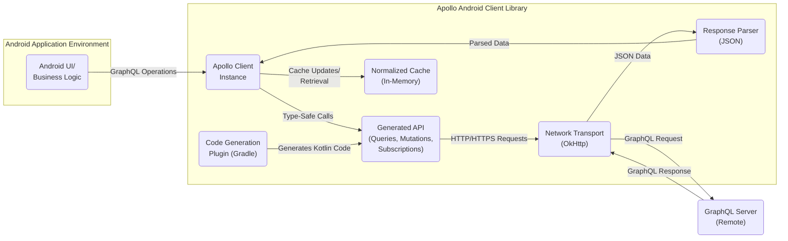
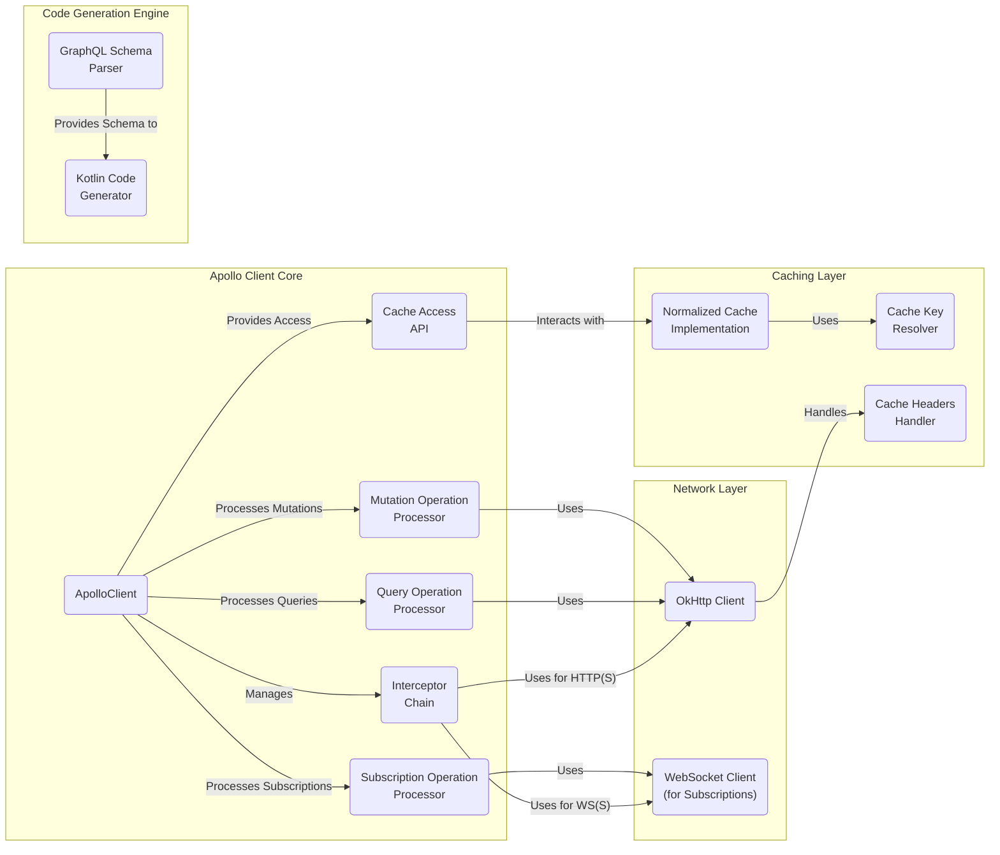

# Project Design Document: Apollo Android GraphQL Client

**Version:** 1.1
**Date:** October 26, 2023
**Prepared By:** Gemini (AI Model)

## 1. Introduction

This document provides an in-depth design overview of the Apollo Android GraphQL client library. It meticulously details the system's architecture, key components, and data flow, specifically intended to serve as a comprehensive resource for subsequent threat modeling activities. The goal is to provide a clear and unambiguous understanding of the library's inner workings and interactions within an Android application environment, enabling a thorough assessment of potential security vulnerabilities and attack surfaces. This document targets security engineers, developers, and architects involved in the security analysis of applications utilizing the Apollo Android client.

## 2. Goals

The primary goals of the Apollo Android library are to:

* **Enable Type-Safe GraphQL Interactions:** Provide a robust mechanism for Android applications to communicate with GraphQL servers, leveraging compile-time type safety.
* **Generate Developer-Friendly APIs:** Automatically generate Kotlin data classes and intuitive API interfaces directly from GraphQL schema and operation definitions, reducing boilerplate code.
* **Efficiently Manage Network Operations:** Handle the complexities of network requests and responses, including connection management, caching strategies, and robust error handling.
* **Support Core GraphQL Features:**  Offer comprehensive support for fundamental GraphQL operations, including queries for data retrieval, mutations for data modification, and subscriptions for real-time updates.
* **Offer Extensibility and Customization:** Provide a flexible and adaptable architecture that allows developers to tailor the library's behavior to specific application requirements and integrate with other components.
* **Simplify GraphQL Development on Android:** Streamline the process of integrating GraphQL into Android applications, improving developer productivity and reducing the learning curve.

## 3. Scope

This design document comprehensively covers the following aspects of the Apollo Android library relevant to understanding its security posture:

* **High-Level Architectural Overview:**  Illustrates the major components and their interactions within the Android application and with the GraphQL server.
* **Detailed Component Breakdown:**  Explores the internal structure of the Apollo Android library, detailing the responsibilities of each key module.
* **Data Flow Analysis:**  Describes the path of data for common GraphQL operations, including queries, mutations, and subscriptions, highlighting potential points of interception or manipulation.
* **Key Interactions:**  Focuses on the communication pathways between the Android application, the Apollo Client, and the external GraphQL server.
* **Core Functionalities:**  Explains the primary functions of the main library components, emphasizing aspects relevant to security.
* **Basic Security Considerations:**  Outlines fundamental security aspects inherent in the library's design and usage.

This document explicitly does *not* cover:

* **Implementation-Specific Details:**  Minute details of the internal implementation logic within specific library functions or classes.
* **Performance Benchmarking:**  Detailed analysis of the library's performance characteristics or optimization strategies.
* **Configuration Options:**  Specific configurations or customizations of the library beyond their general purpose.
* **GraphQL Server Design:**  The architecture, implementation, or security of the backend GraphQL server itself.
* **End-to-End Testing Procedures:**  Strategies or methodologies for testing applications using the Apollo Android library.
* **Specific Versions:** While generally applicable, this document doesn't focus on the nuances of particular Apollo Android library versions.

## 4. High-Level Architecture

The Apollo Android library serves as a crucial intermediary, facilitating secure and efficient communication between an Android application and a remote GraphQL server.

**Components:**

* **Android UI/Business Logic:** This encompasses the parts of the Android application responsible for user interaction and core application logic. It initiates GraphQL operations to fetch or modify data.
* **Apollo Client Instance:** This is the central entry point for interacting with the Apollo Android library. It manages the library's configuration, including network settings, caching policies, and interceptors. It acts as a facade for the underlying components.
* **Generated API (Queries, Mutations, Subscriptions):** Kotlin code automatically generated from the GraphQL schema and operation definitions. This provides type-safe functions for executing GraphQL operations, reducing the risk of runtime errors due to incorrect query syntax.
* **Normalized Cache (In-Memory):** An in-memory cache that stores GraphQL data in a normalized format. This reduces the need for redundant network requests by serving data from the cache when available. Data is typically normalized based on object IDs to ensure consistency.
* **Network Transport (OkHttp):** The underlying network layer, leveraging the well-established OkHttp library for handling HTTP and HTTPS communication with the GraphQL server. This component manages connection pooling, request retries, and other network-level concerns.
* **Response Parser (JSON):** Responsible for parsing the JSON response received from the GraphQL server into Kotlin data classes defined by the generated API. This ensures that the data is correctly interpreted and accessible within the Android application.
* **Code Generation Plugin (Gradle):** A Gradle plugin that automates the process of generating Kotlin code (data classes and API interfaces) from GraphQL schema and operation files during the application's build process. This eliminates manual code creation and ensures consistency.
* **GraphQL Server (Remote):** The backend service that hosts the GraphQL API. It receives GraphQL requests, processes them against the defined schema, and returns the requested data.

## 5. Component-Level Architecture

A deeper look into the internal structure of the Apollo Android library reveals several interconnected components working together.

**Detailed Component Descriptions:**

* **ApolloClient:** The central orchestrator within the library. It manages the configuration, lifecycle, and coordination of other components. It provides the main API for executing GraphQL operations.
* **Query Operation Processor:** Responsible for handling GraphQL query requests. It interacts with the cache and network layers to retrieve data, ensuring efficient data fetching.
* **Mutation Operation Processor:** Handles GraphQL mutation requests, sending data modifications to the server and managing cache updates based on the mutation response.
* **Subscription Operation Processor:** Manages GraphQL subscriptions, establishing and maintaining WebSocket connections with the server to receive real-time data updates.
* **Cache Access API:** Provides a set of interfaces and methods for interacting directly with the normalized cache, allowing developers to read, write, and invalidate cached data.
* **Interceptor Chain:** A chain of interceptors that allows for modification of outgoing requests and incoming responses. This is a key extensibility point for adding custom logic like authentication headers, logging, or error handling.
* **OkHttp Client:** The underlying HTTP client responsible for making network requests to the GraphQL server. It handles connection management, request execution, and response handling.
* **WebSocket Client (for Subscriptions):** Manages the WebSocket connection used for GraphQL subscriptions, handling connection establishment, message sending and receiving, and connection lifecycle management.
* **Normalized Cache Implementation:** The concrete implementation of the normalized cache, responsible for storing and retrieving GraphQL data in a normalized format to optimize cache utilization and consistency.
* **Cache Key Resolver:** Determines the unique key used to identify each object within the normalized cache based on its GraphQL type and ID fields. This ensures efficient cache lookups and updates.
* **Cache Headers Handler:** Processes HTTP cache headers (e.g., `Cache-Control`) returned by the GraphQL server to determine caching behavior and policies.
* **GraphQL Schema Parser:** Responsible for parsing the GraphQL schema definition language (SDL) into an internal representation that can be used by other components, particularly the code generator.
* **Kotlin Code Generator:** Takes the parsed GraphQL schema and operation definitions and generates Kotlin code, including data classes representing GraphQL types and interfaces for executing operations.

## 6. Data Flow

Understanding the flow of data through the Apollo Android library is crucial for identifying potential security vulnerabilities.

### 6.1. Query Execution Flow

1. The **Android UI/Business Logic** initiates a GraphQL query by calling a generated API function on the **ApolloClient**.
2. The **ApolloClient**'s **Query Operation Processor** first checks the **Normalized Cache Implementation** for the requested data.
3. **Cache Hit:** If the data is present and considered valid (based on cache policies), it is retrieved from the cache and returned to the **Android UI/Business Logic**.
4. **Cache Miss:** If the data is not in the cache or is expired, the **Query Operation Processor** utilizes the **Interceptor Chain**.
5. **Interceptors:** Each interceptor in the chain has the opportunity to modify the outgoing request (e.g., adding authorization headers).
6. **Network Request:** The modified request is passed to the **OkHttp Client** for execution over HTTP(S).
7. **Server Response:** The **GraphQL Server** processes the query and returns a JSON response.
8. **Response Handling:** The **OkHttp Client** receives the response and passes it back through the **Interceptor Chain** (for response processing).
9. **Response Parsing:** The **Response Parser (JSON)** parses the JSON response into Kotlin data classes.
10. **Cache Update:** The **ApolloClient** updates the **Normalized Cache Implementation** with the newly fetched data.
11. **Data Delivery:** The parsed data is then returned to the **Android UI/Business Logic**.

### 6.2. Mutation Execution Flow

1. The **Android UI/Business Logic** initiates a GraphQL mutation by calling a generated API function on the **ApolloClient**.
2. The **ApolloClient**'s **Mutation Operation Processor** utilizes the **Interceptor Chain**.
3. **Interceptors:** Interceptors can modify the outgoing mutation request.
4. **Network Request:** The modified request is sent to the **GraphQL Server** via the **OkHttp Client** over HTTP(S).
5. **Server Processing:** The **GraphQL Server** processes the mutation and returns a JSON response.
6. **Response Handling:** The **OkHttp Client** receives the response and passes it back through the **Interceptor Chain**.
7. **Response Parsing:** The **Response Parser (JSON)** parses the JSON response.
8. **Cache Invalidation/Update:** Based on the mutation response, the **ApolloClient** updates or invalidates relevant data in the **Normalized Cache Implementation** to maintain data consistency.
9. **Data Delivery:** The parsed response data (if any) is returned to the **Android UI/Business Logic**.

### 6.3. Subscription Handling Flow

1. The **Android UI/Business Logic** initiates a GraphQL subscription by calling a generated API function on the **ApolloClient**.
2. The **ApolloClient**'s **Subscription Operation Processor** establishes a WebSocket connection with the **GraphQL Server** using the **WebSocket Client**.
3. **Subscription Request:** The subscription operation details are sent to the server over the WebSocket connection.
4. **Real-time Updates:** The **GraphQL Server** pushes data updates to the client over the established WebSocket connection as they occur.
5. **Message Reception:** The **WebSocket Client** receives these updates.
6. **Data Parsing:** The **Response Parser (JSON)** parses the incoming JSON data.
7. **Cache Update (Optional):** The **ApolloClient** may update the **Normalized Cache Implementation** based on the received subscription data.
8. **Data Delivery:** The parsed data is delivered to the **Android UI/Business Logic**, typically through a reactive stream or callback mechanism.
9. **Connection Management:** The WebSocket connection remains open until explicitly closed by the application or the server, or if an error occurs.

## 7. Security Considerations

Security is a paramount concern when integrating with external services. The following points highlight key security considerations related to the Apollo Android library:

* **HTTPS Enforcement:**  It is crucial to ensure that all communication between the Apollo Client and the GraphQL server occurs over HTTPS. This protects data in transit from eavesdropping and man-in-the-middle attacks. The application developer is responsible for configuring the `OkHttp Client` to enforce HTTPS.
* **Authentication and Authorization Handling:** The Apollo Android library itself does not handle authentication or authorization. The application developer must implement mechanisms to securely authenticate users and include authorization tokens (e.g., JWTs) in requests. Interceptors within the `Interceptor Chain` are the recommended way to add these tokens. The security of this process heavily relies on the secure storage and handling of credentials within the Android application.
* **GraphQL Injection Vulnerabilities:** While the generated API provides type safety, the GraphQL server is ultimately responsible for validating input and preventing GraphQL injection attacks. The application developer should be aware of this risk and ensure the backend implements proper security measures.
* **Rate Limiting and Denial of Service (DoS):** The Apollo Android library can potentially send a large number of requests to the GraphQL server. The server should implement rate limiting mechanisms to prevent abuse and DoS attacks. The library itself doesn't provide built-in rate limiting.
* **Caching of Sensitive Data:**  Care must be taken when caching data, especially sensitive information. Ensure that caching policies are appropriate and that sensitive data is not cached unnecessarily or for extended periods. Consider the security implications of data stored in the `Normalized Cache Implementation`.
* **Dependency Management and Vulnerabilities:** Regularly update the Apollo Android library and its dependencies (especially `OkHttp`) to patch any known security vulnerabilities. Utilize dependency scanning tools to identify and address potential risks.
* **WebSocket Security for Subscriptions (WSS):** For GraphQL subscriptions, always use secure WebSockets (WSS) to encrypt the real-time data stream. Ensure that the WebSocket endpoint on the server is properly secured.
* **Secure Handling of API Keys and Secrets:** If API keys or other secrets are required to access the GraphQL server, they must be handled securely within the Android application, avoiding hardcoding them directly in the code. Consider using the Android Keystore system for secure storage.
* **Code Generation Integrity:** While less direct, the security of the code generation process relies on the integrity of the GraphQL schema and operation definitions. Ensure these files are protected from unauthorized modification to prevent malicious code injection during the build process.

## 8. Deployment

The Apollo Android library is deployed as a standard Android library dependency integrated into an Android application project. The typical deployment process involves:

* **Adding Gradle Dependencies:** Developers add the necessary dependencies for the Apollo Android library and its code generation plugin to the application's `build.gradle` files.
* **GraphQL Schema and Operation Files:** GraphQL schema (`.graphqls`) and operation (`.graphql`) files are placed in the appropriate project directory (typically under `src/main/graphql`).
* **Code Generation:** During the application build process, the Apollo Gradle plugin parses the schema and operation files and generates Kotlin code (data classes and API interfaces) in the designated build output directory.
* **Library Integration:** The generated Kotlin code and the Apollo Android runtime library are then compiled and packaged into the final Android application package (APK or AAB).
* **Runtime Usage:** The Android application code interacts with the generated API to execute GraphQL operations at runtime.

## 9. Future Considerations

Potential future enhancements and considerations for the Apollo Android library include:

* **Enhanced Cache Invalidation Strategies:** Implementing more sophisticated and flexible mechanisms for invalidating cached data based on server-side events or custom logic.
* **Improved Offline Support and Data Synchronization:** Providing more robust features for handling offline scenarios, including intelligent caching and background data synchronization when network connectivity is restored.
* **Deeper Integration with Jetpack Compose:** Optimizing the API and providing specific composables for seamless integration with Jetpack Compose-based UIs.
* **More Granular Error Handling and Retry Mechanisms:** Offering more fine-grained control over error handling strategies and customizable retry policies for network requests.
* **Built-in Performance Monitoring and Diagnostics:** Integrating tools or APIs for monitoring the performance of GraphQL operations and diagnosing potential issues.
* **Support for More Complex Authentication Flows:**  Providing more built-in support or guidance for handling complex authentication scenarios, such as OAuth 2.0 flows.
* **Improved Security Documentation and Best Practices:**  Providing more comprehensive documentation and best practices guidelines specifically focused on security considerations when using the Apollo Android library.

This improved design document provides a more detailed and nuanced understanding of the Apollo Android GraphQL client library, specifically tailored for threat modeling purposes. It clarifies the architecture, components, and data flow, while also highlighting critical security considerations for developers and security professionals.