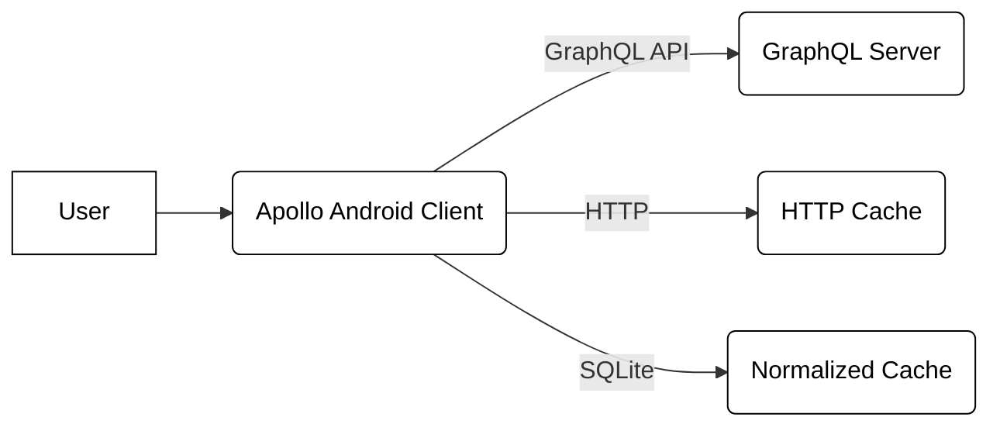
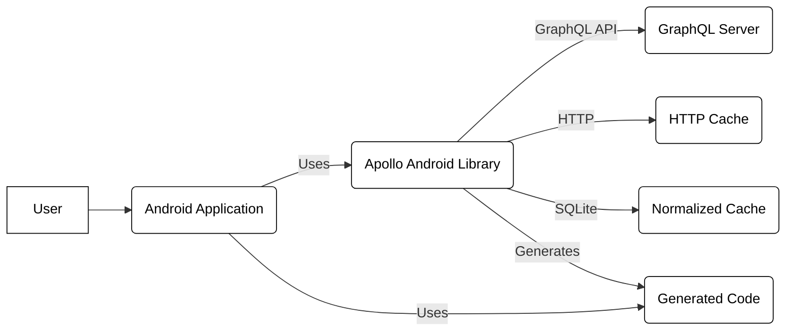
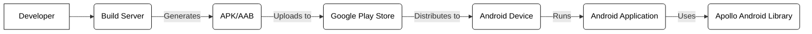
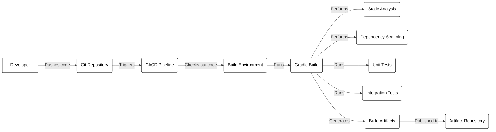

# BUSINESS POSTURE

Business Priorities and Goals:

*   Provide a type-safe, caching GraphQL client for Android applications.
*   Simplify the integration of GraphQL APIs into Android applications.
*   Improve developer productivity by generating code from GraphQL queries.
*   Offer a performant and efficient solution for data fetching and caching.
*   Maintain a robust and well-documented open-source project.
*   Foster a community around the project and encourage contributions.
*   Ensure compatibility with various Android versions and devices.

Business Risks:

*   Data breaches due to vulnerabilities in the client or generated code.
*   Performance issues impacting application responsiveness.
*   Compatibility problems with different GraphQL servers or Android environments.
*   Lack of adoption due to complexity or poor documentation.
*   Security vulnerabilities introduced by dependencies.
*   Inability to keep up with changes in the GraphQL specification or Android platform.
*   Reputational damage due to security incidents or project abandonment.

# SECURITY POSTURE

Existing Security Controls:

*   security control: Code generation: The library generates type-safe Kotlin code from GraphQL queries, reducing the risk of manual errors and injection vulnerabilities. (Described in project documentation and implemented in the code generation module).
*   security control: Dependency management: The project uses Gradle for dependency management, allowing for tracking and updating of dependencies. (Described in build.gradle.kts files).
*   security control: Testing: The project includes unit and integration tests to ensure code quality and identify potential issues. (Described in project documentation and implemented in the test suites).
*   security control: Community engagement: The project has an active community on GitHub, which helps identify and address security concerns. (Visible on the GitHub repository).
*   security control: Static analysis: GitHub Actions workflows are used to perform static analysis checks. (Described in .github/workflows).

Accepted Risks:

*   accepted risk: Reliance on third-party libraries: The project depends on external libraries, which may introduce vulnerabilities.
*   accepted risk: Limited control over GraphQL server security: The client's security depends on the security of the GraphQL server it interacts with.

Recommended Security Controls:

*   security control: Implement regular security audits and penetration testing.
*   security control: Integrate a Software Composition Analysis (SCA) tool to identify and manage vulnerabilities in dependencies.
*   security control: Enable and enforce code signing for releases.
*   security control: Provide security guidelines and best practices for developers using the library.
*   security control: Establish a vulnerability disclosure program.

Security Requirements:

*   Authentication:
    *   The library should support various authentication mechanisms commonly used with GraphQL, such as API keys, OAuth 2.0, and custom authentication headers.
    *   Sensitive authentication data (e.g., tokens, credentials) should be securely stored and handled, leveraging Android's secure storage mechanisms where appropriate.
*   Authorization:
    *   The library should facilitate the implementation of authorization logic based on the responses received from the GraphQL server.
    *   It should be possible to integrate with existing authorization frameworks or libraries.
*   Input Validation:
    *   The library should validate user inputs used in GraphQL queries to prevent injection attacks.
    *   Generated code should include appropriate input validation based on the GraphQL schema.
*   Cryptography:
    *   HTTPS should be used for all communication with GraphQL servers.
    *   If caching sensitive data, the library should use appropriate encryption mechanisms provided by the Android platform.

# DESIGN

## C4 CONTEXT

Element List:

*   Element:
    *   Name: User
    *   Type: Person
    *   Description: A user of an Android application that uses Apollo Android.
    *   Responsibilities: Interacts with the Android application.
    *   Security controls: None (handled by the Android application).

*   Element:
    *   Name: Apollo Android Client
    *   Type: Software System
    *   Description: A type-safe, caching GraphQL client for Android.
    *   Responsibilities:
        *   Generates code from GraphQL queries.
        *   Fetches data from GraphQL servers.
        *   Caches data locally.
        *   Provides a type-safe API for accessing data.
    *   Security controls:
        *   Code generation for type safety.
        *   Input validation (through generated code).
        *   HTTPS for communication with GraphQL servers.

*   Element:
    *   Name: GraphQL Server
    *   Type: Software System
    *   Description: A server that implements a GraphQL API.
    *   Responsibilities:
        *   Processes GraphQL queries.
        *   Returns data to the Apollo Android Client.
    *   Security controls: (Not managed by Apollo Android, but assumed to be in place)
        *   Authentication and authorization.
        *   Input validation.
        *   Rate limiting.
        *   Protection against common web vulnerabilities.

*   Element:
    *   Name: HTTP Cache
    *   Type: Software System
    *   Description: Standard HTTP cache.
    *   Responsibilities:
        *   Caches HTTP responses based on cache headers.
    *   Security controls:
        *   Respects cache control headers.

*   Element:
    *   Name: Normalized Cache
    *   Type: Software System
    *   Description: Apollo specific cache.
    *   Responsibilities:
        *   Caches normalized GraphQL responses.
    *   Security controls:
        *   Data encryption at rest (if configured).

## C4 CONTAINER

Element List:

*   Element:
    *   Name: User
    *   Type: Person
    *   Description: A user of an Android application that uses Apollo Android.
    *   Responsibilities: Interacts with the Android application.
    *   Security controls: None (handled by the Android application).

*   Element:
    *   Name: Android Application
    *   Type: Container: Mobile App
    *   Description: An Android application that uses the Apollo Android library.
    *   Responsibilities:
        *   Provides the user interface.
        *   Handles user interactions.
        *   Uses the Apollo Android library to fetch and display data.
    *   Security controls:
        *   Standard Android security best practices.
        *   Secure storage of sensitive data.

*   Element:
    *   Name: Apollo Android Library
    *   Type: Container: Library
    *   Description: The core Apollo Android library.
    *   Responsibilities:
        *   Provides the API for interacting with GraphQL servers.
        *   Manages the HTTP client and caching.
        *   Handles code generation.
    *   Security controls:
        *   HTTPS for communication with GraphQL servers.

*   Element:
    *   Name: GraphQL Server
    *   Type: Container: Web Server
    *   Description: A server that implements a GraphQL API.
    *   Responsibilities:
        *   Processes GraphQL queries.
        *   Returns data to the Apollo Android Client.
    *   Security controls: (Not managed by Apollo Android, but assumed to be in place)
        *   Authentication and authorization.
        *   Input validation.
        *   Rate limiting.
        *   Protection against common web vulnerabilities.

*   Element:
    *   Name: HTTP Cache
    *   Type: Container: Cache
    *   Description: Standard HTTP cache.
    *   Responsibilities:
        *   Caches HTTP responses based on cache headers.
    *   Security controls:
        *   Respects cache control headers.

*   Element:
    *   Name: Normalized Cache
    *   Type: Container: Cache
    *   Description: Apollo specific cache.
    *   Responsibilities:
        *   Caches normalized GraphQL responses.
    *   Security controls:
        *   Data encryption at rest (if configured).

*   Element:
    *   Name: Generated Code
    *   Type: Container: Code
    *   Description: Kotlin code generated from GraphQL queries.
    *   Responsibilities:
        *   Provides type-safe access to GraphQL data.
        *   Includes input validation logic.
    *   Security controls:
        *   Type safety.
        *   Input validation (based on GraphQL schema).

## DEPLOYMENT

Possible Deployment Solutions:

1.  Standard Android Application Deployment: The Android application using the Apollo Android library is packaged as an APK or AAB and distributed through the Google Play Store or other distribution channels.
2.  Custom Deployment: The application might be deployed through a Mobile Device Management (MDM) solution or sideloaded onto devices.

Chosen Solution (Standard Android Application Deployment):

Element List:

*   Element:
    *   Name: Developer
    *   Type: Person
    *   Description: A developer working on the Android application.
    *   Responsibilities: Writes code, builds the application.
    *   Security controls: None (handled by development environment).

*   Element:
    *   Name: Build Server
    *   Type: Infrastructure Node
    *   Description: A server that builds the Android application (e.g., Jenkins, GitHub Actions).
    *   Responsibilities: Compiles code, runs tests, packages the application.
    *   Security controls:
        *   Access controls.
        *   Secure build environment.

*   Element:
    *   Name: APK/AAB
    *   Type: Artifact
    *   Description: The Android application package.
    *   Responsibilities: Contains the application code and resources.
    *   Security controls:
        *   Code signing.

*   Element:
    *   Name: Google Play Store
    *   Type: Platform
    *   Description: Google's official app distribution platform.
    *   Responsibilities: Distributes the application to users.
    *   Security controls:
        *   App review process.
        *   Security scanning.

*   Element:
    *   Name: Android Device
    *   Type: Device
    *   Description: A user's Android device.
    *   Responsibilities: Runs the Android application.
    *   Security controls:
        *   Android operating system security features.

*   Element:
    *   Name: Android Application
    *   Type: Container
    *   Description: The running instance of the Android application.
    *   Responsibilities: Provides the user interface, interacts with the user, uses the Apollo Android library.
    *   Security controls:
        *   Standard Android security best practices.

*   Element:
    *   Name: Apollo Android Library
    *   Type: Container
    *   Description: The Apollo Android library running within the application.
    *   Responsibilities: Handles GraphQL communication and caching.
    *   Security controls:
        *   HTTPS for communication with GraphQL servers.

## BUILD

Build Process Description:

1.  Developer pushes code changes to the Git repository (GitHub).
2.  The push triggers the CI/CD pipeline (GitHub Actions).
3.  The pipeline checks out the code into a build environment.
4.  Gradle build is executed.
5.  Static analysis tools (e.g., linters, code style checkers) are run.
6.  Dependency scanning (e.g., using a Software Composition Analysis tool) is performed to identify vulnerabilities in dependencies.
7.  Unit tests are executed.
8.  Integration tests are executed.
9.  Build artifacts (e.g., library JAR files, documentation) are generated.
10. Build artifacts are published to an artifact repository (e.g., Maven Central, a private repository).

Security Controls:

*   security control: Static Analysis: Performed during the build process to identify potential code quality and security issues.
*   security control: Dependency Scanning: Performed to identify and manage vulnerabilities in dependencies.
*   security control: Automated Testing: Unit and integration tests are run to ensure code quality and prevent regressions.
*   security control: Secure Build Environment: The CI/CD pipeline runs in a controlled and secure environment.
*   security control: Code Signing: Build artifacts (releases) should be signed to ensure their integrity.

# RISK ASSESSMENT

Critical Business Processes:

*   Providing a reliable and efficient GraphQL client for Android applications.
*   Maintaining the security and integrity of the library and its generated code.
*   Ensuring the privacy and security of user data handled by applications using the library.

Data Sensitivity:

*   The Apollo Android library itself does not directly handle sensitive user data. However, it facilitates the communication with GraphQL servers, which may handle various types of data, including:
    *   Personally Identifiable Information (PII)
    *   Financial data
    *   Health data
    *   Authentication credentials (indirectly, through authentication mechanisms)
*   The sensitivity of the data depends on the specific GraphQL API and the application using the Apollo Android library.

# QUESTIONS & ASSUMPTIONS

Questions:

*   What specific authentication mechanisms are used by the GraphQL servers that will be accessed using this library?
*   Are there any specific regulatory requirements (e.g., GDPR, HIPAA) that apply to the data handled by applications using this library?
*   What is the expected volume of data and request frequency? This can impact caching strategies and performance considerations.
*   What level of support is required for older Android versions?
*   What are the specific security requirements of the artifact repository?

Assumptions:

*   BUSINESS POSTURE: The primary goal is to provide a secure and efficient GraphQL client, prioritizing security and developer experience.
*   SECURITY POSTURE: The GraphQL servers that the library interacts with are assumed to have appropriate security measures in place.
*   DESIGN: The library will primarily be used in Android applications distributed through the Google Play Store. The build process will utilize GitHub Actions.