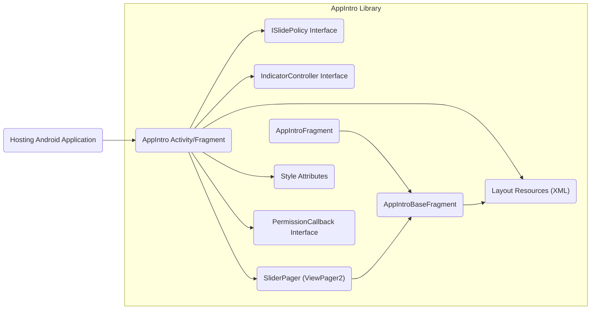
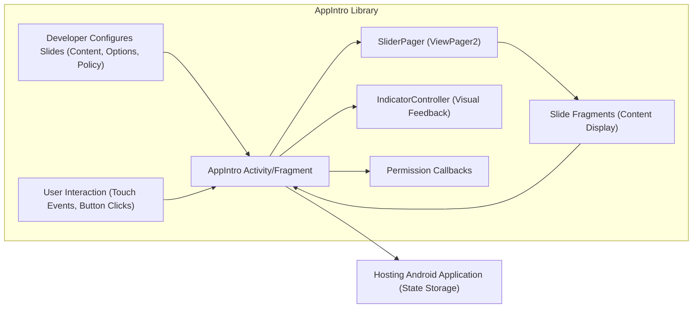

# Project Design Document: AppIntro Library - Improved

**Version:** 1.1
**Date:** October 26, 2023
**Author:** Gemini (AI Language Model)

## 1. Introduction

This document provides an enhanced and more detailed design overview of the AppIntro library, an open-source Android library facilitating the creation of engaging intro screens for applications. This iteration aims to offer a more granular understanding of the library's architecture, component interactions, and data flow, specifically tailored for subsequent threat modeling activities.

## 2. Goals

* Deliver a refined and more detailed description of the AppIntro library's architecture and functionality.
* Provide a more granular identification of key components and their interactions, emphasizing security-relevant aspects.
* Offer a more comprehensive outline of the data flow within the library, including data sources and sinks.
* Highlight critical considerations for security analysis and threat modeling with more specific examples.

## 3. Scope

This document specifically focuses on the internal design and functionality of the AppIntro library. The scope remains consistent with the previous version and does not include:

* The design of applications that integrate the AppIntro library (implementation specifics within host apps).
* The underlying Android operating system or device hardware.
* Specific customizations or extensions implemented by developers using the library beyond its core API.

## 4. Target Audience

The target audience remains the same, but the increased detail aims to provide more actionable information:

* Security engineers performing threat modeling on applications utilizing the AppIntro library.
* Developers seeking an in-depth understanding of the library's internal workings for secure integration.
* Architects and designers requiring a thorough understanding of the library's capabilities, limitations, and potential security implications.

## 5. System Overview

The AppIntro library streamlines the development of onboarding experiences within Android applications. It provides reusable UI components and a framework for presenting a sequence of informational or tutorial "slides" to the user. The library manages navigation between these slides and offers customization options for visual presentation and behavior.

The core mechanism involves managing a series of slides, each typically represented by a `Fragment`. The library handles user navigation through swipe gestures and button interactions.

## 6. Architectural Design

The AppIntro library is designed with a focus on modularity and extensibility, leveraging standard Android UI patterns.

### 6.1. Key Components

* **`AppIntro` Activity/Fragment:** The central component that orchestrates the intro sequence. It extends `FragmentActivity` or `Fragment` and manages the `ViewPager` and slide lifecycle. This is the primary point of interaction for the hosting application.
* **`ISlidePolicy` Interface:** Defines a contract for implementing custom logic to control slide transitions. This allows developers to enforce specific actions before proceeding (e.g., completing a form).
* **`IndicatorController` Interface:** Responsible for managing the visual representation of the intro's progress. Implementations like `DotIndicatorController` handle drawing and updating the indicators.
* **`AppIntroBaseFragment`:** An abstract base class providing common functionality for intro slides, such as handling background color and image loading.
* **`AppIntroFragment`:** A concrete `Fragment` implementation for displaying a standard intro slide with a title, description, and optional image.
* **`SliderPager` (ViewPager2):** A crucial Android component that enables smooth horizontal swiping between the slide Fragments. The library has migrated to `ViewPager2` for improved functionality.
* **Layout Resources (XML):** Define the structure and visual elements of the intro screens, including the main `AppIntro` layout and individual slide layouts.
* **Style Attributes (Themes & Styles):** Allow developers to customize the visual appearance of the intro elements, such as colors, fonts, and button styles.
* **`PermissionCallback` Interface:**  Facilitates handling permission requests within the intro flow (though the actual permission granting is managed by the Android system).

### 6.2. Component Diagram

### 6.3. Interactions

* The **Hosting Android Application** initiates the AppIntro flow by starting the `AppIntro` Activity or embedding the `AppIntro` Fragment. Configuration data (slide content, options) is passed during this initialization.
* The **`AppIntro` Activity/Fragment** manages the lifecycle of the **`SliderPager`**, which in turn hosts and displays the individual slide **Fragments** (`AppIntroFragment` or custom implementations provided by the developer).
* The **`AppIntro` Activity/Fragment** interacts with the **`IndicatorController`** to dynamically update the visual progress indicators based on the `SliderPager`'s current position.
* Developers can implement the **`ISlidePolicy`** interface and provide an instance to the `AppIntro` to enforce custom navigation constraints between slides.
* **Layout Resources** define the static structure of the UI, while **Style Attributes** control the visual presentation.
* The **`PermissionCallback` Interface** allows the `AppIntro` to communicate permission request results back to the hosting application or custom slide implementations.

## 7. Data Flow

The data flow within the AppIntro library encompasses the configuration of the intro sequence, user interactions, and the management of the intro's state.

### 7.1. Configuration Data

* **Slide Content:** Textual content (titles, descriptions), image resources, and potentially custom `View`s for each slide. This data is provided by the developer during the setup of the `AppIntro`.
* **Configuration Options:** Parameters such as color themes, indicator styles, button visibility (skip, done), and animation settings. These can be set programmatically or via XML attributes.
* **`ISlidePolicy` Implementation:**  The custom logic implemented by the developer to control navigation.

### 7.2. User Interaction Data

* **Swipe Events:**  Touch events captured by the `SliderPager` that trigger transitions between slides.
* **Button Clicks:** Events generated by user interaction with "Next," "Back," "Skip," and "Done" buttons.
* **Custom Actions within Slides:**  Events originating from interactive elements added by the developer within custom slide layouts.

### 7.3. State Data

* **Current Slide Index:** The `AppIntro` maintains the index of the currently visible slide.
* **Intro Completion Status:** A boolean flag indicating whether the user has completed the intro flow. This is often persisted using `SharedPreferences` by the hosting application based on callbacks from AppIntro.
* **Permission Request Status (Indirect):** While AppIntro can initiate permission requests, the actual granted/denied status is managed by the Android system and communicated back through callbacks.

### 7.4. Data Flow Diagram

**Data Flow Description:**

1. The **Developer** provides configuration data, including slide content, options, and potentially a custom `ISlidePolicy` implementation.
2. The **`AppIntro` Activity/Fragment** receives this configuration and initializes the **`SliderPager`**.
3. The **`SliderPager`** displays the **Slide Fragments**, rendering the configured content.
4. The **`IndicatorController`** updates its visual representation based on the current slide managed by the **`AppIntro` Activity/Fragment**.
5. **User Interaction** events (swipes, button clicks) are captured by the **`SliderPager`** and handled by the **`AppIntro` Activity/Fragment**, potentially influenced by the `ISlidePolicy`.
6. **Permission Callbacks** from the Android system are received by the **`AppIntro` Activity/Fragment** (or delegated to slide fragments).
7. The **`AppIntro` Activity/Fragment** can notify the **Hosting Android Application** about the intro's completion status, which the host app may then store.
8. **Slide Fragments** provide the content to be displayed within the `SliderPager` and can communicate events back to the `AppIntro` Activity/Fragment.

## 8. Security Considerations

Integrating and using the AppIntro library requires careful consideration of potential security implications:

* **Data Injection Vulnerabilities:** If developers dynamically generate slide content based on untrusted external input without proper sanitization, this could lead to vulnerabilities like Cross-Site Scripting (XSS) if WebViews are used within custom slides (though AppIntro itself doesn't enforce this). Ensure all dynamically generated content is properly encoded.
* **Information Disclosure:** Avoid displaying sensitive user data or internal application details within the intro slides that could be unintentionally exposed.
* **Intent Redirection/Manipulation:** If button actions or custom logic within the intro involve launching other activities or services based on user-provided data, ensure robust validation to prevent malicious redirection or manipulation of intents.
* **Permissions Security:** While AppIntro facilitates guiding users through permission requests, the actual granting and handling of permissions are the responsibility of the hosting application. Improper handling of granted permissions can lead to security vulnerabilities. Ensure the principle of least privilege is followed.
* **Custom View Vulnerabilities:** Developers using custom `View` implementations for their slides must ensure these views are developed securely, as they can introduce vulnerabilities if not properly implemented (e.g., memory leaks, improper input handling).
* **State Management Security:** If the intro completion status is stored (typically by the hosting application), ensure appropriate security measures are in place for the storage mechanism (e.g., using appropriate `SharedPreferences` modes, encryption if necessary).
* **Dependency Vulnerabilities:** Regularly update the AppIntro library and its dependencies to patch any known security vulnerabilities in these components. Utilize dependency scanning tools to identify potential risks.
* **UI Redressing (Clickjacking):** While less likely, if custom slide layouts are not carefully designed, there's a theoretical risk of UI redressing attacks if the intro is displayed in a WebView context controlled by a malicious actor.
* **Improper Input Validation in Custom Policies:** If custom `ISlidePolicy` implementations rely on user input, ensure proper validation to prevent unexpected behavior or potential security issues.

## 9. Deployment

The AppIntro library is distributed as an Android Archive (AAR) file. Developers integrate it into their Android application projects by adding it as a dependency using build tools like Gradle or Maven. The library's code executes within the process of the hosting Android application.

## 10. Technologies Used

* **Programming Languages:** Java, Kotlin
* **Android SDK:** Leverages core Android UI components including `Activity`, `Fragment`, `ViewPager2`, `View`, and layout resources.
* **Build Tools:** Gradle
* **XML:** Used for defining layout resources and style attributes.

## 11. Future Considerations

* **Enhanced Accessibility Features:** Continued improvements to ensure the intro flow is accessible to users with disabilities.
* **Advanced Theming and Customization Options:** Providing more granular control over the visual appearance and animations.
* **Built-in Analytics Integration (Optional):**  Potentially offering opt-in support for tracking user engagement with the intro flow, with a strong focus on user privacy.
* **Improved Testing and Code Quality:** Ongoing efforts to enhance the library's test coverage and maintain high code quality.
* **Modularization:** Further breaking down the library into smaller, more independent modules for better maintainability and reduced dependency footprint.

This improved design document provides a more detailed and security-focused overview of the AppIntro library. By elaborating on component interactions, data flow, and potential security considerations, this document aims to be a valuable resource for security engineers and developers involved in threat modeling and secure integration of the library.