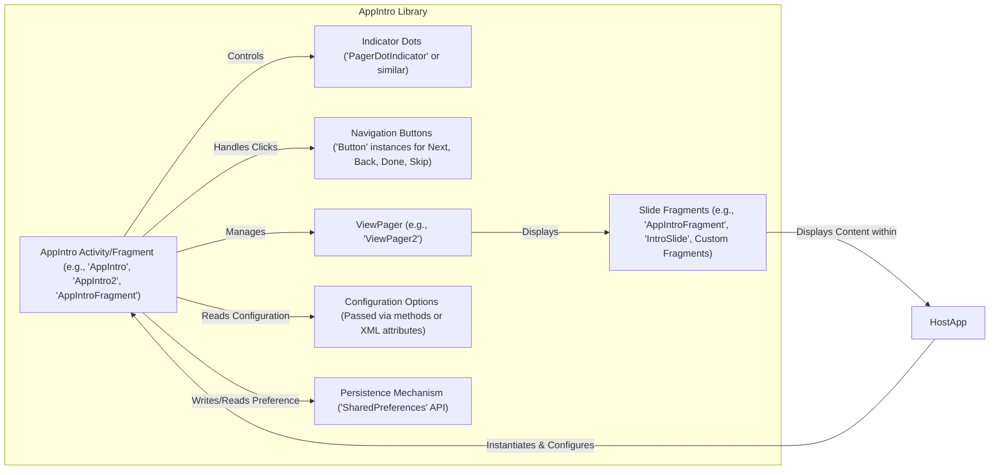
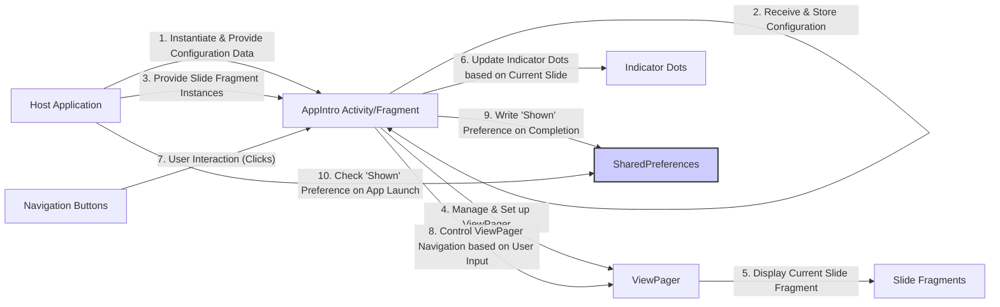

## Project Design Document: AppIntro Library (Improved)

**1. Introduction**

*   **1.1 Purpose:** This document provides an enhanced and detailed design overview of the AppIntro Android library (https://github.com/appintro/appintro). The primary goal remains to serve as a robust foundation for subsequent threat modeling activities. It meticulously outlines the library's architecture, components, data flow, and key functionalities with greater clarity and precision.
*   **1.2 Scope:** This document focuses specifically on the internal design and functionality of the AppIntro library itself. It explicitly excludes the design of applications that integrate the library and the intricacies of the underlying Android operating system, unless directly relevant to the library's operation.
*   **1.3 Goals:**
    *   Clearly and precisely define the architecture and individual components of the AppIntro library, including specific class names where relevant.
    *   Describe the data flow within the library with a more granular level of detail, outlining the sequence of operations.
    *   Identify key functionalities and their interactions, emphasizing the communication pathways between components.
    *   Provide sufficient and specific detail to facilitate effective and targeted threat modeling.
    *   Serve as an authoritative and up-to-date reference point for future development, security analysis, and maintenance efforts.

**2. Overview**

*   **2.1 Project Description:** AppIntro is a well-established open-source Android library designed to simplify the creation of engaging and informative introduction or tutorial sequences within Android applications. It offers a collection of customizable UI elements and functionalities to guide users through an application's core features and benefits upon their initial launch or after a significant update.
*   **2.2 Key Features:**
    *   Creation of multiple interactive slides, each capable of displaying customizable content such as text, images, videos, and Lottie animations.
    *   Support for various pre-built slide types, including basic content slides, custom layout slides, and permission request slides.
    *   Integrated navigation controls, including indicator dots, customizable buttons, and progress bars, to facilitate user progression through the introduction.
    *   Highly customizable transitions between slides, allowing developers to create visually appealing user experiences.
    *   An optional "Skip" functionality, enabling users to bypass the introduction sequence if desired.
    *   A built-in mechanism for persisting the user's preference to not see the introduction again on subsequent app launches.
    *   Extensive support for customization options, including control over colors, fonts, animations, and overall visual styling.

**3. Architecture**

*   **3.1 Component Diagram:**

*   **3.2 Component Descriptions:**
    *   **AppIntro Activity/Fragment:** This serves as the central orchestrator for the introduction flow. Developers typically extend concrete implementations like `AppIntro`, `AppIntro2`, or utilize the `AppIntroFragment` directly. It manages the `ViewPager`, navigation controls, and overall lifecycle of the introduction sequence.
    *   **Slide Fragments:** These represent the individual screens within the introduction. The library provides base implementations like `AppIntroFragment` and `IntroSlide`, which developers can extend or replace with their own custom `Fragment` implementations to display specific content.
    *   **Indicator Dots:** A visual component, often implemented using classes like `PagerDotIndicator`, that displays a series of dots indicating the current slide and the total number of slides in the introduction.
    *   **Navigation Buttons:** Standard Android `Button` widgets used to provide navigation actions. These typically include "Next," "Back," "Done," and an optional "Skip" button. Their behavior is managed by the `AppIntro` Activity/Fragment.
    *   **ViewPager:** An Android UI component, such as `ViewPager2`, responsible for enabling smooth swiping transitions between the different slide fragments. It efficiently manages the lifecycle of the displayed fragments.
    *   **Configuration Options:** Settings that developers can use to customize the appearance and behavior of the AppIntro. These options are typically passed to the `AppIntro` Activity/Fragment through method calls (e.g., `setColorDoneButton()`, `setSkipButtonEnabled()`) or via XML attributes if the library is used within a layout.
    *   **Persistence Mechanism:** The library utilizes the Android `SharedPreferences` API to store a simple boolean flag indicating whether the introduction has been successfully shown to the user. This mechanism prevents the introduction from being displayed repeatedly on subsequent app launches.
    *   **Host Application:** The encompassing Android application that integrates and utilizes the AppIntro library to provide an introductory experience to its users.

**4. Data Flow**

*   **4.1 Initialization Sequence:**
    *   The host application initiates the AppIntro process by instantiating the designated `AppIntro` Activity or Fragment.
    *   The host application configures the `AppIntro` instance by setting various options, such as colors, button labels, and enabling/disabling features, through provided methods or XML attributes.
    *   The host application provides the collection of individual `SlideFragment` instances to the `AppIntro`, defining the content and order of the introduction slides.

*   **4.2 User Interaction Flow:**
    *   The `ViewPager` intercepts user swipe gestures, triggering transitions between the displayed `SlideFragment` instances.
    *   User clicks on the navigation buttons (Next, Back) are handled by the `AppIntro` Activity/Fragment, which then instructs the `ViewPager` to display the corresponding slide.
    *   If enabled, clicking the "Skip" button triggers an action within the `AppIntro` to finalize the introduction sequence, typically by finishing the Activity or Fragment.
    *   Clicking the "Done" button signals the successful completion of the introduction process.

*   **4.3 Persistence Mechanism in Detail:**
    *   Upon successful completion of the introduction (either by clicking the "Done" button on the last slide or by explicitly finishing the introduction), the `AppIntro` Activity/Fragment writes a boolean flag (e.g., a key-value pair like `"isAppIntroShown": true`) to the application's `SharedPreferences`.
    *   During subsequent app launches, typically within the main Activity or a splash screen, the host application queries `SharedPreferences` for the presence and value of this flag. If the flag is present and set to `true`, the host application logic will prevent the `AppIntro` from being displayed again.

*   **4.4 Detailed Data Flow Diagram:**

**5. Security Considerations (For Threat Modeling)**

*   **5.1 Data Storage Vulnerabilities:** While `SharedPreferences` stores a simple boolean, vulnerabilities in the host application or the Android OS could potentially allow unauthorized modification of this preference, leading to the introduction being shown unexpectedly or being bypassed when it shouldn't be. Consider threats like:
    *   **Shared UID Exploitation:** If the host app shares a UID with a malicious app, the malicious app might be able to modify the `SharedPreferences`.
    *   **Backup/Restore Manipulation:**  Manipulating backup files could potentially alter the stored preference.
*   **5.2 Input Validation and Configuration Issues:** The library relies on the host application to provide valid configuration data. Improper validation in the host app could lead to unexpected behavior or even crashes within the AppIntro. Consider threats like:
    *   **Malformed URI for Images/Videos:** Providing invalid or malicious URIs for media content could lead to errors or security vulnerabilities if the library doesn't handle them correctly.
    *   **Integer Overflow/Underflow:**  If configuration options involve numerical values, improper handling could lead to unexpected behavior.
*   **5.3 Host Application Integration Weaknesses:** The security of the AppIntro is intrinsically linked to how securely it's integrated into the host application. Vulnerabilities in the host app could be exploited to manipulate or bypass the introduction flow. Consider threats like:
    *   **Activity Hijacking:** A malicious app could potentially intercept the intent to launch the AppIntro activity.
    *   **Exposure of Internal State:** If the host app inadvertently exposes internal state related to the AppIntro, it could be exploited.
*   **5.4 Dependency Vulnerabilities:**  Like any software, AppIntro relies on external libraries (e.g., AndroidX components). Vulnerabilities in these dependencies could introduce security risks. Regular dependency updates and security scanning are crucial.
*   **5.5 Risks Associated with Customization:** Allowing custom layouts and code within slide fragments introduces potential security risks if developers implement them insecurely. Consider threats like:
    *   **Cross-Site Scripting (XSS) in WebViews:** If custom slides use `WebView`, they could be vulnerable to XSS if not handled carefully.
    *   **Information Disclosure through Logging:**  Custom code might inadvertently log sensitive information.
    *   **Arbitrary Code Execution:** In extreme cases, vulnerabilities in custom code could potentially lead to arbitrary code execution within the app's context.
*   **5.6 Information Disclosure through Slide Content:** Developers should be cautious about displaying sensitive information within the introduction slides. While the library itself doesn't inherently create this risk, it's a consideration for developers using the library.

**6. Dependencies**

*   AndroidX Core Library (e.g., `androidx.core`).
*   AndroidX AppCompat Library (e.g., `androidx.appcompat`).
*   AndroidX ViewPager2 Library (for handling slide transitions).
*   Potentially other AndroidX UI components or third-party libraries depending on the specific features used (e.g., Lottie for animations).

**7. Deployment**

*   The AppIntro library is typically integrated into an Android project by adding its dependency declaration to the project's `build.gradle` file.
*   Developers then instantiate and configure the `AppIntro` Activity or Fragment within their application's activities, typically during the initial launch sequence or after a significant update.

**8. Future Considerations**

*   **Enhanced Accessibility Features:**  Further improvements to ensure the AppIntro is fully accessible to users with disabilities, adhering to accessibility guidelines.
*   **More Granular Theming and Customization Options:** Providing developers with even finer-grained control over the visual appearance and behavior of the library.
*   **Integration with Analytics Platforms:**  Potentially offering built-in mechanisms or clear guidelines for integrating AppIntro usage data with analytics services.
*   **Support for More Complex Introduction Flows:** Exploring features like conditional slide display based on user attributes or app state.
*   **Improved Security Best Practices Documentation:** Providing more comprehensive guidance to developers on how to securely integrate and customize the AppIntro library.

This improved design document offers a more detailed and nuanced understanding of the AppIntro library's architecture and functionality. The enhanced descriptions, diagrams, and security considerations provide a stronger foundation for conducting thorough and effective threat modeling activities.