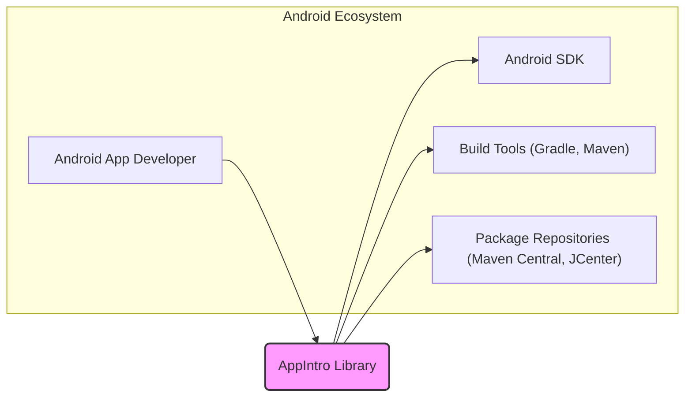
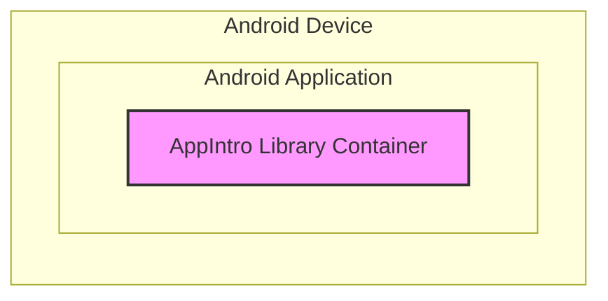

# BUSINESS POSTURE

*   Business Priorities and Goals:
    *   Provide Android app developers with an easy-to-use, customizable, and visually appealing library for creating app introduction or onboarding screens.
    *   Enable developers to quickly integrate intro screens without needing to build them from scratch, saving development time and effort.
    *   Offer a flexible and well-documented library that can be adapted to various app designs and user onboarding flows.
    *   Maintain a stable and reliable library that is actively supported and updated by the open-source community.
*   Business Risks:
    *   Security vulnerabilities in the library could be inherited by applications that use it, potentially leading to security issues in those applications.
    *   Bugs or instability in the library could negatively impact the user experience of applications that integrate it.
    *   Lack of maintenance or updates could lead to the library becoming outdated or incompatible with newer Android versions, reducing its usability and adoption.
    *   Poor documentation or difficult integration could deter developers from using the library.

# SECURITY POSTURE

*   Existing Security Controls:
    *   security control: Code is hosted on GitHub, providing version control and transparency. (Implemented: GitHub Repository)
    *   security control: Open-source nature allows for community review and contribution to identify and fix potential issues. (Implemented: Open Source Model)
    *   security control: Issue tracking on GitHub for reporting and managing bugs and feature requests. (Implemented: GitHub Issues)
*   Accepted Risks:
    *   accepted risk: As an open-source project, the library relies on community contributions, and the speed of addressing security vulnerabilities may vary.
    *   accepted risk: Users of the library are responsible for ensuring that they use it correctly and securely within their own applications.
*   Recommended Security Controls:
    *   recommended security control: Implement automated static analysis security testing (SAST) in the CI/CD pipeline to identify potential code vulnerabilities.
    *   recommended security control: Introduce dependency scanning to monitor and update library dependencies for known vulnerabilities.
    *   recommended security control: Establish a clear process for reporting and handling security vulnerabilities, including a security policy and contact information.
    *   recommended security control: Encourage and facilitate security reviews by the community and potentially conduct periodic formal security audits.
*   Security Requirements:
    *   Authentication: Not directly applicable to a UI library. Authentication is handled by the applications that use this library, not by the library itself.
    *   Authorization: Not directly applicable to a UI library. Authorization is handled by the applications that use this library.
    *   Input Validation: The library should handle any user-provided input or configuration options safely to prevent potential injection vulnerabilities (e.g., if customization allows rendering of text or images provided by the developer). Ensure proper validation and sanitization of any inputs.
    *   Cryptography: Not directly applicable to the core functionality of a UI library like AppIntro. Cryptographic operations are expected to be handled by the applications using this library. However, if the library were to handle any sensitive data (which is not the case for AppIntro), appropriate cryptographic measures would be necessary.

# DESIGN

## C4 CONTEXT



*   Context Diagram Elements:
    *   Element 1:
        *   Name: Android App Developer
        *   Type: Person
        *   Description: Developers who build Android applications and want to integrate onboarding or intro screens into their apps.
        *   Responsibilities: Integrate the AppIntro library into their Android projects, customize it to fit their app's design, and ensure proper usage.
        *   Security controls: Responsible for securely using the library within their applications and handling any data appropriately in their apps.
    *   Element 2:
        *   Name: AppIntro Library
        *   Type: Software System
        *   Description: An open-source Android library that provides customizable intro screen functionality for Android applications.
        *   Responsibilities: Provide a reusable, customizable, and well-documented UI component for app intro screens. Ensure code quality and address reported issues.
        *   Security controls: Implement secure coding practices, address reported vulnerabilities, and potentially incorporate automated security checks in the development process.
    *   Element 3:
        *   Name: Android SDK
        *   Type: Software System
        *   Description: The Android Software Development Kit, providing the necessary tools and libraries for building Android applications.
        *   Responsibilities: Provide the platform and APIs for Android app development.
        *   Security controls: Security of the Android platform is managed by Google. Developers should follow Android security best practices when using the SDK.
    *   Element 4:
        *   Name: Build Tools (Gradle, Maven)
        *   Type: Software System
        *   Description: Build automation tools used to compile, package, and manage dependencies for Android projects.
        *   Responsibilities: Manage the build process of Android applications, including dependency resolution and packaging.
        *   Security controls: Ensure the integrity of the build process and dependency resolution. Developers should use secure configurations and manage dependencies carefully.
    *   Element 5:
        *   Name: Package Repositories (Maven Central, JCenter)
        *   Type: Software System
        *   Description: Repositories where Android libraries, including AppIntro, are published and distributed for developers to include in their projects.
        *   Responsibilities: Host and distribute Android libraries.
        *   Security controls: Ensure the integrity and availability of hosted libraries. Developers should use trusted repositories and verify library integrity if possible.

## C4 CONTAINER



*   Container Diagram Elements:
    *   Element 1:
        *   Name: AppIntro Library Container
        *   Type: Library
        *   Description: The AppIntro library itself, packaged as an Android Archive (AAR) file, which is integrated into an Android application. It contains the Kotlin/Java code, resources (layouts, drawables, styles), and potentially assets required for the intro screen functionality.
        *   Responsibilities: Provide the UI components and logic for displaying intro screens within an Android application. Handle customization options and user interactions related to the intro screens.
        *   Security controls: Implement input validation for customization options, follow secure coding practices to prevent vulnerabilities within the library code. The library itself operates within the security context of the Android application it is included in.

## DEPLOYMENT

```mermaid
flowchart LR
    subgraph "Maven Central Repository"
        A["Maven Central"]
    end
    subgraph "Developer's Build Environment"
        B["Developer's Machine"]
        C["Build Tools (Gradle)"]
    end

    B --> C: Build & Publish
    C --> A: Publish Artifact (AAR)
    D["Android App Developer"] --> C: Download Dependency

    style A fill:#f9f,stroke:#333,stroke-width:2px
    style C fill:#ccf,stroke:#333,stroke-width:1px
    style B fill:#eee,stroke:#333,stroke-width:1px
```

*   Deployment Diagram Elements:
    *   Element 1:
        *   Name: Maven Central
        *   Type: Package Repository
        *   Description: A central repository for Maven artifacts, used to host and distribute the AppIntro library (AAR file).
        *   Responsibilities: Securely store and serve the AppIntro library artifact. Ensure availability and integrity of the artifact.
        *   Security controls: Maven Central has its own security infrastructure to protect hosted artifacts and ensure secure distribution.
    *   Element 2:
        *   Name: Developer's Machine
        *   Type: Development Environment
        *   Description: The local development environment of an Android app developer, where they use tools like Android Studio and Gradle to build their applications.
        *   Responsibilities: Develop and build Android applications that use the AppIntro library. Manage dependencies using build tools.
        *   Security controls: Developers are responsible for maintaining the security of their development machines and using secure development practices.
    *   Element 3:
        *   Name: Build Tools (Gradle)
        *   Type: Build System
        *   Description: Gradle is used to build and package the AppIntro library and also to manage dependencies in Android projects that use AppIntro.
        *   Responsibilities: Automate the build process, manage dependencies, and package the library for distribution.
        *   Security controls: Ensure the integrity of the build process and dependency resolution. Use secure configurations for build tools and manage dependencies carefully.

## BUILD

```mermaid
flowchart LR
    A["Developer"] --> B{Code Changes};
    B --> C[GitHub Repository];
    C --> D{CI/CD System (GitHub Actions)};
    D --> E[Build & Test];
    E --> F{Security Checks (SAST, Linters)};
    F --> G[Package Artifact (AAR)];
    G --> H[Publish to Maven Central];

    style C fill:#ccf,stroke:#333,stroke-width:1px
    style D fill:#ccf,stroke:#333,stroke-width:1px
    style E fill:#ccf,stroke:#333,stroke-width:1px
    style F fill:#ccf,stroke:#333,stroke-width:1px
    style G fill:#f9f,stroke:#333,stroke-width:2px
    style H fill:#f9f,stroke:#333,stroke-width:2px
```

*   Build Process Description:
    *   Developer makes code changes and commits them to the GitHub repository.
    *   A CI/CD system, likely GitHub Actions, is triggered by code changes (e.g., push, pull request).
    *   The CI/CD system executes the build process, which includes:
        *   Compiling the Kotlin/Java code.
        *   Running unit tests and potentially UI tests.
        *   Performing code quality checks (linters).
        *   Running static analysis security testing (SAST) tools (recommended security control).
    *   If all checks pass, the build process packages the library into an Android Archive (AAR) file.
    *   The AAR artifact is then published to a package repository like Maven Central, making it available for Android developers to use in their projects.
*   Build Process Security Controls:
    *   security control: Version control using Git and GitHub to track changes and manage code history. (Implemented: GitHub)
    *   security control: Automated build process using CI/CD to ensure consistent and repeatable builds. (Implemented: Likely GitHub Actions or similar)
    *   security control: Code quality checks (linters) to enforce coding standards and identify potential code issues. (Implemented: Likely through build scripts)
    *   security control: Unit and UI tests to verify functionality and prevent regressions. (Implemented: Likely through build scripts)
    *   security control: Static analysis security testing (SAST) to identify potential security vulnerabilities in the code. (Recommended: Implement in CI/CD pipeline)
    *   security control: Dependency scanning to ensure dependencies are up-to-date and free of known vulnerabilities. (Recommended: Implement in CI/CD pipeline)
    *   security control: Secure publishing process to Maven Central, ensuring artifacts are not tampered with during publication. (Implemented: Maven Central and build tools security features)

# RISK ASSESSMENT

*   Critical Business Processes We Are Trying to Protect:
    *   For the AppIntro library itself: Maintaining the integrity and availability of the library for Android developers. Protecting the reputation of the library as a reliable and secure component.
    *   For applications using AppIntro: Ensuring the security and stability of Android applications that integrate the library. Protecting the user experience of these applications.
*   Data We Are Trying to Protect and Their Sensitivity:
    *   The AppIntro library itself does not directly handle sensitive user data.
    *   However, vulnerabilities in the library could potentially be exploited in applications that use it, which *may* handle sensitive user data. In this indirect way, the security of the library contributes to the overall security of applications and the data they process.
    *   The library's source code is publicly available on GitHub. The main data to protect in the context of the library itself is the integrity of the released artifacts (AAR files) to prevent supply chain attacks.

# QUESTIONS & ASSUMPTIONS

*   Questions:
    *   Is there a formal security policy or vulnerability disclosure process for the AppIntro project?
    *   Are there any automated security scanning tools currently used in the development or CI/CD pipeline for AppIntro?
    *   What is the process for reviewing and merging community contributions, especially from a security perspective?
*   Assumptions:
    *   The AppIntro library is primarily maintained by a community of open-source contributors.
    *   The library is intended to be used in a wide range of Android applications, potentially including those that handle sensitive user data.
    *   Security best practices are generally followed in the development of the library, but there may be room for improvement in terms of formal security processes and automated security checks.
    *   The primary distribution channel for the library is Maven Central.