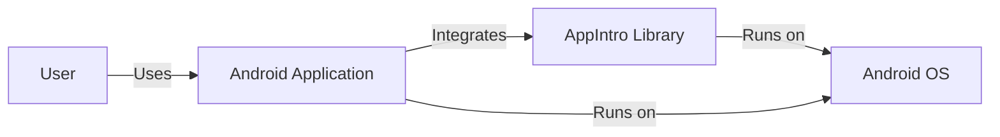
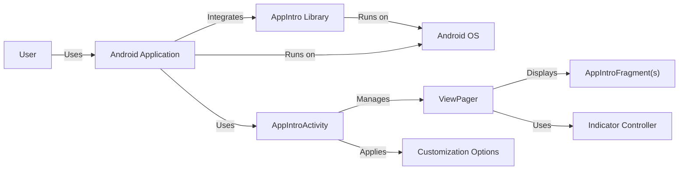
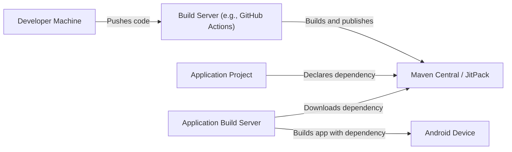
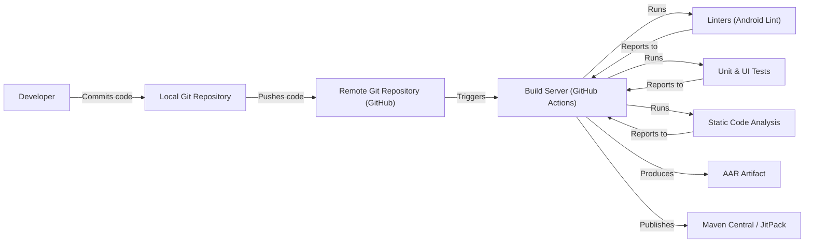

# BUSINESS POSTURE

Business Priorities and Goals:

*   Provide an easy-to-use and customizable library for creating app introductions (onboarding screens) for Android applications.
*   Simplify the development process for app developers by offering a pre-built solution for a common UI pattern.
*   Maintain a lightweight and performant library to minimize the impact on the host application's size and speed.
*   Offer sufficient customization options to allow developers to match the app intro to their app's branding and style.
*   Ensure compatibility with a wide range of Android versions.
*   Provide good documentation and support to the user community.

Business Risks:

*   Low adoption rate due to lack of awareness or competition from similar libraries.
*   Negative user reviews due to bugs, lack of features, or poor performance.
*   Inability to maintain the library and keep it up-to-date with the latest Android versions and best practices.
*   Security vulnerabilities that could be exploited in applications using the library.
*   Compatibility issues with other libraries or specific device configurations.

# SECURITY POSTURE

Existing Security Controls:

*   security control: The library itself does not handle sensitive data directly. It primarily deals with UI elements and user navigation. (Implicit in the nature of the library)
*   security control: The library does not make network requests. (Implicit in the nature of the library)
*   security control: The library does not store any data persistently. (Implicit in the nature of the library)
*   security control: Proguard/R8 rules are provided for code shrinking and obfuscation. (Mentioned in the README)

Accepted Risks:

*   accepted risk: The library relies on the host application to handle any sensitive data or user authentication.
*   accepted risk: The library's functionality is limited to UI presentation, and any security vulnerabilities in the host application are outside the library's scope.
*   accepted risk: The library does not implement specific input validation beyond what is provided by the Android framework for standard UI components.

Recommended Security Controls:

*   security control: Implement a robust testing strategy, including unit and UI tests, to identify and fix potential bugs that could lead to unexpected behavior.
*   security control: Regularly update dependencies to address any known vulnerabilities in third-party libraries.
*   security control: Conduct static code analysis (e.g., using Android Lint or FindBugs) to identify potential security issues and code quality problems.
*   security control: Consider adding a Content Security Policy (CSP) if the library uses WebViews (although this is unlikely given the library's purpose).

Security Requirements:

*   Authentication: Not applicable, as the library does not handle user authentication.
*   Authorization: Not applicable, as the library does not manage user roles or permissions.
*   Input Validation: The library should rely on the standard Android UI components and their built-in input validation mechanisms. Any custom views or input handling should include appropriate validation to prevent issues like injection vulnerabilities.
*   Cryptography: Not applicable, as the library does not handle sensitive data requiring encryption.

# DESIGN

## C4 CONTEXT

Context Diagram Element Description:

*   Element:
    *   Name: User
    *   Type: Person
    *   Description: The end-user of the Android application.
    *   Responsibilities: Interacts with the Android application, including viewing the app introduction screens.
    *   Security controls: N/A (External entity)

*   Element:
    *   Name: AppIntro Library
    *   Type: Software System
    *   Description: The library providing the app introduction functionality.
    *   Responsibilities: Provides UI components and logic for displaying onboarding screens.
    *   Security controls: Relies on host application security, no direct handling of sensitive data, no network requests, no persistent data storage.

*   Element:
    *   Name: Android Application
    *   Type: Software System
    *   Description: The application that integrates the AppIntro library.
    *   Responsibilities: Hosts the AppIntro library, handles application logic, and manages user data.
    *   Security controls: Responsible for overall application security, including data protection and user authentication.

*   Element:
    *   Name: Android OS
    *   Type: Software System
    *   Description: The Android operating system.
    *   Responsibilities: Provides the underlying platform and services for the application and library to run.
    *   Security controls: Provides platform-level security features and sandboxing.

## C4 CONTAINER

Container Diagram Element Description:

*   Element:
    *   Name: User
    *   Type: Person
    *   Description: The end-user of the Android application.
    *   Responsibilities: Interacts with the Android application, including viewing the app introduction screens.
    *   Security controls: N/A (External entity)

*   Element:
    *   Name: Android Application
    *   Type: Software System
    *   Description: The application that integrates the AppIntro library.
    *   Responsibilities: Hosts the AppIntro library, handles application logic, and manages user data.
    *   Security controls: Responsible for overall application security, including data protection and user authentication.

*   Element:
    *   Name: AppIntro Library
    *   Type: Software System
    *   Description: The library providing the app introduction functionality.
    *   Responsibilities: Provides UI components and logic for displaying onboarding screens.
    *   Security controls: Relies on host application security, no direct handling of sensitive data, no network requests, no persistent data storage.

*   Element:
    *   Name: Android OS
    *   Type: Software System
    *   Description: The Android operating system.
    *   Responsibilities: Provides the underlying platform and services for the application and library to run.
    *   Security controls: Provides platform-level security features and sandboxing.

*   Element:
    *   Name: AppIntroActivity
    *   Type: Container (Android Activity)
    *   Description: The main Activity provided by the library to manage the app intro flow.
    *   Responsibilities: Handles the overall lifecycle of the app intro, manages fragments, and applies customization.
    *   Security controls: Relies on Android's Activity lifecycle security.

*   Element:
    *   Name: AppIntroFragment(s)
    *   Type: Container (Android Fragment)
    *   Description: Individual fragments representing each page of the app intro.
    *   Responsibilities: Displays the content for each intro screen.
    *   Security controls: Relies on Android's Fragment lifecycle security.

*   Element:
    *   Name: AppIntroViewPager
    *   Type: Container (Android ViewPager)
    *   Description: A standard Android ViewPager used to manage the swiping between intro fragments.
    *   Responsibilities: Handles the horizontal scrolling and display of fragments.
    *   Security controls: Standard Android component, relies on Android's UI security.

*   Element:
    *   Name: AppIntroIndicator
    *   Type: Container (UI Component)
    *   Description: The indicator showing the user's progress through the intro screens.
    *   Responsibilities: Visually represents the current page and total number of pages.
    *   Security controls: Standard Android component, relies on Android's UI security.

*   Element:
    *   Name: AppIntroCustomization
    *   Type: Configuration
    *   Description: Customization options provided by the library (e.g., colors, fonts, animations).
    *   Responsibilities: Allows developers to customize the appearance and behavior of the app intro.
    *   Security controls: Input validation for customization parameters should be performed to prevent unexpected behavior.

## DEPLOYMENT

Deployment Options:

1.  **Local Library Project:** The library is included as a local module within the application project.
2.  **Maven Central/JitPack:** The library is published to a repository like Maven Central or JitPack and included as a dependency in the application's build.gradle file.

Chosen Deployment (Maven Central/JitPack):

Deployment Diagram Element Description:

*   Element:
    *   Name: Developer Machine
    *   Type: Infrastructure Node
    *   Description: The developer's local machine where the library code is developed.
    *   Responsibilities: Code development, testing, and pushing to the build server.
    *   Security controls: Standard development environment security practices.

*   Element:
    *   Name: Build Server (e.g., GitHub Actions)
    *   Type: Infrastructure Node
    *   Description: The server responsible for building and publishing the library.
    *   Responsibilities: Automated builds, testing, and publishing to the repository.
    *   Security controls: Secure build environment, access control, dependency scanning.

*   Element:
    *   Name: Maven Central / JitPack
    *   Type: Infrastructure Node
    *   Description: The repository hosting the compiled library.
    *   Responsibilities: Stores and serves the library artifact.
    *   Security controls: Repository security measures, access control.

*   Element:
    *   Name: Application Project
    *   Type: Software System
    *   Description: The Android application project that uses the AppIntro library.
    *   Responsibilities: Declares the AppIntro library as a dependency.
    *   Security controls: Standard application security practices.

*   Element:
    *   Name: Application Build Server
    *   Type: Infrastructure Node
    *   Description: The server that builds the Android application.
    *   Responsibilities: Downloads dependencies, compiles the application, and creates the APK.
    *   Security controls: Secure build environment, dependency scanning.

*   Element:
    *   Name: Android Device
    *   Type: Infrastructure Node
    *   Description: The device where the Android application is installed and run.
    *   Responsibilities: Runs the application.
    *   Security controls: Device security, Android OS security.

## BUILD

Build Process Description:

1.  **Code Commit:** The developer commits code changes to the local Git repository.
2.  **Push to Remote:** The changes are pushed to the remote repository (GitHub).
3.  **Build Trigger:** The push to the remote repository triggers the build server (GitHub Actions).
4.  **Linting:** The build server runs linters (e.g., Android Lint) to check for code style and potential errors.
5.  **Testing:** The build server executes unit and UI tests.
6.  **Static Code Analysis:** Static code analysis tools are run to identify potential security vulnerabilities and code quality issues.
7.  **Artifact Creation:** If all checks pass, the build server creates the AAR (Android Archive) artifact.
8.  **Publish to Repository:** The AAR artifact is published to a repository like Maven Central or JitPack.

Security Controls in Build Process:

*   security control: **Linters:** Enforce code style and identify potential errors.
*   security control: **Unit & UI Tests:** Verify the functionality of the library and prevent regressions.
*   security control: **Static Code Analysis:** Detect potential security vulnerabilities and code quality issues.
*   security control: **Secure Build Environment:** The build server (GitHub Actions) provides a secure and isolated environment for building the library.
*   security control: **Dependency Scanning:** (Recommended) Scan dependencies for known vulnerabilities.

# RISK ASSESSMENT

Critical Business Processes:

*   Providing a seamless and user-friendly onboarding experience for Android applications.

Data Protection:

*   The library itself does not handle any sensitive data. The host application is responsible for protecting any user data. Therefore, there is no data sensitivity classification needed for the library itself.

# QUESTIONS & ASSUMPTIONS

Questions:

*   Are there any specific compliance requirements (e.g., GDPR, CCPA) that the host application must adhere to, which might indirectly impact the library's usage? (Although the library doesn't handle data, compliance of the host app is relevant.)
*   Are there any plans to add features that might involve handling user data or making network requests in the future?

Assumptions:

*   BUSINESS POSTURE: The primary goal is to provide a functional and easy-to-use library, with security being a secondary but important consideration.
*   SECURITY POSTURE: The host application is responsible for the overall security of the user experience, including data protection and authentication. The library is assumed to be used in a secure manner within the host application.
*   DESIGN: The library's design is simple and focused on UI presentation. It does not interact with external systems or services beyond the Android OS. The provided deployment model via Maven Central/JitPack is the most common and will be used.