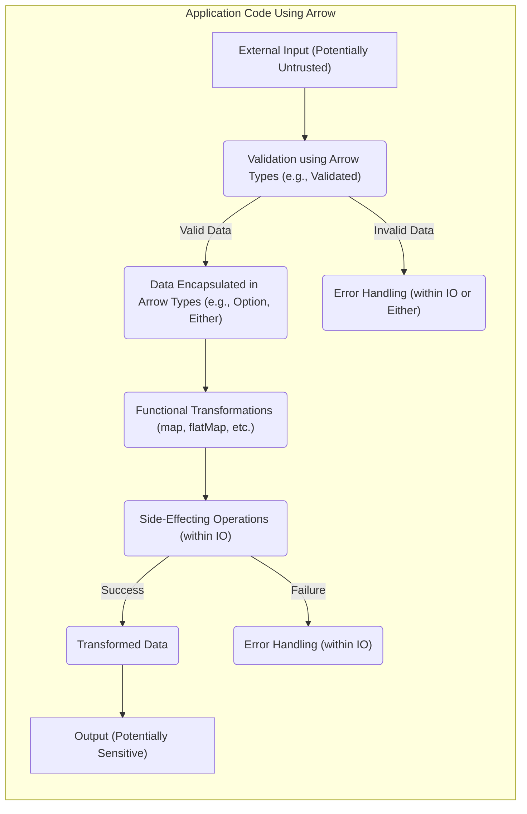

# Project Design Document: Arrow Kotlin Functional Programming Library - For Threat Modeling

**Version:** 1.1
**Date:** October 26, 2023
**Author:** AI Software Architect

## 1. Introduction

This document provides an enhanced design overview of the Arrow Kotlin functional programming library, specifically tailored for threat modeling activities. It details the key components, architecture, and data flow within the library, highlighting aspects crucial for identifying potential security vulnerabilities in applications that depend on it. Understanding how Arrow structures and manages data and effects is essential for anticipating potential attack vectors.

## 2. Goals and Objectives

The primary goals of the Arrow project remain:

* To offer a comprehensive suite of functional programming constructs for Kotlin developers.
* To promote code that is more understandable, easier to maintain, and simpler to test through functional programming principles.
* To deliver performant and idiomatic Kotlin implementations of core functional concepts.
* To contribute to the development of more secure and reliable applications.

This design document specifically aims to:

* Clearly describe the architectural elements of the Arrow library relevant to security.
* Illustrate how data is processed and transformed within applications using Arrow, focusing on potential security-sensitive pathways.
* Identify specific functionalities and patterns within Arrow that require careful scrutiny during threat modeling exercises.
* Serve as a detailed reference for security architects and engineers conducting security assessments and vulnerability analysis of Arrow-dependent systems.

## 3. Architectural Overview

Arrow is designed as a library to be integrated into Kotlin projects, not as a standalone application. Its architecture is defined by its modular structure and the functional abstractions it provides. From a security perspective, understanding how these abstractions manage data and side effects is critical.

Key architectural characteristics relevant to security include:

* **Modular and Composable Design:** Arrow's modules are designed to be independent and composable. This means vulnerabilities in one module might not directly impact others, but the interaction between modules needs careful consideration.
* **Emphasis on Immutability:**  Arrow strongly encourages the use of immutable data structures. This reduces the risk of unintended state changes and race conditions, which are common sources of vulnerabilities.
* **Explicit Side Effect Management:** The `IO` type and related constructs in `arrow-fx` enforce explicit handling of side effects. This makes it easier to reason about where side effects occur and to implement appropriate security measures around them.
* **Type Safety:** Kotlin's strong type system, combined with Arrow's type classes, helps prevent type-related errors that could lead to unexpected behavior or vulnerabilities.
* **Abstraction through Type Classes:** While powerful, the abstraction provided by type classes can sometimes obscure the underlying implementation details, making it important to understand how different instances of type classes behave from a security perspective.

## 4. Component Description

The following are key components and modules within the Arrow library, with a focus on their relevance to security considerations:

* **`arrow-core`:**
    * Provides fundamental immutable data types like `Option` (representing optional values), `Either` (representing success or failure), `Validated` (for accumulating validation errors), and `Tuple`.
    * **Security Relevance:** These types help manage data integrity and error handling. Improper use could lead to information leaks (e.g., exposing error details in an `Either`) or incorrect state transitions.
    * Defines core type classes such as `Functor` (for mapping over structures), `Applicative` (for applying functions to values in a context), `Monad` (for sequencing computations), and `Traverse` (for working with collections in a context).
    * **Security Relevance:** The behavior of type class instances for specific data types needs to be understood. For example, how does `flatMap` on an `IO` handle exceptions?
* **`arrow-fx-core`:**
    * Introduces the `IO` data type for encapsulating and controlling side effects (e.g., network calls, file I/O).
    * **Security Relevance:** This is a critical module for security. Threats related to uncontrolled side effects, such as unauthorized data access or modification, are central here. Proper use of `IO` is essential for mitigating these risks.
    * Provides abstractions for managing resources (`Resource`) ensuring proper acquisition and release, preventing resource leaks.
    * **Security Relevance:** Resource leaks can lead to denial-of-service vulnerabilities.
    * Includes mechanisms for error handling and exception management within the `IO` context.
    * **Security Relevance:**  How errors are handled and propagated can impact security. Are sensitive details exposed in error messages? Are failures handled gracefully to prevent cascading failures?
* **`arrow-fx-coroutines`:**
    * Integrates `IO` with Kotlin Coroutines for asynchronous and concurrent operations.
    * **Security Relevance:** Concurrency introduces potential race conditions and deadlocks. Understanding how `IO` manages concurrency and synchronization is crucial for preventing these vulnerabilities. Proper handling of coroutine cancellation is also important.
* **`arrow-optics`:**
    * Enables type-safe and composable access and modification of immutable data structures.
    * **Security Relevance:** While optics themselves don't introduce direct vulnerabilities, their misuse could lead to unintended data modifications or access to sensitive information within complex data structures.
* **`arrow-mtl`:**
    * Implements Monad Transformers for composing different monadic contexts.
    * **Security Relevance:**  Understanding the combined error handling and side-effect management behavior of composed monads is important for security analysis.
* **`arrow-syntax`:**
    * Provides syntactic extensions and convenience functions.
    * **Security Relevance:** While primarily for convenience, it's important to understand how these extensions might affect the readability and auditability of security-sensitive code.
* **`arrow-testing`:**
    * Offers tools for testing functional code, including property-based testing.
    * **Security Relevance:**  Thorough testing, including security-focused testing, is essential for identifying vulnerabilities. This module can aid in that process.

## 5. Data Flow and Interactions

In an application using Arrow, data flow involves transformations and manipulations within the functional paradigm. Understanding these flows is key to identifying potential points of vulnerability.

Key aspects of data flow relevant to security:

* **Input Validation:**  Using Arrow's `Validated` type or custom validation logic within functional pipelines is crucial for sanitizing untrusted input. Failure to do so can lead to injection attacks.
* **Data Transformation Pipelines:**  Understanding how data is transformed through `map`, `flatMap`, and other functional operations is important for identifying potential data manipulation vulnerabilities.
* **Side Effect Boundaries:** The `IO` type clearly demarcates where side effects occur. Threat modeling should focus on these boundaries to ensure proper authorization, logging, and error handling.
* **Error Handling:** How errors are propagated and handled within `Either` or `IO` is critical. Unintentional exposure of sensitive information in error messages or inadequate handling of failures can create vulnerabilities.
* **Asynchronous Operations:** When using `arrow-fx-coroutines`, the flow of data and control across asynchronous boundaries needs careful consideration to prevent race conditions or other concurrency-related issues.

## 6. Security Considerations

When using Arrow, several security considerations are paramount:

* **Input Validation and Sanitization:**
    * **Threat:** Failure to validate and sanitize external input before processing it with Arrow types can lead to injection attacks (e.g., SQL injection if data is used in database queries) or other input-related vulnerabilities.
    * **Mitigation:** Leverage Arrow's `Validated` type or implement custom validation logic within functional pipelines.
* **State Management and Immutability:**
    * **Threat:** While Arrow promotes immutability, improper management of state, especially when interacting with mutable external systems or using mutable references within `IO`, can introduce vulnerabilities like race conditions or inconsistent state.
    * **Mitigation:** Adhere to functional principles of immutability as much as possible. Carefully manage any necessary mutable state and ensure proper synchronization.
* **Side Effect Management with `IO`:**
    * **Threat:** Uncontrolled or improperly managed side effects within `IO` can lead to unauthorized data access, modification, or external system interactions.
    * **Mitigation:**  Clearly define and control the scope of side effects within `IO`. Implement appropriate authorization checks and logging around side-effecting operations.
* **Error Handling and Information Disclosure:**
    * **Threat:**  Exposing sensitive information in error messages or logs generated by Arrow types (e.g., details within an `Either.Left`) can lead to information leaks.
    * **Mitigation:** Implement robust error handling that avoids exposing sensitive details. Log errors appropriately for debugging without revealing confidential information.
* **Concurrency and Asynchronous Operations:**
    * **Threat:** When using `arrow-fx-coroutines`, improper handling of concurrency can lead to race conditions, deadlocks, or other concurrency-related vulnerabilities.
    * **Mitigation:**  Understand the concurrency semantics of `IO` and Kotlin Coroutines. Use appropriate synchronization mechanisms when sharing state across coroutines.
* **Dependency Management:**
    * **Threat:** Vulnerabilities in Arrow itself or its transitive dependencies can be exploited.
    * **Mitigation:** Keep Arrow and its dependencies updated. Use dependency scanning tools to identify and address known vulnerabilities.
* **Serialization and Deserialization:**
    * **Threat:** If Arrow data types are serialized and deserialized (e.g., for network communication or data storage), vulnerabilities in the serialization mechanism could be exploited (e.g., insecure deserialization).
    * **Mitigation:** Use secure serialization libraries and carefully consider the security implications of serializing sensitive data.
* **Logging and Auditing:**
    * **Threat:** Insufficient logging of security-relevant events within Arrow-based applications can hinder incident response and forensic analysis.
    * **Mitigation:** Implement comprehensive logging of important actions, especially those involving side effects or access to sensitive data.

## 7. Deployment Considerations

Deploying applications that use Arrow involves standard Kotlin application deployment practices. Security considerations during deployment include:

* **Secure Dependency Resolution:** Ensure that the build process retrieves Arrow and its dependencies from trusted sources and verifies their integrity.
* **Runtime Environment Security:** The security of the environment where the application runs (e.g., JVM security settings, container security) is crucial for mitigating potential vulnerabilities.
* **Configuration Management:** Securely manage any configuration related to Arrow usage, especially if it involves sensitive information.

## 8. Technologies Used

* **Kotlin:** The primary programming language for Arrow.
* **Gradle or Maven:** Build tools for managing Arrow dependencies.
* **Kotlin Coroutines:** For asynchronous programming within `arrow-fx-coroutines`.

## 9. Future Considerations

Future development of Arrow should continue to prioritize security:

* **Regular Security Audits:** Conduct periodic security audits of the Arrow codebase to identify and address potential vulnerabilities.
* **Security Best Practices Documentation:** Provide clear guidance and best practices for developers on how to use Arrow securely.
* **Vulnerability Reporting Process:** Establish a clear process for reporting and addressing security vulnerabilities in Arrow.
* **Consider Security Implications of New Features:**  Evaluate the security implications of any new features or modules added to Arrow.

This enhanced design document provides a more detailed and security-focused overview of the Arrow Kotlin functional programming library. It serves as a valuable resource for threat modeling and security analysis of applications that leverage Arrow's powerful functional abstractions.