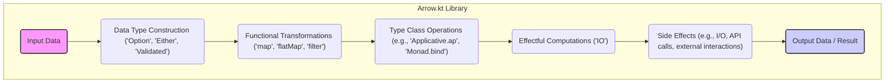

# Project Design Document: Arrow.kt Library

**Version:** 1.1
**Date:** October 26, 2023
**Author:** AI Software Architect

## 1. Introduction

This document provides an enhanced architectural design overview of the Arrow.kt library, focusing on aspects relevant to threat modeling. It details key components, data flow, deployment contexts, and security considerations to facilitate security analysis and risk assessment of systems integrating Arrow.kt.

### 1.1. Purpose

The primary goal of this document is to offer a clear and comprehensive design perspective of the Arrow.kt library, specifically tailored for threat modeling exercises. It aims to help identify potential security vulnerabilities and attack vectors within applications utilizing this library.

### 1.2. Scope

This document encompasses the core architectural elements of the Arrow.kt library, emphasizing its principal functionalities and their interactions. The scope includes:

*   A refined high-level description of the library's purpose and core features.
*   Detailed identification of key components and their respective responsibilities.
*   A more granular description of data flow patterns within the library's constructs.
*   Expanded considerations for typical deployment scenarios and usage patterns.
*   Enhanced security considerations with more specific examples relevant to threat modeling.

This document maintains its focus on architectural aspects and does not delve into the minute implementation details of individual functions or classes within the library.

### 1.3. Target Audience

This document is intended for a technical audience involved in the security and development lifecycle of applications using Arrow.kt:

*   Security architects and engineers tasked with performing threat modeling and security assessments.
*   Software architects and developers responsible for integrating and utilizing Arrow.kt in their projects.
*   Cloud architects involved in deploying and managing applications that depend on Arrow.kt.

## 2. Overview of Arrow.kt

Arrow.kt is a functional programming library for Kotlin, offering a rich set of data types, type classes, and functional constructs. It empowers developers to build more resilient, composable, and testable applications by leveraging functional programming principles. Key aspects include:

*   **Enhanced Data Types:** Provides robust functional alternatives for handling optional values (`Option`), potential failures (`Either`), and validation outcomes (`Validated`), promoting safer and more explicit data handling.
*   **Abstracted Operations via Type Classes:** Offers powerful abstractions through type classes like `Functor`, `Applicative`, `Monad`, and `Traverse`, enabling generic algorithms applicable across diverse data structures.
*   **Principled Side Effect Management:** Facilitates controlled and predictable management of side effects using types such as `IO`, allowing for reasoning about and testing effectful computations.
*   **Immutable Data Manipulation with Optics:** Enables focused and safe manipulation of immutable data structures using `Lens`, `Prism`, and `Traversal`, simplifying complex updates without altering original data.
*   **Functional Concurrency Constructs:** Provides tools for building concurrent applications using functional paradigms, emphasizing immutability and explicit control.
*   **Utilities for Functional Testing:** Offers specific utilities designed to facilitate effective testing of functional code, including property-based testing support.

Arrow.kt is primarily a compile-time library, with its core functionalities resolved during compilation. However, runtime aspects are present, particularly within the effects system (`IO`) and concurrency features where actual execution occurs.

## 3. Key Components

The Arrow.kt library is structured around several key components, each with distinct responsibilities:

*   **Core Functional Data Types:**
    *   `Option`: Represents the presence or absence of a value, eliminating null pointer exceptions.
    *   `Either`: Represents a value that can be one of two distinct types, commonly used for representing success or failure.
    *   `Validated`: Represents the outcome of a validation process, capable of accumulating multiple errors.
    *   `Ior`: Represents a value that can be either the left type, the right type, or both concurrently.
*   **Abstract Interfaces (Type Classes):**
    *   `Functor`:  Defines the `map` operation for transforming values within a context.
    *   `Applicative`: Extends `Functor` with the ability to apply functions within a context.
    *   `Monad`: Extends `Applicative` with the `flatMap` operation for sequencing computations.
    *   `Traverse`: Enables traversing and performing actions on elements within a data structure.
    *   `Semigroup`: Defines an associative binary operation for combining two values.
    *   `Monoid`:  A `Semigroup` with an identity element for the combining operation.
*   **Effect Management System:**
    *   `IO`: Represents a computation that can perform side effects, but whose execution is delayed and controlled.
    *   `Deferred`: Represents a value that will become available asynchronously in the future.
    *   Contextual Error Handling (`Raise`, `EffectScope`): Provides mechanisms for handling errors and controlling the flow within effectful computations, enabling safer error propagation.
*   **Immutable Data Manipulation (Optics):**
    *   `Lens`:  Allows focusing on a specific field within a data structure for reading and updating.
    *   `Prism`:  Allows focusing on a specific case within a sealed class or enum (sum type).
    *   `Traversal`:  Allows focusing on multiple elements within a collection-like structure.
*   **Concurrency Building Blocks:**
    *   `Resource`:  Provides a mechanism for safely acquiring and releasing resources, ensuring proper cleanup.
    *   `Supervisor`:  Manages the lifecycle of child fibers (lightweight threads) within a concurrent scope.
*   **Testing Support Module:**
    *   Utilities for writing property-based tests and integrating functional components effectively.

## 4. Data Flow

Data flow within Arrow.kt primarily involves transforming and manipulating data using its functional data types and type class operations. Below is a refined representation of typical data flow patterns:

**Detailed Description of Data Flow:**

*   **Input Data:** Data enters the application, often as standard Kotlin types.
*   **Data Type Construction:** Input data is frequently wrapped within Arrow.kt's data types (e.g., wrapping a potentially null result in `Option.fromNullable()`). This adds explicit type information about potential absence or failure.
*   **Functional Transformations:** Data is transformed using pure functions applied via operations like `map`, `flatMap`, and `filter`, provided by the data types and type classes. These transformations maintain immutability and predictability.
*   **Type Class Operations:** Generic operations defined by type classes are applied, enabling reusable algorithms across various data types. For example, `Applicative.ap` can apply a function wrapped in a context to a value wrapped in the same context.
*   **Effectful Computations:** When side effects are required (e.g., network calls, database interactions), computations are often encapsulated within the `IO` type. This delays the execution of the side effect, making it manageable and testable.
*   **Side Effects:** The `IO` type, when its execution is triggered (e.g., via `unsafeRunSync`), performs the intended side effects. These interactions with the external world are the points where security vulnerabilities are often introduced.
*   **Output Data / Result:** The final result of the computation is produced, potentially wrapped within an Arrow.kt data type to represent success, failure, or other relevant information.

**Specific Data Flow Considerations for Threat Modeling:**

*   **Explicit Input Handling:** Arrow.kt encourages explicit handling of potentially missing or invalid data through types like `Option` and `Either`. However, the security of the application still depends on the correct implementation of validation logic *before* or during the construction of these types. Failure to do so can lead to vulnerabilities if unchecked data reaches sensitive parts of the system.
*   **Immutable State and Transformations:** The emphasis on immutability reduces the risk of side effects and unintended state changes. However, threat modeling should consider how state is managed *outside* of Arrow.kt's purely functional constructs, especially when interacting with external systems.
*   **Controlled Error Propagation:** `Either` and `Validated` provide structured ways to handle errors. However, if error handling logic is flawed or exposes sensitive information (e.g., detailed error messages in API responses), it can become a security vulnerability. The `Raise` context needs careful consideration to prevent unintended information leaks during error propagation.
*   **Concurrency Safety:** While Arrow.kt's concurrency primitives aim for safety, incorrect usage can still lead to race conditions or deadlocks. Threat modeling should analyze how shared state (if any) is accessed and modified within concurrent contexts.

## 5. Deployment Model

Arrow.kt is a library integrated into Kotlin applications and is not deployed as a standalone entity. The deployment model of an application using Arrow.kt depends on the application's nature and architecture. Common deployment scenarios include:

*   **Backend Services:** Arrow.kt is frequently used in backend services built with frameworks like Ktor, Spring Boot (with Kotlin support), or Micronaut. Deployment platforms include:
    *   Cloud environments (AWS, Azure, GCP) utilizing containerization (Docker, Kubernetes) or serverless functions.
    *   On-premise infrastructure.
*   **Mobile Applications (Android):** Arrow.kt can enhance code quality and simplify asynchronous operations in Android applications.
*   **Desktop Applications (JVM):** Kotlin/JVM desktop applications can leverage Arrow.kt for improved functional design.
*   **Software Libraries:** Arrow.kt itself can be a dependency of other software libraries and frameworks.

**Deployment Considerations for Threat Modeling:**

*   **Dependency Chain Security:** As a library, Arrow.kt introduces dependencies. Security vulnerabilities in these direct or transitive dependencies can impact applications using Arrow.kt. Regular security scanning of the entire dependency tree is crucial.
*   **Runtime Environment Security:** The security of the underlying runtime environment (JVM, Android Runtime) is paramount. Vulnerabilities in the runtime environment can compromise applications using Arrow.kt. Keeping the runtime environment updated is essential.
*   **Application Configuration:** While Arrow.kt has minimal inherent configuration, applications using it will have their own configurations. Secure configuration practices, including managing secrets and access controls, are vital.

## 6. Security Considerations

This section provides enhanced security considerations for threat modeling applications utilizing Arrow.kt, offering more specific examples.

*   **Input Validation and Sanitization Vulnerabilities:**
    *   **Example:** An application uses `Either<Error, User>` to represent the result of fetching a user. If the user ID used for the fetch is not validated, it could be susceptible to injection attacks (e.g., SQL injection if the ID is used in a database query).
    *   **Mitigation:** Implement robust input validation before constructing Arrow.kt types. Use `Validated` to accumulate validation errors and provide informative feedback.
*   **State Management and Race Conditions:**
    *   **Example:**  In a concurrent scenario using `IO`, multiple threads might attempt to update a shared mutable variable based on data processed using Arrow.kt. Without proper synchronization, this can lead to race conditions and inconsistent state.
    *   **Mitigation:** Favor immutable data structures and pure functions. When mutable state is unavoidable, use appropriate concurrency control mechanisms (e.g., locks, atomic variables) outside of Arrow.kt's core functional constructs or leverage Arrow.kt's concurrency primitives carefully.
*   **Error Handling and Information Disclosure:**
    *   **Example:** An API endpoint returns an `Either<Exception, Data>`. If the `Exception` case directly exposes internal error details (e.g., stack traces, database connection strings) in the API response, it can leak sensitive information to attackers.
    *   **Mitigation:** Implement careful error mapping and transformation to avoid exposing sensitive information in error responses or logs. Use specific error types within `Either` that do not contain sensitive details.
*   **Dependency Exploits:**
    *   **Example:** A transitive dependency of Arrow.kt has a known security vulnerability. An attacker could exploit this vulnerability in an application using Arrow.kt, even if the application code itself is secure.
    *   **Mitigation:** Regularly scan dependencies for known vulnerabilities using tools like OWASP Dependency-Check or Snyk. Keep dependencies updated to the latest secure versions.
*   **Concurrency and Deadlocks:**
    *   **Example:** Using `Resource` to manage multiple resources, improper acquisition order or lack of timeout mechanisms could lead to deadlocks, causing denial of service.
    *   **Mitigation:** Carefully design resource acquisition and release logic. Use timeouts for resource acquisition and consider using higher-level concurrency abstractions if appropriate.
*   **Serialization and Deserialization Attacks:**
    *   **Example:** If Arrow.kt data types containing sensitive information are serialized (e.g., using JSON) and deserialized without proper safeguards, attackers might be able to manipulate the serialized data to inject malicious payloads or access unauthorized information.
    *   **Mitigation:** Use secure serialization libraries and techniques. Avoid serializing sensitive data if possible. Implement integrity checks on serialized data.
*   **Resource Exhaustion:**
    *   **Example:**  Improper use of `IO.repeat` or other looping constructs without proper limits could lead to unbounded resource consumption, causing a denial-of-service.
    *   **Mitigation:** Implement safeguards and limits on resource-intensive operations, especially those involving loops or recursion.
*   **Configuration Vulnerabilities:**
    *   **Example:**  If application configurations related to features utilizing Arrow.kt (e.g., API keys for services called within `IO` blocks) are stored insecurely, attackers could gain access to these secrets.
    *   **Mitigation:** Follow secure configuration management practices, such as using environment variables, secure vault solutions, and avoiding hardcoding secrets.

## 7. Dependencies

Arrow.kt has dependencies on the Kotlin ecosystem. Understanding these dependencies is crucial for security assessments. Key dependencies include:

*   **Kotlin Standard Library (stdlib):** Provides fundamental Kotlin language features and utilities. Its security is generally well-maintained by JetBrains.
*   **Kotlin Coroutines:** Used extensively for the `IO` type and other asynchronous and concurrent functionalities. Security considerations for Kotlin Coroutines should be taken into account.
*   Potentially other specific Kotlin libraries depending on the Arrow.kt modules used (e.g., libraries for specific data formats or network protocols if used within `IO` actions). The security posture of these transitive dependencies needs to be evaluated.

## 8. Future Considerations

The evolution of Arrow.kt may introduce new security considerations. Potential future developments to monitor include:

*   **Introduction of New Data Types and Type Classes:** New abstractions could introduce novel attack vectors or require updates to security best practices for their usage.
*   **Enhancements to the Effects System (`IO`):**  Changes to `IO`'s implementation or the introduction of new effect types might have implications for how side effects are managed and secured. New ways to compose or handle effects could introduce unforeseen vulnerabilities if not carefully designed.
*   **Deeper Integration with External Libraries and Frameworks:**  As Arrow.kt integrates more closely with other ecosystems, new dependencies and potential security concerns related to those integrations may arise. Security assessments will need to consider the interaction between Arrow.kt and these external components.

This document represents the current architectural design of Arrow.kt. Continuous monitoring of the library's evolution and updates to this document are necessary to maintain its relevance for threat modeling activities.