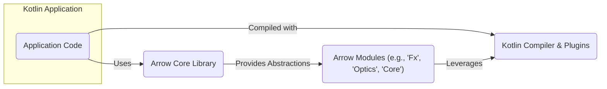
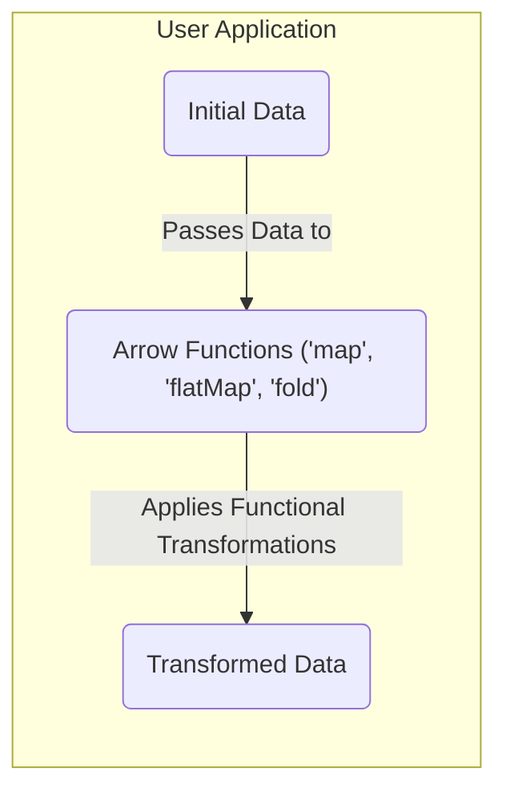
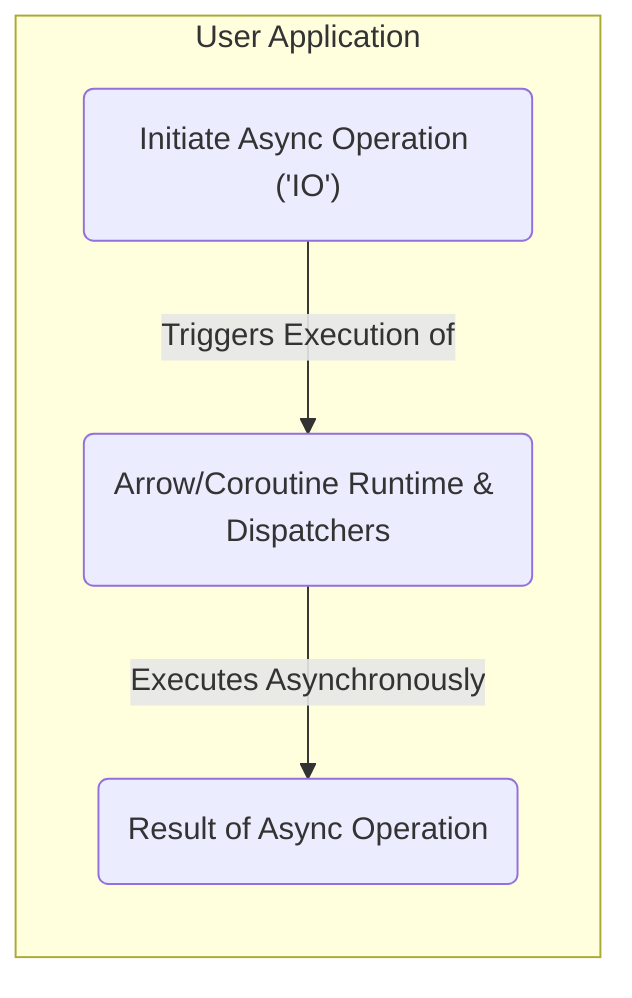

## Project Design Document: Arrow Kotlin Functional Programming Library

**Version:** 1.1
**Date:** October 26, 2023
**Author:** Gemini (AI Language Model)

### 1. Project Overview

Arrow is a comprehensive functional programming library for the Kotlin ecosystem. It provides a rich set of abstractions, data types, and type classes that empower developers to build robust, composable, and maintainable applications using functional paradigms. This design document details the architectural aspects of Arrow, specifically focusing on elements relevant for subsequent threat modeling activities.

### 2. Goals

* To offer a wide range of immutable data types (e.g., `Option`, `Either`, `Validated`) that enhance type safety and reduce null-related errors.
* To provide core functional type classes (e.g., `Functor`, `Applicative`, `Monad`) that enable abstracting over computational structures.
* To facilitate functional handling of asynchronous operations and side effects through the `IO` type and related constructs within the `arrow-fx-coroutines` module.
* To improve code composability and reduce boilerplate through features like extension functions and syntactic sugar provided by `arrow-syntax`.
* To extend Kotlin's type system with features like higher-kinded types (achieved through compiler plugins) to enable more powerful abstractions.
* To cultivate a vibrant community around functional programming principles in Kotlin.

### 3. Non-Goals

* To replace or significantly alter the core semantics of the Kotlin language itself.
* To introduce a custom runtime environment or virtual machine for executing Kotlin code.
* To dictate a specific application architecture beyond promoting functional programming best practices.
* To provide solutions for every conceivable programming problem; the focus remains on functional solutions and patterns.
* To be a framework for building user interfaces or handling specific platform-level concerns (e.g., database interactions, networking) directly, though it provides tools to manage these functionally.

### 4. Target Audience

* Kotlin developers who are actively seeking to apply functional programming principles in their projects.
* Teams working on applications where immutability, referential transparency, and type safety are paramount for correctness and maintainability.
* Library and framework authors within the Kotlin ecosystem who aim to build functional APIs and abstractions.
* Developers looking for principled ways to manage asynchronous operations, concurrency, and side effects in Kotlin.
* Individuals and organizations interested in leveraging the benefits of functional programming for improved code quality and reasoning.

### 5. High-Level Architecture

Arrow is primarily a compile-time library that integrates directly with the Kotlin compilation process. Its core functionalities are implemented as Kotlin code, including interfaces, abstract classes, data classes, and extension functions. Compiler plugins play a crucial role in enabling advanced type system features.

* **Application Code:** This represents the user's Kotlin application code that imports and utilizes the various components of the Arrow library.
* **Arrow Core Library:** This module provides the foundational functional data types (like `Option`, `Either`) and core type classes (`Functor`, `Applicative`, `Monad`).
* **Arrow Modules:** Arrow is organized into distinct modules, each offering specific functional capabilities. Examples include `arrow-fx-coroutines` for effect management, `arrow-optics` for immutable data manipulation, and `arrow-core` for fundamental types.
* **Kotlin Compiler & Plugins:** The standard Kotlin compiler, enhanced by Arrow's compiler plugins, processes the application code and Arrow library code. The plugins enable features like higher-kinded types.

### 6. Component Breakdown

Arrow's functionality is delivered through a modular design. Key components include:

* **`arrow-core`:**
    * Provides fundamental immutable data types: `Option` (for handling nullable values), `Either` (for representing computations that can fail), `Validated` (for accumulating validation errors), `Tuple` (for grouping values).
    * Defines core functional type classes: `Functor` (for mapping over structures), `Applicative` (for applying functions to values in a context), `Monad` (for sequencing computations), `Traverse` (for working with collections of contextual values).
    * Offers utility functions for working with these types, such as `map`, `flatMap`, `fold`, and combinators.
* **`arrow-fx-coroutines`:**
    * Enables functional handling of asynchronous operations and side effects using the `IO` type, which represents a computation that can perform side effects.
    * Provides `Resource` for managing resources that need to be acquired and released safely.
    * Integrates deeply with Kotlin Coroutines, allowing for structured concurrency and asynchronous programming in a functional style.
    * Offers types like `DeferredK` and `ReceiveChannelOf` for interoperability with coroutine primitives.
* **`arrow-optics`:**
    * Provides tools for accessing and modifying immutable data structures in a type-safe and composable way.
    * Introduces concepts like `Lens` (for focusing on a single field), `Prism` (for focusing on a specific case in a sealed class), and `Traversal` (for focusing on multiple elements within a structure).
    * Enables updating deeply nested immutable objects without modifying the original object.
* **`arrow-mtl`:**
    * Offers Monad Transformers, which allow for combining and composing different monadic contexts (e.g., combining `Option` and `Either`).
    * Provides a way to manage multiple layers of monadic effects.
* **`arrow-syntax`:**
    * Provides syntactic sugar and extension functions to make working with Arrow's core types more ergonomic and readable.
    * Includes features like infix functions and operator overloading for a more natural functional programming style.
* **Compiler Plugins:**
    * These plugins extend the Kotlin compiler to enable features that are not natively supported by the language, such as higher-kinded types.
    * They perform code transformations and generate boilerplate code at compile time.
* **Annotations:**
    * Annotations are used to guide the compiler plugins and provide metadata for code generation or analysis. For example, annotations might be used to indicate that a certain type should be treated as having a higher-kind.

### 7. Data Flow

The primary "data flow" within the context of Arrow involves the transformation and manipulation of data within a user's application using Arrow's functional constructs.

* **Initial Data:** The starting data within the user's application that will be processed using Arrow's functions. This data is typically immutable.
* **Arrow Functions:** Functions provided by the Arrow library (e.g., `map` to transform data, `flatMap` to sequence computations, `fold` to reduce a structure to a single value) are applied to the data. These functions operate on the data without modifying it in place, adhering to immutability principles.
* **Transformed Data:** The resulting data after the functional transformations have been applied. This new data is a result of the computations performed by the Arrow functions.

For asynchronous operations managed by `arrow-fx-coroutines`:

* **Initiate Async Operation ('IO'):** The user's code constructs an `IO` value, which represents a description of an asynchronous computation or a side-effecting operation. This `IO` value itself doesn't execute the operation immediately.
* **Arrow/Coroutine Runtime & Dispatchers:** When the `IO` value is run (e.g., using `unsafeRunSync` or by launching it within a coroutine), the Kotlin Coroutine runtime, potentially using specific dispatchers, executes the asynchronous operation described by the `IO`.
* **Result of Async Operation:** The final result of the asynchronous computation, wrapped within the `IO` context. The `IO` type ensures that side effects are managed and controlled.

### 8. Security Considerations

As a library, Arrow's direct security vulnerabilities are primarily related to how it's used within a larger application and the security of its dependencies.

* **Dependency Vulnerabilities:** Arrow depends on other Kotlin libraries and potentially Java libraries. Vulnerabilities in these transitive dependencies could indirectly affect applications using Arrow. Regularly updating dependencies is crucial.
* **Compiler Plugin Issues:** While less common, vulnerabilities or bugs in Arrow's compiler plugins could theoretically lead to unexpected or insecure code generation. This could manifest as subtle bugs that are hard to detect. Thorough testing and community review of the plugins are important.
* **Misuse of Functional Constructs:** Incorrect or insecure usage of Arrow's features can introduce vulnerabilities in the user's application. Examples include:
    * **Improper handling of `IO`:** Failing to handle exceptions within `IO` blocks or using `unsafeRunSync` inappropriately can lead to unexpected behavior or crashes.
    * **Resource leaks:** If `Resource` is not used correctly, it can lead to resource leaks (e.g., open file handles, database connections).
    * **Logical errors in transformations:** Incorrectly implemented functional transformations could lead to data corruption or incorrect business logic.
* **Denial of Service (DoS):** While less likely to originate directly from Arrow, computationally intensive operations within functional pipelines, if not designed carefully, could contribute to DoS vulnerabilities in the user's application. For example, deeply nested recursive computations or inefficient data processing.
* **Information Disclosure (Indirect):** If Arrow is used to process sensitive data, vulnerabilities in the user's application logic (e.g., logging sensitive data within a `map` operation) could lead to information disclosure. Arrow itself doesn't inherently introduce these vulnerabilities but can be a part of the data flow.
* **Supply Chain Attacks:**  Compromised dependencies or malicious code injected into the Arrow library itself (though highly unlikely for a well-established project) could pose a significant risk. Verifying the integrity of the library and its dependencies is important.

**Specific areas for threat modeling:**

* **Input Validation:** How does Arrow encourage or enable input validation within functional pipelines using types like `Validated` or custom validation logic within `IO`?
* **Error Handling:** How does Arrow facilitate robust error handling using `Either`, `Validated`, and exception handling within `IO`? What are the potential consequences of unhandled errors?
* **State Management:** How does Arrow's emphasis on immutability impact state management and reduce the risk of race conditions or inconsistent state?
* **Concurrency and Parallelism:** How does `arrow-fx-coroutines` manage concurrency and parallelism? What are the potential risks of race conditions, deadlocks, or other concurrency issues if not used correctly?
* **Code Generation (Compiler Plugins):** What are the potential security implications of the code generated by Arrow's compiler plugins? Are there any known vulnerabilities or areas of concern?
* **Serialization and Deserialization:** If Arrow's data types are serialized or deserialized, are there any potential vulnerabilities related to insecure deserialization?

### 9. Technologies Used

* **Kotlin:** The primary programming language for the library and its users.
* **Kotlin Coroutines:** Used extensively within `arrow-fx-coroutines` for asynchronous programming.
* **Gradle or Maven:** Build tools used for managing Arrow's dependencies and for user projects integrating Arrow.
* **Kotlin Compiler Plugins:** Essential for enabling advanced type system features like higher-kinded types.
* **Java Class Library:** Kotlin interoperates seamlessly with Java, and Arrow may indirectly rely on parts of the Java Class Library.

### 10. Deployment Considerations

Arrow is deployed as a library dependency within a Kotlin project. Developers add Arrow dependencies to their project's build files (e.g., `build.gradle.kts` for Gradle, `pom.xml` for Maven). There is no separate deployment process for Arrow itself. The security of an application using Arrow depends on the overall security posture of the application, its dependencies, and the environment in which it is deployed. Ensuring secure dependency management practices is crucial.

### 11. Future Considerations

* **Further development of new functional abstractions and modules to address emerging needs in the Kotlin ecosystem.**
* **Enhancements to compiler plugins for improved type safety, performance, and developer experience.**
* **Deeper integration with other Kotlin libraries and frameworks.**
* **Exploration of new concurrency models and effect systems within `arrow-fx`.**
* **Continued focus on documentation and community building to promote best practices and secure usage of the library.**

This revised document provides a more detailed and security-focused overview of the Arrow project's architecture, intended to be a valuable resource for subsequent threat modeling activities. The expanded explanations of components, data flow, and security considerations aim to facilitate a more comprehensive analysis of potential vulnerabilities.