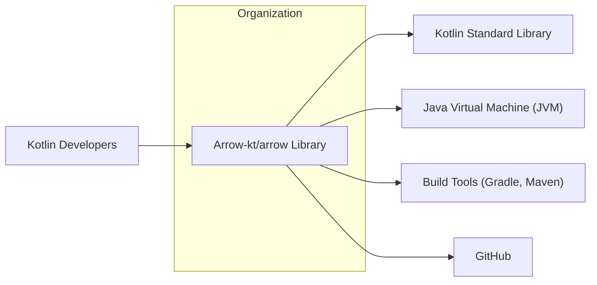
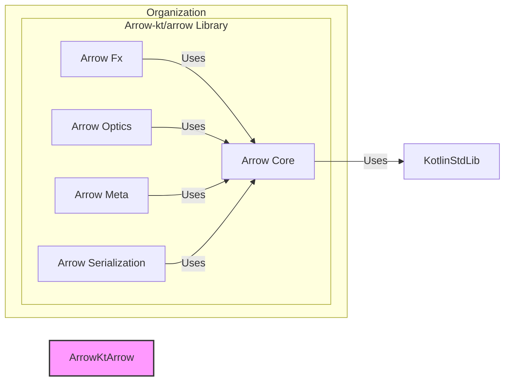

# BUSINESS POSTURE

The Arrow-kt/arrow project is a library for Kotlin that aims to bring functional programming paradigms and tools to the Kotlin ecosystem.

- Business Priorities and Goals:
  - Provide high-quality, robust functional programming tools for Kotlin developers.
  - Increase developer productivity and code quality by enabling functional programming techniques.
  - Foster a strong community around functional programming in Kotlin.
  - Ensure compatibility and interoperability with existing Kotlin and Java ecosystems.

- Business Risks:
  - Adoption risk: The library might not be widely adopted by Kotlin developers.
  - Community risk: Lack of sufficient community contribution and support could hinder the project's growth and maintenance.
  - Compatibility risk: Changes in Kotlin or Java platforms could break compatibility and require significant rework.
  - Security risk: Vulnerabilities in the library could negatively impact projects that depend on it.
  - Maintenance risk: Long-term maintenance and support might be challenging if the project lacks resources or community engagement.

# SECURITY POSTURE

- Security Controls:
  - security control: Open Source Review - The project is open source, allowing for community review of the code. Implemented: GITHUB REPOSITORY.
  - security control: Version Control - Source code is managed in a version control system (Git). Implemented: GITHUB REPOSITORY.
  - security control: Publicly Available - The library is publicly available, allowing for broad scrutiny and usage. Implemented: GITHUB REPOSITORY, MAVEN CENTRAL (or similar).

- Accepted Risks:
  - accepted risk: Dependency Vulnerabilities -  The library depends on other open-source libraries, which might contain vulnerabilities.
  - accepted risk: Code Vulnerabilities -  The library code itself might contain vulnerabilities that are not yet discovered.
  - accepted risk: Supply Chain Risk -  The build and release process might be vulnerable to supply chain attacks.

- Recommended Security Controls:
  - security control: Dependency Scanning - Implement automated dependency scanning to identify known vulnerabilities in dependencies.
  - security control: Static Application Security Testing (SAST) - Integrate SAST tools into the build process to detect potential code vulnerabilities.
  - security control: Software Composition Analysis (SCA) - Use SCA tools to manage and monitor open source components and their licenses.
  - security control: Security Audits - Conduct periodic security audits of the codebase by security experts.
  - security control: Secure Release Process - Implement a secure release process, including code signing and verification of artifacts.

- Security Requirements:
  - Authentication: Not directly applicable to a library. Authentication is relevant for systems that use this library, but not for the library itself.
  - Authorization: Not directly applicable to a library. Authorization is relevant for systems that use this library.
  - Input Validation: Important for library APIs. The library should perform input validation to prevent unexpected behavior or vulnerabilities in systems that use it. This should be considered for all public facing APIs of the library.
  - Cryptography: Potentially relevant if the library provides cryptographic functionalities. If so, ensure proper and secure implementation of cryptographic algorithms and key management. If not, avoid implementing custom cryptography and rely on well-established libraries.

# DESIGN

## C4 CONTEXT



- Context Diagram Elements:
  - - Name: Arrow-kt/arrow Library
    - Type: Software System
    - Description: A Kotlin library providing functional programming tools and abstractions.
    - Responsibilities: Provides functional programming functionalities for Kotlin.
    - Security controls: Input validation in public APIs, dependency management, secure build and release process.
  - - Name: Kotlin Developers
    - Type: Person
    - Description: Developers who use the Arrow-kt/arrow library in their Kotlin projects.
    - Responsibilities: Integrate and utilize the library in their applications.
    - Security controls: Secure coding practices in their applications, proper usage of the library's APIs.
  - - Name: Kotlin Standard Library
    - Type: Software System
    - Description: The standard library provided by Kotlin.
    - Responsibilities: Provides core functionalities for Kotlin language.
    - Security controls: Security controls of the Kotlin Standard Library itself (maintained by JetBrains).
  - - Name: Java Virtual Machine (JVM)
    - Type: Technology
    - Description: The runtime environment for Kotlin code.
    - Responsibilities: Executes Kotlin bytecode.
    - Security controls: Security controls of the JVM itself (maintained by JVM vendors).
  - - Name: Build Tools (Gradle, Maven)
    - Type: Software System
    - Description: Tools used to build, test, and package the Arrow-kt/arrow library and projects that use it.
    - Responsibilities: Dependency management, build automation, packaging.
    - Security controls: Dependency resolution security, plugin security, build script security.
  - - Name: GitHub
    - Type: Software System
    - Description: Platform for hosting the source code repository, issue tracking, and collaboration.
    - Responsibilities: Source code management, version control, issue tracking, CI/CD.
    - Security controls: GitHub's security controls (access control, authentication, audit logs).

## C4 CONTAINER



- Container Diagram Elements:
  - - Name: Arrow Core
    - Type: Library Module
    - Description: Core module providing fundamental functional programming abstractions.
    - Responsibilities: Provides core data types and functions (e.g., Option, Either, Functor, Monad).
    - Security controls: Input validation in public APIs, secure coding practices.
  - - Name: Arrow Fx
    - Type: Library Module
    - Description: Module for functional effect system and concurrency.
    - Responsibilities: Provides tools for asynchronous programming and effect management.
    - Security controls: Secure handling of asynchronous operations, potential concurrency-related security issues.
  - - Name: Arrow Optics
    - Type: Library Module
    - Description: Module for optics (lenses, prisms, etc.) for data manipulation.
    - Responsibilities: Provides tools for accessing and modifying immutable data structures.
    - Security controls: Secure handling of data access and modification.
  - - Name: Arrow Meta
    - Type: Library Module
    - Description: Module for metaprogramming and compiler plugins.
    - Responsibilities: Enables compile-time code generation and manipulation.
    - Security controls: Secure compiler plugin development, preventing malicious code injection during compilation.
  - - Name: Arrow Serialization
    - Type: Library Module
    - Description: Module for functional serialization and deserialization.
    - Responsibilities: Provides tools for serializing and deserializing data structures.
    - Security controls: Secure serialization and deserialization to prevent vulnerabilities like injection attacks or data corruption.

## DEPLOYMENT

The Arrow-kt/arrow library is not deployed as a standalone application but is distributed as a library to be included in other Kotlin projects. The deployment context is therefore the distribution of the library artifacts.

- Deployment Options:
  - Maven Central: The most common way to distribute Java/Kotlin libraries.
  - GitHub Packages: Can be used for hosting packages, including Maven packages.
  - Self-hosted Maven Repository: Less common for public libraries, but possible.

- Detailed Deployment (Maven Central):

```mermaid
graph LR
    subgraph "Maven Central Repository"
        MavenCentral["Maven Central"]
    end
    subgraph "Build Environment"
        BuildServer["Build Server (CI)"]
    end
    Developer["Developer"]

    Developer --> BuildServer: Push Code
    BuildServer --> MavenCentral: Publish Artifacts

    style MavenCentral fill:#ccf,stroke:#333,stroke-width:2px
    style BuildServer fill:#eee,stroke:#333,stroke-width:2px
```

- Deployment Diagram Elements (Maven Central):
  - - Name: Maven Central
    - Type: Package Repository
    - Description: Public repository for Maven artifacts, used to distribute Java and Kotlin libraries.
    - Responsibilities: Hosting and distributing the library artifacts.
    - Security controls: Maven Central's security controls (artifact verification, malware scanning).
  - - Name: Build Server (CI)
    - Type: Infrastructure
    - Description: Automated build environment (e.g., GitHub Actions) used to build, test, and publish the library.
    - Responsibilities: Automated build, testing, and publishing of the library.
    - Security controls: Secure build pipelines, access control to build environment, secrets management.
  - - Name: Developer
    - Type: Person
    - Description: Developers contributing to the Arrow-kt/arrow project.
    - Responsibilities: Writing code, committing changes, triggering builds.
    - Security controls: Secure development practices, code review, access control to the repository.

## BUILD

```mermaid
graph LR
    subgraph "Developer Environment"
        Developer["Developer"]
    end
    subgraph "CI Environment (GitHub Actions)"
        SourceCode["Source Code Repository (GitHub)"]
        BuildAutomation["Build Automation (GitHub Actions)"]
        DependencyManagement["Dependency Management (Gradle)"]
        Testing["Automated Testing"]
        SAST["SAST Scanner"]
        ArtifactRepository["Artifact Repository (Maven Central Staging)"]
    end
    Artifacts["Library Artifacts (JARs, POMs)"]

    Developer --> SourceCode: Push Code
    SourceCode --> BuildAutomation: Trigger Build
    BuildAutomation --> DependencyManagement: Resolve Dependencies
    BuildAutomation --> Testing: Run Tests
    BuildAutomation --> SAST: Run SAST
    BuildAutomation --> ArtifactRepository: Publish Artifacts
    ArtifactRepository --> Artifacts: Release to Maven Central

    style Developer fill:#cdf,stroke:#333,stroke-width:2px
    style CIEnvironment fill:#eee,stroke:#333,stroke-width:2px
    style Artifacts fill:#fcc,stroke:#333,stroke-width:2px
```

- Build Diagram Elements:
  - - Name: Developer
    - Type: Person
    - Description: Software developer contributing to the project.
    - Responsibilities: Writes code, performs local builds and tests, commits code.
    - Security controls: Secure development environment, code review.
  - - Name: Source Code Repository (GitHub)
    - Type: Software System
    - Description: Git repository hosted on GitHub, containing the project's source code.
    - Responsibilities: Version control, source code storage, collaboration.
    - Security controls: GitHub's security controls (access control, branch protection, audit logs).
  - - Name: Build Automation (GitHub Actions)
    - Type: Software System
    - Description: GitHub Actions workflows used for CI/CD.
    - Responsibilities: Automated build, test, static analysis, and deployment.
    - Security controls: Secure workflow configuration, secrets management, access control to workflows.
  - - Name: Dependency Management (Gradle)
    - Type: Software System
    - Description: Gradle build tool used for dependency management and build automation.
    - Responsibilities: Resolving dependencies, managing build process.
    - Security controls: Dependency resolution integrity (e.g., using dependency lock files, verifying checksums).
  - - Name: Testing
    - Type: Software System
    - Description: Automated testing framework used to run unit and integration tests.
    - Responsibilities: Ensuring code quality and functionality.
    - Security controls: Security tests (if applicable), test coverage for security-relevant code.
  - - Name: SAST Scanner
    - Type: Software System
    - Description: Static Application Security Testing tool integrated into the build pipeline.
    - Responsibilities: Identifying potential security vulnerabilities in the source code.
    - Security controls: Configuration and maintenance of SAST tool, remediation of findings.
  - - Name: Artifact Repository (Maven Central Staging)
    - Type: Software System
    - Description: Staging repository for Maven artifacts before publishing to Maven Central.
    - Responsibilities: Staging and verification of artifacts before public release.
    - Security controls: Access control to staging repository, artifact verification.
  - - Name: Library Artifacts (JARs, POMs)
    - Type: Data
    - Description: Compiled JAR files and POM files representing the released library.
    - Responsibilities: Distribution of the library to users.
    - Security controls: Code signing, artifact integrity verification (checksums).

# RISK ASSESSMENT

- Critical Business Processes:
  - Distribution of the Arrow-kt/arrow library to Kotlin developers.
  - Maintaining the integrity and availability of the library.
  - Ensuring the library is free from critical security vulnerabilities that could impact users.

- Data to Protect and Sensitivity:
  - Source Code: Publicly available, but integrity and availability are important to prevent malicious modifications. Sensitivity: Public, Integrity and Availability are important.
  - Build Artifacts (JARs, POMs): Publicly distributed, integrity is critical to prevent supply chain attacks. Sensitivity: Public, Integrity is critical.
  - Developer Credentials and Secrets: Used for build and deployment processes. Sensitivity: Confidential, High.
  - Issue Tracker Data: Publicly available, but integrity is important for community trust. Sensitivity: Public, Integrity is important.

# QUESTIONS & ASSUMPTIONS

- Questions:
  - What is the target audience for this design document (e.g., security team, development team, management)?
  - Are there any specific security compliance requirements that the project needs to adhere to (e.g., SOC 2, ISO 27001)?
  - What is the risk appetite of the organization or community behind the Arrow-kt/arrow project?
  - Are there any specific security incidents or concerns that have prompted this design document?
  - What is the process for handling security vulnerabilities discovered in the library?

- Assumptions:
  - The primary goal is to provide a functional programming library for Kotlin developers.
  - Security is important but not the absolute highest priority compared to functionality and usability.
  - The project is developed and maintained by a community or organization with limited resources dedicated to security.
  - The library is intended for general-purpose use in various types of Kotlin projects.
  - The project follows standard open-source development practices.
  - The deployment target is primarily Maven Central for distribution.