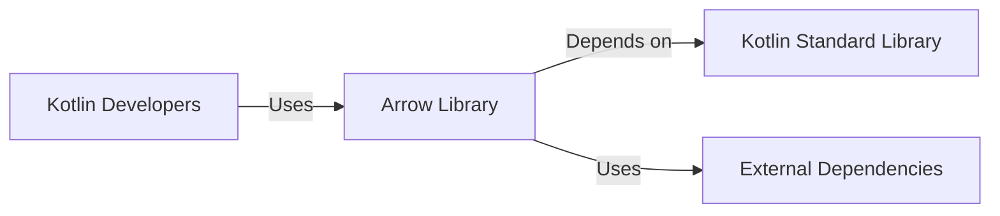
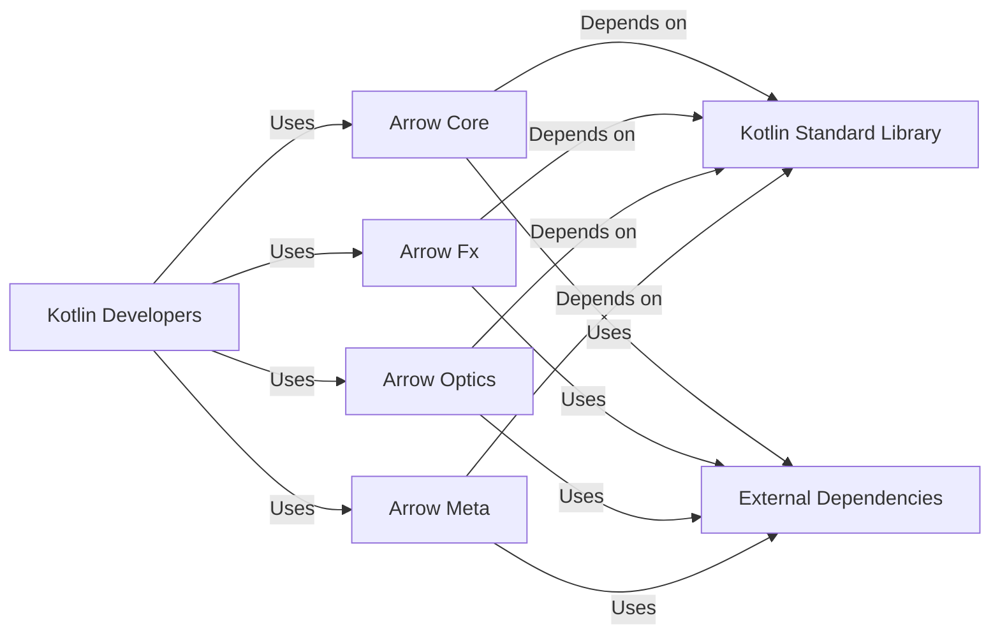
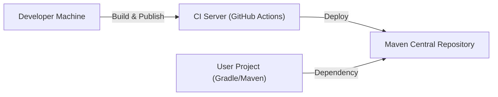
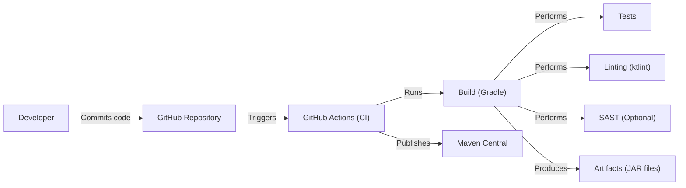

# BUSINESS POSTURE

Business Priorities and Goals:

*   Provide a functional programming library for Kotlin to enhance developer productivity and code maintainability.
*   Attract and grow a community of users and contributors around the library.
*   Establish Arrow as a leading functional programming library in the Kotlin ecosystem.
*   Ensure the library is reliable, performant, and well-documented.
*   Offer features that promote type safety and reduce common programming errors.

Business Risks:

*   Low adoption rate due to competition from other libraries or lack of awareness.
*   Difficulty in maintaining the library due to its complexity and evolving Kotlin language features.
*   Security vulnerabilities introduced through dependencies or custom code, potentially leading to exploits in applications using Arrow.
*   Negative impact on project reputation due to bugs, performance issues, or lack of support.
*   Inability to keep up with the evolving Kotlin ecosystem and functional programming best practices.

# SECURITY POSTURE

Existing Security Controls:

*   security control: The project uses GitHub for version control, which provides built-in security features like access control, audit logs, and branch protection rules. (Described in GitHub repository settings and workflows).
*   security control: The project utilizes GitHub Actions for continuous integration, which can be configured to run security checks. (Described in GitHub workflow files).
*   security control: The project may have code quality checks and linters in place to identify potential issues. (Described in build configuration files and GitHub workflows).
*   security control: Dependency management is handled by Gradle, which allows for specifying versions and potentially using vulnerability scanning tools. (Described in build.gradle.kts files).

Accepted Risks:

*   accepted risk: The library relies on external dependencies, which may introduce vulnerabilities. Mitigation strategies include regular dependency updates and vulnerability scanning.
*   accepted risk: The complexity of functional programming concepts and the library's internals may increase the risk of subtle bugs or security flaws. Mitigation strategies include thorough testing and code reviews.

Recommended Security Controls:

*   security control: Implement static application security testing (SAST) tools in the CI pipeline to automatically scan for vulnerabilities in the codebase.
*   security control: Integrate software composition analysis (SCA) tools to identify known vulnerabilities in dependencies and manage their updates.
*   security control: Establish a clear security policy and vulnerability disclosure process for the project.
*   security control: Conduct regular security reviews and penetration testing of the library.
*   security control: Provide security documentation and guidance for users of the library.

Security Requirements:

*   Authentication: Not directly applicable to the library itself, as it's a dependency used within other applications. However, any supporting infrastructure (e.g., documentation websites, package repositories) should have appropriate authentication mechanisms.
*   Authorization: Not directly applicable to the library itself. Authorization is the responsibility of the applications using Arrow.
*   Input Validation: The library should employ defensive programming techniques to handle unexpected inputs gracefully and prevent potential vulnerabilities like injection attacks. This is particularly relevant for functions that deal with external data or user-provided inputs.
*   Cryptography: If the library includes any cryptographic functionality, it should adhere to industry best practices and use well-vetted cryptographic libraries. Avoid implementing custom cryptography.

# DESIGN

## C4 CONTEXT

Element Descriptions:

*   Element:
    *   Name: Kotlin Developers
    *   Type: User
    *   Description: Developers who use the Arrow library in their Kotlin projects.
    *   Responsibilities: Utilize Arrow's functionalities to write functional code, handle errors, and manage data.
    *   Security controls: Not directly applicable, as these are external users.

*   Element:
    *   Name: Arrow Library
    *   Type: System
    *   Description: The Arrow functional programming library for Kotlin.
    *   Responsibilities: Provide functional programming constructs, data types, and type classes to Kotlin developers.
    *   Security controls: Input validation, dependency management, secure coding practices.

*   Element:
    *   Name: Kotlin Standard Library
    *   Type: System
    *   Description: The standard library provided by the Kotlin language.
    *   Responsibilities: Provide core functionalities and data structures used by Arrow.
    *   Security controls: Relies on the security of the Kotlin standard library itself.

*   Element:
    *   Name: External Dependencies
    *   Type: System
    *   Description: Third-party libraries that Arrow depends on.
    *   Responsibilities: Provide specific functionalities required by Arrow.
    *   Security controls: Dependency management, vulnerability scanning.

## C4 CONTAINER

Element Descriptions:

*   Element:
    *   Name: Kotlin Developers
    *   Type: User
    *   Description: Developers who use the Arrow library in their Kotlin projects.
    *   Responsibilities: Utilize Arrow's functionalities to write functional code, handle errors, and manage data.
    *   Security controls: Not directly applicable.

*   Element:
    *   Name: Arrow Core
    *   Type: Container
    *   Description: Provides core data types and type classes (e.g., Either, Option, IO).
    *   Responsibilities: Foundation for other Arrow modules.
    *   Security controls: Input validation, secure coding practices.

*   Element:
    *   Name: Arrow Fx
    *   Type: Container
    *   Description: Provides functionalities for concurrent and asynchronous programming.
    *   Responsibilities: Manage side effects and concurrency.
    *   Security controls: Secure handling of concurrency, thread safety.

*   Element:
    *   Name: Arrow Optics
    *   Type: Container
    *   Description: Provides optics for working with immutable data structures.
    *   Responsibilities: Facilitate data manipulation in a functional way.
    *   Security controls: Secure handling of data transformations.

*   Element:
    *   Name: Arrow Meta
    *   Type: Container
    *   Description: Provides compiler plugins and code generation capabilities.
    *   Responsibilities: Extend Kotlin's compiler with functional programming features.
    *   Security controls: Secure code generation, prevention of injection vulnerabilities.

*   Element:
    *   Name: Kotlin Standard Library
    *   Type: System
    *   Description: The standard library provided by the Kotlin language.
    *   Responsibilities: Provide core functionalities and data structures used by Arrow.
    *   Security controls: Relies on the security of the Kotlin standard library itself.

*   Element:
    *   Name: External Dependencies
    *   Type: System
    *   Description: Third-party libraries that Arrow depends on.
    *   Responsibilities: Provide specific functionalities required by Arrow.
    *   Security controls: Dependency management, vulnerability scanning.

## DEPLOYMENT

Possible deployment solutions:

1.  Published to Maven Central: Developers include Arrow as a dependency in their projects using build tools like Gradle or Maven.
2.  Published to a private repository: Organizations may host their own artifact repository for internal use.
3.  Built from source: Developers can clone the repository and build the library locally.

Chosen solution (Maven Central):

Element Descriptions:

*   Element:
    *   Name: Developer Machine
    *   Type: Node
    *   Description: The developer's local environment where code is written and tested.
    *   Responsibilities: Code development, testing, and initiating the build process.
    *   Security controls: Secure coding practices, local security configurations.

*   Element:
    *   Name: CI Server (GitHub Actions)
    *   Type: Node
    *   Description: The continuous integration server that automates the build, test, and deployment process.
    *   Responsibilities: Run builds, tests, and deploy artifacts.
    *   Security controls: Access control, secure configuration of CI workflows, secret management.

*   Element:
    *   Name: Maven Central Repository
    *   Type: Node
    *   Description: The public repository where Arrow artifacts are published.
    *   Responsibilities: Store and distribute Arrow library artifacts.
    *   Security controls: Access control, integrity checks, vulnerability scanning (managed by Maven Central).

*   Element:
    *   Name: User Project (Gradle/Maven)
    *   Type: Node
    *   Description: A Kotlin project that uses Arrow as a dependency.
    *   Responsibilities: Include Arrow as a dependency and utilize its functionalities.
    *   Security controls: Dependency management, secure configuration of build tools.

## BUILD

Build Process Description:

1.  Developers commit code to the GitHub repository.
2.  GitHub Actions is triggered by commits or pull requests.
3.  The GitHub Actions workflow sets up the build environment (e.g., Java, Kotlin, Gradle).
4.  Gradle is used to build the project. This includes:
    *   Compiling the code.
    *   Running unit and integration tests.
    *   Performing linting checks (e.g., using ktlint).
    *   Optionally, running SAST tools for static code analysis.
5.  If all checks pass, Gradle produces the library artifacts (JAR files).
6.  GitHub Actions publishes the artifacts to Maven Central.

Security Controls in Build Process:

*   security control: GitHub Actions workflows are defined in code (YAML files) and version-controlled, providing an audit trail of changes.
*   security control: Secrets (e.g., API keys, publishing credentials) are managed securely using GitHub Actions secrets.
*   security control: Linting tools (ktlint) help enforce code style and identify potential issues.
*   security control: SAST tools (optional, but recommended) can be integrated into the build process to detect vulnerabilities.
*   security control: Dependency management (Gradle) allows for specifying versions and using vulnerability scanning tools.
*   security control: Build process is automated, reducing the risk of manual errors and ensuring consistency.

# RISK ASSESSMENT

Critical Business Processes:

*   Software development using the Arrow library: Ensuring the library is reliable, secure, and performs well is crucial for developers relying on it.
*   Community engagement: Maintaining a healthy and active community is important for the long-term success of the project.
*   Reputation management: Protecting the reputation of the Arrow project and its contributors.

Data Sensitivity:

*   The library itself does not handle sensitive data directly. However, it's used to build applications that might handle sensitive data. Therefore, the library must be secure to avoid introducing vulnerabilities into those applications.
*   The library's source code and build artifacts are publicly available.
*   Any data handled by CI/CD pipelines (e.g., secrets) should be treated as sensitive.

# QUESTIONS & ASSUMPTIONS

Questions:

*   Are there any specific compliance requirements (e.g., GDPR, HIPAA) that applications built using Arrow typically need to adhere to?
*   What is the expected threat model for applications using Arrow? (e.g., web applications, mobile apps, backend services)
*   What is the current level of security expertise within the Arrow development team?
*   Are there any existing security audits or penetration tests performed on the library?
*   What is the process for handling security vulnerabilities reported by external researchers?

Assumptions:

*   BUSINESS POSTURE: The primary goal is to provide a robust and reliable functional programming library for Kotlin.
*   BUSINESS POSTURE: The project has a moderate risk appetite, balancing innovation with stability and security.
*   SECURITY POSTURE: The project follows basic secure development practices, but there's room for improvement.
*   SECURITY POSTURE: Developers using Arrow are responsible for the overall security of their applications.
*   DESIGN: The library is primarily used as a dependency in other Kotlin projects.
*   DESIGN: The build and deployment process is automated using GitHub Actions and Maven Central.
*   DESIGN: The project structure follows standard Kotlin and Gradle conventions.