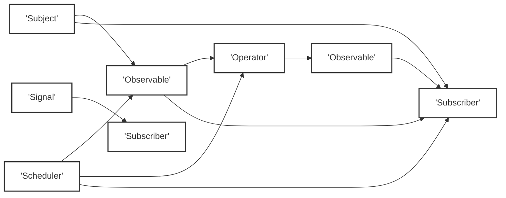
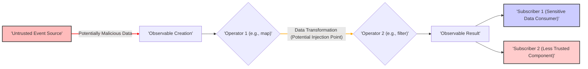

# Project Design Document: Reaktive Library (Improved for Threat Modeling)

**Version:** 1.1
**Date:** October 26, 2023
**Prepared By:** AI Software Architect

## 1. Introduction

This document provides an enhanced architectural overview of the Reaktive library, a Kotlin library for building reactive applications. This version is specifically tailored to facilitate threat modeling, providing detailed insights into the library's components, interactions, and data flow with a focus on potential security implications.

## 2. Goals

The primary goals of this design document are:

* To provide a clear and detailed description of the Reaktive library's architecture, emphasizing aspects relevant to security.
* To identify key components and their responsibilities, highlighting potential security boundaries and trust zones.
* To illustrate the data flow within the library and between its components, pinpointing potential data manipulation and interception points.
* To outline the main functionalities and use cases of Reaktive from a security perspective.
* To serve as a robust foundation for identifying potential security threats, vulnerabilities, and attack vectors during threat modeling activities.

## 3. Scope

This document covers the core architectural aspects of the Reaktive library relevant to security analysis, including:

* Core reactive primitives (Observables, Subjects, Signals) and their potential for misuse.
* Schedulers and concurrency management, focusing on potential race conditions and data corruption.
* Operators for transforming and combining reactive streams, highlighting risks of data manipulation and injection.
* Disposable resources and lifecycle management, emphasizing the impact of resource leaks and dangling subscriptions.
* Interoperability points with other Kotlin and Java libraries, identifying potential attack surfaces.

This document does not cover:

* The internal implementation details of individual operators beyond their functional behavior.
* Performance characteristics unless directly relevant to security (e.g., denial of service).
* Detailed code-level analysis or specific vulnerability findings.
* Security best practices for the Kotlin language or the JVM in general, unless directly related to Reaktive's usage.

## 4. High-Level Architecture

Reaktive facilitates asynchronous data processing through reactive streams. Understanding the interaction of its core components is crucial for identifying potential security weaknesses.

**Key Components (Security Perspective):**

* **Observable:** Represents a potentially untrusted data source or a channel for sensitive information. Improper handling can lead to information leaks or manipulation.
* **Subscriber:**  The data consumer, which needs to be protected from malicious data or unexpected behavior from the Observable.
* **Operator:**  Transformation logic that can be exploited to inject malicious data or alter the intended data flow if not carefully implemented or used.
* **Subject:** A point of potential vulnerability if not properly secured, as it acts as both producer and consumer, potentially amplifying security risks.
* **Scheduler:** Controls the execution context, and its misconfiguration can lead to concurrency issues and race conditions, potentially exploitable for denial of service or data corruption.
* **Signal:** Represents a single event, often indicating the outcome of an operation. Secure handling of error signals is crucial to prevent information disclosure.

## 5. Detailed Component Descriptions (Security Focus)

* **Observable:**
    * Can emit data originating from untrusted sources (e.g., user input, network requests).
    * Cold Observables might re-execute side effects upon multiple subscriptions, potentially leading to unintended consequences if those side effects are security-sensitive.
    * Hot Observables share emissions, so a malicious actor might influence data received by other subscribers if the Subject is not properly secured.

* **Subscriber:**
    * Needs to be resilient to malformed or malicious data emitted by the Observable to prevent crashes or unexpected behavior.
    * Unsubscribing is crucial to prevent resource leaks and potential denial-of-service scenarios.
    * Error handling within the Subscriber must be robust to prevent information disclosure through error messages.

* **Operator:**
    * Custom operators introduce the risk of introducing vulnerabilities if not implemented securely (e.g., improper input validation, insecure data transformation).
    * Operators like `flatMap` or `switchMap` that create new Observables based on emitted items can be exploited if the emitted items are attacker-controlled.
    * Operators that perform side effects (e.g., logging, external API calls) need careful consideration to avoid unintended security implications.

* **Subject:**
    * `PublishSubject`: Any subscriber can receive emissions, potentially exposing sensitive information if not used in a controlled manner.
    * `BehaviorSubject`:  Subscribers receive the last emitted item upon subscription, which might be sensitive.
    * `ReplaySubject`: Can replay past emissions, potentially revealing historical sensitive data to new subscribers.
    * Subjects that allow external entities to emit data require strict authorization and validation.

* **Scheduler:**
    * Using the `io()` scheduler for CPU-bound tasks can lead to performance issues and potential denial of service.
    * Sharing mutable state across different Schedulers without proper synchronization can lead to race conditions and data corruption.
    * Custom Schedulers might introduce security vulnerabilities if not implemented carefully.

* **Signal:**
    * Error signals might contain sensitive information about the failure. Proper sanitization and logging are necessary.
    * Completion signals might trigger subsequent actions that have security implications.

## 6. Data Flow (Security Perspective)

Understanding how data flows through Reaktive components is essential for identifying potential interception, manipulation, or leakage points.

**Detailed Data Flow Steps (Security Considerations):**

1. **Untrusted Event Source:** Data originates from an external source that might be compromised or malicious. This is a primary entry point for attacks.
2. **Observable Creation:**  Wrapping untrusted data into an Observable without proper sanitization can propagate vulnerabilities.
3. **Operator Chain (Potential Vulnerabilities):**
    * **Data Transformation:** Operators like `map` or custom operators can be exploited to inject malicious code or manipulate data if input validation is missing.
    * **Filtering:** Improperly implemented filters might allow malicious data to pass through.
    * **Combining:** Combining data streams from different sources without proper validation can introduce vulnerabilities.
4. **Scheduling (Concurrency Risks):**  Concurrent processing on different Schedulers without proper synchronization can lead to race conditions and data corruption, especially if shared mutable state is involved.
5. **Subscription:**  Subscribers need to be prepared to handle potentially malicious data.
6. **Data Emission:** Emitting unsanitized data to Subscribers can lead to vulnerabilities in the consuming components.
7. **Data Consumption:** Subscribers might perform security-sensitive actions based on the received data, making input validation crucial.
8. **Completion or Error (Information Disclosure):** Error signals might reveal sensitive information about the system or the data processing pipeline.

## 7. Key Interactions and Interfaces (Security Implications)

* **Observable and Subscriber:** The `subscribe()` method establishes a trust relationship. The Subscriber implicitly trusts the Observable to emit valid and safe data. This trust needs to be carefully managed, especially with external or untrusted Observables.
* **Observable and Operator:** Operators act as intermediaries in the data flow. Malicious or poorly implemented operators can intercept, modify, or inject data.
* **Observable and Scheduler:** The interaction with Schedulers introduces concurrency considerations. Improper synchronization can lead to race conditions where data integrity is compromised.
* **Subject as Observable and Observer:** Subjects require careful access control and validation to prevent unauthorized emission or consumption of data.
* **Disposable Interface:**  Failure to dispose of resources can lead to resource leaks, potentially causing denial of service. Dangling subscriptions might continue processing data or holding onto sensitive information longer than necessary.

## 8. Security Considerations (Detailed)

* **Input Validation:**  Any data entering a Reaktive stream from an external source should be rigorously validated to prevent injection attacks and other forms of malicious input.
* **Output Sanitization:** Data emitted to Subscribers, especially if destined for external systems or user interfaces, needs to be sanitized to prevent cross-site scripting (XSS) or other output-related vulnerabilities.
* **Error Handling and Information Disclosure:**  Error handling logic should avoid exposing sensitive information in error messages or logs. Consider using generic error messages and logging detailed error information securely.
* **Concurrency Control and Race Conditions:** When using multiple Schedulers or shared mutable state, proper synchronization mechanisms (e.g., locks, atomic variables) are essential to prevent race conditions and data corruption.
* **Resource Management and Disposal:** Ensure proper disposal of subscriptions and other resources to prevent memory leaks and potential denial-of-service vulnerabilities. Use `Disposable` effectively.
* **Backpressure Handling:**  Implement appropriate backpressure strategies to prevent overwhelming Subscribers and potentially causing resource exhaustion or denial of service.
* **Third-Party Operator Security:** Exercise caution when using third-party or custom operators, as they might contain vulnerabilities. Review their code and understand their security implications.
* **Subject Security:** Implement appropriate access controls and validation mechanisms for Subjects, especially if they are used to broadcast data to multiple consumers or allow external entities to emit data.
* **Scheduler Security:** Be mindful of the security implications of different Schedulers. Avoid using the `io()` scheduler for CPU-intensive tasks, and ensure proper synchronization when sharing state across different execution contexts.

## 9. Technology Stack

* **Kotlin:** The primary language. Security considerations for Kotlin code (e.g., null safety, data classes) are relevant.
* **Kotlin Coroutines:**  Security implications of using coroutines, such as proper cancellation and handling of exceptions in coroutine contexts, should be considered.
* **JVM (Java Virtual Machine):**  Underlying platform. JVM security considerations (e.g., sandbox environments, security managers) might be relevant depending on the deployment context.

## 10. Deployment Considerations (Security Impact)

* **Application Type:** The security requirements and potential attack vectors will vary depending on the type of application (e.g., web application, mobile app, backend service).
* **Trust Boundaries:** Identify trust boundaries within the application and how Reaktive streams cross these boundaries. Data flowing across trust boundaries requires careful scrutiny.
* **Containerization and Orchestration:** If deployed in containers (e.g., Docker, Kubernetes), ensure proper security configurations for the container environment.
* **Access Control:** Implement appropriate access controls to protect resources and data accessed by the application using Reaktive.

## 11. Threat Modeling Focus Areas (Specific and Actionable)

The threat modeling exercise should specifically focus on:

* **STRIDE analysis on data flowing through Observables and Operators:** Identify Spoofing, Tampering, Repudiation, Information Disclosure, Denial of Service, and Elevation of Privilege threats related to data manipulation and flow.
* **Analyzing custom Operators for potential injection vulnerabilities:**  Review the implementation of custom operators for weaknesses that could allow malicious code or data to be injected.
* **Identifying potential race conditions and deadlocks related to Scheduler usage:** Analyze how different Schedulers are used and whether shared mutable state is properly synchronized.
* **Evaluating the security of Subjects and their potential for unauthorized access or manipulation:** Assess access controls and validation mechanisms for Subjects.
* **Analyzing error handling paths for information disclosure vulnerabilities:** Review error logging and error propagation mechanisms to ensure sensitive information is not leaked.
* **Assessing the impact of resource leaks due to improper `Disposable` management:**  Identify scenarios where subscriptions might not be properly disposed of, leading to resource exhaustion.
* **Evaluating the security of interoperability points with other libraries:** Analyze how Reaktive interacts with other libraries and identify potential vulnerabilities at these integration points.

This improved design document provides a more security-focused perspective on the Reaktive library's architecture, offering a stronger foundation for effective threat modeling.
