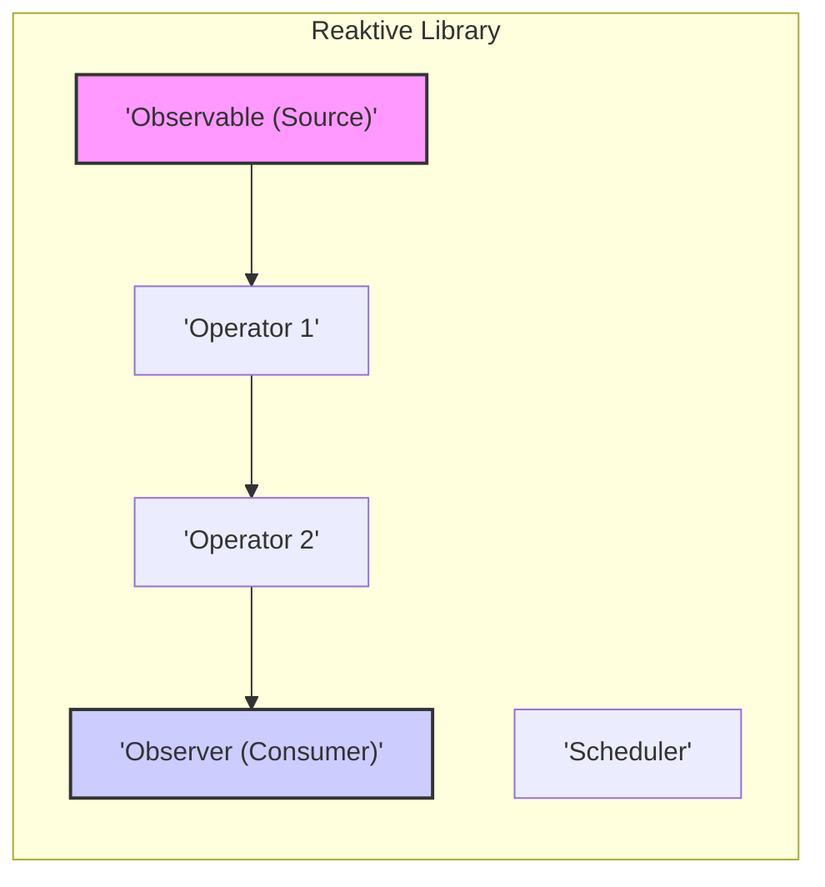
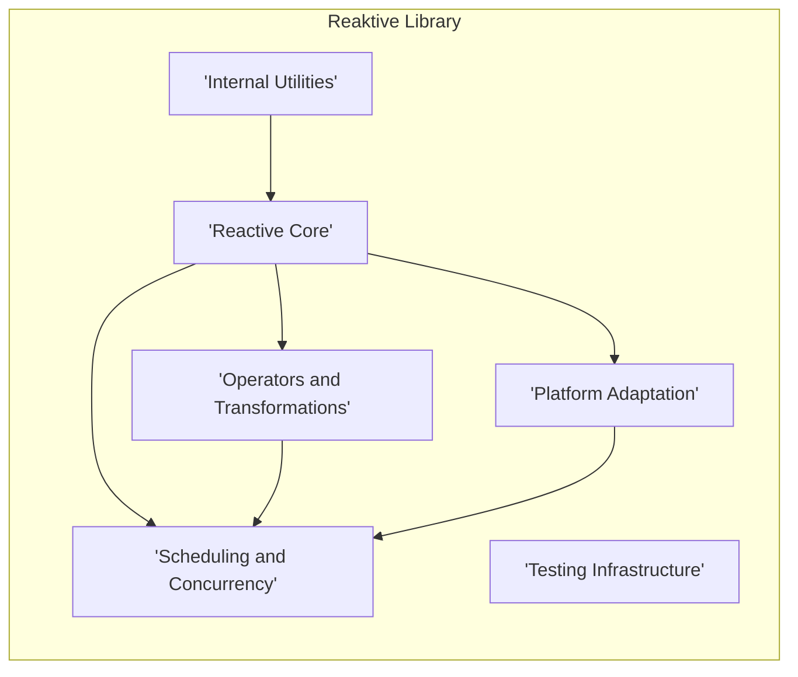
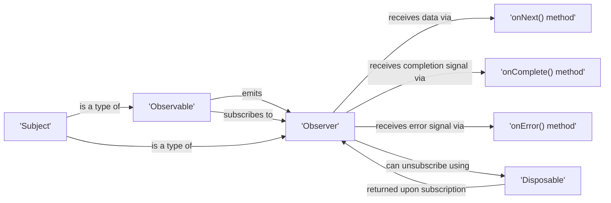

## Project Design Document: Reaktive (Improved)

**1. Introduction**

This document provides an enhanced design overview of the Reaktive project, a Kotlin Multiplatform library designed for building reactive applications. This detailed description serves as a foundational resource for subsequent threat modeling activities, offering a clear understanding of Reaktive's architecture, component interactions, and data flow. The goal is to provide the necessary context for identifying potential security vulnerabilities.

**1.1. Project Overview**

Reaktive empowers developers to implement reactive programming paradigms within Kotlin, targeting diverse platforms including the JVM, JavaScript, and Native environments. It facilitates the management of asynchronous data streams and the efficient propagation of changes. The library's core functionality revolves around key concepts such as `Observable` for emitting data, `Observer` for consuming data, and `Scheduler` for managing execution contexts.

**1.2. Goals of this Document**

*   Present a refined and comprehensive architectural overview of the Reaktive library.
*   Clearly identify the key components within Reaktive and detail their interactions and responsibilities.
*   Provide an in-depth description of the data flow mechanisms within the library.
*   Highlight specific areas of potential security concern to guide effective threat modeling.
*   Serve as a definitive reference point for security assessments, architectural discussions, and onboarding new team members.

**1.3. Scope**

This document focuses specifically on the internal architecture, core functionalities, and design principles of the Reaktive library itself. It does not extend to cover specific applications built utilizing Reaktive. The emphasis is on understanding the library's inherent structure and potential vulnerabilities within its codebase and its direct dependencies. The interaction of Reaktive with external systems or application-specific logic is outside the scope of this document.

**2. Architectural Overview**

Reaktive adopts a modular architecture, with distinct components dedicated to specific aspects of reactive programming. This design promotes separation of concerns and enhances maintainability. The core architectural elements can be broadly categorized as follows:

*   **Reactive Core:**  Encompasses the fundamental interfaces and classes that define reactive streams.
*   **Operators and Transformations:** Provides a rich set of functions for manipulating and transforming data within reactive streams.
*   **Scheduling and Concurrency:** Manages the execution context and concurrency model for reactive operations.
*   **Platform Adaptation:**  Bridges the gap between the core abstractions and the specifics of each target platform.
*   **Internal Utilities:** Offers supporting functionalities used internally by the library.
*   **Testing Infrastructure:** Provides tools and mechanisms for verifying the behavior of reactive streams.

**3. Component Breakdown**

*   **`reaktive-core`:**
    *   Contains the foundational interfaces and abstract classes that define the reactive contract: `Observable`, `Observer`, `Subject` (both `PublishSubject` and `BehaviorSubject` variations), `Disposable`, and the base `Scheduler` interface.
    *   Establishes the fundamental building blocks for creating, subscribing to, and managing reactive data streams.
    *   Includes essential core operators like `map`, `filter`, `doOnNext`, `doOnError`, `subscribeOn`, and `observeOn`, providing basic data manipulation capabilities.
*   **`reaktive-utils`:**
    *   Provides a collection of utility classes and extension functions for common tasks such as collection manipulation, synchronization primitives (e.g., atomic operations), and standardized error handling mechanisms.
    *   Serves as an internal support library, enhancing code reusability and consistency across different modules.
*   **`reaktive-scheduler`:**
    *   Defines concrete implementations of the `Scheduler` interface, offering various execution strategies: `TrampolineScheduler` (executes tasks synchronously on the current thread), `NewThreadScheduler` (creates a new thread for each task), and platform-specific schedulers optimized for each target environment.
    *   Manages the execution of tasks associated with reactive streams, allowing developers to control the threading and concurrency behavior.
    *   Provides mechanisms for delaying task execution and scheduling periodic tasks.
*   **`reaktive-primitive`:**
    *   Contains specialized, often more performant, implementations of core reactive types, potentially leveraging platform-specific optimizations.
    *   May include optimized versions of `Observable` or `Subject` for specific use cases where performance is critical.
*   **`reaktive-test`:**
    *   Offers a suite of utilities specifically designed for testing reactive streams, including `TestObserver` (for verifying emitted values and notifications) and `TestScheduler` (for controlling the flow of time in tests).
    *   Enables developers to write robust and reliable tests for their reactive logic.
*   **Platform-Specific Modules (`reaktive-jvm`, `reaktive-js`, `reaktive-native`):**
    *   Implement platform-specific adaptations and integrations, tailoring the core abstractions to the nuances of each target environment.
    *   Handle platform-specific threading models, concurrency primitives, and interoperability with native APIs.
    *   May provide platform-specific `Scheduler` implementations that leverage the underlying operating system's capabilities.

**4. Data Flow**

The fundamental data flow within Reaktive is based on the principles of reactive streams.

*   **Emission Phase:** A data source, represented by an `Observable`, initiates the process by emitting data items sequentially over time. These emissions can be triggered by various events or data sources.
*   **Transformation and Manipulation:** As data is emitted, it can pass through a series of operators. Each operator performs a specific transformation or manipulation on the data stream, such as mapping values, filtering based on conditions, combining multiple streams, or handling errors.
*   **Subscription and Observation:** An `Observer` establishes a connection to an `Observable` by subscribing to it. This subscription signals the `Observable` to begin emitting data to the `Observer`.
*   **Consumption and Reaction:** The `Observer` receives the emitted data items and notifications (completion or error signals). The `Observer`'s methods (`onNext()`, `onComplete()`, `onError()`) are invoked to process these events and trigger corresponding actions.
*   **Scheduling and Context Switching:** The `Scheduler` plays a crucial role in determining the thread or execution context on which emissions and transformations occur. This allows developers to manage concurrency and ensure operations are performed on appropriate threads.

**Detailed Data Flow Breakdown:**

1. An `Observable` instance, acting as the source of data, begins emitting data items. These emissions can be triggered by events, timers, or other data sources.
2. Emitted data flows through a pipeline of operators. Each operator in the chain applies a specific transformation to the data. For example, a `map` operator might transform each emitted item, while a `filter` operator might selectively pass through items based on a condition.
3. The `Scheduler` associated with the `Observable` or individual operators dictates the thread or execution context where these emission and transformation operations are executed. This allows for asynchronous processing and management of concurrency.
4. The transformed data eventually reaches the `Observer` that has subscribed to the `Observable`. The subscription establishes the connection for data flow.
5. For each emitted data item, the `Observer`'s `onNext()` method is invoked, providing the data to the consumer.
6. If an error occurs during the data stream processing, the `Observable` emits an error signal, and the `Observer`'s `onError()` method is invoked, providing information about the error.
7. When the `Observable` has finished emitting all its data items successfully, it emits a completion signal, and the `Observer`'s `onComplete()` method is invoked.
8. Upon subscription, a `Disposable` object is returned. This `Disposable` allows the `Observer` to unsubscribe from the `Observable`, effectively stopping the flow of data and releasing resources.

**5. Security Considerations**

While Reaktive itself is a library focused on asynchronous data management and doesn't inherently handle sensitive data or network communication directly, its usage within applications introduces potential security considerations:

*   **Sensitive Data Exposure through Logging and Debugging:** If reactive streams are employed to process sensitive information, enabling verbose logging or debugging features within Reaktive or the consuming application could inadvertently expose this data in log files or debugging outputs. Mitigation involves carefully configuring logging levels and avoiding logging sensitive data.
*   **Information Disclosure via Error Handling:**  Improperly implemented error handling within reactive streams could unintentionally leak sensitive details about the application's internal state or system configuration through error messages or stack traces. Implementing robust error handling and avoiding the propagation of sensitive information in error responses is crucial.
*   **Resource Exhaustion Vulnerabilities:**  Unbounded or poorly managed reactive streams, particularly those dealing with continuous data sources, can potentially lead to resource exhaustion, such as memory leaks or excessive CPU utilization, creating denial-of-service (DoS) vulnerabilities. Implementing backpressure mechanisms and resource management strategies is essential.
*   **Concurrency and Threading Issues:** Incorrect or unsafe usage of Schedulers or shared mutable state within reactive streams can introduce race conditions, deadlocks, or other concurrency-related vulnerabilities, potentially leading to unexpected behavior or data corruption. Careful consideration of threading models and synchronization is necessary.
*   **Dependency Chain Vulnerabilities:** Reaktive relies on the Kotlin standard library and potentially other platform-specific libraries. Known vulnerabilities in these dependencies could indirectly impact applications using Reaktive. Regularly updating dependencies and performing security scans are important mitigation steps.
*   **Security of Custom Operators:** If custom or third-party operators are integrated into reactive streams, vulnerabilities within their implementation could introduce security risks. Thoroughly reviewing and testing custom operators is crucial.
*   **Platform-Specific Security Concerns:** Security considerations specific to the target platform (JVM, JS, Native) must be addressed when using Reaktive in those environments. For instance, in JavaScript environments, careful handling of client-side data is necessary to prevent cross-site scripting (XSS) attacks. On native platforms, memory management and interaction with system resources require careful attention.

**6. Deployment**

Reaktive is distributed as a library and is integrated into Kotlin projects as a dependency. The typical deployment process involves:

*   **Dependency Management:** Adding the relevant Reaktive dependency declarations to the project's build configuration file. For Gradle projects, this involves adding entries to the `dependencies` block in `build.gradle.kts` or `build.gradle`. For Maven projects, dependencies are added to the `pom.xml` file.
*   **Module Selection:** Specifying the specific Reaktive modules required by the project. This allows developers to include only the necessary components, reducing the application's footprint. Examples include `reaktive-core`, `reaktive-scheduler`, and platform-specific modules like `reaktive-jvm`.
*   **Build Process:** The build tool (Gradle or Maven) resolves and downloads the specified Reaktive library artifacts from a configured repository (e.g., Maven Central).
*   **Integration:** The Reaktive library is then included in the application's classpath or output artifacts (e.g., JAR files for JVM, JavaScript bundles for JS, native binaries for Native).

**7. Technologies Used**

*   **Kotlin:** The primary programming language in which Reaktive is developed.
*   **Kotlin Multiplatform:** Enables the development of Reaktive with the ability to target multiple platforms (JVM, JavaScript, Native) from a shared codebase.
*   **Gradle (or Maven):** Commonly used build tools for managing dependencies, building, and testing Kotlin projects, including those using Reaktive.
*   **Platform-Specific APIs:** Reaktive leverages platform-specific APIs for functionalities such as threading, concurrency management, and interoperability with the underlying operating system or runtime environment.

**8. Diagrams**

**8.1. High-Level Architecture Diagram**

**8.2. Core Abstractions Relationship Diagram**

**9. Conclusion**

This improved design document provides a comprehensive and detailed overview of the Reaktive library's architecture, components, and data flow mechanisms. This information is essential for conducting thorough and effective threat modeling exercises to identify and mitigate potential security vulnerabilities in applications that utilize Reaktive. By gaining a deeper understanding of the library's internal workings and dependencies, developers and security professionals can better assess the security risks associated with its integration and implement appropriate security measures. This document serves as a valuable and up-to-date resource for security assessments, architectural discussions, and ongoing development efforts related to the Reaktive project.