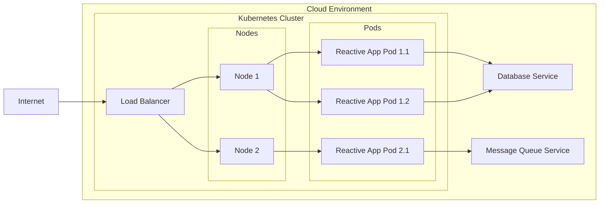

# BUSINESS POSTURE

- Business Priorities and Goals:
  - Provide a high-performance, robust, and developer-friendly reactive programming library for Kotlin.
  - Enable developers to build efficient and scalable applications using reactive paradigms.
  - Foster a strong community around the library to ensure its long-term maintenance and evolution.
- Business Risks:
  - Risk of critical defects in the library leading to application failures or unexpected behavior in applications that depend on it.
  - Risk of performance bottlenecks introduced by the library, negatively impacting the performance of applications using it.
  - Risk of security vulnerabilities within the library itself, potentially exploitable by malicious actors in applications using the library.
  - Risk of low adoption by the Kotlin developer community if the library is perceived as too complex, unreliable, or lacking in features.

# SECURITY POSTURE

- Existing Security Controls:
  - security control: Code Review - Implemented as part of the standard development process, especially for contributions from external developers, and during pull requests. Location: GitHub repository pull request process.
  - security control: Unit Testing - Implemented to ensure the correctness of individual components and functions within the library. Location: Source code repository under test directories.
  - security control: Integration Testing - Implemented to verify the interaction between different components of the library and ensure they work together as expected. Location: Source code repository under test directories.
  - security control: Static Analysis - Likely used by developers locally using IDE plugins and potentially as part of CI pipelines to identify potential code quality and security issues. Location: Developer local environment and potentially CI pipelines.
- Accepted Risks:
  - accepted risk: Open Source Vulnerability Disclosure - As an open-source project, vulnerabilities may be publicly disclosed before a patch is available, potentially increasing the window of exploitation.
  - accepted risk: Community-Driven Security - Reliance on the open-source community for identifying and reporting security vulnerabilities, which may lead to delays in vulnerability discovery and patching compared to dedicated security teams.
- Recommended Security Controls:
  - security control: Dependency Scanning - Implement automated dependency scanning to identify known vulnerabilities in third-party libraries used by Reaktive during the build process.
  - security control: Fuzz Testing - Integrate fuzz testing into the CI pipeline to automatically test the library's robustness against various inputs and identify potential crash-inducing inputs or vulnerabilities.
  - security control: Security Audits - Conduct periodic security audits, especially for critical components or before major releases, by security experts to identify potential vulnerabilities that might be missed by standard development practices.
- Security Requirements:
  - Authentication: Not directly applicable to a library. Reaktive itself does not handle user authentication. Applications built using Reaktive will need to implement their own authentication mechanisms.
  - Authorization: Not directly applicable to a library. Reaktive itself does not enforce authorization. Applications built using Reaktive will need to implement their own authorization mechanisms.
  - Input Validation: Reaktive library APIs should implement robust input validation to prevent unexpected behavior, crashes, or potential vulnerabilities due to malformed or malicious input data passed to the library functions by applications. This is crucial for library stability and security.
  - Cryptography: While Reaktive itself might not directly implement cryptographic functions, it should be designed to be compatible with secure cryptographic practices if used in security-sensitive applications. If cryptographic operations are needed within Reaktive in the future, established and well-vetted cryptographic libraries should be used, avoiding custom cryptographic implementations.

# DESIGN

## C4 CONTEXT

```mermaid
flowchart LR
    subgraph "Reactive Application Developers"
        RD[Reactive Application Developer]
    end
    subgraph "Kotlin Ecosystem"
        KSL[Kotlin Standard Library]
        RSP[Reactive Streams Standard]
        BR[Build Tools (Gradle, Maven)]
        PR[Package Repositories (Maven Central)]
    end
    RL["Reaktive Library"]

    RD --> RL
    RL --> KSL
    RL --> RSP
    RL --> BR
    RL --> PR
```

- Context Diagram Elements:
  - - Name: Reaktive Library
    - Type: Software System
    - Description: A Kotlin library providing primitives and abstractions for reactive programming, enabling developers to build asynchronous and event-driven applications.
    - Responsibilities: Provides core reactive types (Observable, Single, Completable), operators for transforming and composing reactive streams, and schedulers for managing concurrency.
    - Security controls: Input validation within library APIs to prevent unexpected behavior.
  - - Name: Reactive Application Developer
    - Type: Person
    - Description: Software developers who use the Reaktive library to build Kotlin applications.
    - Responsibilities: Utilize Reaktive library to implement application logic, manage asynchronous operations, and handle events in their applications. Responsible for secure usage of the library within their applications.
    - Security controls: Secure coding practices when using Reaktive, including proper error handling and input validation in application code.
  - - Name: Kotlin Standard Library
    - Type: Software System
    - Description: The standard library for the Kotlin programming language, providing core functionalities and utilities.
    - Responsibilities: Provides fundamental functionalities used by Reaktive, such as collections, coroutines, and basic utilities.
    - Security controls: Security controls of the Kotlin Standard Library are assumed to be in place and managed by the Kotlin language development team.
  - - Name: Reactive Streams Standard
    - Type: Standard/Specification
    - Description: A standard for asynchronous stream processing with non-blocking backpressure.
    - Responsibilities: Defines the interfaces and protocols that Reaktive implements to ensure interoperability with other reactive libraries and systems.
    - Security controls: The Reactive Streams Standard itself does not implement security controls, but it guides the design of Reaktive to be compatible with reactive principles and potentially security best practices in asynchronous programming.
  - - Name: Build Tools (Gradle, Maven)
    - Type: Software System
    - Description: Build automation tools used to compile, test, and package the Reaktive library and applications that use it.
    - Responsibilities: Manage dependencies, compile source code, run tests, and package the Reaktive library for distribution.
    - Security controls: Dependency scanning and build process security controls within Gradle/Maven environments used to build Reaktive.
  - - Name: Package Repositories (Maven Central)
    - Type: Software System
    - Description: Central repositories for hosting and distributing Java and Kotlin libraries, including Reaktive.
    - Responsibilities: Host and distribute the Reaktive library to developers.
    - Security controls: Security controls of Maven Central, including malware scanning and integrity checks of published artifacts.

## C4 CONTAINER

```mermaid
flowchart LR
    subgraph "Reactive Application Developers"
        RD[Reactive Application Developer]
    end
    subgraph "Kotlin Runtime Environment"
        KRE[Kotlin Runtime Environment]
    end
    subgraph "Build and Distribution Infrastructure"
        BR[Build Tools (Gradle, Maven)]
        PR[Package Repositories (Maven Central)]
    end
    subgraph "Reaktive Library Containers"
        RC[Reaktive Core]
        RE[Reaktive Extensions (Optional)]
    end

    RD --> RC
    RD --> RE
    RC --> KRE
    RE --> RC
    BR --> RC
    BR --> RE
    RC --> PR
    RE --> PR
```

- Container Diagram Elements:
  - - Name: Reaktive Core
    - Type: Library (Kotlin JAR)
    - Description: The core module of the Reaktive library, containing essential reactive types, operators, and schedulers.
    - Responsibilities: Provides the fundamental building blocks for reactive programming in Kotlin, including Observable, Single, Completable, and associated operators. Manages core concurrency and scheduling mechanisms.
    - Security controls: Input validation in core API functions, unit and integration testing, dependency scanning during build, and potential fuzz testing.
  - - Name: Reaktive Extensions (Optional)
    - Type: Library (Kotlin JAR)
    - Description: Optional extension modules providing additional functionalities and integrations with other libraries or frameworks, built on top of Reaktive Core.
    - Responsibilities: Offers extended functionalities, such as integrations with specific libraries or patterns, without bloating the core library. Depends on Reaktive Core.
    - Security controls: Input validation in extension module APIs, unit and integration testing, dependency scanning during build, and potential fuzz testing. Inherits security controls from Reaktive Core.
  - - Name: Kotlin Runtime Environment
    - Type: Runtime Environment
    - Description: The runtime environment required to execute Kotlin code, including the JVM or other supported platforms.
    - Responsibilities: Provides the execution environment for Reaktive library and applications using it. Manages memory, threads, and other runtime resources.
    - Security controls: Security controls of the Kotlin Runtime Environment are assumed to be in place and managed by the Kotlin language and platform providers (e.g., JVM security).
  - - Name: Build Tools (Gradle, Maven)
    - Type: Build Tool
    - Description: Tools used to build, test, and package Reaktive Core and Reaktive Extensions.
    - Responsibilities: Compile Kotlin source code, manage dependencies, run tests, package JAR files, and potentially perform static analysis and security checks during the build process.
    - Security controls: Build process security, dependency scanning, static analysis integration, and secure configuration of build tools.
  - - Name: Package Repositories (Maven Central)
    - Type: Package Repository
    - Description: Repository for hosting and distributing Reaktive Core and Reaktive Extensions JAR files.
    - Responsibilities: Securely host and distribute Reaktive library artifacts to developers.
    - Security controls: Repository security controls, including artifact signing, malware scanning, and access controls.

## DEPLOYMENT

- Deployment Architecture:
  - Reaktive library itself is not deployed as a standalone application. It is deployed as a library artifact to package repositories (Maven Central) and then included as a dependency in Kotlin applications. The deployment diagram below illustrates the deployment of an application that *uses* the Reaktive library, rather than the library itself. We assume a typical deployment scenario for a Kotlin backend application using Reaktive, deployed to a cloud environment.



- Deployment Diagram Elements:
  - - Name: Kubernetes Cluster
    - Type: Container Orchestration Platform
    - Description: A Kubernetes cluster in a cloud environment used to orchestrate and manage the deployment of reactive applications that utilize the Reaktive library.
    - Responsibilities: Provides a platform for deploying, scaling, and managing containerized applications. Ensures high availability and resilience.
    - Security controls: Kubernetes security controls, including RBAC, network policies, pod security policies, and secrets management.
  - - Name: Nodes
    - Type: Virtual Machines/Physical Servers
    - Description: Worker nodes within the Kubernetes cluster that host pods and run application containers.
    - Responsibilities: Provide compute resources for running application containers.
    - Security controls: Operating system security hardening, node security configurations, and network security controls at the node level.
  - - Name: Pods
    - Type: Kubernetes Pod
    - Description: The smallest deployable units in Kubernetes, encapsulating one or more containers running instances of the reactive application.
    - Responsibilities: Run instances of the reactive application built using Reaktive.
    - Security controls: Container security (image scanning, least privilege), pod security context, and network policies at the pod level.
  - - Name: Reactive App Pods
    - Type: Application Container
    - Description: Containers running instances of a reactive application built using the Reaktive library.
    - Responsibilities: Execute the application logic, handle user requests, interact with databases and message queues, and leverage Reaktive for asynchronous operations.
    - Security controls: Application-level security controls, input validation, secure coding practices, authentication and authorization within the application, and secure communication protocols.
  - - Name: Load Balancer
    - Type: Network Load Balancer
    - Description: Distributes incoming traffic across multiple instances of the reactive application pods for load balancing and high availability.
    - Responsibilities: Distribute traffic, ensure application availability, and potentially provide TLS termination.
    - Security controls: Load balancer security configurations, TLS termination, DDoS protection, and access control lists.
  - - Name: Database Service
    - Type: Managed Database Service
    - Description: A managed database service used by the reactive application to store and retrieve data.
    - Responsibilities: Persist application data, provide data access, and ensure data integrity and availability.
    - Security controls: Database security controls, including access control, encryption at rest and in transit, database auditing, and vulnerability management.
  - - Name: Message Queue Service
    - Type: Managed Message Queue Service
    - Description: A managed message queue service used for asynchronous communication and event-driven architectures within the application.
    - Responsibilities: Facilitate asynchronous communication between application components, decouple services, and enable event-driven processing.
    - Security controls: Message queue security controls, including access control, encryption in transit, and message integrity.
  - - Name: Internet
    - Type: Public Network
    - Description: The public internet through which users access the reactive application.
    - Responsibilities: Provide network connectivity for users to interact with the application.
    - Security controls: Network security controls at the perimeter, firewalls, intrusion detection systems, and DDoS protection.

## BUILD

```mermaid
flowchart LR
    subgraph "Developer Workstation"
        DEV[Developer]
        CODE[Source Code]
    end
    subgraph "Version Control System"
        VCS[Git Repository (GitHub)]
    end
    subgraph "CI/CD System (GitHub Actions)"
        BC[Build Container]
        COMPILE[Compile & Test]
        SAST[SAST Scanner]
        DEP_SCAN[Dependency Scanner]
        PACKAGE[Package (JAR)]
        PUBLISH[Publish to Maven Central]
    end
    subgraph "Package Repository"
        REPO[Maven Central]
    end

    DEV --> CODE
    CODE --> VCS
    VCS --> BC
    BC --> COMPILE
    COMPILE --> SAST
    SAST --> DEP_SCAN
    DEP_SCAN --> PACKAGE
    PACKAGE --> PUBLISH
    PUBLISH --> REPO
```

- Build Process Elements:
  - - Name: Developer
    - Type: Person
    - Description: Software developer writing and modifying the Reaktive library code.
    - Responsibilities: Write high-quality, secure code, perform local testing, and commit code changes to the version control system.
    - Security controls: Secure coding practices, code review participation, and local security tools (e.g., IDE linters, static analysis).
  - - Name: Source Code
    - Type: Codebase
    - Description: The Kotlin source code of the Reaktive library.
    - Responsibilities: Represent the codebase of the Reaktive library, stored in a version control system.
    - Security controls: Version control system access controls, code review process, and branch protection policies.
  - - Name: Git Repository (GitHub)
    - Type: Version Control System
    - Description: GitHub repository hosting the Reaktive library source code and managing version history.
    - Responsibilities: Securely store and manage the source code, track changes, and facilitate collaboration among developers.
    - Security controls: Access controls, branch protection, audit logs, and GitHub security features.
  - - Name: Build Container
    - Type: Containerized Build Environment
    - Description: A containerized environment used to perform the build process in a consistent and isolated manner.
    - Responsibilities: Provide a consistent and reproducible build environment, isolate build dependencies, and execute build steps.
    - Security controls: Base image security, container security scanning, and minimal toolset within the container.
  - - Name: Compile & Test
    - Type: Build Step
    - Description: Compilation of Kotlin source code and execution of unit and integration tests.
    - Responsibilities: Compile the source code into bytecode, run tests to ensure code correctness and functionality.
    - Security controls: Secure compilation process, test isolation, and reporting of test failures.
  - - Name: SAST Scanner
    - Type: Static Application Security Testing Tool
    - Description: Static analysis security testing tool to automatically scan the source code for potential security vulnerabilities.
    - Responsibilities: Identify potential security flaws in the code without executing it, such as code injection vulnerabilities, insecure configurations, etc.
    - Security controls: SAST tool configuration, vulnerability reporting, and integration into the CI pipeline.
  - - Name: Dependency Scanner
    - Type: Software Composition Analysis Tool
    - Description: Tool to scan project dependencies for known security vulnerabilities.
    - Responsibilities: Identify vulnerable dependencies used by the Reaktive library, ensuring that no known vulnerable libraries are included in the final artifact.
    - Security controls: Dependency vulnerability database updates, vulnerability reporting, and build failure on critical vulnerabilities.
  - - Name: Package (JAR)
    - Type: Build Artifact
    - Description: The packaged Reaktive library as a JAR file.
    - Responsibilities: Package the compiled code and resources into a distributable JAR file.
    - Security controls: Artifact signing to ensure integrity and authenticity.
  - - Name: Publish to Maven Central
    - Type: Publishing Step
    - Description: Publishing the packaged JAR file to Maven Central repository.
    - Responsibilities: Securely upload and publish the Reaktive library artifact to Maven Central for public consumption.
    - Security controls: Secure publishing process, artifact signing, and Maven Central security policies.
  - - Name: Maven Central
    - Type: Package Repository
    - Description: Public repository for hosting and distributing Java and Kotlin libraries.
    - Responsibilities: Host and distribute the Reaktive library to developers worldwide.
    - Security controls: Repository security controls, malware scanning, and integrity checks of published artifacts.

# RISK ASSESSMENT

- Critical Business Processes:
  - Development and maintenance of high-quality, reliable, and performant Kotlin applications by developers using the Reaktive library.
  - Distribution of a secure and trustworthy reactive programming library to the Kotlin community.
- Data Sensitivity:
  - Source code of the Reaktive library: Moderately sensitive. Confidentiality is less critical for open-source, but integrity and availability are crucial.
  - Potential data processed by applications using Reaktive: Sensitivity varies greatly depending on the application. Reaktive itself does not handle specific application data, but applications built with it might process highly sensitive data (e.g., personal data, financial data). The security of Reaktive indirectly impacts the security of this application data.

# QUESTIONS & ASSUMPTIONS

- BUSINESS POSTURE:
  - Assumption: The primary business goal is to provide a valuable and widely adopted reactive programming library for the Kotlin ecosystem.
  - Question: Are there specific industry verticals or application domains that Reaktive is primarily targeting? Understanding this could help prioritize certain security or feature aspects.

- SECURITY POSTURE:
  - Assumption: Security is a significant concern for the Reaktive project to ensure the reliability and trustworthiness of applications built using it.
  - Question: Is there a formal security incident response plan in place for Reaktive? How are security vulnerabilities reported and handled?
  - Question: Are there any specific compliance requirements (e.g., OWASP, GDPR, HIPAA) that Reaktive needs to consider, even indirectly as a library?

- DESIGN:
  - Assumption: Reaktive is designed to be a modular library with a core module and optional extensions.
  - Question: What is the strategy for managing dependencies of Reaktive and its extensions? Are there plans to minimize dependencies to reduce the attack surface?
  - Question: Are there any specific performance or scalability requirements that have driven the design of Reaktive? Understanding these can help assess the trade-offs between performance and security.