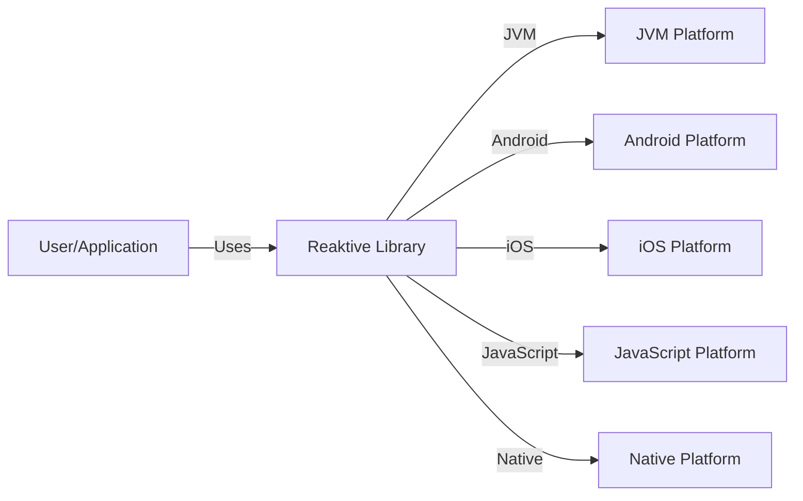
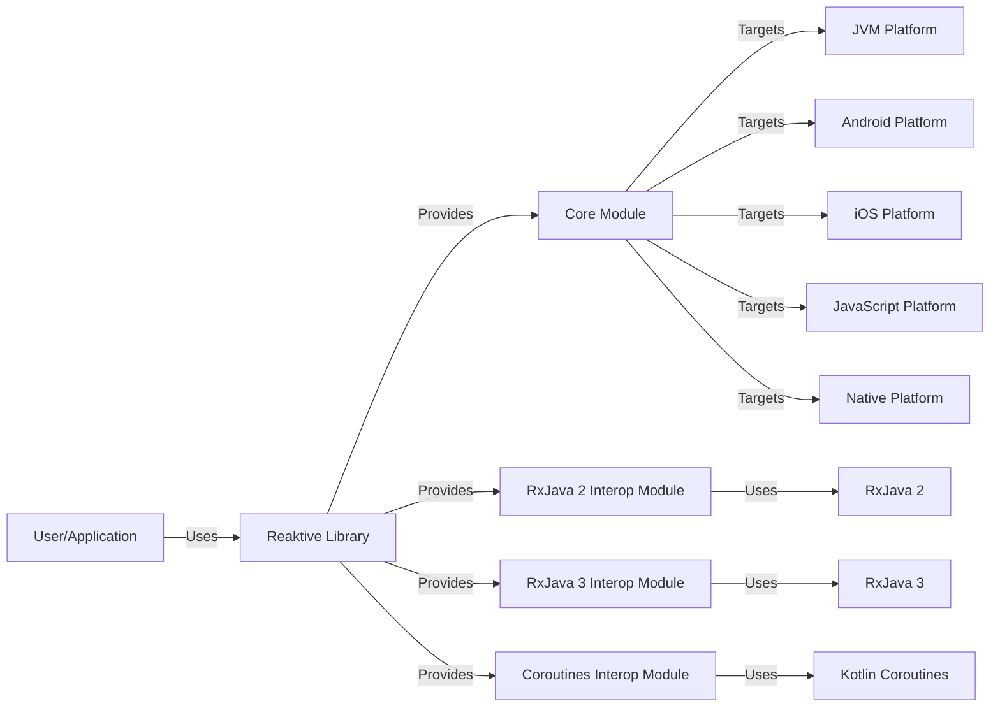
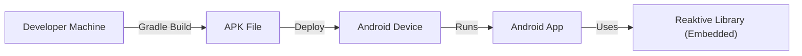
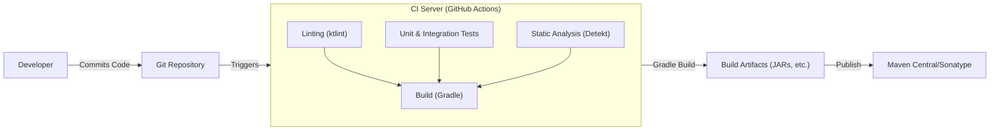

Okay, let's create a design document for the Reaktive library, keeping in mind its purpose and potential security considerations.

# BUSINESS POSTURE

Reaktive is a Kotlin Multiplatform library for reactive programming. It aims to provide a consistent and efficient way to handle asynchronous data streams across various platforms (JVM, Android, iOS, JavaScript, Native).

Priorities:

*   Cross-platform compatibility: The core value proposition is enabling code reuse across different platforms.
*   Performance and efficiency:  Reactive streams can be performance-critical; the library must be efficient.
*   Ease of use and maintainability:  A clean API and well-structured codebase are essential for adoption and long-term viability.
*   Reliability and stability:  As a foundational library, it needs to be robust and handle errors gracefully.
*   Community adoption:  Success depends on developers choosing Reaktive over alternatives.

Goals:

*   Provide a unified reactive programming model for Kotlin Multiplatform.
*   Offer a rich set of operators for manipulating data streams.
*   Minimize platform-specific code and maximize code sharing.
*   Enable efficient resource management (memory, threads).

Business Risks:

*   Inconsistent behavior across platforms: This would undermine the core value of the library.
*   Performance bottlenecks:  Slow or inefficient stream processing could make the library unsuitable for demanding applications.
*   Memory leaks or excessive resource consumption:  This could lead to crashes or performance degradation, especially on resource-constrained platforms like mobile.
*   Security vulnerabilities: While not directly handling sensitive data, vulnerabilities in the library could be exploited as part of a larger attack chain.  Specifically, vulnerabilities related to threading or asynchronous operations could be problematic.
*   Lack of adoption: If developers don't find the library useful or reliable, it won't succeed.

# SECURITY POSTURE

Existing Security Controls:

*   security control: Code Reviews: The GitHub repository shows evidence of pull requests and code reviews, which are crucial for identifying potential security issues. (Implicit in the open-source development model).
*   security control: Testing: The project includes unit and integration tests, which help ensure the correctness and stability of the code. This indirectly contributes to security by reducing the likelihood of unexpected behavior. (Visible in the repository structure and build configuration).
*   security control: Static Analysis: The build process likely includes static analysis tools (e.g., linters, Kotlin compiler checks) that can detect some types of errors. (Inferred from standard Kotlin development practices).
*   security control: Dependency Management: The project uses Gradle for dependency management, allowing for tracking and updating of external libraries. (Visible in the `build.gradle.kts` files).

Accepted Risks:

*   accepted risk: The library itself does not handle authentication, authorization, or encryption. It's assumed that these concerns are addressed at a higher level in the applications that use Reaktive.
*   accepted risk: The library relies on the underlying platform's security mechanisms (e.g., JVM security, iOS sandboxing) for protection against low-level attacks.
*   accepted risk: The library does not implement specific defenses against denial-of-service (DoS) attacks targeting reactive streams. It's assumed that applications using Reaktive will implement their own rate limiting or other mitigation strategies if necessary.

Recommended Security Controls:

*   security control: Fuzz Testing: Implement fuzz testing to explore edge cases and uncover potential vulnerabilities related to unexpected input or threading issues.
*   security control: Regular Security Audits: Conduct periodic security audits, either internally or by external experts, to identify potential vulnerabilities.
*   security control: Supply Chain Security: Implement measures to ensure the integrity of dependencies, such as using signed artifacts and vulnerability scanning.
*   security control: Thread Safety Analysis: Given the library's focus on concurrency, perform a thorough thread safety analysis to identify and mitigate potential race conditions or deadlocks.

Security Requirements:

*   Authentication: Not directly applicable to the library itself.
*   Authorization: Not directly applicable to the library itself.
*   Input Validation: While the library doesn't directly handle user input, it should be robust against unexpected or malformed data passed to its operators. This includes handling null values, invalid parameters, and potential integer overflows.
*   Cryptography: Not directly applicable to the library itself.
*   Concurrency: The library must be thread-safe and handle concurrent operations correctly. This is crucial for preventing data corruption and ensuring reliable behavior.
*   Error Handling: The library must handle errors gracefully and propagate them appropriately through the reactive streams. Unhandled exceptions could lead to application crashes or unpredictable behavior.

# DESIGN

## C4 CONTEXT

Element Descriptions:

*   Element:
    *   Name: User/Application
    *   Type: User/External System
    *   Description: Represents the developer or application that utilizes the Reaktive library.
    *   Responsibilities: Consumes and interacts with the Reaktive API to manage asynchronous data streams.
    *   Security controls: Implements application-level security controls (authentication, authorization, input validation, etc.).

*   Element:
    *   Name: Reaktive Library
    *   Type: System
    *   Description: The Kotlin Multiplatform reactive programming library.
    *   Responsibilities: Provides a consistent API for creating, transforming, and consuming reactive streams across different platforms. Manages threading and concurrency.
    *   Security controls: Internal code reviews, testing, static analysis, thread safety measures.

*   Element:
    *   Name: JVM Platform
    *   Type: Platform
    *   Description: The Java Virtual Machine environment.
    *   Responsibilities: Executes JVM-targeted code. Provides core libraries and runtime services.
    *   Security controls: JVM security manager, sandboxing (if enabled).

*   Element:
    *   Name: Android Platform
    *   Type: Platform
    *   Description: The Android operating system.
    *   Responsibilities: Executes Android-targeted code. Provides platform-specific APIs and services.
    *   Security controls: Android application sandboxing, permissions model.

*   Element:
    *   Name: iOS Platform
    *   Type: Platform
    *   Description: The iOS operating system.
    *   Responsibilities: Executes iOS-targeted code. Provides platform-specific APIs and services.
    *   Security controls: iOS application sandboxing, code signing.

*   Element:
    *   Name: JavaScript Platform
    *   Type: Platform
    *   Description: A JavaScript runtime environment (e.g., browser, Node.js).
    *   Responsibilities: Executes JavaScript-targeted code. Provides platform-specific APIs and services.
    *   Security controls: Browser security model (same-origin policy, etc.).

*   Element:
    *   Name: Native Platform
    *   Type: Platform
    *   Description: The underlying native operating system (e.g., Linux, macOS, Windows).
    *   Responsibilities: Executes native code. Provides low-level system resources.
    *   Security controls: Operating system security features (user accounts, file permissions, etc.).

## C4 CONTAINER

Since Reaktive is a library, the container diagram is essentially an expanded view of the context diagram, showing the internal modules of the library.

Element Descriptions:

*   Element:
    *   Name: User/Application
    *   Type: User/External System
    *   Description: Represents the developer or application that utilizes the Reaktive library.
    *   Responsibilities: Consumes and interacts with the Reaktive API to manage asynchronous data streams.
    *   Security controls: Implements application-level security controls (authentication, authorization, input validation, etc.).

*   Element:
    *   Name: Reaktive Library
    *   Type: System
    *   Description: The Kotlin Multiplatform reactive programming library.
    *   Responsibilities: Provides a consistent API for creating, transforming, and consuming reactive streams across different platforms. Manages threading and concurrency.
    *   Security controls: Internal code reviews, testing, static analysis, thread safety measures.

*   Element:
    *   Name: Core Module
    *   Type: Module
    *   Description: The core functionality of the Reaktive library, including the base reactive types (Observable, Flowable, Single, Completable, Maybe) and operators.
    *   Responsibilities: Implements the core reactive programming logic. Handles threading and concurrency.
    *   Security controls: Thread safety analysis, fuzz testing (recommended).

*   Element:
    *   Name: RxJava 2 Interop Module
    *   Type: Module
    *   Description: Provides interoperability with RxJava 2.
    *   Responsibilities: Allows seamless integration between Reaktive and RxJava 2 streams.
    *   Security controls: Relies on the security of RxJava 2 and Reaktive's core.

*   Element:
    *   Name: RxJava 3 Interop Module
    *   Type: Module
    *   Description: Provides interoperability with RxJava 3.
    *   Responsibilities: Allows seamless integration between Reaktive and RxJava 3 streams.
    *   Security controls: Relies on the security of RxJava 3 and Reaktive's core.

*   Element:
    *   Name: Coroutines Interop Module
    *   Type: Module
    *   Description: Provides interoperability with Kotlin Coroutines.
    *   Responsibilities: Allows seamless integration between Reaktive streams and Kotlin Coroutines Flows.
    *   Security controls: Relies on the security of Kotlin Coroutines and Reaktive's core.

*   Element:
    *   Name: RxJava 2
    *   Type: External Library
    *   Description:  The RxJava 2 library.
    *   Responsibilities: Provides its own reactive programming implementation.
    *   Security controls: Managed by the RxJava 2 project.

*   Element:
    *   Name: RxJava 3
    *   Type: External Library
    *   Description: The RxJava 3 library.
    *   Responsibilities: Provides its own reactive programming implementation.
    *   Security controls: Managed by the RxJava 3 project.

*   Element:
    *   Name: Kotlin Coroutines
    *   Type: External Library
    *   Description: The Kotlin Coroutines library.
    *   Responsibilities: Provides a concurrency framework for Kotlin.
    *   Security controls: Managed by the Kotlin project.

*   Element:
    *   Name: JVM Platform, Android Platform, iOS Platform, JavaScript Platform, Native Platform
    *   Type: Platform
    *   Description: The target platforms for the library.
    *   Responsibilities: Provide the runtime environment for the compiled code.
    *   Security controls: Platform-specific security mechanisms.

## DEPLOYMENT

Reaktive is a library, not a standalone application. Therefore, its deployment is tied to the applications that use it.  Here are some possible deployment scenarios:

1.  **Android Application:**  The Reaktive library is included as a dependency in the Android application's Gradle build. The application is packaged as an APK and deployed to Android devices.
2.  **iOS Application:** The Reaktive library is included as a dependency (likely via CocoaPods or Swift Package Manager) in the iOS application. The application is compiled and deployed to iOS devices.
3.  **JVM Application:** The Reaktive library is included as a dependency in the JVM application's build (e.g., Gradle, Maven). The application is packaged as a JAR or other executable format and deployed to a JVM environment.
4.  **JavaScript Application:** The Reaktive library is included as a dependency in the JavaScript application's build (e.g., npm, yarn). The application is bundled and deployed to a web server or other JavaScript runtime.
5.  **Multiplatform Application:** A Kotlin Multiplatform project uses Reaktive and is compiled to multiple targets (e.g., Android, iOS, JVM). Each target is deployed according to its platform-specific process.

Let's describe the Android Application deployment in detail:

Element Descriptions:

*   Element:
    *   Name: Developer Machine
    *   Type: Development Environment
    *   Description: The machine where the Android application is developed and built.
    *   Responsibilities: Hosts the development tools (Android Studio, Gradle, etc.).
    *   Security controls: Developer machine security best practices (antivirus, firewall, etc.).

*   Element:
    *   Name: APK File
    *   Type: Artifact
    *   Description: The Android application package, containing the compiled code, resources, and the Reaktive library.
    *   Responsibilities: Represents the deployable unit of the application.
    *   Security controls: Code signing, ProGuard/R8 obfuscation (optional).

*   Element:
    *   Name: Android Device
    *   Type: Device
    *   Description: The physical or emulated Android device where the application is deployed.
    *   Responsibilities: Runs the Android operating system and executes the application.
    *   Security controls: Android device security features (screen lock, app sandboxing, etc.).

*   Element:
    *   Name: Android App
    *   Type: Application
    *   Description: The running instance of the Android application.
    *   Responsibilities: Provides the application's functionality to the user.
    *   Security controls: Application-level security controls.

*   Element:
    *   Name: Reaktive Library (Embedded)
    *   Type: Library
    *   Description: The Reaktive library, embedded within the Android application.
    *   Responsibilities: Provides reactive programming capabilities to the application.
    *   Security controls: Inherits security controls from the application and the Android platform.

## BUILD

The Reaktive library uses Gradle for its build process. The build process is automated and includes several steps that contribute to security:

Build Process Description:

1.  **Code Commit:** A developer commits code changes to the Git repository (GitHub).
2.  **CI Trigger:** The commit triggers a build on the CI server (GitHub Actions).
3.  **Linting:** The code is checked for style and formatting issues using ktlint.
4.  **Static Analysis:** The code is analyzed for potential bugs and code smells using Detekt.
5.  **Testing:** Unit and integration tests are executed to verify the correctness of the code.
6.  **Build:** Gradle compiles the code, resolves dependencies, and generates the build artifacts (JAR files for different platforms).
7.  **Publish:** The build artifacts are published to a repository (Maven Central/Sonatype).

Security Controls in the Build Process:

*   security control: **Linting (ktlint):** Enforces code style and helps prevent some types of errors.
*   security control: **Static Analysis (Detekt):** Detects potential bugs, code smells, and security vulnerabilities.
*   security control: **Unit & Integration Tests:** Verify the correctness of the code and help prevent regressions.
*   security control: **Dependency Management (Gradle):** Tracks and manages external dependencies, allowing for vulnerability scanning and updates.
*   security control: **CI/CD (GitHub Actions):** Automates the build process, ensuring consistency and reducing the risk of manual errors.

# RISK ASSESSMENT

Critical Business Processes:

*   Providing a reliable and efficient reactive programming framework for Kotlin Multiplatform development.
*   Maintaining cross-platform compatibility and consistency.
*   Supporting the development of high-performance and responsive applications.

Data to Protect:

*   The Reaktive library itself does not handle sensitive data directly. However, it's used to *process* data within applications. The sensitivity of that data depends on the specific application.
*   Source code: The library's source code is publicly available, but its integrity is important. Unauthorized modifications could introduce vulnerabilities.
*   Build artifacts: The integrity of the published build artifacts (JARs) is critical. Tampering with these artifacts could compromise applications that use the library.

Data Sensitivity:

*   Since Reaktive is a library, it doesn't directly handle data in the traditional sense. The sensitivity of the data being processed by applications *using* Reaktive is entirely dependent on those applications.  Reaktive itself has no concept of data sensitivity.

# QUESTIONS & ASSUMPTIONS

Questions:

*   Are there any specific performance benchmarks or targets that the library needs to meet?
*   What are the expected usage patterns of the library (e.g., high-frequency events, large data streams)?
*   Are there any plans to integrate with other reactive libraries or frameworks besides RxJava and Coroutines?
*   What is the process for handling security vulnerabilities reported by external researchers?
*   What level of support and maintenance is planned for the library?

Assumptions:

*   BUSINESS POSTURE: It is assumed that the primary goal is to create a robust and widely adopted library, prioritizing stability and cross-platform compatibility over bleeding-edge features.
*   SECURITY POSTURE: It is assumed that applications using Reaktive will handle their own security concerns (authentication, authorization, data encryption). Reaktive's role is to provide a secure foundation for reactive programming, not to be a complete security solution.
*   DESIGN: It is assumed that the library will continue to evolve and add new features, but the core design principles (reactive streams, operator-based transformations) will remain consistent. The interop modules are crucial for adoption and will be maintained.