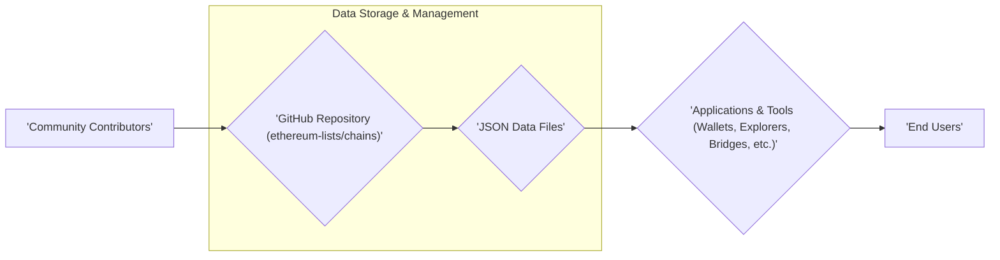
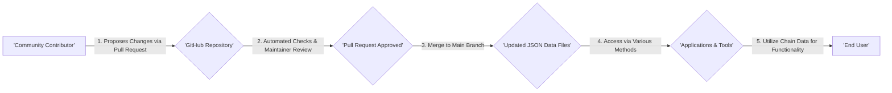

# Project Design Document: Ethereum Chains List

**Project Repository:** https://github.com/ethereum-lists/chains

**Document Version:** 1.1
**Date:** October 26, 2023
**Author:** AI Software Architect

## 1. Introduction

This document provides an enhanced design overview of the `ethereum-lists/chains` project. This project serves as a critical, community-maintained resource providing comprehensive information about various Ethereum Virtual Machine (EVM) compatible blockchains. The data, meticulously structured in JSON format, facilitates seamless integration and parsing by a wide array of applications and tools within the blockchain ecosystem. This document aims to provide a more detailed exploration of the project's architecture, components, data flow, and crucial security considerations for subsequent threat modeling activities.

## 2. Project Goals and Scope

* **Goal:** To maintain a definitive, accurate, and consistently updated list of EVM-compatible blockchain networks, encompassing their essential configuration parameters necessary for integration and interaction.
* **Scope:**
    * Centralized storage and rigorous maintenance of JSON files, each representing a distinct blockchain and its associated metadata.
    * Adherence to a clearly defined and consistent data structure across all chain definitions to ensure uniformity and ease of programmatic access.
    * Fostering a collaborative, community-driven contribution model that allows for the continuous addition of new chains and the timely updating of existing chain information.
    * Unrestricted public accessibility of the data through the project's GitHub repository, promoting transparency and widespread adoption.

## 3. High-Level Design

The project adopts a straightforward yet effective architecture centered around data storage and retrieval, leveraging the robust features of GitHub for version control, collaborative contributions, and open accessibility.

**Components:**

* **Community Contributors:** A diverse group of individuals and organizations actively involved in contributing new chain data, proposing updates to existing information, and ensuring the accuracy of the repository.
* **GitHub Repository (`ethereum-lists/chains`):** The authoritative central repository hosted on GitHub, serving as the primary storage location for all project data, documentation, and contribution guidelines.
* **JSON Data Files:** The fundamental building blocks of the project, with each file containing meticulously structured information about a specific EVM-compatible blockchain.
* **Applications & Tools:** A broad spectrum of software solutions that consume the data from the repository to enhance their functionality, including cryptocurrency wallets, block explorers, cross-chain bridges, and developer tools.
* **End Users:** The ultimate beneficiaries of the project, utilizing applications and tools that rely on the accurate and up-to-date chain data provided by the repository.

## 4. Detailed Design

### 4.1. Data Structure (JSON Files)

Each blockchain's configuration details are meticulously stored in individual JSON files located within the `_data/chains` directory. The structure of these JSON files is strictly standardized across all chains to guarantee consistent parsing and interpretation by consuming applications.

**Key Fields and Examples in JSON Files:**

* `name`: The full, official name of the blockchain (e.g., "Ethereum Mainnet").
* `chain`: A concise, unique identifier for the chain, often used programmatically (e.g., "eth").
* `rpc`: An array containing one or more Remote Procedure Call (RPC) endpoint URLs essential for connecting to the blockchain network (e.g., `["https://mainnet.infura.io/v3/${INFURA_API_KEY}", "https://cloudflare-eth.com"]`).
* `faucets`: An array of URLs pointing to faucet services that provide testnet tokens for development and testing purposes (e.g., `["https://faucet.example.com"]`).
* `nativeCurrency`: An object detailing the chain's native cryptocurrency, including:
    * `name`: The full name of the currency (e.g., "Ether").
    * `symbol`: The ticker symbol of the currency (e.g., "ETH").
    * `decimals`: The number of decimal places used by the currency (e.g., 18).
* `infoURL`: A URL linking to the official website or documentation providing comprehensive information about the blockchain (e.g., "https://ethereum.org").
* `shortName`: A shorter, more user-friendly name for the chain (e.g., "eth").
* `chainId`: The unique numerical identifier for the blockchain, crucial for transaction signing and network identification (e.g., 1).
* `networkId`:  The network identifier, often used internally by nodes (e.g., 1).
* `slip44`: The Standardized Lightweight Implementation of BIP-0044 (SLIP-0044) coin type, if applicable (e.g., 60).
* `ens`: An optional object containing information about the Ethereum Name Service (ENS) registry on the chain, including the `registry` address.
* `explorers`: An array of objects, each defining a block explorer for the chain, including:
    * `name`: The name of the explorer (e.g., "Etherscan").
    * `url`: The base URL of the explorer (e.g., "https://etherscan.io").
    * `standard`: The standard used by the explorer (e.g., "EIP3091").
* `parent`: An optional object describing the parent chain for Layer-2 scaling solutions or sidechains, including `chainId` and `name`.
* `status`:  Indicates the current operational status of the chain (e.g., "active", "deprecated", "incubating").
* `redFlags`: An array of potential issues or warnings associated with the chain (e.g., `["Centralized Sequencer"]`).
* `contracts`: An optional object containing addresses of significant smart contracts deployed on the chain, with keys representing the contract name (e.g., `wETH: "0xC02aaA39b223FE8D0A0e5C4F27eAD9083C756Cc2"`).
* `icon`: An optional URL pointing to an icon representing the blockchain.
* `title`: A descriptive title for the chain, potentially used in user interfaces.
* `network`: A general classification of the network (e.g., "mainnet", "testnet").
* `testnet`: A boolean value indicating whether the chain is a test network (`true`) or a main network (`false`).
* `slug`: A URL-friendly identifier for the chain, often derived from the `shortName`.

### 4.2. GitHub Repository Structure

The repository's organization is designed for clarity and ease of navigation.

* **`.github/`:** Contains GitHub-specific configuration files essential for project management, including:
    * `workflows/`: Defines automated workflows for continuous integration and other tasks.
    * `issue_templates/`: Provides templates for reporting issues and suggesting enhancements.
    * `pull_request_template.md`: Guides contributors when submitting pull requests.
* **`_data/`:** The primary directory housing the project's core data files.
    * **`chains/`:** Contains individual JSON files, each representing a specific EVM-compatible blockchain.
    * **`README.md`:**  A detailed explanation of the data structure, contribution guidelines, and other relevant information for contributors.
* **`LICENSE`:** Specifies the open-source license under which the project is distributed (e.g., MIT License).
* **`README.md`:** The main README file for the repository, providing a high-level overview of the project's purpose and how to use the data.

### 4.3. Contribution Workflow

The project embraces a standard GitHub pull request-based contribution model, ensuring transparency and collaborative development.

**Detailed Steps for Contribution:**

1. **Fork the Repository:** Create a personal copy of the `ethereum-lists/chains` repository on your GitHub account.
2. **Create a New Branch:**  Develop your changes within a dedicated branch, clearly named to reflect the purpose of the changes (e.g., `add-optimism-chain`, `update-ethereum-rpc`).
3. **Add or Modify JSON Files:**  Locate the relevant JSON file in the `_data/chains` directory or create a new one for a new chain. Ensure the JSON data adheres strictly to the defined schema and is valid JSON.
4. **Validate JSON Data:**  Utilize a JSON validator to confirm the correctness of your changes, preventing syntax errors.
5. **Commit Changes:** Commit your changes with a clear and concise message explaining the modifications made.
6. **Submit a Pull Request:**  Propose your changes by submitting a pull request from your branch to the main branch of the `ethereum-lists/chains` repository. Provide a comprehensive description of the changes and their rationale.
7. **Code Review:** Project maintainers will review your pull request, scrutinizing the data for accuracy, consistency, and adherence to the project's standards.
8. **Address Feedback:** Be prepared to address any feedback or requested changes from the maintainers.
9. **Merge:** Once the pull request is approved, a maintainer will merge your changes into the main branch, making your contribution live.

### 4.4. Data Access Methods

The primary mechanism for accessing the project's data is through direct interaction with the GitHub repository.

**Comprehensive List of Access Methods:**

* **Direct Download via Web Browser:** Users can directly download individual JSON files or the entire repository as a ZIP archive through the GitHub website.
* **Git Cloning:** Developers can clone the repository to their local machines using Git, enabling version control and offline access to the data: `git clone https://github.com/ethereum-lists/chains.git`.
* **GitHub API:** Programmatic access to the files and repository metadata is available through the robust GitHub API, allowing for automated data retrieval and integration into applications.
* **Raw File Access via CDN:**  Direct access to the raw JSON files is possible through GitHub's Content Delivery Network (CDN) by constructing URLs pointing to the specific files within the repository.
* **Community-Built Libraries and SDKs:**  Third-party libraries and Software Development Kits (SDKs) may be developed by the community to provide more convenient and language-specific ways to access and parse the chain data.

## 5. Data Flow

The data flow within the project is primarily a linear progression from contributors to consumers, facilitated by the GitHub platform.

**Detailed Data Flow Description:**

1. A community contributor identifies the need to introduce new chain information or update existing data and initiates the process by submitting a pull request to the `ethereum-lists/chains` GitHub repository.
2. Upon submission, the pull request undergoes automated checks (e.g., linting, JSON validation) and is then reviewed by project maintainers to ensure data accuracy, consistency, and adherence to project guidelines.
3. If the pull request meets the required standards, it is approved by a maintainer.
4. The approved changes are then merged into the main branch of the repository, resulting in updated JSON data files reflecting the new or modified chain information.
5. Applications and tools within the blockchain ecosystem access these updated data files through various methods, including direct download, Git cloning, and the GitHub API.
6. End users ultimately benefit from the updated and accurate chain information as applications and tools leverage this data to provide seamless and correct functionality.

## 6. Security Considerations for Threat Modeling

This section expands upon potential security considerations, providing a more detailed foundation for subsequent threat modeling exercises.

**Elaborated Potential Threat Areas:**

* **Data Integrity:** Maintaining the accuracy and trustworthiness of the chain data is paramount.
    * **Malicious Contributions:**  Sophisticated attackers could attempt to inject subtly incorrect or misleading information into JSON files via seemingly legitimate pull requests, potentially directing users to malicious contracts or incorrect network configurations.
    * **Compromised Contributor Accounts:**  The compromise of a contributor's GitHub account could allow attackers to bypass the review process and inject malicious data directly. Implementing strong authentication measures and educating contributors about account security is crucial.
    * **Data Tampering on GitHub:** While highly unlikely, vulnerabilities within the GitHub platform itself could theoretically be exploited to tamper with the data. Monitoring repository activity and utilizing GitHub's security features can help mitigate this risk.
* **Availability:** Ensuring continuous access to the chain data is essential for dependent applications.
    * **Denial of Service (DoS) on GitHub:**  While the project team has limited control over GitHub's infrastructure, understanding the potential impact of a GitHub outage is important. Exploring data mirroring or caching strategies could enhance resilience.
    * **Accidental Data Deletion or Corruption:**  Despite version control, accidental deletion of critical files or introduction of widespread data corruption could temporarily disrupt availability. Implementing robust backup and recovery procedures is vital.
* **Confidentiality:** Although the project primarily deals with public information, vigilance is required.
    * **Accidental Exposure of Sensitive Information:**  Contributors must be cautious not to inadvertently include sensitive data like private keys, API keys, or internal infrastructure details within the JSON files or commit messages. Regular audits and contributor education can help prevent this.
* **Authentication and Authorization:** Securing the contribution and maintenance processes is critical.
    * **Pull Request Review Process Vulnerabilities:**  Weaknesses in the review process, such as insufficient scrutiny of changes or compromised maintainer judgment, could allow malicious contributions to slip through. Implementing multi-person review for sensitive changes can enhance security.
    * **Maintainer Account Security:**  Compromise of maintainer accounts poses a significant risk, as these accounts have the authority to merge changes. Enforcing strong multi-factor authentication and regularly auditing maintainer account activity are crucial.
* **Supply Chain Security:**  Considering the security of tools and dependencies involved in the project lifecycle.
    * **Compromised Dependencies:** While this project has minimal direct dependencies, any tools used for development, testing, or automation could introduce vulnerabilities if compromised. Regularly auditing and updating these tools is important.
* **Rate Limiting and Abuse:**  Preventing misuse of the data access methods.
    * **Excessive API Requests:**  Applications making an excessive number of requests to the GitHub API could face rate limiting, temporarily hindering their access to the data. Implementing caching mechanisms and respecting API usage guidelines are important considerations for consumers.

**Specific Threat Examples with Higher Granularity:**

* An attacker submits a pull request that appears legitimate but subtly modifies RPC endpoints to point to a phishing site designed to steal user credentials or private keys.
* A compromised contributor account is used to alter the `chainId` of a popular network, causing widespread transaction failures and confusion for users and applications.
* An attacker exploits a vulnerability in a widely used JSON parsing library, allowing them to craft a malicious JSON payload that, when processed by applications consuming the chain data, could lead to a denial-of-service or remote code execution.
* A disgruntled contributor intentionally introduces subtle errors into multiple chain definitions, causing intermittent and difficult-to-diagnose issues for applications relying on the data.

## 7. Future Considerations

* **Formal Schema Definition and Enforcement:** Implementing a formal schema definition using a standard like JSON Schema to rigorously enforce data consistency and enable automated validation of contributions. This would involve integrating schema validation into the pull request workflow.
* **Automated Validation and Testing:**  Expanding the use of automated checks (e.g., using GitHub Actions) to perform comprehensive validation of pull requests against the defined schema, run integration tests against example applications, and identify potential conflicts or errors.
* **Data Signing and Verification:** Exploring the possibility of digitally signing the data files to guarantee their authenticity and integrity, allowing consumers to verify that the data has not been tampered with.
* **Decentralized Data Distribution:** Investigating options for distributing the chain data through decentralized storage solutions like IPFS to enhance resilience and reduce reliance on a single platform.
* **Community Governance Model:**  Formalizing the project's governance model with clear guidelines for decision-making, conflict resolution, and the roles and responsibilities of maintainers and contributors.
* **Enhanced Documentation for Consumers:** Providing more comprehensive documentation and examples for developers on how to effectively access, parse, and utilize the chain data in their applications.
* **Versioning of Data:** Implementing a versioning system for the data to allow applications to target specific versions and manage potential breaking changes.

This enhanced design document provides a more in-depth understanding of the `ethereum-lists/chains` project, offering a stronger foundation for thorough threat modeling. By carefully considering the architecture, data flow, and the elaborated potential vulnerabilities, security assessments can be conducted with greater precision to identify and effectively mitigate potential risks.
