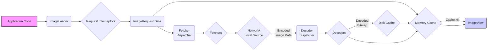

## Project Design Document: Coil - An Image Loading Library for Android

**Version:** 1.1
**Date:** October 26, 2023
**Prepared By:** AI Software Architect

### 1. Project Overview

Coil is a modern, asynchronous image loading library for Android built with Kotlin Coroutines. Its primary function is to efficiently fetch, decode, and display images in Android applications, with a focus on performance and ease of use. This document details Coil's architecture and key components to facilitate thorough threat modeling.

### 2. Goals of this Document

*   Provide a detailed and accurate representation of Coil's architectural design and its constituent parts.
*   Clearly delineate the responsibilities and interactions between the various components within Coil.
*   Map out the critical data flows involved in processing image requests.
*   Serve as a foundational document for security professionals to identify potential threats, vulnerabilities, and attack vectors.
*   Enable developers and stakeholders to gain a comprehensive understanding of Coil's internal workings for security analysis and development purposes.

### 3. Target Audience

*   Security architects and engineers tasked with performing threat modeling and security assessments on Coil.
*   Software developers who contribute to the development of Coil or integrate it into Android applications.
*   Quality assurance and security testing teams responsible for evaluating Coil's security posture.

### 4. Scope

This document encompasses the core functionalities of the Coil library related to the lifecycle of an image request, from initiation to display. The focus is on the architectural components and their interactions within the library itself.

**Included:**

*   Initiation and management of image loading requests.
*   Mechanisms for fetching image data from network and local sources.
*   Image decoding and transformation processes.
*   In-memory and on-disk caching implementations.
*   Integration points with Android `ImageView` components.

**Excluded:**

*   Fine-grained implementation details of individual classes and methods.
*   Specific network protocols beyond standard HTTP/HTTPS interactions.
*   External libraries or dependencies used by applications consuming Coil (e.g., custom HTTP client configurations within the application).
*   The internal implementation details of Kotlin Coroutines.

### 5. System Architecture

The architecture of Coil is designed around the processing of individual image requests. The following diagram illustrates the primary data flow and component interactions:

**Key Architectural Components:**

*   **Application Code:** The portion of the Android application that utilizes Coil to initiate image loading requests.
*   **ImageLoader:** The central component responsible for managing and executing image loading requests. It acts as the primary interface for interacting with Coil.
*   **Request Interceptors:** An ordered chain of interceptors that allow for inspecting and modifying `ImageRequest` objects before they are processed.
*   **ImageRequest Data:**  An immutable data class containing all the necessary information for an image loading request, such as the image URL, target `ImageView`, and any applied transformations.
*   **Memory Cache:** An in-memory cache (typically an `LruCache`) that stores decoded `Bitmap` objects for rapid retrieval.
*   **Fetcher Dispatcher:**  A component that selects the appropriate `Fetcher` implementation based on the scheme of the image URI (e.g., "http", "https", "file").
*   **Fetchers:** Concrete implementations responsible for fetching raw image data from various sources.
*   **Network/Local Source:** The origin of the image data, which can be a remote web server (for network requests) or the local file system.
*   **Decoder Dispatcher:** A component that selects the appropriate `Decoder` based on the format of the encoded image data.
*   **Decoders:** Concrete implementations responsible for decoding encoded image data into `Bitmap` objects.
*   **Disk Cache:** A persistent cache on the device's storage that stores either encoded image data or decoded `Bitmap` objects.
*   **ImageView:** The standard Android UI component where the loaded image is ultimately displayed.

### 6. Detailed Component Descriptions

*   **ImageLoader:**
    *   Serves as the main entry point for initiating image loading requests via methods like `enqueue()` and `execute()`.
    *   Manages the lifecycle of `ImageRequest` objects, including processing, caching, and dispatching to appropriate components.
    *   Provides a configurable interface for setting cache policies, network clients (e.g., `OkHttpClient`), and other global settings.
    *   Leverages Kotlin Coroutines for asynchronous operations, ensuring non-blocking execution on the main thread.
*   **Request Interceptors:**
    *   Implement the `Interceptor` interface and are executed sequentially before the image is fetched or retrieved from the cache.
    *   Offer a mechanism to modify request parameters (e.g., adding headers), log requests, or implement custom caching logic.
    *   The order of interceptors is significant and can be configured.
*   **ImageRequest Data:**
    *   Encapsulates all the details required to process an image loading request.
    *   Includes the target image URI (URL or resource identifier), the `ImageView` to load the image into, desired image transformations, and cache retrieval policies.
    *   Designed to be immutable to ensure data integrity throughout the request processing pipeline.
*   **Memory Cache:**
    *   Implements an in-memory storage mechanism for decoded `Bitmap` objects.
    *   Typically utilizes an `LruCache` to manage memory usage by evicting least recently used bitmaps when the cache reaches its capacity.
    *   Provides fast access to frequently accessed images, improving performance and reducing the need for repeated decoding.
*   **Fetcher Dispatcher:**
    *   Examines the scheme of the `ImageRequest`'s URI to determine the appropriate `Fetcher` implementation.
    *   For example, URIs starting with "http://" or "https://" will typically be handled by an `HttpFetcher`.
    *   Provides a point of extensibility for supporting custom URI schemes and data sources.
*   **Fetchers:**
    *   **HttpFetcher:** Responsible for fetching image data from network URLs using `HttpURLConnection` or a configurable `OkHttpClient`. Handles HTTP requests, including headers, redirects, and error responses.
    *   **FileFetcher:** Loads image data from the local file system based on file paths.
    *   **ContentFetcher:** Retrieves image data from Android `ContentProvider` instances using content URIs.
    *   Custom `Fetcher` implementations can be created to support other data sources or protocols.
*   **Network/Local Source:**
    *   Represents the external source of the image data.
    *   For network requests, this is typically a web server hosting the image.
    *   For local requests, this is the device's file system or a content provider.
*   **Decoder Dispatcher:**
    *   Inspects the format or MIME type of the encoded image data to select the appropriate `Decoder`.
    *   May rely on content type headers from network responses or file extensions for local files.
*   **Decoders:**
    *   **BitmapFactoryDecoder:** Uses Android's `BitmapFactory` class to decode common image formats like JPEG, PNG, and WebP.
    *   **GifDecoder:** Specifically handles the decoding of GIF image formats.
    *   **SvgDecoder:** (If included) Decodes SVG (Scalable Vector Graphics) images.
    *   Custom `Decoder` implementations can be provided to support specialized or less common image formats.
*   **Disk Cache:**
    *   Provides persistent storage for image data on the device's file system.
    *   Can store either the raw encoded image data or the decoded `Bitmap` objects, depending on configuration and implementation.
    *   Improves performance by avoiding repeated network requests and decoding operations.
    *   Typically implements size limits and eviction policies to manage disk space usage.
*   **ImageView:**
    *   The standard Android UI component used to display images.
    *   Coil sets the decoded `Bitmap` onto the `ImageView`'s drawable, making the image visible to the user.

### 7. Data Flow Description

1. The application initiates an image loading request by calling a method on the `ImageLoader`.
2. An `ImageRequest` object is created, encapsulating the details of the request.
3. The configured **Request Interceptors** are executed in order, allowing for modification or observation of the `ImageRequest`.
4. The `ImageLoader` checks the **Memory Cache** for a previously loaded and decoded `Bitmap` corresponding to the `ImageRequest`.
    *   If a cache hit occurs, the `Bitmap` is retrieved directly from the **Memory Cache** and displayed in the **ImageView**.
5. If the image is not found in the **Memory Cache**, the `ImageLoader` checks the **Disk Cache**.
    *   If a cache hit occurs in the **Disk Cache**, the encoded image data (or a previously decoded `Bitmap`) is retrieved. Encoded data is passed to the **Decoder Dispatcher**.
6. If the image is not found in either cache, the **Fetcher Dispatcher** selects the appropriate **Fetcher** based on the image URI scheme.
7. The selected **Fetcher** retrieves the encoded image data from the **Network/Local Source**.
8. The retrieved encoded image data is passed to the **Decoder Dispatcher**.
9. The **Decoder Dispatcher** selects the appropriate **Decoder** based on the image format.
10. The **Decoder** decodes the encoded image data into a `Bitmap`.
11. The decoded `Bitmap` is stored in the **Memory Cache** and potentially the **Disk Cache**, based on the configured caching policies.
12. Finally, the `Bitmap` is set on the target **ImageView**, making the image visible to the user.

### 8. Security Considerations (For Threat Modeling)

*   **Data Confidentiality:**
    *   **Network Transmission:** Image data fetched over insecure HTTP connections is susceptible to interception and eavesdropping. Enforcing HTTPS for all network requests is crucial.
    *   **Disk Cache Storage:** Sensitive images stored in the disk cache without encryption could be exposed if the device is compromised. Consider options for encrypting the disk cache.
    *   **Memory Exposure:** While typically transient, cached bitmaps in memory could potentially be exposed through memory dumps or vulnerabilities in the Android OS.
*   **Data Integrity:**
    *   **Man-in-the-Middle Attacks:** Attackers could intercept and modify image data during network transmission if HTTPS is not used or is improperly configured. Implementing certificate pinning can mitigate this.
    *   **Compromised Image Sources:** If the image source is compromised, malicious or altered images could be served. Implementing integrity checks (e.g., checksums) could help detect such issues.
    *   **Cache Poisoning:** An attacker might attempt to inject malicious content into the disk or memory cache, which would then be served to users. Secure cache implementations and validation mechanisms are necessary.
*   **Availability:**
    *   **Denial of Service (DoS) Attacks:**  Targeted attacks on image servers could prevent Coil from loading images. Implementing retry mechanisms and fallback strategies can improve resilience.
    *   **Resource Exhaustion:**  Excessive caching or large image sizes could lead to memory pressure or disk space exhaustion, potentially crashing the application. Implementing appropriate cache limits and eviction policies is important.
*   **Authentication and Authorization:**
    *   Coil relies on the underlying network stack (e.g., `OkHttpClient`) for handling authentication. Misconfigurations or vulnerabilities in the authentication setup could lead to unauthorized access to images. Ensure proper configuration of authentication headers and credentials.
*   **Input Validation:**
    *   **URL Validation:** Improper validation of image URLs could lead to vulnerabilities like Server-Side Request Forgery (SSRF) if custom fetchers are allowed to access internal resources. Implement robust URL validation.
    *   **Image Format Vulnerabilities:**  Vulnerabilities in image decoding libraries could be exploited by serving maliciously crafted images. Keeping decoding libraries up-to-date and sandboxing decoding processes can mitigate this.
*   **Code Injection:**
    *   While less likely in the core Coil library, vulnerabilities in custom **Request Interceptors** or **Fetchers** could potentially introduce code injection risks if they process untrusted input. Ensure proper input sanitization and validation in custom components.
*   **Cache Eviction Policies:** Insecure or predictable cache eviction policies could allow attackers to manipulate the cache contents. Ensure robust and unpredictable eviction strategies.

### 9. Future Considerations

*   Further optimization of caching strategies for different use cases.
*   Integration with more advanced image processing and transformation libraries.
*   Enhanced error handling and detailed logging capabilities for debugging and security monitoring.
*   More granular configuration options for individual request settings.

This document provides a comprehensive design overview of the Coil library, intended to serve as a valuable resource for security analysis and threat modeling activities.
