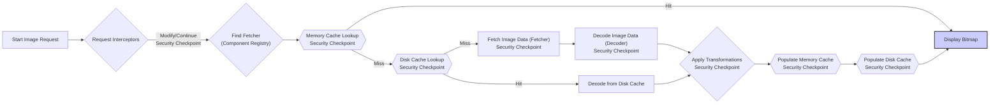

# Project Design Document: Coil Image Loading Library

**Version:** 1.1
**Date:** October 26, 2023
**Author:** AI Software Architect

## 1. Introduction

This document provides an enhanced architectural design of the Coil image loading library for Android (as found at [https://github.com/coil-kt/coil](https://github.com/coil-kt/coil)). This revised document aims to provide a more detailed and nuanced understanding of Coil's components, data flow, and potential security considerations, specifically to facilitate comprehensive threat modeling activities.

## 2. Goals and Non-Goals

**Goals:**

*   Provide a comprehensive and detailed overview of Coil's architecture.
*   Clearly identify key components, their responsibilities, and potential security implications.
*   Describe the data flow during an image loading request with greater precision.
*   Highlight specific potential areas of security concern for future threat modeling, providing concrete examples.

**Non-Goals:**

*   Provide a line-by-line code analysis.
*   Detail every single configuration option or API method.
*   Perform an actual threat model in this document.
*   Discuss performance optimization strategies in detail, unless directly relevant to security.

## 3. High-Level Architecture

Coil's architecture is structured around several interacting components that manage the lifecycle of an image loading request.

```mermaid
graph LR
    subgraph "Coil API ('coil-base')"
        A["ImageLoader"]
        B["ImageRequest"]
        C["Request Builders"]
    end
    D["EventListener"]
    E["Request Interceptors ('coil-interceptors')"]
    F["Component Registry ('coil-base')"]
    subgraph "Fetchers ('coil-base', 'coil-svg', etc.)"
        G["HttpFetcher"]
        H["FileFetcher"]
        I["ContentFetcher"]
        J["BitmapFetcher"]
        K["DrawableFetcher"]
        L["SVGFetcher (Optional)"]
    end
    M["Data Loaders ('coil-base')"]
    N["Decoders ('coil-base', 'coil-gif', etc.)"]
    O["Bitmap Factory (Android System)"]
    P["Memory Cache ('coil-base')"]
    Q["Disk Cache ('coil-disk')]
    R["Transformation Engine ('coil-transformations')"]
    S["Target (ImageView, Custom Target)"]

    A --> B
    B --> D
    B --> E
    E --> F
    F --> G
    F --> H
    F --> I
    F --> J
    F --> K
    F --> L
    G --> M
    H --> M
    I --> M
    J --> M
    K --> M
    L --> M
    M --> N
    N --> O
    O --> P
    O --> Q
    O --> R
    R --> S
    P --> S
    Q --> S
```

**Description of Components:**

*   **Coil API (`coil-base`):** The primary interface for interacting with the library.
    *   **`ImageLoader`:** The central orchestrator, managing request execution, caching, and resource management. It's responsible for applying global configurations and dispatching requests. Potential security concerns include improper resource management leading to DoS.
    *   **`ImageRequest`:** An immutable object encapsulating all the details of a single image load request, including the data source, target, transformations, and request options. Maliciously crafted requests could potentially exploit vulnerabilities in downstream components.
    *   **Request Builders:** Provide a convenient and type-safe way to construct `ImageRequest` objects. Improper input sanitization in custom builders could introduce vulnerabilities.
*   **`EventListener`:** Allows observation of the image loading lifecycle, providing hooks for logging, analytics, and custom error handling. While not directly involved in core processing, misconfigured event listeners could inadvertently leak information.
*   **Request Interceptors (`coil-interceptors`):** A chain of interceptors that can modify `ImageRequest` objects before they are processed. This is powerful but introduces risks if interceptors are not carefully implemented, potentially bypassing security checks or introducing new vulnerabilities (e.g., adding insecure headers).
*   **Component Registry (`coil-base`):**  A central registry mapping supported data types to their corresponding `Fetcher` and `Decoder` implementations. A compromised registry could redirect requests to malicious handlers.
*   **Fetchers (`coil-base`, `coil-svg`, etc.):** Responsible for retrieving the raw image data from various sources.
    *   **`HttpFetcher`:** Fetches images over HTTP(S). Crucial for network security; vulnerabilities here include improper TLS configuration, lack of certificate validation, and susceptibility to MITM attacks.
    *   **`FileFetcher`:** Loads images from the local file system. Security risks involve path traversal vulnerabilities if the application allows arbitrary file paths, potentially exposing sensitive data.
    *   **`ContentFetcher`:** Loads images via Android's `ContentResolver`. Security depends on the permissions and vulnerabilities of the accessed content provider.
    *   **`BitmapFetcher`:** Handles loading from existing `Bitmap` objects. Generally safe, but potential issues could arise if the input `Bitmap` is unexpectedly large or malformed.
    *   **`DrawableFetcher`:** Loads images from Android `Drawable` resources. Typically safe, but potential issues could arise from malformed or excessively large drawable resources.
    *   **`SVGFetcher` (Optional):**  Handles loading and rendering SVG images. SVG parsing can be complex and prone to vulnerabilities like XML External Entity (XXE) injection if not handled carefully.
*   **Data Loaders (`coil-base`):** Internal components that manage the process of fetching data using the selected `Fetcher`. They handle retries and error management during the fetch process.
*   **Decoders (`coil-base`, `coil-gif`, etc.):** Responsible for decoding the raw image data into a `Bitmap`. Different decoders handle various image formats (JPEG, PNG, GIF, WebP, etc.). Decoding libraries can have vulnerabilities that could lead to crashes or even code execution if processing maliciously crafted images.
*   **`Bitmap Factory` (Android System):** The Android OS component used by decoders to create `Bitmap` objects. While generally reliable, vulnerabilities in the underlying OS image decoding libraries could be exploited.
*   **Memory Cache (`coil-base`):** A fast, in-memory cache for storing recently loaded `Bitmap` objects. Potential security concerns include information leakage if the cache is not properly cleared or if sensitive data remains in memory after the application is backgrounded.
*   **Disk Cache (`coil-disk`):** A persistent cache on the device's storage. Security risks include cache poisoning (injecting malicious images), information leakage if the cache is not properly protected, and potential for denial of service by filling up storage.
*   **Transformation Engine (`coil-transformations`):** Applies transformations (resizing, cropping, blurring, etc.) to `Bitmap` objects. Vulnerabilities in custom transformations or the transformation logic itself could lead to unexpected behavior or security issues.
*   **Target (ImageView, Custom Target):** The destination where the loaded image is displayed. While not directly involved in loading, vulnerabilities in custom targets could be exploited if they mishandle the received `Bitmap`.

## 4. Detailed Design and Data Flow

The following outlines the detailed data flow for a typical image loading request in Coil, highlighting potential security checkpoints:

1. **Request Initiation:** The application initiates an image loading request via the `ImageLoader` API, providing an `ImageRequest` or using a request builder. *Security Consideration: Ensure input validation on the image source and any provided parameters to prevent injection attacks or unexpected behavior.*

2. **Interceptor Chain Execution:** The `ImageRequest` is passed through the configured `RequestInterceptor` chain. Each interceptor can inspect and modify the request. *Security Consideration: Carefully review and audit interceptor implementations to ensure they don't introduce vulnerabilities or bypass intended security measures. Ensure proper error handling within interceptors.*

3. **Fetcher Resolution:** The `ImageLoader` consults the `ComponentRegistry` to determine the appropriate `Fetcher` based on the image source (e.g., `HttpFetcher` for a URL). *Security Consideration:  A compromised `ComponentRegistry` could lead to the selection of a malicious `Fetcher`. Implement integrity checks for the registry.*

4. **Memory Cache Lookup:** The `ImageLoader` checks the `MemoryCache` for a `Bitmap` corresponding to the request's cache key. If a valid entry exists, it's returned directly to the `Target`. *Security Consideration:  Ensure the memory cache implementation is robust against cache poisoning and information leakage.*

5. **Disk Cache Lookup:** If the `Bitmap` is not in the memory cache, the `ImageLoader` checks the `DiskCache`. If a valid cached image is found, it's retrieved. *Security Consideration:  Implement measures to prevent cache poisoning and unauthorized access to the disk cache. Verify the integrity of cached data.*

6. **Data Fetching (if not cached):** If the image is not in either cache, the selected `Fetcher` retrieves the raw image data.
    *   For `HttpFetcher`: An HTTP(S) request is made. *Security Consideration: Enforce HTTPS usage, implement proper certificate validation, and handle potential network errors securely to prevent MITM attacks and information disclosure.*
    *   For `FileFetcher`: The file is read from the local file system. *Security Consideration:  Restrict access to specific directories and sanitize file paths to prevent path traversal vulnerabilities.*
    *   For `ContentFetcher`: Data is retrieved via the `ContentResolver`. *Security Consideration: Rely on the security mechanisms of the accessed content provider and ensure proper permission checks.*

7. **Decoding:** The fetched image data is passed to an appropriate `Decoder` based on the image format. The `Decoder` uses the Android `BitmapFactory` to create a `Bitmap`. *Security Consideration:  Use up-to-date decoding libraries to mitigate known vulnerabilities. Implement error handling to prevent crashes due to malformed images.*

8. **Transformation:** If transformations are specified in the `ImageRequest`, the `Transformation Engine` applies them to the decoded `Bitmap`. *Security Consideration:  Carefully review custom transformation logic for potential vulnerabilities or unexpected behavior. Be mindful of resource consumption during transformations.*

9. **Cache Population:** The decoded and transformed `Bitmap` (or the raw data, depending on the caching strategy) is stored in the `MemoryCache` and/or `DiskCache`. *Security Consideration:  Implement secure caching mechanisms to prevent cache poisoning and information leakage. Consider using encryption for sensitive cached data.*

10. **Target Display:** The final `Bitmap` is delivered to the `Target` (e.g., an `ImageView`). *Security Consideration:  Ensure custom targets handle `Bitmap` objects securely and don't introduce new vulnerabilities.*



## 5. Security Considerations (For Threat Modeling)

This section expands on the initial security considerations, providing more specific examples for threat modeling:

*   **Malicious Image URLs (HttpFetcher):**
    *   **DoS:** Providing URLs to extremely large images can exhaust network bandwidth and memory, leading to application slowdown or crashes.
    *   **Decoder Exploits:** URLs pointing to specially crafted images can exploit vulnerabilities in the decoding process (e.g., buffer overflows in JPEG or PNG decoders).
    *   **Server-Side Exploits:**  URLs could target vulnerable endpoints on the image server, potentially leading to server compromise.
    *   **Information Disclosure:** URLs might inadvertently point to resources containing sensitive information.
*   **Man-in-the-Middle (MITM) Attacks (HttpFetcher):**
    *   If HTTPS is not enforced or certificate validation is disabled, attackers can intercept network traffic, potentially replacing legitimate images with malicious ones.
    *   Attackers could inject malicious code or track user activity.
*   **Cache Poisoning (MemoryCache, DiskCache):**
    *   Attackers could attempt to inject malicious images into the cache, which would then be served to users, potentially leading to UI manipulation or exploitation of decoder vulnerabilities.
    *   Exploiting race conditions or vulnerabilities in cache eviction policies could facilitate cache poisoning.
*   **Local File Access Vulnerabilities (FileFetcher):**
    *   If the application allows loading images from user-provided file paths without proper sanitization, attackers could use path traversal techniques (e.g., `../../sensitive_data`) to access sensitive files on the device.
*   **Content Provider Vulnerabilities (ContentFetcher):**
    *   Exploiting vulnerabilities in the accessed content provider could allow attackers to retrieve unauthorized images or trigger malicious actions.
    *   Insufficient permission checks when accessing content providers could lead to information disclosure.
*   **Transformation Vulnerabilities (Transformation Engine):**
    *   Bugs or vulnerabilities in custom transformation implementations could lead to crashes, unexpected behavior, or even security exploits if they process untrusted data.
    *   Resource-intensive transformations could be used for DoS attacks.
*   **Denial of Service (DoS) through Resource Exhaustion:**
    *   Repeated requests for large, uncached images can overwhelm the network, CPU, and memory resources of the device.
    *   Requesting a large number of unique images can bypass caching mechanisms and lead to resource exhaustion.
*   **Information Disclosure through Caching (MemoryCache, DiskCache):**
    *   Sensitive images might be cached in a way that makes them accessible to other applications or users, especially on rooted devices or devices with insecure storage.
    *   Thumbnails or previews of sensitive images might be inadvertently cached.
*   **Bypass of Security Policies (Request Interceptors):**
    *   Malicious or poorly implemented interceptors could remove security headers, disable certificate validation, or redirect requests to insecure endpoints.
    *   Interceptors could be used to log sensitive information inappropriately.
*   **SVG Parsing Vulnerabilities (SVGFetcher):**
    *   SVG files can contain embedded scripts or links to external resources, potentially leading to Cross-Site Scripting (XSS) attacks or XXE injection if not handled securely.

## 6. Future Considerations

*   Detailed analysis of error handling and exception management within each component, focusing on how errors are propagated and handled to prevent information leakage or unexpected behavior.
*   In-depth review of the library's dependency on external libraries (e.g., OkHttp, image decoding libraries) and their known vulnerabilities. Implement dependency scanning and update processes.
*   Evaluation of different caching strategies and their specific security implications, including cache invalidation and secure deletion of cached data.
*   Consideration of security best practices for handling sensitive image data, such as encryption at rest and in transit.
*   Analysis of the library's resilience against common mobile security threats, such as rooting and reverse engineering.

This enhanced document provides a more detailed and security-focused architectural overview of the Coil image loading library, serving as a more robust foundation for comprehensive threat modeling activities.