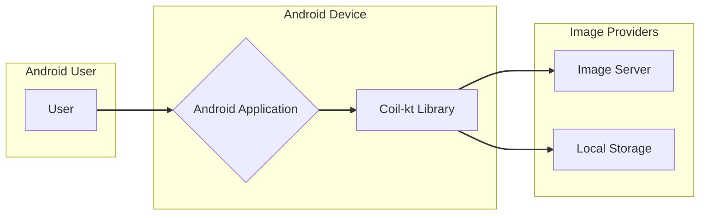

# BUSINESS POSTURE

The Coil-kt project is an image loading library for Android applications.

- Business Priorities and Goals:
  - Provide a high-performance and efficient image loading solution for Android developers.
  - Simplify the process of image loading and caching in Android apps.
  - Offer a Kotlin-first and modern API for image loading.
  - Reduce boilerplate code associated with image loading in Android.
  - Improve user experience in Android applications by ensuring fast and smooth image loading.
- Business Risks:
  - Performance bottlenecks in image loading can lead to poor user experience and negative app reviews.
  - Inefficient caching mechanisms can result in excessive data usage and slow loading times.
  - Security vulnerabilities in image handling or network communication could expose user data or compromise device security.
  - Compatibility issues with different Android versions or devices can limit adoption and increase development costs.
  - Lack of ongoing maintenance and updates can lead to the library becoming outdated and insecure over time.

# SECURITY POSTURE

- Existing Security Controls:
  - security control: Dependency management using Gradle and Maven Central, ensuring dependencies are from trusted sources. (Implemented in `build.gradle.kts` files)
  - security control: Code reviews and pull requests are used for code changes. (GitHub repository workflow)
  - security control: Static analysis tools and linters are likely used during development (though not explicitly mentioned in the repository, it's a common practice in Kotlin/Android development). (Assumed best practice)
  - security control: HTTPS is used for network communication by default when fetching images from remote servers. (Assumed best practice for network libraries)
- Accepted Risks:
  - accepted risk: Vulnerabilities in third-party dependencies. (Mitigated by dependency updates and security scanning, but not fully eliminated)
  - accepted risk: Potential for denial-of-service if the library is used to load extremely large or numerous images without proper resource management in the integrating application. (Responsibility of the integrating application developer)
- Recommended Security Controls:
  - recommended security control: Implement automated security scanning of dependencies to detect known vulnerabilities. (Can be integrated into CI/CD pipeline)
  - recommended security control: Integrate static application security testing (SAST) tools into the build process to identify potential code-level vulnerabilities. (Can be integrated into CI/CD pipeline)
  - recommended security control: Regularly update dependencies to patch known security vulnerabilities. (Part of ongoing maintenance)
  - recommended security control: Implement input validation and sanitization for image URLs and any user-provided data that influences image loading. (Within the library code)
  - recommended security control: Consider implementing Content Security Policy (CSP) headers if the library is used in contexts where web content is loaded. (Context dependent, might not be directly applicable to the library itself but relevant for applications using it)

- Security Requirements:
  - Authentication: Not directly applicable to an image loading library itself. Authentication is the responsibility of the application using the library when accessing protected image resources.
  - Authorization: Not directly applicable to the library itself. Authorization is the responsibility of the application using the library to ensure users are authorized to access requested image resources. The library should respect any authorization mechanisms implemented by the application or image server.
  - Input Validation:
    - Requirement: Validate image URLs to prevent injection attacks or unexpected behavior.
    - Requirement: Validate image data formats to prevent processing of malicious or malformed image files.
    - Requirement: Sanitize any user-provided input that influences image loading parameters (e.g., image size, transformations).
  - Cryptography:
    - Requirement: Ensure secure communication (HTTPS) when fetching images from remote servers.
    - Requirement: If storing cached images locally, consider encryption of sensitive image data at rest, especially if the application handles user-specific or private images (though this might be application's responsibility, the library should not hinder it).
    - Requirement: Verify the integrity of downloaded images to prevent tampering during transit. (e.g., using checksums or digital signatures if provided by the image server).

# DESIGN

## C4 CONTEXT



- Context Diagram Elements:
  - Element:
    - Name: User
    - Type: Person
    - Description: End-user of the Android application. Interacts with the application, triggering image loading.
    - Responsibilities: Uses the Android application to view content that includes images.
    - Security controls: User authentication and authorization are handled by the Android Application, not directly by Coil-kt. User device security is assumed to be managed by the user.
  - Element:
    - Name: Android Application
    - Type: Software System
    - Description: The Android application that integrates the Coil-kt library to display images.
    - Responsibilities: Presents user interface, handles user interactions, integrates Coil-kt for image loading, manages application-level security and data handling.
    - Security controls: security control: Application-level authentication and authorization. security control: Input validation for user inputs. security control: Secure data storage for application data. security control: Protection against common mobile application vulnerabilities (e.g., injection, data leakage).
  - Element:
    - Name: Coil-kt Library
    - Type: Software System (Library)
    - Description: Kotlin image loading library responsible for fetching, caching, decoding, and displaying images within the Android application.
    - Responsibilities: Image loading, caching (memory and disk), image decoding, image transformations, network requests for images, providing API for Android application to load images.
    - Security controls: security control: Input validation for image URLs and data. security control: Secure network communication (HTTPS). security control: Memory management to prevent leaks. security control: Protection against image processing vulnerabilities.
  - Element:
    - Name: Image Server
    - Type: Software System
    - Description: Remote server hosting image resources. Provides images to the Coil-kt library over the network.
    - Responsibilities: Storing and serving image files, handling image requests, potentially implementing authentication and authorization for image access.
    - Security controls: security control: Server-side authentication and authorization. security control: HTTPS for secure image delivery. security control: Protection against web server vulnerabilities. security control: Rate limiting and DDoS protection.
  - Element:
    - Name: Local Storage
    - Type: Data Store
    - Description: Device's local storage (disk and memory) used by Coil-kt for caching images.
    - Responsibilities: Persistently storing cached images to improve loading performance and reduce network requests.
    - Security controls: security control: Disk encryption provided by the Android OS. security control: Memory management within the Coil-kt library to prevent data leaks in memory cache. security control: Secure file permissions for disk cache directory (managed by Android OS and library).

## C4 CONTAINER

```mermaid
graph LR
    subgraph "Android Device"
        subgraph "Android Application"
            A[UI Layer]
            B[Business Logic Layer]
            subgraph "Coil-kt Library"
                C[Image Loader API]
                D[Request Dispatcher]
                E[Cache Engine]
                F[Network Client]
                G[Decoder Engine]
                H[Transformation Engine]
            end
        end
    end

    A --> B
    B --> C
    C --> D
    D --> E
    D --> F
    D --> G
    D --> H
    F --> I[Image Server]
    E --> J[Local Storage]

    linkStyle 0,1,2,3,4,5,6,7,8,9 stroke:#333,stroke-width:2px;
```

- Container Diagram Elements:
  - Element:
    - Name: UI Layer
    - Type: Container (Application Component)
    - Description: Android application's user interface components (Activities, Fragments, Views) that display images.
    - Responsibilities: Rendering UI, displaying images loaded by Coil-kt, handling user interactions.
    - Security controls: UI-related security best practices (e.g., preventing UI redressing attacks, secure data handling in UI components).
  - Element:
    - Name: Business Logic Layer
    - Type: Container (Application Component)
    - Description: Android application's business logic that orchestrates image loading using Coil-kt and manages application data.
    - Responsibilities: Managing application flow, initiating image loading requests via Coil-kt API, handling application-specific data and logic.
    - Security controls: Application-level authorization checks, input validation before passing data to Coil-kt, secure data handling within the business logic.
  - Element:
    - Name: Image Loader API
    - Type: Container (Coil-kt Component)
    - Description: Public API of Coil-kt library that Android applications use to initiate image loading requests.
    - Responsibilities: Providing a simple and fluent API for image loading, accepting image requests from the application, delegating requests to the Request Dispatcher.
    - Security controls: API design to prevent misuse, input validation of API parameters (image URLs, request options).
  - Element:
    - Name: Request Dispatcher
    - Type: Container (Coil-kt Component)
    - Description: Component within Coil-kt that manages and orchestrates image loading requests.
    - Responsibilities: Receiving image requests, coordinating with Cache Engine, Network Client, Decoder Engine, and Transformation Engine to fulfill requests, managing request lifecycle.
    - Security controls: Request prioritization and throttling to prevent resource exhaustion, error handling and logging, secure request processing logic.
  - Element:
    - Name: Cache Engine
    - Type: Container (Coil-kt Component)
    - Description: Component responsible for managing image caching (memory and disk).
    - Responsibilities: Storing and retrieving images from memory and disk caches, implementing cache eviction policies, providing cache access to the Request Dispatcher.
    - Security controls: security control: Secure cache storage on disk (using Android file system permissions). security control: Memory management to prevent cache-related memory leaks. security control: Cache invalidation and consistency mechanisms.
  - Element:
    - Name: Network Client
    - Type: Container (Coil-kt Component)
    - Description: Component responsible for handling network requests to fetch images from remote servers.
    - Responsibilities: Making HTTP requests to image servers, handling network communication, managing network connections, implementing network-related optimizations (e.g., connection pooling).
    - Security controls: security control: Enforcing HTTPS for network requests. security control: Handling network errors and timeouts securely. security control: Potentially implementing certificate pinning for enhanced security (if configured).
  - Element:
    - Name: Decoder Engine
    - Type: Container (Coil-kt Component)
    - Description: Component responsible for decoding image data from various formats (JPEG, PNG, etc.) into bitmaps.
    - Responsibilities: Decoding image data, handling different image formats, optimizing decoding performance.
    - Security controls: security control: Protection against image format vulnerabilities (e.g., buffer overflows in decoders). security control: Input validation of image data before decoding. security control: Resource management during decoding to prevent denial-of-service.
  - Element:
    - Name: Transformation Engine
    - Type: Container (Coil-kt Component)
    - Description: Component responsible for applying image transformations (resizing, cropping, etc.).
    - Responsibilities: Applying requested image transformations, optimizing transformation performance.
    - Security controls: security control: Input validation of transformation parameters to prevent unexpected behavior or attacks. security control: Resource management during transformations to prevent denial-of-service.

## DEPLOYMENT

Deployment of Coil-kt library is within the Android application's deployment environment. Android applications are typically deployed to user's Android devices via app stores like Google Play Store or sideloading.

```mermaid
graph LR
    subgraph "User's Android Device"
        A[Android OS]
        subgraph "Android Runtime"
            B[Android Application Process]
            C[Coil-kt Library (within App Process)]
        end
    end

    B -- Uses --> C
    A -- Manages --> B

    linkStyle 0,1 stroke:#333,stroke-width:2px;
```

- Deployment Diagram Elements:
  - Element:
    - Name: Android OS
    - Type: Infrastructure (Operating System)
    - Description: Android operating system running on the user's mobile device.
    - Responsibilities: Managing device resources, providing security features, running applications, managing application processes, providing file system and network access.
    - Security controls: security control: Operating system level security features (e.g., sandboxing, permissions). security control: Disk encryption. security control: Network security features. security control: Regular security updates.
  - Element:
    - Name: Android Runtime
    - Type: Environment (Runtime Environment)
    - Description: Runtime environment within Android OS where Android applications execute.
    - Responsibilities: Providing execution environment for Android applications, managing application lifecycle, providing APIs for applications to interact with the OS and device hardware.
    - Security controls: security control: Application sandboxing. security control: Permission management for application access to device resources. security control: Memory management for application processes.
  - Element:
    - Name: Android Application Process
    - Type: Software Instance (Process)
    - Description: Instance of the Android application running on the user's device. Contains the application code and the integrated Coil-kt library.
    - Responsibilities: Executing application logic, loading and displaying images using Coil-kt, interacting with the Android OS and runtime.
    - Security controls: security control: Application-level security controls (as described in previous sections). security control: Relying on Android OS and runtime security features. security control: Secure coding practices within the application.
  - Element:
    - Name: Coil-kt Library (within App Process)
    - Type: Software Instance (Library Instance)
    - Description: Instance of the Coil-kt library running within the Android application process.
    - Responsibilities: Performing image loading, caching, decoding, and transformations within the application process.
    - Security controls: security control: Library-level security controls (as described in previous sections). security control: Operating within the security context of the Android application process.

## BUILD

```mermaid
graph LR
    A[Developer] --> B{Code Changes};
    B --> C[GitHub Repository];
    C --> D[GitHub Actions CI];
    D --> E{Build & Test};
    E --> F{Security Scans (SAST, Dependency)};
    F --> G{Artifacts (JAR/AAR)};
    G --> H[Maven Central / GitHub Packages];

    style B fill:#ccf;
    style E fill:#ccf;
    style F fill:#ccf;

    linkStyle 0,1,2,3,4,5,6 stroke:#333,stroke-width:2px;
```

- Build Process Diagram Elements:
  - Element:
    - Name: Developer
    - Type: Person
    - Description: Software developer contributing to the Coil-kt project.
    - Responsibilities: Writing code, fixing bugs, implementing new features, submitting code changes via pull requests.
    - Security controls: security control: Secure development environment. security control: Code review participation. security control: Following secure coding practices.
  - Element:
    - Name: Code Changes
    - Type: Data
    - Description: Source code modifications made by developers.
    - Responsibilities: Representing new features, bug fixes, or improvements to the Coil-kt codebase.
    - Security controls: security control: Version control using Git. security control: Code review process.
  - Element:
    - Name: GitHub Repository
    - Type: System (Version Control)
    - Description: GitHub repository hosting the Coil-kt source code.
    - Responsibilities: Storing source code, managing version history, facilitating collaboration, triggering CI/CD pipelines.
    - Security controls: security control: Access control to the repository. security control: Audit logging of repository activities. security control: Branch protection rules.
  - Element:
    - Name: GitHub Actions CI
    - Type: System (CI/CD)
    - Description: GitHub Actions workflows configured for Coil-kt project for automated build, test, and security checks.
    - Responsibilities: Automating build process, running unit and integration tests, performing security scans, publishing build artifacts.
    - Security controls: security control: Secure configuration of CI/CD pipelines. security control: Secret management for CI/CD workflows. security control: Isolation of build environments. security control: Audit logging of CI/CD activities.
  - Element:
    - Name: Build & Test
    - Type: Process
    - Description: Automated build and testing process within CI/CD pipeline.
    - Responsibilities: Compiling code, running unit tests, running integration tests, generating build artifacts.
    - Security controls: security control: Build process isolation. security control: Dependency integrity checks. security control: Test coverage to ensure code quality and security.
  - Element:
    - Name: Security Scans (SAST, Dependency)
    - Type: Process
    - Description: Automated security scanning process within CI/CD pipeline. Includes Static Application Security Testing (SAST) and dependency vulnerability scanning.
    - Responsibilities: Identifying potential code-level vulnerabilities (SAST), detecting known vulnerabilities in dependencies, generating security reports.
    - Security controls: security control: Configuration of SAST and dependency scanning tools. security control: Regular updates of security scanning tools and vulnerability databases. security control: Automated reporting and alerting on security findings.
  - Element:
    - Name: Artifacts (JAR/AAR)
    - Type: Data
    - Description: Build artifacts produced by the CI/CD pipeline, typically JAR or AAR files for a Kotlin/Android library.
    - Responsibilities: Representing compiled and packaged version of the Coil-kt library, ready for distribution.
    - Security controls: security control: Signing of artifacts to ensure integrity and authenticity. security control: Secure storage of build artifacts.
  - Element:
    - Name: Maven Central / GitHub Packages
    - Type: System (Artifact Repository)
    - Description: Public or private artifact repositories where Coil-kt library artifacts are published for consumption by Android developers.
    - Responsibilities: Hosting and distributing Coil-kt library artifacts, providing access to developers for dependency management.
    - Security controls: security control: Access control to artifact repositories (for publishing and consumption). security control: Integrity checks for published artifacts. security control: HTTPS for artifact download.

# RISK ASSESSMENT

- Critical Business Processes:
  - Providing a smooth and fast user experience in Android applications by ensuring efficient image loading and display.
  - Reducing application development time and complexity related to image handling.
  - Minimizing data usage and battery consumption by optimizing image loading and caching.
- Data to Protect and Sensitivity:
  - Image Data:
    - Sensitivity: Varies depending on the application. For many applications, images are publicly available or not highly sensitive. However, in some applications, images might contain personal or sensitive information (e.g., user profile pictures, medical images).
    - Protection Goals: Confidentiality (if images are sensitive), Integrity (ensure images are not tampered with), Availability (ensure images can be loaded when needed).
  - Cached Image Data:
    - Sensitivity: Same as original image data.
    - Protection Goals: Same as original image data, plus secure storage of cached data.
  - Application Data related to Image Loading (e.g., request parameters, cache metadata):
    - Sensitivity: Low to Medium. Could potentially reveal usage patterns or application behavior.
    - Protection Goals: Integrity (ensure data is not tampered with), Availability.

# QUESTIONS & ASSUMPTIONS

- Questions:
  - Are there any specific compliance requirements (e.g., GDPR, HIPAA) that applications using Coil-kt might need to adhere to regarding image data handling? (Assumption: No specific compliance requirements are directly imposed on the library itself, but applications using it might have compliance obligations).
  - Are there any specific performance benchmarks or SLAs that Coil-kt aims to achieve? (Assumption: Performance is a key non-functional requirement, but specific benchmarks are not explicitly defined in the input).
  - What is the intended scope of security support and maintenance for Coil-kt in the long term? (Assumption: The project is actively maintained by the community, and security updates will be provided as needed).

- Assumptions:
  - BUSINESS POSTURE: The primary business goal is to provide a high-quality, efficient, and developer-friendly image loading library for Android.
  - SECURITY POSTURE: Standard security practices for software development and open-source projects are followed. HTTPS is used for network communication. Basic input validation is expected.
  - DESIGN: The design is modular and component-based, allowing for maintainability and extensibility. Caching is a core feature. The library is designed to be integrated into typical Android applications.
  - DEPLOYMENT: Coil-kt is deployed as a library within Android applications, which are deployed on user's Android devices.
  - BUILD: A standard CI/CD pipeline using GitHub Actions is used for build, test, and potentially security checks. Artifacts are published to Maven Central or GitHub Packages.