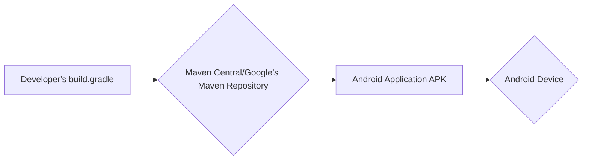

# BUSINESS POSTURE

Coil is an image loading library for Android. It's likely that the primary business goal is to provide a fast, efficient, lightweight, and easy-to-use solution for developers to load images in their Android applications. This contributes to a positive user experience within those apps (faster loading, less memory usage). The project is open-source, so community adoption, contribution, and positive reputation are also important.

Business priorities:

-   Performance: Image loading should be fast and efficient, minimizing impact on application responsiveness and battery life.
-   Ease of Use: The library should be simple to integrate and use for developers of all skill levels.
-   Reliability: The library should handle various image formats, network conditions, and error scenarios gracefully.
-   Maintainability: The codebase should be well-structured, documented, and easy to maintain and extend.
-   Community: Foster a vibrant and active community around the project.

Business risks:

-   Security vulnerabilities in the library could expose applications using it to attacks, such as remote code execution or denial of service.
-   Poor performance or instability could negatively impact the user experience of applications using the library.
-   Lack of adoption or negative community perception could lead to the project becoming obsolete.
-   Inability to keep up with changes in the Android ecosystem (new APIs, formats, etc.) could render the library less useful over time.
-   Legal issues related to image processing (e.g., handling of copyrighted material) could arise.

# SECURITY POSTURE

Existing security controls (based on the GitHub repository):

-   security control: Dependency management: Uses Gradle for dependency management, allowing for version control and updates of third-party libraries. (build.gradle.kts files)
-   security control: Testing: Includes unit and integration tests to verify functionality and prevent regressions. (src/test/ and src/androidtest/ directories)
-   security control: Code style and analysis: Uses Detekt and Ktlint for static code analysis to enforce coding standards and identify potential issues. (.github/workflows/build.yml)
-   security control: Proguard/R8 configuration: Offers configuration options for code shrinking and obfuscation, which can provide a basic level of protection against reverse engineering. (consumer-rules.pro)
-   security control: Handles network operations: Uses OkHttp for network requests, which provides features like connection pooling, timeouts, and support for modern TLS/SSL. (Coil uses OkHttp internally)
-   security control: Supports HTTPS: Encourages the use of HTTPS for secure image loading. (Documentation and examples)
-   security control: Caching mechanisms: Implements memory and disk caching to reduce network requests and improve performance. (Caching is a core feature)
-   security control: Open Source: Being open source allows for community scrutiny and contributions, potentially leading to faster identification and resolution of security vulnerabilities.

Accepted risks:

-   accepted risk: The library processes untrusted image data from potentially untrusted sources (URLs). This inherently carries risks of vulnerabilities related to image parsing and decoding.
-   accepted risk: The library relies on third-party libraries (OkHttp, AndroidX components, etc.), which may have their own security vulnerabilities.
-   accepted risk: The library's caching mechanisms could potentially be exploited to store malicious data if not configured correctly.
-   accepted risk: The library might not be fully hardened against all possible attack vectors, especially those related to image processing vulnerabilities.

Recommended security controls:

-   security control: Implement robust input validation and sanitization for all URLs and image data.
-   security control: Integrate a security linter or static analysis tool specifically designed for security vulnerabilities (e.g., FindSecBugs, SpotBugs with security plugins).
-   security control: Regularly update all dependencies to their latest secure versions, including transitive dependencies. Implement automated dependency scanning.
-   security control: Consider using a fuzzer to test the image parsing and decoding components for vulnerabilities.
-   security control: Provide clear security documentation and guidelines for developers using the library, including best practices for secure configuration and usage.
-   security control: Establish a security vulnerability reporting process and actively respond to reported issues.
-   security control: Consider implementing a Content Security Policy (CSP) if applicable to the context of the library's usage.
-   security control: Explore using more secure image loading techniques, such as sandboxing image decoding processes.

Security requirements:

-   Authentication: Not directly applicable, as the library itself doesn't handle authentication. However, if the library is used to load images from authenticated sources, it should support standard authentication mechanisms (e.g., passing headers with authentication tokens).
-   Authorization: Not directly applicable, as the library doesn't manage authorization. However, it should be compatible with applications that implement authorization mechanisms for accessing image resources.
-   Input Validation:
    -   URLs should be validated to ensure they are well-formed and point to supported image sources.
    -   Image data should be validated to ensure it conforms to expected formats and sizes.
    -   Headers and other metadata associated with image requests should be validated.
-   Cryptography:
    -   HTTPS should be enforced for all network requests to ensure secure communication.
    -   If caching sensitive images, consider encrypting the cached data.
-   Image Processing:
    -   The library should be resistant to common image processing vulnerabilities, such as buffer overflows, integer overflows, and format string vulnerabilities.
    -   Consider using memory-safe languages or libraries for image processing if possible.

# DESIGN

## C4 CONTEXT

```mermaid
graph LR
    A[User] --> B(Coil Android Image Loading Library)
    B --> C{Image Source (e.g., Web Server, Local Storage)}
    B --> D[Android Application]
    D --> A
```

Element descriptions:

-   1.  Name: User
    -   Type: Person
    -   Description: The end-user of the Android application that uses Coil to load images.
    -   Responsibilities: Interacts with the Android application.
    -   Security controls: Not directly applicable.

-   2.  Name: Coil Android Image Loading Library
    -   Type: Software System
    -   Description: The library that provides image loading functionality for Android applications.
    -   Responsibilities:
        -   Fetching images from various sources.
        -   Decoding and transforming images.
        -   Caching images in memory and on disk.
        -   Displaying images in Android UI components.
    -   Security controls:
        -   Input validation and sanitization.
        -   Secure network communication (HTTPS).
        -   Dependency management.
        -   Code analysis and testing.

-   3.  Name: Image Source (e.g., Web Server, Local Storage)
    -   Type: External System
    -   Description: The source of the images that Coil loads. This could be a remote web server, local storage, or another data source.
    -   Responsibilities: Providing image data to Coil.
    -   Security controls: Depends on the specific source. Web servers should use HTTPS and implement appropriate security measures.

-   4.  Name: Android Application
    -   Type: Software System
    -   Description: Application that is using Coil library.
    -   Responsibilities: Using Coil library to load images.
    -   Security controls: Depends on application implementation.

## C4 CONTAINER

```mermaid
graph LR
    A[Android Application] --> B(Coil Library)
    B --> C[Fetcher]
    B --> D[Decoder]
    B --> E[Memory Cache]
    B --> F[Disk Cache]
    B --> G[Transformation]
    C --> H{Image Source (e.g., Web Server, Local Storage)}
    C --> I[OkHttp]
    I --> H
    F --> J[Okio]
```

Element descriptions:

-   1.  Name: Android Application
    -   Type: Software System
    -   Description: Application that is using Coil library.
    -   Responsibilities: Using Coil library to load images.
    -   Security controls: Depends on application implementation.

-   2.  Name: Coil Library
    -   Type: Container (Library)
    -   Description: The main entry point for the library. Handles requests, coordinates components, and manages the image pipeline.
    -   Responsibilities:
        -   Managing the image loading pipeline.
        -   Providing a simple API for developers.
        -   Handling configuration and options.
    -   Security controls:
        -   Input validation.
        -   Configuration options for security features (e.g., disabling caching).

-   3.  Name: Fetcher
    -   Type: Component
    -   Description: Responsible for fetching image data from various sources (network, disk, content providers, etc.).
    -   Responsibilities:
        -   Retrieving image data from the specified source.
        -   Handling network requests (using OkHttp).
        -   Reading data from local storage.
    -   Security controls:
        -   URL validation.
        -   Secure network communication (HTTPS).

-   4.  Name: Decoder
    -   Type: Component
    -   Description: Responsible for decoding the raw image data into a usable format (e.g., Bitmap).
    -   Responsibilities:
        -   Decoding various image formats (JPEG, PNG, GIF, WebP, etc.).
        -   Handling potential decoding errors.
    -   Security controls:
        -   Input validation (checking for malformed image data).
        -   Using secure decoding libraries.

-   5.  Name: Memory Cache
    -   Type: Component
    -   Description: Stores decoded images in memory for fast access.
    -   Responsibilities:
        -   Caching images in memory.
        -   Managing cache size and eviction policies.
    -   Security controls:
        -   Consider encrypting sensitive images in the cache.

-   6.  Name: Disk Cache
    -   Type: Component
    -   Description: Stores downloaded image data on disk for persistence and offline access.
    -   Responsibilities:
        -   Caching image data on disk.
        -   Managing cache size and eviction policies.
    -   Security controls:
        -   Consider encrypting sensitive images in the cache.
        -   Secure file permissions.

-   7.  Name: Transformation
    -   Type: Component
    -   Description: Applies transformations to images (e.g., resizing, cropping, applying filters).
    -   Responsibilities:
        -   Performing image transformations.
    -   Security controls:
        -   Input validation (checking transformation parameters).

-   8.  Name: Image Source (e.g., Web Server, Local Storage)
    -   Type: External System
    -   Description: The source of the images.
    -   Responsibilities: Providing image data.
    -   Security controls: Depends on the specific source.

-   9.  Name: OkHttp
    -   Type: Library
    -   Description: HTTP client used for network requests.
    -   Responsibilities:
        -   Handling HTTP requests and responses.
        -   Managing connections and timeouts.
        -   Supporting HTTPS.
    -   Security controls:
        -   Uses secure protocols (TLS/SSL).
        -   Provides configuration options for security settings.

-   10. Name: Okio
    -   Type: Library
    -   Description: I/O library used for file system operations.
    -   Responsibilities:
        -   Reading and writing data to the file system.
    -   Security controls:
        -   Secure file handling.

## DEPLOYMENT

Coil is a library, not a standalone application. Therefore, deployment is about how it's integrated into other Android applications.

Possible deployment solutions:

1.  **Dependency Management System (Gradle/Maven):** Developers add Coil as a dependency in their project's build file (e.g., build.gradle). The dependency management system automatically downloads and includes the library in the application. This is the standard and recommended approach.
2.  **Manual Integration:** Developers could theoretically download the library's source code or compiled artifacts and manually include them in their project. This is not recommended due to complexity and difficulty in managing updates.

Chosen solution (described in detail): Dependency Management System (Gradle)



Element descriptions:

-   1.  Name: Developer's build.gradle
    -   Type: File
    -   Description: The build configuration file for the Android application that uses Coil. Contains the dependency declaration for Coil.
    -   Responsibilities: Specifying project dependencies.
    -   Security controls: None directly related to Coil.

-   2.  Name: Maven Central/Google's Maven Repository
    -   Type: Repository
    -   Description: A repository that hosts the compiled artifacts of the Coil library.
    -   Responsibilities: Providing the Coil library artifacts for download.
    -   Security controls:
        -   Repository security measures (access controls, integrity checks).
        -   Signed artifacts (optional, but recommended for Coil).

-   3.  Name: Android Application APK
    -   Type: Package
    -   Description: The final Android application package that includes the Coil library.
    -   Responsibilities: Containing all the code and resources for the application, including Coil.
    -   Security controls:
        -   Code signing.
        -   Proguard/R8 configuration.

-   4.  Name: Android Device
    -   Type: Device
    -   Description: The device where the Android application is installed and run.
    -   Responsibilities: Running the Android application.
    -   Security controls:
        -   Android operating system security features.

## BUILD

```mermaid
graph LR
    A[Developer] --> B{GitHub Repository (Source Code)}
    B --> C[GitHub Actions (CI/CD)]
    C --> D[Build Process (Gradle)]
    D --> E{Static Analysis (Detekt, Ktlint)}
    D --> F[Unit & Integration Tests]
    D --> G[Artifact Generation (AAR)]
    G --> H{Maven Central/Google's Maven Repository}
    E --> I{Reports}
    F --> I
```

Build process description:

1.  **Developer:** Developers write code and push changes to the GitHub repository.
2.  **GitHub Repository:** The source code of the Coil library is hosted on GitHub.
3.  **GitHub Actions (CI/CD):** GitHub Actions is used as the CI/CD system. Workflows are defined to automate the build process. (.github/workflows/build.yml)
4.  **Build Process (Gradle):** Gradle is used as the build tool. It compiles the code, runs tests, and generates the library artifacts.
5.  **Static Analysis (Detekt, Ktlint):** Detekt and Ktlint are used for static code analysis to enforce coding standards and identify potential issues.
6.  **Unit & Integration Tests:** Unit and integration tests are executed to verify the functionality of the library.
7.  **Artifact Generation (AAR):** The build process generates an Android Archive (AAR) file, which is the standard format for Android libraries.
8.  **Maven Central/Google's Maven Repository:** The generated AAR file is published to Maven Central or Google's Maven Repository, making it available for developers to include in their projects.
9. **Reports**: Static analysis and tests generate reports that can be reviewed.

Security controls in the build process:

-   security control: CI/CD pipeline: Automates the build process, ensuring consistency and reducing the risk of manual errors.
-   security control: Static analysis: Detekt and Ktlint help identify potential code quality and security issues early in the development process.
-   security control: Automated testing: Unit and integration tests help ensure the library functions correctly and prevent regressions.
-   security control: Dependency management: Gradle manages dependencies, allowing for version control and updates.
-   security control: Artifact signing: (Potentially) The AAR file could be digitally signed to ensure its integrity and authenticity.

# RISK ASSESSMENT

Critical business processes to protect:

-   **Image loading pipeline:** The core functionality of the library must be reliable and performant. Any disruption or vulnerability in this pipeline directly impacts the user experience of applications using Coil.
-   **Dependency management:** Ensuring that the library and its dependencies are up-to-date and free of known vulnerabilities is crucial.
-   **Community trust and reputation:** Maintaining a positive reputation and trust within the developer community is essential for the long-term success of the project.

Data to protect and their sensitivity:

-   **Image data (in transit and at rest in cache):** While Coil primarily deals with publicly accessible images, there might be cases where applications use it to load sensitive or private images. The sensitivity of this data depends on the specific application using Coil.
    -   Sensitivity: Potentially high, depending on the application.
-   **URLs and metadata associated with image requests:** These could potentially reveal information about the application or its users.
    -   Sensitivity: Low to moderate.
-   **Source code and build artifacts:** Protecting the integrity of the source code and build artifacts is crucial to prevent malicious code injection.
    -   Sensitivity: High.

# QUESTIONS & ASSUMPTIONS

Questions:

-   Are there any specific compliance requirements (e.g., GDPR, CCPA) that apply to applications using Coil? This might influence caching and data handling policies.
-   Are there any specific threat models or attack scenarios that the Coil maintainers are particularly concerned about?
-   What is the process for handling security vulnerability reports?
-   Are there any plans to support more advanced security features, such as image decoding sandboxing?
-   What level of support is provided for older Android versions? This can impact security considerations, as older versions may have known vulnerabilities.

Assumptions:

-   BUSINESS POSTURE: The primary goal is to provide a fast, efficient, and easy-to-use image loading library for Android developers.
-   BUSINESS POSTURE: The project prioritizes open-source principles and community engagement.
-   SECURITY POSTURE: Developers using Coil are responsible for implementing appropriate security measures in their own applications, including securing image sources and handling sensitive data.
-   SECURITY POSTURE: Coil relies on the security of its dependencies (OkHttp, AndroidX components, etc.) and assumes that these libraries are regularly updated.
-   DESIGN: The library is designed to be modular and extensible, allowing for future enhancements and additions.
-   DESIGN: The library follows common Android development best practices.
-   DESIGN: The provided GitHub repository is the official and main source of truth for the Coil project.