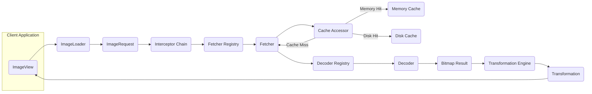
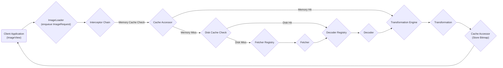

# Project Design Document: Coil - An Image Loading Library for Android

**Version:** 1.1
**Date:** October 26, 2023
**Author:** AI Software Architect

## 1. Project Overview

Coil is a modern, asynchronous image loading library for Android built with Kotlin Coroutines. It prioritizes performance, ease of use, and extensibility. Coil handles the complexities of fetching images from various sources, managing caching, applying transformations, and displaying them in `ImageView`s. This document details Coil's architecture to facilitate thorough threat modeling.

## 2. Goals

* Deliver a highly performant and memory-efficient image loading solution for Android applications.
* Offer a developer-friendly and concise API, minimizing boilerplate code.
* Support a wide range of image sources, including network URLs, local files, Android resources, and content URIs.
* Implement robust, multi-layered caching (memory and disk) with configurable policies.
* Provide flexible image transformation capabilities (e.g., resizing, cropping, rounded corners).
* Leverage Kotlin Coroutines for efficient asynchronous operations and cancellation.
* Maintain a modular and extensible design to accommodate custom implementations and integrations.

## 3. Non-Goals

* Providing built-in image editing functionalities beyond transformations applied during loading.
* Supporting video or other non-image media loading.
* Maintaining compatibility with Android API levels prior to the currently supported minimum.
* Serving as a general-purpose networking or data fetching library.

## 4. Target Audience

* Android developers integrating image loading into their applications.
* Software architects evaluating image loading libraries for Android projects.
* Security engineers conducting threat assessments and penetration testing of Android applications using Coil.
* Contributors and maintainers of the Coil open-source project.

## 5. Architectural Overview

Coil's architecture is designed around a central `ImageLoader` that orchestrates the image loading process. Requests are processed through an interceptor chain, fetching data, leveraging caching, decoding images, applying transformations, and finally displaying the result.

**Key Components:**

* **`ImageLoader`:** The primary interface for initiating image loading requests and managing the overall process.
* **`ImageRequest`:** An immutable data class encapsulating all parameters for a single image load, including the image source, target `ImageView`, and transformations.
* **`Interceptor Chain`:** A sequence of interceptors that can intercept, modify, or short-circuit the image loading request and response.
* **`Fetcher Registry`:**  Manages available `Fetcher` implementations, selecting the appropriate one based on the image source type.
* **`Fetcher`:** Responsible for retrieving the raw image data from a specific source (e.g., network, file).
* **`Cache Accessor`:** A unified interface for interacting with both the memory and disk caches.
* **`Memory Cache`:** Stores decoded `Bitmap` objects in memory for fast retrieval.
* **`Disk Cache`:** Stores encoded image data on disk for persistent caching across application sessions.
* **`Decoder Registry`:** Manages available `Decoder` implementations, selecting the appropriate one based on the image format.
* **`Decoder`:** Responsible for decoding raw image data into a `Bitmap` object.
* **`Bitmap Result`:** Represents the successfully decoded `Bitmap` or an error state.
* **`Transformation Engine`:** Applies a series of `Transformation`s to the `Bitmap`.
* **`Transformation`:** An interface for modifying a `Bitmap` (e.g., resizing, cropping).

## 6. Component Details

This section provides a more detailed breakdown of the core components and their functionalities.

### 6.1. ImageLoader

* **Responsibilities:**
    * Accepts `ImageRequest` objects.
    * Manages a coroutine scope for asynchronous operations.
    * Dispatches requests through the `Interceptor Chain`.
    * Coordinates with the `Cache Accessor` to check for cached images.
    * Delegates fetching to the appropriate `Fetcher`.
    * Delegates decoding to the appropriate `Decoder`.
    * Applies `Transformation`s.
    * Updates the target `ImageView` with the loaded image or error drawable.
    * Manages request lifecycle and cancellation.
* **Key Functionality:**
    * `enqueue(request: ImageRequest)`: Asynchronously executes the image loading request.
    * `execute(request: ImageRequest)`: Synchronously executes the image loading request (less common).
    * Configuration options for customizing caching, networking (using `OkHttpClient`), and other aspects.

### 6.2. ImageRequest

* **Responsibilities:**
    * Holds all necessary information for a single image load.
    * Defines the image source (`data`: URL, File, Resource ID, etc.).
    * Specifies the target (`target`: `ImageView` or custom target).
    * Contains a list of `Transformation`s to apply.
    * Includes optional parameters like placeholders, error drawables, and request priorities.
    * Is immutable, ensuring thread safety.
* **Key Attributes:**
    * `data`: The source of the image to load.
    * `target`: The destination where the loaded image will be displayed.
    * `transformations`: A list of `Transformation` objects.
    * `placeholder`: Drawable to display while loading.
    * `error`: Drawable to display if loading fails.
    * `memoryCacheKey`: A unique key for identifying the request in the memory cache.
    * `diskCacheKey`: A unique key for identifying the request in the disk cache.

### 6.3. Interceptor Chain

* **Responsibilities:**
    * Provides a flexible mechanism to intercept and potentially modify the image loading process at various stages.
    * Allows for adding custom logic for tasks like logging, authentication, adding custom headers, or modifying cache behavior.
    * Executes interceptors in a defined order, allowing for layered processing.
* **Key Functionality:**
    * Each `Interceptor` implements an `intercept(chain: Interceptor.Chain)` function.
    * Interceptors can call `chain.proceed(request)` to continue the processing or return a custom `Bitmap Result`.
    * Coil provides default interceptors for caching and decoding.

### 6.4. Fetcher Registry

* **Responsibilities:**
    * Maintains a collection of available `Fetcher` implementations.
    * Determines the appropriate `Fetcher` to use based on the type of the image source (`ImageRequest.data`).
    * Allows for registering custom `Fetcher` implementations.
* **Key Functionality:**
    * `resolve(request: ImageRequest)`: Returns the `Fetcher` capable of handling the request's data type.

### 6.5. Fetcher

* **Responsibilities:**
    * Retrieves the raw image data from the specified source.
    * Handles network requests (typically using `OkHttpClient`).
    * Reads data from local files, Android resources, or content providers.
    * Returns an `ImageSource` object containing the raw data and metadata.
* **Types of Fetchers:**
    * `HttpFetcher`: Fetches images from network URLs using HTTP(S).
    * `FileFetcher`: Fetches images from local file paths.
    * `ResourceFetcher`: Fetches images from Android resources (drawables, mipmaps).
    * `ContentUriFetcher`: Fetches images from content providers.

### 6.6. Cache Accessor

* **Responsibilities:**
    * Provides a unified interface for accessing both the `Memory Cache` and the `Disk Cache`.
    * Checks both caches for an image corresponding to the `ImageRequest`.
    * Retrieves images from either cache.
    * Stores images in both caches according to configured policies.
* **Key Functionality:**
    * `get(key: CacheKey)`: Attempts to retrieve an image from the cache (first memory, then disk).
    * `set(key: CacheKey, image: Image)`: Stores an image in the cache.

### 6.7. Memory Cache

* **Responsibilities:**
    * Stores decoded `Bitmap` objects in RAM for fast access.
    * Uses a Least Recently Used (LRU) eviction policy to manage memory usage.
    * Configurable size limits.
* **Key Functionality:**
    * `get(key: CacheKey)`: Retrieves a `Bitmap` from the memory cache.
    * `set(key: CacheKey, bitmap: Bitmap)`: Stores a `Bitmap` in the memory cache.

### 6.8. Disk Cache

* **Responsibilities:**
    * Stores encoded image data on the device's storage for persistent caching.
    * Uses a journal-based system for tracking cached files and managing cache integrity.
    * Configurable size limits and directory location.
* **Key Functionality:**
    * `get(key: CacheKey)`: Retrieves the encoded image data from the disk cache.
    * `set(key: CacheKey, imageSource: ImageSource)`: Stores the encoded image data in the disk cache.

### 6.9. Decoder Registry

* **Responsibilities:**
    * Maintains a collection of available `Decoder` implementations.
    * Selects the appropriate `Decoder` based on the image format (determined from the `ImageSource`).
    * Allows for registering custom `Decoder` implementations.
* **Key Functionality:**
    * `resolve(imageSource: ImageSource)`: Returns the `Decoder` capable of handling the image source's format.

### 6.10. Decoder

* **Responsibilities:**
    * Decodes raw image data (from `ImageSource`) into a `Bitmap` object.
    * Handles various image formats (JPEG, PNG, GIF, WebP, etc.).
    * Performs image scaling and sampling based on the target `ImageView` dimensions and request parameters.
* **Key Functionality:**
    * `decode(imageSource: ImageSource, options: Options)`: Decodes the image data and returns a `Bitmap Result`.

### 6.11. Transformation Engine

* **Responsibilities:**
    * Applies a sequence of `Transformation`s to a `Bitmap`.
    * Executes transformations in the order they are specified in the `ImageRequest`.
* **Key Functionality:**
    * `transform(bitmap: Bitmap, transformations: List<Transformation>)`: Applies the list of transformations to the bitmap.

### 6.12. Transformation

* **Responsibilities:**
    * Defines an operation that modifies a `Bitmap`.
    * Implementations include resizing, cropping, applying rounded corners, and custom effects.
* **Common Implementations:**
    * `CircleCropTransformation`
    * `RoundedCornersTransformation`
    * `BlurTransformation`
    * `GrayscaleTransformation`

## 7. Data Flow

The following outlines the typical flow of an image loading request within Coil:

1. The client application initiates an image load by calling `imageLoader.enqueue(imageRequest)`.
2. The `ImageLoader` receives the `ImageRequest`.
3. The `ImageRequest` is passed through the `Interceptor Chain`.
4. The caching interceptor in the chain uses the `Cache Accessor` to check for the image in the `Memory Cache`.
    * **Memory Cache Hit:** The `Bitmap` is retrieved and passed to the `Transformation Engine`.
5. If not in the memory cache, the caching interceptor checks the `Disk Cache` via the `Cache Accessor`.
    * **Disk Cache Hit:** The encoded image data is retrieved, passed to the appropriate `Decoder` (determined by the `Decoder Registry`), decoded into a `Bitmap`, and then passed to the `Transformation Engine`. The `Bitmap` is also stored in the `Memory Cache`.
6. If not in either cache, the request proceeds to the `Fetcher Registry` to select the appropriate `Fetcher` based on the `ImageRequest.data`.
7. The selected `Fetcher` retrieves the raw image data from the source.
8. The raw data is passed to the `Decoder Registry` to select the appropriate `Decoder`.
9. The selected `Decoder` decodes the data into a `Bitmap`.
10. The decoded `Bitmap` is passed to the `Transformation Engine` to apply any specified `Transformation`s.
11. The transformed `Bitmap` is stored in both the `Memory Cache` and the `Disk Cache` (if caching is enabled).
12. The final `Bitmap` is delivered to the target `ImageView` (or custom target).

## 8. Security Considerations (For Threat Modeling)

This section outlines potential security vulnerabilities and threats relevant to Coil's architecture.

* **Network Communication (HttpFetcher):**
    * **Man-in-the-Middle (MITM) Attacks:** If HTTPS is not enforced, attackers can intercept and potentially modify image data in transit. Ensure `OkHttpClient` is configured to use HTTPS and validate certificates.
    * **Insecure Connections:**  Allowing fallback to HTTP can expose the application to MITM attacks.
    * **Data Injection/Tampering:** Maliciously crafted URLs or responses could potentially exploit vulnerabilities in the underlying networking stack or image decoders. Implement robust input validation and error handling.
    * **Denial of Service (DoS):**  Fetching excessively large images or making a high volume of requests can exhaust device resources or network bandwidth. Implement request prioritization and limits.
    * **Server-Side Vulnerabilities:** Coil relies on the security of the image servers it interacts with. Vulnerable servers could serve malicious content.
* **Caching (Memory Cache & Disk Cache):**
    * **Cache Poisoning:** If an attacker can compromise the image source, they could inject malicious images into the cache, which would then be served to users. Implement cache validation mechanisms.
    * **Information Disclosure:** Sensitive or private images might be unintentionally cached. Implement appropriate cache control policies and consider encrypting the disk cache.
    * **Local Storage Security (Disk Cache):** The disk cache directory should have appropriate permissions to prevent unauthorized access or modification of cached data.
    * **Cache Overflow/DoS:**  An attacker might try to fill the cache with a large number of unique images, potentially leading to performance issues or denial of service. Implement cache eviction policies and size limits.
* **Decoding (Decoder):**
    * **Image Format Vulnerabilities:** Certain image formats (e.g., maliciously crafted JPEGs or PNGs) might contain vulnerabilities that could be exploited during decoding, potentially leading to crashes, code execution, or information disclosure. Keep decoding libraries up-to-date and consider using secure decoding options.
    * **Integer Overflow/Buffer Overflow:**  Processing very large or malformed images could lead to integer overflows or buffer overflows during decoding.
    * **Denial of Service:** Decoding computationally expensive image formats or very large images can consume excessive CPU and memory, leading to application unresponsiveness or crashes.
* **Transformations (Transformation Engine & Transformations):**
    * **Resource Exhaustion:** Applying complex or chained transformations can consume significant CPU and memory resources, potentially leading to performance issues or crashes.
    * **Bugs in Custom Transformations:**  Custom `Transformation` implementations might contain bugs that could lead to unexpected behavior or security vulnerabilities. Ensure thorough testing of custom transformations.
* **Third-Party Dependencies:**
    * Coil relies on libraries like `OkHttpClient` and potentially others. Vulnerabilities in these dependencies could directly impact Coil's security. Regularly update dependencies and monitor for security advisories.
* **Input Validation:**
    * Insufficient validation of image URLs or other input parameters could lead to unexpected behavior or vulnerabilities. Implement robust input validation to prevent issues like SSRF (Server-Side Request Forgery) if user-provided URLs are used.

## 9. Future Considerations

* **Improved Security Auditing Tools:**  Providing hooks or interfaces to facilitate security audits and penetration testing.
* **Support for Content Security Policy (CSP):**  Integrating with CSP to restrict the sources from which images can be loaded.
* **Enhanced Cache Security:** Exploring options for encrypting the disk cache by default or providing easier configuration for encryption.
* **Fuzzing and Security Testing:**  Implementing automated fuzzing and security testing to identify potential vulnerabilities.

This improved design document provides a more detailed and security-focused overview of Coil's architecture, intended to be a valuable resource for threat modeling and security analysis.