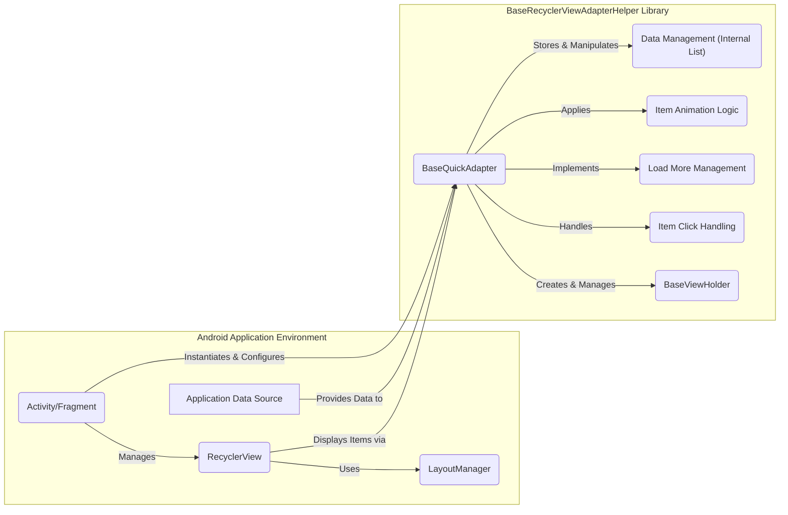

# Project Design Document: BaseRecyclerViewAdapterHelper

**Version:** 1.1
**Date:** October 26, 2023
**Author:** AI Software Architect

## 1. Introduction

This document provides an enhanced and detailed design overview of the "BaseRecyclerViewAdapterHelper" library, a widely used Android library available on GitHub at [https://github.com/CymChad/BaseRecyclerViewAdapterHelper](https://github.com/CymChad/BaseRecyclerViewAdapterHelper). This document aims to provide a clear and comprehensive understanding of the library's architecture, components, and data flow, specifically tailored for subsequent threat modeling activities. This revision includes more detailed explanations and clarifies certain aspects of the library's functionality.

## 2. Goals and Objectives

The primary goal of the BaseRecyclerViewAdapterHelper library is to significantly simplify the development process for Android RecyclerView adapters. The library achieves this by offering a robust and flexible base class that handles common adapter functionalities, reducing the need for developers to write repetitive boilerplate code. Key objectives include:

*   **Minimize Boilerplate Code:**  Reduce the amount of repetitive code developers need to write for common adapter tasks.
*   **Provide a Flexible Base:** Offer an extensible base class (`BaseQuickAdapter`) that can be adapted to various adapter implementations and data structures.
*   **Offer Built-in Common Features:**  Integrate support for frequently used features such as item click listeners (including different types of clicks), "load more" functionality for handling large datasets, and item animation capabilities.
*   **Enhance Developer Productivity:**  Improve the speed and efficiency of adapter development.
*   **Improve Code Maintainability:**  Promote cleaner and more maintainable adapter code by encapsulating common logic within the library.

## 3. System Architecture

The library employs a class-based, object-oriented architecture, centered around the `BaseQuickAdapter` class. This design promotes code reuse and modularity.



**Components:**

*   **Android Application Environment:** The context in which the library is used.
    *   **Activity/Fragment:** The Android UI components responsible for displaying and managing the RecyclerView.
    *   **RecyclerView:** The core Android UI widget used to display large, scrollable lists of data efficiently.
    *   **LayoutManager:**  Determines how items are arranged within the RecyclerView (e.g., linear, grid, staggered grid).
    *   **Application Data Source:** The source of the data that will be displayed in the RecyclerView (e.g., local database, network API).
*   **BaseRecyclerViewAdapterHelper Library:** The core components of the library.
    *   **BaseQuickAdapter:** The central abstract class that developers extend to create concrete adapter implementations. It orchestrates data management, view holder creation, and the application of various features.
    *   **BaseViewHolder:** A ViewHolder implementation provided by the library. It acts as a container for the views of an individual item in the RecyclerView, improving performance by reducing the need to repeatedly find views.
    *   **Item Click Handling:**  The module responsible for managing and dispatching click events on RecyclerView items and their child views. This includes handling single clicks, long clicks, and clicks on specific child views within an item.
    *   **Load More Management:**  The module that implements the "load more" functionality. It detects when the user has scrolled to the end of the list and triggers the loading of additional data.
    *   **Item Animation Logic:**  The module that provides built-in animations for items as they are added, removed, or updated in the RecyclerView.
    *   **Data Management (Internal List):** The internal data structure (typically an `ArrayList` or similar) within the `BaseQuickAdapter` that holds the data to be displayed.

## 4. Data Flow

The typical data flow within an Android application utilizing the BaseRecyclerViewAdapterHelper library involves the following steps:

```mermaid
graph LR
    subgraph "Android Application"
        A["Application Data Source"]
    end
    subgraph "BaseRecyclerViewAdapterHelper Library"
        B["BaseQuickAdapter Instance"]
        C["BaseViewHolder Instance"]
    end
    D["RecyclerView Instance"]

    A -- "Provides Data" --> B
    B -- "setData(), addData(), etc." --> "Internal Data List"
    "Internal Data List" -- "getItem(position)" --> B
    B -- "onCreateViewHolder()" --> C
    B -- "onBindViewHolder()" --> C
    C -- "Binds Data to Views" --> D
    D -- "User Interaction (Click, Scroll)" --> B
    B -- "Triggers Listeners/Callbacks" --> A
```

**Detailed Data Flow Description:**

1. **Application Data Source:** The application's data source (e.g., a local database, a remote API) holds the raw data.
2. **Provides Data:** The application retrieves data from its data source.
3. **setData(), addData(), etc.:** The application uses methods provided by the `BaseQuickAdapter` (or a custom adapter extending it) like `setNewData()`, `addData()`, `remove()`, etc., to update the adapter's internal data list.
4. **Internal Data List:** The `BaseQuickAdapter` maintains an internal list to store the data it will display.
5. **getItem(position):** When the `RecyclerView` needs to display an item at a specific position, the `BaseQuickAdapter`'s `getItem(position)` method is called to retrieve the corresponding data object from its internal list.
6. **onCreateViewHolder():** The `RecyclerView` calls the `onCreateViewHolder()` method of the `BaseQuickAdapter` to create a new `BaseViewHolder` instance for an item.
7. **onBindViewHolder():** The `RecyclerView` calls the `onBindViewHolder()` method of the `BaseQuickAdapter` to bind the data at a specific position to the views held by the `BaseViewHolder`.
8. **Binds Data to Views:** Inside the `onBindViewHolder()` method, the application logic (within the extended adapter) uses the `BaseViewHolder` to access the views of the item layout and populate them with data retrieved from the data source.
9. **User Interaction (Click, Scroll):** The user interacts with the `RecyclerView` by scrolling, clicking on items, etc.
10. **Triggers Listeners/Callbacks:**  When a user interacts with an item (e.g., a click), the `RecyclerView` and the `BaseQuickAdapter`'s internal logic detect the interaction and trigger the appropriate listeners or callbacks that have been set up in the application (e.g., `OnItemClickListener`). The application then handles these events.

## 5. Key Components in Detail

*   **BaseQuickAdapter:**
    *   **Responsibilities:**
        *   Acts as the intermediary between the application's data and the `RecyclerView`.
        *   Manages the underlying data collection.
        *   Provides methods for efficient data updates (adding, removing, replacing items).
        *   Handles the creation and management of `BaseViewHolder` instances.
        *   Implements the core logic for binding data to views within the `BaseViewHolder`.
        *   Manages item click listeners, long click listeners, and child view click listeners.
        *   Integrates and manages the `Load More Management` and `Item Animation Logic` modules.
    *   **Key Methods:**
        *   `onCreateViewHolder(ViewGroup parent, int viewType)`:  Abstract method that must be implemented by subclasses to create a new `BaseViewHolder` instance.
        *   `onBindViewHolder(K holder, int position)`: Abstract method that must be implemented by subclasses to bind data to the views within the `BaseViewHolder`.
        *   `setNewData(@Nullable List<T> data)`:  Sets a new list of data for the adapter, replacing the existing data.
        *   `addData(@NonNull Collection<? extends T> newData)`: Appends a collection of new data to the existing data.
        *   `remove(int position)`: Removes the item at the specified position from the data set.
        *   `setOnItemClickListener(@Nullable OnItemClickListener listener)`: Sets a listener to handle click events on the entire item.
        *   `setOnItemChildClickListener(@Nullable OnItemChildClickListener listener)`: Sets a listener to handle click events on specific child views within an item.
        *   `getDefItemCount()`: Returns the current number of items in the data set.
*   **BaseViewHolder:**
    *   **Responsibilities:**
        *   Holds direct references to the views within an item's layout. This avoids the performance overhead of repeatedly calling `findViewById()`.
        *   Provides convenient helper methods to access and manipulate the views within the item.
    *   **Key Methods:**
        *   `getView(int viewId)`: Returns the `View` object with the specified ID.
        *   `setText(int viewId, CharSequence value)`: Sets the text of a `TextView`.
        *   `setImageResource(int viewId, @DrawableRes int resId)`: Sets the image resource of an `ImageView`.
        *   `setOnClickListener(int viewId, @Nullable View.OnClickListener listener)`: Sets an `OnClickListener` on a specific view within the item.
*   **Item Click Handling:**
    *   **Responsibilities:**
        *   Provides a structured way to handle various types of click events on RecyclerView items.
        *   Allows developers to easily register listeners for item clicks, long clicks, and clicks on specific child views.
    *   **Key Interfaces:**
        *   `OnItemClickListener`: Interface for handling single click events on an item.
        *   `OnItemLongClickListener`: Interface for handling long click events on an item.
        *   `OnItemChildClickListener`: Interface for handling single click events on specific child views within an item.
        *   `OnItemChildLongClickListener`: Interface for handling long click events on specific child views within an item.
*   **Load More Management:**
    *   **Responsibilities:**
        *   Detects when the user has scrolled to the bottom of the RecyclerView.
        *   Triggers a callback to the application to load more data.
        *   Manages the visual state of the "load more" indicator (e.g., showing a loading spinner).
        *   Provides methods to control the loading state (e.g., `loadMoreComplete()`, `loadMoreFail()`, `loadMoreEnd()`).
    *   **Key Features:**
        *   Customizable loading view (allows developers to define their own layout for the "load more" indicator).
        *   Threshold configuration (allows setting how far from the bottom the user needs to scroll before loading is triggered).
        *   Support for automatic and manual loading.
*   **Item Animation Logic:**
    *   **Responsibilities:**
        *   Provides pre-built animations that can be applied to items as they are added, removed, or updated in the RecyclerView.
        *   Simplifies the process of adding visual feedback for data changes.
    *   **Available Animations:**
        *   `AlphaInAnimation`: Fades the item in.
        *   `ScaleInAnimation`: Scales the item in from a smaller size.
        *   `SlideInBottomAnimation`: Slides the item in from the bottom.
        *   `SlideInLeftAnimation`: Slides the item in from the left.
        *   `SlideInRightAnimation`: Slides the item in from the right.

## 6. Security Considerations (More Detailed)

While the BaseRecyclerViewAdapterHelper library primarily focuses on the presentation layer, it's crucial to consider potential security implications arising from its use:

*   **Cross-Site Scripting (XSS) via Unsanitized Data:** If the data displayed in the RecyclerView contains HTML or JavaScript that is not properly sanitized by the application *before* being passed to the adapter, it could lead to XSS vulnerabilities. The library itself doesn't perform sanitization, relying on the application to provide safe data.
*   **Denial of Service (DoS) through Resource Exhaustion:**  An attacker could potentially provide a very large or deeply nested dataset to the adapter, potentially causing excessive memory consumption or CPU usage, leading to a denial of service. The application needs to implement safeguards against processing excessively large datasets.
*   **Information Disclosure through Improper Error Handling:** If exceptions within the application's adapter implementation (extending `BaseQuickAdapter`) are not handled correctly, error messages or stack traces might inadvertently reveal sensitive information.
*   **Security Vulnerabilities in Transitive Dependencies:** The library might rely on other third-party libraries. Vulnerabilities in these transitive dependencies could indirectly impact the security of applications using BaseRecyclerViewAdapterHelper. Regularly checking for and updating dependencies is crucial.
*   **Insecure Handling of Click Listeners (Application-Side Vulnerability):** While the library provides the mechanism for click listeners, the security of the actions performed within those listeners is the responsibility of the application developer. For example, if a click listener directly uses user-provided data to construct a web request without validation, it could lead to vulnerabilities like command injection.
*   **Data Binding Issues (If Used):** If the application uses data binding in conjunction with the library, vulnerabilities related to data binding expressions (e.g., code injection) could arise if user-controlled data is directly used in binding expressions without proper sanitization.

**Note:** A dedicated threat modeling exercise, considering the specific context of the application using this library, is essential for a comprehensive security assessment.

## 7. Assumptions and Constraints

*   The primary responsibility for data fetching, validation, and sanitization lies with the Android application utilizing the library.
*   The library operates within the presentation layer of the application and does not handle network communication or data persistence directly.
*   The security of the underlying Android framework and the device's operating system is assumed.
*   Developers using the library are expected to adhere to secure coding practices, particularly when handling user input and implementing click listener logic.
*   The library's functionality is constrained by the capabilities of the Android `RecyclerView` widget.

## 8. Future Considerations

*   **Enhanced Animation Options:**  Expanding the animation module with more sophisticated and customizable animation effects.
*   **Improved Support for Complex Layouts:**  Providing more built-in mechanisms for handling RecyclerViews with diverse item layouts and view types without requiring extensive custom code.
*   **Seamless Integration with Data Binding:**  Further streamlining the integration with Android Data Binding to reduce boilerplate and improve code readability.
*   **Accessibility Improvements:**  Enhancements to ensure the library is fully accessible to users with disabilities.
*   **Regular Security Audits:**  Conducting periodic security audits and penetration testing to identify and address potential vulnerabilities proactively.
*   **Performance Optimization:**  Continuously profiling and optimizing the library's performance, especially when dealing with large datasets.

This improved design document provides a more detailed and nuanced understanding of the BaseRecyclerViewAdapterHelper library. The enhanced descriptions of components, data flow, and security considerations will be valuable for conducting a thorough and effective threat modeling exercise.