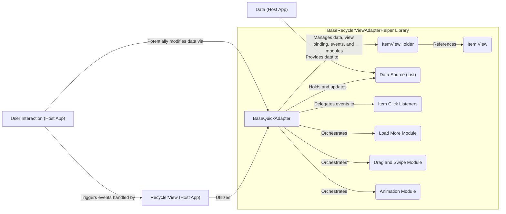
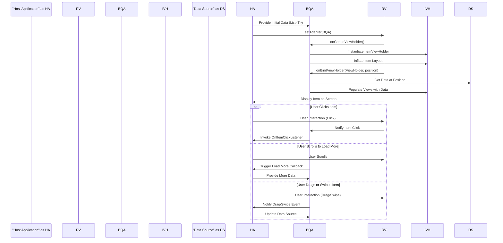
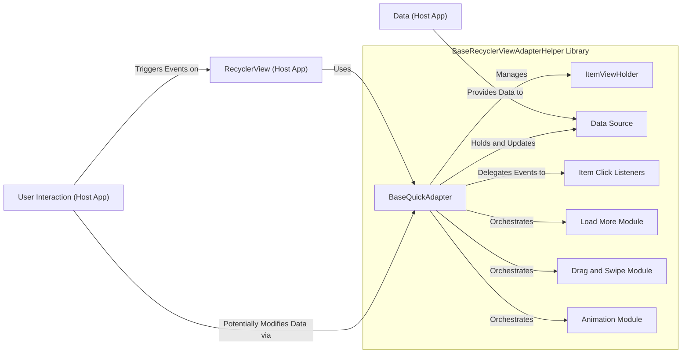
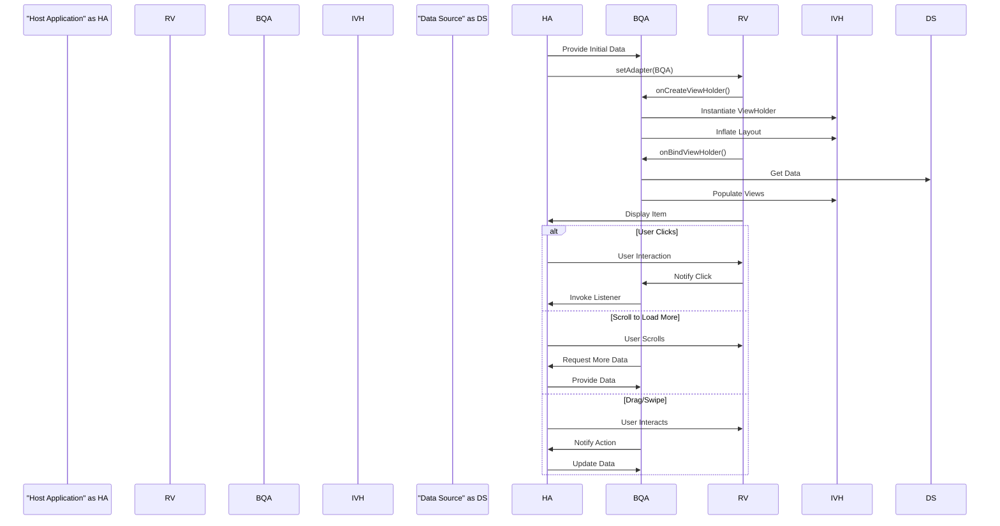

# Project Design Document: BaseRecyclerViewAdapterHelper

**Version:** 1.1
**Date:** October 26, 2023
**Author:** AI Architecture Expert

## 1. Introduction

This document provides an enhanced design overview of the `BaseRecyclerViewAdapterHelper` library, a popular Android library available on GitHub at [https://github.com/cymchad/baserecyclerviewadapterhelper](https://github.com/cymchad/baserecyclerviewadapterhelper). This document aims to provide a more detailed and refined understanding of the library's architecture, components, and data flow, serving as a robust basis for subsequent threat modeling activities.

## 2. Goals and Objectives

The primary goals of the `BaseRecyclerViewAdapterHelper` library are to:

* **Significantly simplify `RecyclerView.Adapter` creation:** Minimize boilerplate code and offer reusable, well-defined components for common adapter functionalities.
* **Extend adapter capabilities:** Provide integrated support for advanced features such as item click handling, efficient "load more" implementations, intuitive drag-and-drop and swipe-to-dismiss actions, and engaging item animations.
* **Boost developer efficiency:** Enable developers to manage `RecyclerView` data and user interactions in a more streamlined, less error-prone, and ultimately more productive manner.

This design document aims to:

* **Clearly and comprehensively define the library's architecture and the responsibilities of each component.**
* **Precisely illustrate the flow of data within the library and its interactions with the encompassing host application environment.**
* **Identify and describe key interfaces and any external dependencies the library relies upon.**
* **Establish a strong and detailed foundation for effectively identifying potential security vulnerabilities during subsequent threat modeling exercises.**

## 3. Architecture Overview

The `BaseRecyclerViewAdapterHelper` library employs a modular and highly extensible architecture, with the `BaseQuickAdapter` class at its core. This central class serves as the foundational building block for constructing diverse types of `RecyclerView` adapters. The library further provides a collection of specialized helper classes and well-defined interfaces to streamline common adapter-related tasks.

The core components and their interactions can be visualized as follows:

**Key Architectural Concepts:**

* **Central Role of the Adapter:** The `BaseQuickAdapter` is the primary class, taking responsibility for managing the underlying data, creating and managing `ViewHolder` instances, and handling various user interaction events. It also orchestrates the functionality of the included modules.
* **Modularity and Extensibility:** The library's design emphasizes modularity, with features like load more, drag and swipe, and animations implemented as independent, pluggable modules. This allows developers to include only the functionality they require, reducing overhead.
* **Efficient View Management:** The library leverages the `ItemViewHolder` pattern, a standard Android practice, to ensure efficient recycling of view instances, leading to improved performance, especially with large datasets.
* **Event-Driven Interactions:** User interactions and certain lifecycle events are managed through well-defined listener interfaces, promoting a clear separation of concerns and making it easier to customize behavior.

## 4. Component Details

This section provides a more detailed description of the key components within the `BaseRecyclerViewAdapterHelper` library:

* **`BaseQuickAdapter<T, VH extends RecyclerView.ViewHolder>`:**
    * This abstract base class serves as the foundation for creating concrete `RecyclerView` adapters.
    * It internally manages the data source, typically a `List<T>`, which holds the items to be displayed.
    * Provides a comprehensive set of methods for manipulating the data source, including adding, removing, updating, and retrieving individual data items or ranges of items.
    * Implements the essential `onCreateViewHolder()` and `onBindViewHolder()` methods from the `RecyclerView.Adapter` interface, handling the creation of `ViewHolder` instances and the binding of data to the corresponding views.
    * Manages a collection of event listeners, including those for item clicks (single and long), and provides mechanisms for attaching and detaching these listeners.
    * Offers flexible hooks and abstract methods to allow for customization of item view types, layout inflation logic, and other adapter-specific behaviors.

* **`ItemViewHolder`:**
    * A generic implementation of `RecyclerView.ViewHolder`.
    * Its primary responsibility is to hold direct references to the individual `View` objects within an item's layout. This avoids costly `findViewById()` calls during the binding process, significantly improving performance.
    * Can be extended by developers to create specialized `ViewHolder` subclasses tailored to the specific view structure of different item types within the `RecyclerView`.

* **Data Source (`List<T>`):**
    * Represents the collection of data that will be displayed within the `RecyclerView`. This is typically a `List` in Java, but could potentially be other collection types.
    * This data source is usually provided and managed by the host application, reflecting the application's underlying data model.
    * The adapter interacts with this data source to retrieve items for display and to reflect any changes resulting from user interactions (e.g., drag and drop).

* **Item Click Listeners:**
    * A set of interfaces (e.g., `OnItemClickListener`, `OnItemLongClickListener`, `OnItemChildClickListener`) and their corresponding implementations.
    * These listeners enable the host application to respond to user taps and long presses on individual items or specific views within an item.
    * When a click event occurs, the adapter identifies the clicked item and its position and invokes the appropriate listener callback, passing this information to the host application for handling.

* **Load More Module:**
    * Provides a standardized and efficient way to implement "load more" or "infinite scrolling" functionality in `RecyclerViews`.
    * Monitors the scrolling position of the `RecyclerView`. When the user scrolls to a predefined threshold (e.g., near the end of the list), it triggers a callback to the host application, signaling the need to load additional data.
    * Often includes customizable loading indicators and error handling mechanisms to provide a better user experience during the data loading process.

* **Drag and Swipe Module:**
    * Adds support for interactive item reordering (drag and drop) and swipe-to-dismiss gestures within the `RecyclerView`.
    * Handles the touch events necessary to detect and manage drag and swipe actions.
    * Provides callbacks to the host application, allowing it to update the underlying data source to reflect the changes made by the user through these gestures.

* **Animation Module:**
    * Offers a collection of pre-built animations that can be applied to items as they are added, removed, or updated within the `RecyclerView`.
    * Allows for customization of animation types, durations, and other parameters to create visually appealing transitions.

## 5. Data Flow

The data flow within the `BaseRecyclerViewAdapterHelper` library and its interaction with the host application can be described in a more granular manner:

1. **Data Initialization:** The host application retrieves data from its data layer (e.g., a database, network source) and provides this data as a `List<T>` to the `BaseQuickAdapter` instance.
2. **Adapter Configuration:** The host application sets the `BaseQuickAdapter` as the adapter for the `RecyclerView`, establishing the connection between the data and the UI component.
3. **Initial View Creation:** When the `RecyclerView` is initially displayed or when new items become visible, it requests view holders from the adapter by calling `onCreateViewHolder()`.
4. **ViewHolder Instantiation and Layout Inflation:** The `BaseQuickAdapter` creates a new `ItemViewHolder` instance and inflates the layout for the corresponding item type.
5. **Data Binding Process:** The `RecyclerView` then calls `onBindViewHolder()`, providing the `ViewHolder` and the data item at the specific position.
6. **Data Retrieval:** Inside `onBindViewHolder()`, the `BaseQuickAdapter` retrieves the relevant data for the current item from the provided data source.
7. **View Population:** The adapter populates the views within the `ViewHolder` with the retrieved data. This involves setting text on `TextViews`, loading images into `ImageViews`, and configuring other view properties.
8. **Display on Screen:** The `RecyclerView` displays the populated item view to the user.
9. **User Interaction Handling:**
    * **Item Clicks:** When the user interacts with an item (e.g., a tap), the `RecyclerView` detects the touch event and notifies the `BaseQuickAdapter`. The adapter then determines which item was clicked and invokes the appropriate listener callback (if registered), passing the item data and position to the host application.
    * **Load More Trigger:** As the user scrolls, the Load More module monitors the scroll position. Upon reaching a defined threshold, it triggers a callback to the host application, signaling the need for more data. The host application then fetches additional data and updates the adapter's data source.
    * **Drag and Swipe Actions:** When the user initiates a drag or swipe gesture, the Drag and Swipe module intercepts these events. It provides visual feedback during the interaction and, upon completion, notifies the adapter (and potentially the host application) of the changes, allowing for data source updates.

## 6. External Interfaces

The `BaseRecyclerViewAdapterHelper` library interacts with the host application and the Android framework through the following key interfaces:

* **`RecyclerView`:** This is the fundamental Android UI component that the adapter is designed to work with. The library relies heavily on the `RecyclerView`'s API for managing layout, handling view recycling, and dispatching touch events.
* **Data Source (`List<T>` or similar):** The host application is responsible for providing the data that the adapter will display. This data is typically provided as a `List`, but the adapter can be adapted to work with other collection types.
* **Listener Interfaces (e.g., `OnItemClickListener`, `OnLoadMoreListener`):** The host application implements these interfaces to receive notifications about user interactions (like item clicks) and lifecycle events (like the need to load more data).
* **Layout Resources:** The host application provides XML layout files that define the structure and appearance of individual items within the `RecyclerView`. The adapter inflates these layouts to create the item views.
* **Android Support/AndroidX Libraries:** The library depends on components from the Android Support Library or its successor, AndroidX, particularly the `RecyclerView` itself and potentially other utility classes.

## 7. Security Considerations (Pre-Threat Modeling)

While the `BaseRecyclerViewAdapterHelper` library primarily focuses on simplifying UI development, it's important to consider potential security implications during threat modeling:

* **Data Exposure through Improper Handling of Click Listeners:** If the host application directly uses data from a clicked item without proper input validation or sanitization, a malicious data source could inject harmful data that is then processed by the application, potentially leading to vulnerabilities like cross-site scripting (if displaying web content) or SQL injection (if constructing database queries).
* **UI Redress Attacks via Misconfigured Item Views:** While less common with list adapters, if item views are not carefully designed, it might be possible for an attacker to overlay malicious UI elements on top of legitimate ones, tricking users into performing unintended actions (clickjacking).
* **Vulnerabilities in Third-Party Dependencies:** The `BaseRecyclerViewAdapterHelper` library itself might depend on other third-party libraries. These dependencies could contain known security vulnerabilities. It's crucial to regularly update these dependencies to their latest secure versions. Dependency scanning tools can help identify such vulnerabilities.
* **Denial of Service through Resource Exhaustion in Load More:** If the "load more" functionality is not implemented with proper safeguards, a malicious or compromised backend could send an excessive amount of data, potentially overwhelming the device's resources and leading to a denial-of-service condition. Rate limiting and proper error handling are essential.
* **Data Integrity Issues with Drag and Swipe:** If the drag and swipe functionality is used to reorder or delete sensitive data, it's crucial to ensure that the underlying data source is updated atomically and securely. Improper implementation could lead to data corruption or loss.
* **Potential for Exploiting Custom Item View Logic:** If the host application allows for highly dynamic or user-defined item layouts and data binding logic, there's a potential risk of introducing vulnerabilities if this logic is not carefully scrutinized for potential exploits. For instance, allowing arbitrary code execution within the data binding process would be a severe security risk.
* **Information Disclosure through Logging or Error Handling:** Ensure that sensitive data handled by the adapter is not inadvertently logged or exposed through verbose error messages, especially in production builds.

This list provides a more detailed starting point for identifying potential threats. A comprehensive threat modeling exercise should involve a deeper analysis of each component, data flow, and interaction point to uncover specific vulnerabilities and their potential impact.

## 8. Diagrams

The following diagrams provide enhanced visual representations of the library's architecture and data flow:

**8.1. Component Diagram (Mermaid)**

**8.2. Data Flow Diagram (Mermaid)**

## 9. Conclusion

This enhanced design document provides a more detailed and refined understanding of the `BaseRecyclerViewAdapterHelper` library. By elaborating on the responsibilities of each component, clarifying the data flow, and highlighting potential security considerations, this document serves as a more robust foundation for effective threat modeling and the development of secure Android applications leveraging this library.