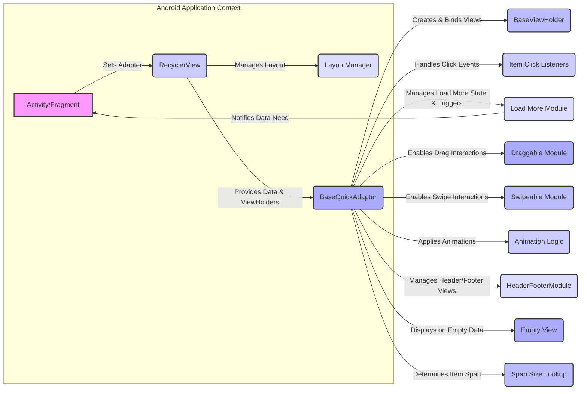

# Project Design Document: BaseRecyclerViewAdapterHelper

**Version:** 1.1
**Date:** October 26, 2023
**Author:** AI Software Architect

## 1. Introduction

This document provides an enhanced and more detailed design overview of the `BaseRecyclerViewAdapterHelper` library (hereafter referred to as "the Library"), a popular Android library available on GitHub at [https://github.com/cymchad/baserecyclerviewadapterhelper](https://github.com/cymchad/baserecyclerviewadapterhelper). This document aims to provide a clear and comprehensive understanding of the Library's architecture, components, and functionalities to facilitate effective threat modeling and security analysis. This version expands on the previous document with more specific details and examples.

## 2. Goals

*   Provide a comprehensive and in-depth understanding of the Library's design and architecture.
*   Clearly identify key components, their specific responsibilities, and their interactions.
*   Precisely outline the data flow within the Library, including data transformation points.
*   Serve as a robust and detailed foundation for subsequent threat modeling activities, enabling identification of potential vulnerabilities.
*   Document the Library in a clear, concise, and technically accurate manner for security stakeholders and developers.

## 3. Overview

The Library is a widely used Android library designed to significantly simplify the development of `RecyclerView.Adapter` implementations. It offers a robust base adapter class equipped with built-in functionalities commonly required when working with `RecyclerViews`. This abstraction reduces boilerplate code and enhances developer productivity. Key features include:

*   Efficient handling of item click and long click events, including child view clicks.
*   Streamlined implementation of "load more" functionality for handling large datasets.
*   Integrated support for drag and swipe interactions, enhancing user experience.
*   Flexible animation capabilities for item additions, removals, and changes, providing visual feedback.
*   Management of different view types within a single `RecyclerView`, allowing for complex list layouts.
*   Support for adding header and footer views to the `RecyclerView`.
*   A mechanism for displaying a custom empty state view.

The primary goal of the Library is to abstract away the complexities of common `RecyclerView.Adapter` implementations, allowing developers to focus on the specific logic of their data and UI. It achieves this through a well-defined set of reusable components and interfaces. The target audience for this library is Android developers building applications with dynamic lists and grids.

## 4. Architecture

The Library employs a modular architecture centered around the `BaseQuickAdapter` class. This class provides the foundational logic for managing data, creating views, and handling events within a `RecyclerView`.

### 4.1. Key Components

*   **`BaseQuickAdapter<T, VH extends BaseViewHolder>`:**  The core abstract base class that developers extend. `T` represents the data model type, and `VH` is the custom `ViewHolder` type. It manages the data list, implements `onCreateViewHolder` and `onBindViewHolder`, and provides methods for data manipulation (add, remove, update). It also orchestrates the interaction with other modules.
*   **`BaseViewHolder`:** A concrete `RecyclerView.ViewHolder` implementation provided by the Library. It simplifies the process of finding views within an item layout by providing a `getView(int viewId)` method, caching view lookups for performance.
*   **Item Click Listeners:** A set of interfaces and corresponding implementations for handling various click events:
    *   **`OnItemClickListener`:**  Handles clicks on the entire item view.
    *   **`OnItemLongClickListener`:** Handles long clicks on the entire item view.
    *   **`OnItemChildClickListener`:** Handles clicks on specific child views within the item layout, identified by their IDs.
    *   **`OnItemChildLongClickListener`:** Handles long clicks on specific child views within the item layout. These listeners are typically set within the `convert()` method of a custom adapter.
*   **`LoadMoreModule`:** A module responsible for implementing the "load more" pattern. It provides methods to enable/disable loading, set the loading view, and trigger the `OnLoadMoreListener` when the user scrolls to a predefined threshold.
    *   **`OnLoadMoreListener`:** An interface that developers implement to define the action to be taken when more data needs to be loaded.
*   **`DraggableModule`:**  Enables drag-and-drop functionality for `RecyclerView` items. It uses an `ItemTouchHelper` internally and provides callbacks for handling drag events.
    *   **`OnItemDragListener`:** An interface for receiving callbacks related to drag events (start, moving, end).
*   **`SwipeableModule`:** Enables swipe-to-dismiss or swipe-to-perform-action functionality. It also utilizes `ItemTouchHelper` and provides callbacks for swipe events.
    *   **`OnItemSwipeListener`:** An interface for receiving callbacks related to swipe events (swipe start, swipe move, swiped).
*   **Animation Types (within `BaseQuickAdapter`):**  Predefined animation types (e.g., AlphaIn, ScaleIn, SlideInBottom) that can be applied to items as they are displayed. The adapter handles the logic of applying these animations.
*   **`HeaderFooterModule`:** Manages the addition and display of header and footer views. It maintains lists of header and footer views and adjusts the item view type logic accordingly.
*   **Empty View (within `BaseQuickAdapter`):**  Allows setting a custom `View` to be displayed when the adapter's data list is empty. The adapter handles showing and hiding this view based on the data size.
*   **Span Size Lookup (within `BaseQuickAdapter`):**  Provides a mechanism to customize the span size of items when using a `GridLayoutManager`. Developers can override a method to define the span size for each item based on its position or data.

### 4.2. Component Interactions

The following diagram illustrates the interactions between the key components and the Android `RecyclerView` framework:



**Detailed Interaction Flow:**

*   The `Activity/Fragment` initializes a `RecyclerView` and sets an instance of a custom adapter (extending `BaseQuickAdapter`) to it.
*   The `RecyclerView` uses the `LayoutManager` to position items on the screen.
*   The `BaseQuickAdapter` holds the data to be displayed. When the `RecyclerView` needs a new view, the adapter's `onCreateViewHolder` method is called, creating a `BaseViewHolder`.
*   The `onBindViewHolder` method of the `BaseQuickAdapter` is then called to bind the data at a specific position to the views within the `BaseViewHolder`. This is where developers typically use the `convert()` method to populate the views.
*   User interactions on the `RecyclerView` (e.g., clicks) are intercepted by the Android framework. If an item click occurs, the `BaseQuickAdapter`'s internal logic, potentially involving the `Item Click Listeners`, handles the event and notifies the developer's implementation.
*   When the user scrolls near the end of the list, the `Load More Module` detects this and triggers the `OnLoadMoreListener`, prompting the application to fetch more data.
*   If drag and swipe are enabled, the `DraggableModule` and `SwipeableModule` use `ItemTouchHelper` to handle these gestures, notifying the respective listeners.
*   The `Animation Logic` within the `BaseQuickAdapter` applies animations to item views during operations like adding or removing items.
*   The `HeaderFooterModule` modifies the view type logic to accommodate header and footer views, ensuring they are created and bound correctly.
*   The `Empty View` is shown by the `BaseQuickAdapter` when the data list is empty, providing visual feedback to the user.
*   The `Span Size Lookup` is consulted by the `GridLayoutManager` to determine the appropriate span size for each item.

### 4.3. Data Flow

The data flow within the Library can be described as follows:

1. **Data Provision:** The Android application provides a collection of data items (of type `T`) to the `BaseQuickAdapter` through its constructor or data manipulation methods (e.g., `setList`, `addData`).
2. **Data Storage:** The `BaseQuickAdapter` internally stores this data, typically in a `List<T>`.
3. **View Creation:** When the `RecyclerView` needs to display an item, the `BaseQuickAdapter` creates a `BaseViewHolder` for the corresponding item layout.
4. **Data Binding (Conversion):** The `onBindViewHolder` method calls the abstract `convert(VH holder, T item)` method, which developers implement to bind the data (`item`) to the views within the `BaseViewHolder` (`holder`). This is the primary point where data is transformed and displayed in the UI.
5. **Event Handling:** User interactions on the bound views can trigger events. These events are often handled by setting listeners on the views within the `convert()` method. The Library's built-in click listeners provide a structured way to manage these events.
6. **Data Updates:** When the underlying data changes, the application uses the `BaseQuickAdapter`'s data manipulation methods to update the internal data list. The adapter then notifies the `RecyclerView` of these changes, triggering UI updates.

## 5. Key Features and Functionalities

*   **Highly Reusable Base Adapter:** Reduces redundant code for common `RecyclerView` adapter implementations.
*   **Comprehensive Click Event Handling:** Supports clicks on the item and individual child views with clear listener interfaces.
*   **Effortless Load More Implementation:** Simplifies the process of loading data in chunks as the user scrolls.
*   **Integrated Drag and Swipe Capabilities:** Enables intuitive item reordering and dismissal with minimal code.
*   **Visually Appealing Item Animations:** Provides built-in animation options to enhance the user experience during list updates.
*   **Flexible Header and Footer Management:** Allows adding static header and footer views to the `RecyclerView`.
*   **User-Friendly Empty State Handling:** Offers a straightforward way to display a custom view when no data is available.
*   **Adaptable Multiple View Type Support:** Facilitates the display of diverse item layouts within the same `RecyclerView` using the `getItemViewType` mechanism.
*   **Customizable Span Size for Grid Layouts:** Provides control over how items are sized in a `GridLayoutManager`.

## 6. Security Considerations (Detailed for Threat Modeling)

Considering the Library's role in handling user interactions and displaying data, potential security considerations for threat modeling include:

*   **Malicious Data Injection Leading to UI Issues:** If the data provided to the adapter is sourced from untrusted sources and not properly sanitized within the `convert()` method, it could lead to:
    *   **Cross-Site Scripting (XSS) vulnerabilities:** If displaying web content (e.g., using `WebView` within a list item), unsanitized HTML could execute malicious scripts.
    *   **UI Redressing (Clickjacking):** Maliciously crafted data could overlay interactive elements, tricking users into performing unintended actions.
    *   **Data leakage:** Improper handling of sensitive data within the `convert()` method could unintentionally expose it.
*   **Denial of Service (DoS) through Resource Exhaustion:**
    *   **Large Datasets without Pagination:**  Attempting to display extremely large datasets without proper pagination (even with "load more") could lead to excessive memory consumption and UI freezes, effectively causing a DoS.
    *   **Complex Layouts and View Binding:**  Overly complex item layouts or inefficient view binding logic within the `convert()` method could lead to performance bottlenecks and make the application unresponsive.
*   **Vulnerabilities in Transitive Dependencies:** The Library depends on other Android libraries. Vulnerabilities in these underlying dependencies could be exploited if not properly managed and updated. Regular dependency scanning and updates are crucial.
*   **Insecure Implementation of Click Listeners:**
    *   **Exposure of Sensitive Information:**  Click listeners might inadvertently expose sensitive data if not implemented with proper security considerations.
    *   **Unintended Actions:**  If click listeners trigger actions without proper authorization or validation, it could lead to security breaches.
*   **Security Risks in Custom Adapter Implementations:** Developers extending `BaseQuickAdapter` might introduce vulnerabilities in their custom logic:
    *   **Insecure Data Handling:**  Improperly handling or storing data within the custom adapter.
    *   **Authentication/Authorization Bypass:**  Flaws in the custom logic could bypass security checks.
*   **Potential for Manipulation through Drag and Swipe:** While less common, vulnerabilities in the `DraggableModule` or `SwipeableModule` could potentially be exploited to:
    *   **Reorder items to gain unauthorized access or privileges.**
    *   **Trigger unintended actions by manipulating the order of operations.**
*   **Integer Overflow in Position Handling:**  While unlikely with standard list sizes, if the library internally uses integers for item positions, extremely large datasets could theoretically lead to integer overflows, potentially causing unexpected behavior.

## 7. Dependencies

The Library directly depends on the following AndroidX libraries:

*   `androidx.recyclerview:recyclerview` (for the core `RecyclerView` functionality).
*   `androidx.annotation:annotation` (for annotations).
*   Potentially other AndroidX components depending on the specific version of the library.

It's crucial to perform a thorough analysis of the Library's `build.gradle` file to identify all direct and transitive dependencies for a comprehensive security assessment. Tools like dependency-check can be used for this purpose.

## 8. Deployment and Usage

The Library is integrated into Android projects by adding a dependency to the project's `build.gradle` file:

```gradle
dependencies {
    implementation 'com.github.CymChad:BaseRecyclerViewAdapterHelper:3.0.11' // Example version, check for the latest
}
```

Developers then create custom adapter classes that extend `BaseQuickAdapter`, providing the data model type and `ViewHolder` type. They implement the `convert()` method to bind data to the views within each item. The adapter is then set on a `RecyclerView` instance in an `Activity` or `Fragment`. Common usage scenarios include displaying lists of data fetched from a network, displaying user profiles, or showing items in an e-commerce application.

## 9. Future Considerations

Potential future enhancements that could impact security include:

*   **Integration with Data Binding Library:** While some level of integration might exist, deeper integration could introduce new attack vectors if not handled carefully.
*   **More Complex Animation Frameworks:**  Adopting more sophisticated animation libraries could introduce vulnerabilities if those libraries have security flaws.
*   **Accessibility Improvements:** While beneficial, ensuring accessibility features don't introduce new ways to bypass security measures is important.
*   **Performance Optimizations:**  Optimizations should be carefully reviewed to ensure they don't compromise security (e.g., aggressive caching of sensitive data).

## 10. Conclusion

This enhanced design document provides a detailed and comprehensive overview of the `BaseRecyclerViewAdapterHelper` library. It elaborates on the key components, their interactions, and the data flow, offering a solid foundation for effective threat modeling. The detailed security considerations section highlights potential vulnerabilities that should be carefully examined during a security assessment. By understanding the architecture and potential risks, developers and security professionals can work together to ensure the secure and reliable use of this popular Android library.