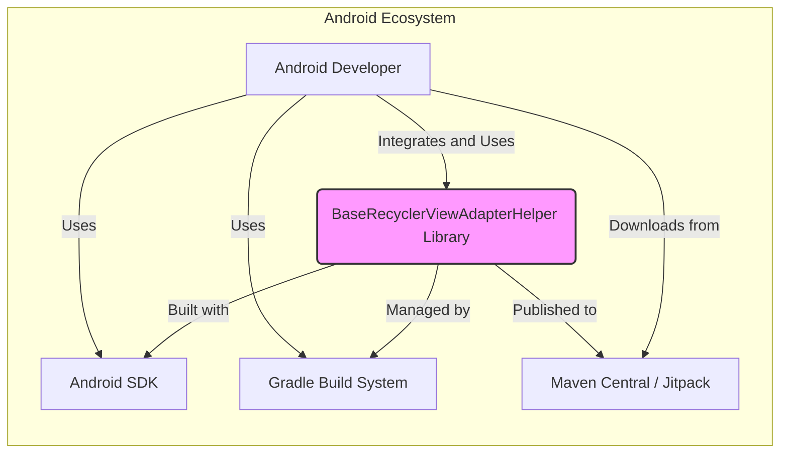
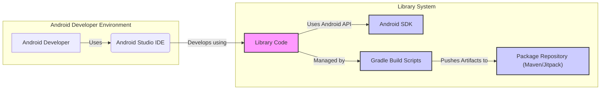
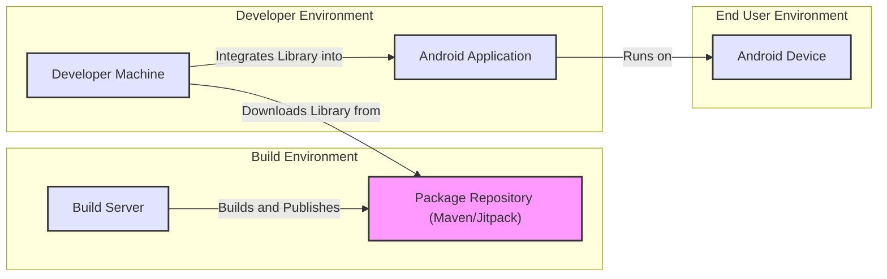
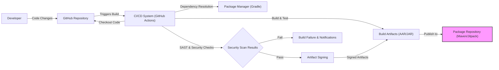

# BUSINESS POSTURE

This project is an open-source Android library named 'BaseRecyclerViewAdapterHelper'. It aims to simplify the development of RecyclerView Adapters in Android applications. The primary business priority for such a library is to enhance developer productivity by providing reusable and efficient components. The goal is to reduce boilerplate code and accelerate the development process for Android developers working with RecyclerViews.

Key business risks associated with this project include:
- Risk of introducing vulnerabilities into applications that use this library. If the library contains security flaws, applications incorporating it may become vulnerable.
- Risk of reduced developer trust if the library is unreliable, poorly documented, or difficult to use. This could lead to decreased adoption and impact the library's purpose of improving developer productivity.
- Risk of supply chain attacks if the library's dependencies or build process are compromised, potentially injecting malicious code into applications using the library.

# SECURITY POSTURE

## Existing Security Controls

- security control: Open Source Code Review. The library is hosted on GitHub and is publicly accessible, allowing for community review of the code. This can help identify potential security vulnerabilities and code quality issues. Implemented through GitHub repository visibility.
- security control: GitHub Security Features. GitHub provides basic security features like dependency scanning and vulnerability alerts for known vulnerabilities in dependencies. Implemented by GitHub Dependabot and security scanning tools.
- accepted risk: Reliance on Community Contributions. The security of the library partially relies on the vigilance and security awareness of the open-source community. There is a risk that vulnerabilities might be missed or not addressed promptly.
- accepted risk: Lack of Formal Security Audits. As an open-source project, it's unlikely to have undergone formal, professional security audits. This increases the risk of undiscovered vulnerabilities.

## Recommended Security Controls

- recommended security control: Dependency Scanning. Implement automated dependency scanning as part of the CI/CD pipeline to proactively identify and address vulnerabilities in third-party libraries used by the project.
- recommended security control: Static Application Security Testing (SAST). Integrate SAST tools into the build process to automatically analyze the codebase for potential security flaws and coding vulnerabilities.
- recommended security control: Code Signing. Sign the released artifacts (AAR or JAR files) to ensure integrity and authenticity, protecting against tampering and supply chain attacks.
- recommended security control: Security focused code review guidelines. Establish and document security focused code review guidelines for contributors to follow.

## Security Requirements

- Authentication: Not applicable for a library. Libraries themselves do not typically handle authentication. Applications using this library will manage their own authentication mechanisms.
- Authorization: Not applicable for a library. Authorization is handled by the applications that integrate this library. The library should not enforce any authorization decisions.
- Input Validation: The library should perform robust input validation for any external data it processes. This is crucial to prevent common vulnerabilities like injection attacks or denial-of-service. Input validation should be implemented within the library's code, specifically in methods that accept parameters from the application using it.
- Cryptography: If the library handles sensitive data, it should utilize appropriate cryptographic measures. However, based on the library's description, it is unlikely to directly handle sensitive data. If cryptography is needed, it should use well-established and secure cryptographic libraries provided by the Android platform or reputable third-party libraries.

# DESIGN

## C4 CONTEXT

### Context Diagram Elements

- Name: Android Developer
  - Type: Person
  - Description: Software developers who build Android applications and use the BaseRecyclerViewAdapterHelper library to simplify RecyclerView adapter implementation.
  - Responsibilities: Integrate the library into their Android projects, use the library's APIs, and ensure proper usage within their applications.
  - Security controls: Responsible for the security of their own applications, including how they use and integrate third-party libraries like BaseRecyclerViewAdapterHelper.

- Name: BaseRecyclerViewAdapterHelper Library
  - Type: Software System
  - Description: An Android library that provides a base adapter and common functionalities to simplify the development of RecyclerView adapters in Android applications.
  - Responsibilities: Provide reusable components for RecyclerView adapters, handle common adapter logic, and improve developer productivity.
  - Security controls: Input validation within the library, secure coding practices, dependency management, and build process security.

- Name: Android SDK
  - Type: Software System
  - Description: The Android Software Development Kit, providing tools, libraries, and APIs necessary for Android app development.
  - Responsibilities: Provide the platform and tools for building Android applications, including core Android libraries and APIs.
  - Security controls: Security of the Android platform itself, managed by Google. Developers rely on the SDK's security features and best practices.

- Name: Gradle Build System
  - Type: Software System
  - Description: A powerful build automation tool used for building Android applications and managing dependencies.
  - Responsibilities: Build the library, manage dependencies, compile code, and package the library for distribution.
  - Security controls: Dependency resolution and management, build script security, and integration with security scanning tools.

- Name: Maven Central / Jitpack
  - Type: Software System
  - Description: Package repositories where the library is published and distributed for developers to download and integrate into their projects.
  - Responsibilities: Host and distribute the library artifacts, manage versions, and provide access for developers to download the library.
  - Security controls: Repository security, integrity checks of published artifacts, and access control.

## C4 CONTAINER

### Container Diagram Elements

- Name: Library Code
  - Type: Container
  - Description: The codebase of the BaseRecyclerViewAdapterHelper library, written in Java or Kotlin. It contains the implementation of the base adapter and helper functionalities.
  - Responsibilities: Provide the core logic of the library, implement RecyclerView adapter functionalities, and expose APIs for developers to use.
  - Security controls: Input validation, secure coding practices, code review, SAST scanning, and dependency management.

- Name: Android SDK
  - Type: Container
  - Description: The Android Software Development Kit, used to compile and build the library. It provides the necessary Android APIs and libraries.
  - Responsibilities: Provide the platform APIs and tools required to build Android applications and libraries.
  - Security controls: Security of the Android platform, managed by Google. The library relies on the SDK for secure APIs and functionalities.

- Name: Gradle Build Scripts
  - Type: Container
  - Description: Gradle build scripts (build.gradle files) that define how the library is built, tested, and packaged.
  - Responsibilities: Automate the build process, manage dependencies, compile code, run tests, and package the library into AAR or JAR files.
  - Security controls: Build script security, dependency management, integration with security scanning tools, and secure artifact signing.

- Name: Package Repository (Maven/Jitpack)
  - Type: Container
  - Description: The repository where the compiled library artifacts (AAR or JAR files) are published for distribution. Examples are Maven Central or Jitpack.
  - Responsibilities: Host and distribute the library artifacts, manage versions, and provide access for developers to download the library.
  - Security controls: Repository security, integrity checks of published artifacts, access control, and potentially artifact signing verification.

## DEPLOYMENT

For a library, the "deployment" is primarily about its distribution to developers. The library itself is not deployed to a runtime environment in the traditional sense. Instead, it is published to package repositories, and developers then integrate it into their Android applications, which are then deployed to Android devices.

Deployment Architecture: Distribution via Package Repositories

### Deployment Diagram Elements

- Name: Build Server
  - Type: Deployment Node
  - Description: A server environment used for building and publishing the library. This could be a CI/CD system like GitHub Actions, Jenkins, or Travis CI.
  - Responsibilities: Automate the build process, run tests, package the library, and publish artifacts to the package repository.
  - Security controls: Secure build environment, access control, secrets management, and secure artifact signing.

- Name: Package Repository (Maven/Jitpack)
  - Type: Deployment Node
  - Description: A repository server that hosts and distributes the library artifacts. Examples are Maven Central or Jitpack.
  - Responsibilities: Host and distribute the library artifacts, manage versions, and provide access for developers to download the library.
  - Security controls: Repository security, access control, integrity checks of published artifacts, and potentially artifact signing verification.

- Name: Developer Machine
  - Type: Deployment Node
  - Description: The local development environment of an Android developer, including their computer and Android Studio.
  - Responsibilities: Download the library from the package repository, integrate it into Android applications, and develop applications using the library.
  - Security controls: Developer machine security, secure development practices, and dependency management.

- Name: Android Application
  - Type: Deployment Node
  - Description: The Android application built by developers that incorporates the BaseRecyclerViewAdapterHelper library.
  - Responsibilities: Utilize the library's functionalities within the application, provide application-specific logic, and deliver features to end-users.
  - Security controls: Application security controls, including secure usage of third-party libraries, input validation, authentication, and authorization.

- Name: Android Device
  - Type: Deployment Node
  - Description: The end-user's Android device where the Android application runs.
  - Responsibilities: Execute the Android application, provide the runtime environment, and interact with the user.
  - Security controls: Android OS security, device security features, and application sandboxing.

## BUILD

### Build Process Elements

- Name: Developer
  - Type: Person
  - Description: Software developer who writes and commits code changes to the GitHub repository.
  - Responsibilities: Write code, commit changes, and initiate the build process through code pushes.
  - Security controls: Secure coding practices, code review, and secure access to development environment and GitHub repository.

- Name: GitHub Repository
  - Type: System
  - Description: The Git repository hosted on GitHub that stores the source code of the library.
  - Responsibilities: Version control, code storage, and trigger CI/CD pipelines on code changes.
  - Security controls: Access control, branch protection, and audit logging.

- Name: CI/CD System (GitHub Actions)
  - Type: System
  - Description: An automated CI/CD system, likely GitHub Actions in this case, that orchestrates the build, test, and publish process.
  - Responsibilities: Automate the build process, run tests, perform security checks, sign artifacts, and publish to package repositories.
  - Security controls: Secure build environment, secrets management, access control, and audit logging.

- Name: Package Manager (Gradle)
  - Type: System
  - Description: Gradle, used for dependency resolution and build automation within the CI/CD pipeline.
  - Responsibilities: Manage dependencies, compile code, run tests, and package the library.
  - Security controls: Dependency resolution integrity, vulnerability scanning of dependencies, and build script security.

- Name: Build Artifacts (AAR/JAR)
  - Type: Data Store
  - Description: The compiled library artifacts (AAR or JAR files) produced by the build process.
  - Responsibilities: Contain the compiled library code ready for distribution.
  - Security controls: Integrity protection through signing, storage security, and access control.

- Name: Security Scan Results
  - Type: Data Store
  - Description: Results from SAST and other security checks performed during the build process.
  - Responsibilities: Provide feedback on potential security vulnerabilities in the code and dependencies.
  - Security controls: Secure storage of scan results, access control, and integration with build failure mechanisms.

- Name: Artifact Signing
  - Type: Process
  - Description: The process of digitally signing the build artifacts to ensure integrity and authenticity.
  - Responsibilities: Generate and apply digital signatures to the artifacts.
  - Security controls: Secure key management, secure signing process, and verification of signatures during consumption.

- Name: Package Repository (Maven/Jitpack)
  - Type: System
  - Description: The repository where the signed library artifacts are published for distribution.
  - Responsibilities: Host and distribute the signed library artifacts, manage versions, and provide access for developers to download the library.
  - Security controls: Repository security, access control, integrity checks of published artifacts, and signature verification.

# RISK ASSESSMENT

## Critical Business Processes

The critical business process being protected is the development of Android applications by developers using the BaseRecyclerViewAdapterHelper library. The library aims to improve developer productivity and reduce development time. Any compromise to the library's security or integrity could negatively impact the security and reliability of applications that depend on it, ultimately affecting the developers and end-users of those applications.

## Data Sensitivity

- Source Code: Sensitivity - Medium. The source code is intellectual property. Exposure could lead to unauthorized modifications or cloning of the library.
- Build Artifacts (AAR/JAR): Sensitivity - Medium to High. These are the distributable components of the library. Compromise could lead to malicious code injection and supply chain attacks.
- Dependency Information: Sensitivity - Low to Medium. Information about dependencies is publicly available but could be used to target known vulnerabilities in specific versions.
- Security Scan Results: Sensitivity - Low. These results are primarily for internal use to improve security. Exposure might reveal areas of potential weakness but are not directly exploitable.

# QUESTIONS & ASSUMPTIONS

## BUSINESS POSTURE

- Question: What is the target audience for this library? Is it primarily for internal use within a specific organization, or is it intended for the broader Android developer community?
  - Assumption: The library is intended for the broader Android developer community as an open-source project.
- Question: What are the key performance indicators (KPIs) for the success of this library? Is it adoption rate, developer satisfaction, or something else?
  - Assumption: Success is measured by adoption rate and positive feedback from the Android developer community.

## SECURITY POSTURE

- Question: Are there any specific security compliance requirements that this library needs to adhere to?
  - Assumption: No specific security compliance requirements beyond general secure coding practices for open-source libraries.
- Question: Is there a dedicated security team or individual responsible for overseeing the security of this project?
  - Assumption: Security is primarily managed by the project maintainers and the open-source community.
- Question: Are there any existing security incident response plans in place for this project?
  - Assumption: Incident response is likely ad-hoc and community-driven, without a formal plan.

## DESIGN

- Question: What is the expected scale and performance requirements for the library?
  - Assumption: The library is expected to be performant and efficient for typical Android RecyclerView use cases, without specific high-performance requirements beyond that.
- Question: Are there any specific integration points with other systems or services beyond the Android SDK and build tools?
  - Assumption: The library primarily integrates with the Android SDK and standard Android development tools, with no external system dependencies beyond package repositories for distribution.
- Question: What is the process for managing and updating dependencies used by the library?
  - Assumption: Dependencies are managed using Gradle, and updates are performed by the project maintainers as needed, potentially triggered by vulnerability alerts or feature updates.